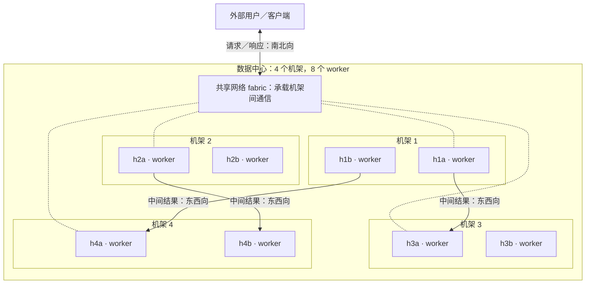
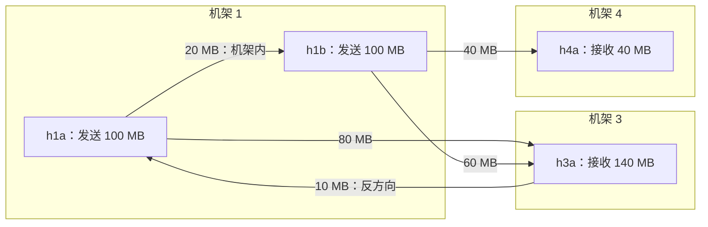
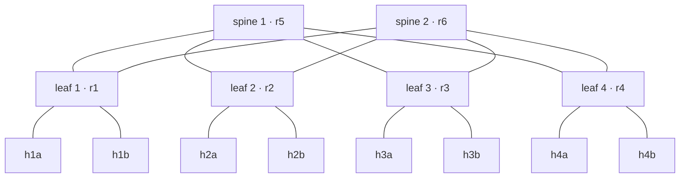

# 第 05 讲 数据中心网络：拓扑、多路径与虚拟网络

> **课程导读**：上一讲，我们让路由器把地图变成下一跳。本讲把三台路由器扩展成一座迷你数据中心：用 leaf-spine 拓扑提供多条路径，用 ECMP 分担流量，再用 overlay 为租户呈现各自的虚拟网络。贯穿全讲的问题是：**两台主机能互通之后，网络还能为计算提供多少能力？** 学完后，你应能从拓扑、路由表和抓包结果解释“路很多，作业却仍然很慢”的原因。

本讲对应 [课程大纲](../README.md)第 05 讲和 [Lab 3 设计](../experiments/README.md#lab-3搭一个迷你数据中心)。第 05 讲由原来的两讲合并而来，按 **90 分钟有效授课时间**设计；两节 50 分钟的课可把其余时间用于休息和讨论。Clos、ECMP、收敛比为基础要求；VXLAN 的封装原理要求看懂，多租户搭建为进阶任务；容器网络与 SDN 只建立概念联系。

**材料状态**：讲义草稿，已配套[课堂观察脚本](../experiments/03/README.md)，共用一张真实 leaf-spine 实验床。本文的命令与六组脚本观察已在 Ubuntu 24.04、Linux `6.8.0-142-generic` ARM64、4 核／4 GB 的备课沙箱中使用 Lab 2 参考实现复核（2026-10-04）。标为“实测样例”的输出来自该环境；为便于阅读可省略无关字段，端口、路径分布和用时以自己的测量为准。算例另标为教学设定或理论下界。完整 Lab 3 的分层作业、验收与后续接口仍待完善。

**课堂组织**：前五个模块讲原理，每次短观察只解决一个问题：用什么工具、看哪些字段、这些数据支持什么判断。模块六再做一次完整的“预测、测量、解释”：在同一实验床上，让学生诊断两种“传得慢”的原因。课前搭建一次，课堂连续使用，模块六结束后统一清理。基础跟做不要求当场重写拓扑、路由器或 VXLAN 配置；这些工作留到 Lab 3 分层完成。

---

## 学习目标

1. 画出 2 spine × 4 leaf × 8 host 的拓扑，追踪同机架与跨机架报文，说明二层网桥和三层路由各自的范围。
2. 从最短路径计算、内核下一跳集合和哈希选择三个环节解释等价多路径（Equal-Cost Multi-Path，ECMP），说明单连接和多连接的差别。
3. 按明确的带宽口径计算收敛比，找出流量矩阵中的瓶颈；区分收敛比与路由收敛时间。
4. 识别 VXLAN 的内外层地址、VNI 和 UDP 端口，计算 MTU 预算，并解释租户隔离与带宽共享的关系。
5. 综合流量矩阵、实际路径和限速证据，完成一次 60 MB 通信对照实验；能区分接收端集中与路径容量不足，并将观察方法带入 Lab 3。

| 时间 | 内容 | 课堂产出 |
| --- | --- | --- |
| 0–10 分钟 | 模块一：从互通走向容量 | 读流量矩阵；说明 ping 还缺少什么证据 |
| 10–22 分钟 | 模块二：Clos 与 leaf-spine | 画路径、数端口；用查表与抓包区分交换和路由 |
| 22–36 分钟 | 模块三：ECMP | 读下一跳、哈希策略、连接路径与接收吞吐 |
| 36–46 分钟 | 模块四：收敛比与瓶颈 | 用 tc 查容量配置，计算共享链路的时间下界 |
| 46–60 分钟 | 模块五：overlay、VXLAN、容器网络与 SDN | 教师演示内外层抓包；读 MTU 边界输出 |
| 60–85 分钟 | 模块六：综合动手——诊断一次通信变慢 | 小组运行接收分布与容量对照，解释数据并清理 |
| 85–90 分钟 | 模块七：离堂检查与课后衔接 | 提交三道短题 |

**课前准备（不计入上述 90 分钟）**：学生自行准备 Ubuntu Linux，工具与内核要求见[课堂观察指导书](../experiments/03/README.md)。所有命令从仓库根目录执行；先按原指导书结束并清理 Lab 1/2，避免 namespace 重名。不同小组各用独立主机或虚拟机；同一台机器由一人操作，避免同时修改共享的限速配置。

```bash
# 1. 按锁文件准备两个实验的 Python 环境
uv sync --project 2026/experiments/02 --frozen
uv sync --project 2026/experiments/03 --frozen

# 2. 使用自己完成的 Lab 2 路由与 ECMP 实现，搭建网络
sudo bash 2026/experiments/03/classroom.sh up

# 3. 核验每条上联、机架接入和跨机架的往返连通性
sudo bash 2026/experiments/03/classroom.sh check
```

`up` 默认使用学生的 `02/lsrd`，原始 TODO 骨架尚不能跑通。尚未完成 Lab 2 ECMP 的同学可先分析教师输出；教师演示将第 2 步替换为以下命令，显式加载独立参考实现：

```bash
# 1. 教师演示入口：保留学生源码，单独加载参考实现
sudo bash 2026/experiments/03/classroom.sh up --reference
```

准备完成应出现 `[就绪] 6 台路由器、8 台主机` 和 `[OK] 每条上联往返、8 台 host 的网桥接入与跨机架往返。`，并显示到 `10.0.3.0/24` 的两个下一跳，读法见 3.5 节。`classroom.sh` 负责重复的资源搭建与进程收尾；各观察中会拆出关键工具与输出。**中途不要拆拓扑；提前结束或发生中断时，也要执行 6.7 节的清理命令。**

---

## 模块一：从网络互通走向计算通信

### 1.1 一个作业会同时制造很多条流

先考虑一个教学场景：8 个 worker 分布在 4 个机架，每个机架 2 个。计算完成后，它们要把中间结果交换给其他 worker。**东西向流量（East-West Traffic）**是数据中心内部节点之间的通信；与之相对，用户或外部系统进出数据中心的通信称为**南北向流量（North-South Traffic）**。



*图示说明：箭头表示应用的通信方向，只选出三组跨机架通信；中间的 fabric 概括共享网络，具体接线见 2.2 节。*

如果每个 worker 都向另外 7 个 worker 发送数据，一轮交换就有 $8\times7=56$ 组**有方向的通信关系**。这不等于固定有 56 条 TCP 连接：一对节点之间可以使用一条或多条连接，也可能分时发送。图中三个箭头只是其中一部分，许多通信关系会争用相同的网络资源。

前四讲主要回答“目的地能不能到达”。面对并发交换数据，还要回答三个问题：流量能走几条路，每条路能承载多少，哪些流会争用同一条链路。

**课堂提问**：8 台主机两两 `ping` 都成功，能否证明这张网络适合并行计算？先写出一条缺少的证据。可从并发吞吐、共享链路、故障后的容量中选一个切入。

### 1.2 三张图要分清

| 观察对象 | 它回答的问题 | 本讲的例子 |
| --- | --- | --- |
| 拓扑图 | 哪些设备有链路相连？ | 每个 leaf 连到两个 spine |
| 路由表 | 到这个前缀可从哪些下一跳出去？ | 一条前缀有两个 `nexthop` |
| 流量矩阵 | 谁向谁发送多少数据？ | 两台源主机同时向另一机架发送 |

同一张拓扑、同一组路由，换一个流量矩阵就可能换一个瓶颈。后续实验会把这些差异进一步联系到作业完成时间（Job Completion Time，JCT）；本讲先把网络条件说清楚。

#### 行是发送端，列是接收端

**流量矩阵（Traffic Matrix）**把一组起点到终点的通信需求写成矩阵。节点可以是一台主机、一个机架或一个站点；粒度由分析的问题决定。[RFC 9522 第 1.4 节](https://www.rfc-editor.org/rfc/rfc9522.html#section-1.4)给出了这一概念的定义。本讲先按主机统计，并约定：

- 第 $i$ 行表示发送端，第 $j$ 列表示接收端；$D_{ij}$ 表示一个指定作业阶段中，主机 $i$ 需要向主机 $j$ 发送的**应用有效数据量**，单位为 B 或 MB。
- $D_{ij}$ 与 $D_{ji}$ 是两个方向，通常不相等。一个格子汇总这一主机对的通信，不保留 TCP 端口，也不区分使用了多少条连接。
- 本例不统计同一主机内部的进程通信，因此对角线 $D_{ii}=0$。非对角线上的 0 表示“本阶段没有这项需求”，不能据此判断两台主机是否连通。

**一张矩阵必须同时注明：节点顺序、统计阶段／时间窗口、单位、数据口径。** 交换行列会把发送与接收颠倒；用机架级矩阵分析机架内部通信，则会丢掉主机之间的差异。

#### 先读一个 4 × 4 的例子

仍使用 1.1 节的 8 台主机，但这一阶段只有 `h1a`、`h1b`、`h3a`、`h4a` 参与通信，另外四台的对应行列都是 0。下面截取这四台的子矩阵；所有数值都是**教学设定的应用数据量**，不是测量结果，采用十进制 $1\,\mathrm{MB}=10^6\,\mathrm{B}$。

| 发送端 ↓ ／接收端 → | `h1a` | `h1b` | `h3a` | `h4a` | 行和：发送总量 |
| --- | ---: | ---: | ---: | ---: | ---: |
| `h1a` | 0 | 20 | 80 | 0 | 100 MB |
| `h1b` | 0 | 0 | 60 | 40 | 100 MB |
| `h3a` | 10 | 0 | 0 | 0 | 10 MB |
| `h4a` | 0 | 0 | 0 | 0 | 0 MB |
| **列和：接收总量** | **10 MB** | **20 MB** | **140 MB** | **40 MB** | **合计 210 MB** |



*图示说明：一个非零格子对应一条有方向、带数据量的通信关系；这些箭头尚未指定经过哪个 spine。*

读矩阵时可以依次做三件事：

1. **读单个格子**：`h1a` 行、`h3a` 列的 80 表示 `h1a → h3a` 要发送 80 MB；反方向只有 10 MB，不能把矩阵默认当作对称矩阵。
2. **看行和与列和**：发送总量为 $\sum_j D_{ij}$，接收总量为 $\sum_i D_{ij}$。`h1a` 和 `h1b` 各发送 100 MB；`h3a` 接收 140 MB，提示我们检查它的接入链路。全体行和、全体列和都应等于 210 MB，每项需求各统计一次。
3. **结合拓扑，累加共享资源上的需求**：`h1a → h1b` 的 20 MB 留在机架 1；机架 1 向外发送的应用数据合计为 $80+60+40=180\,\mathrm{MB}$。反方向的 10 MB 计入上联的接收方向，不能直接混进发送方向。源机架上联与目的主机接入链路都是要检查的资源。

180 MB 是机架 1 **两条上联合计**要承载的应用数据，不能直接给每条上联分配 90 MB。还需知道通信使用的连接及 ECMP 选择；多个连接可能分开，也可能落在同一条链路上。若要与接口计数或链路容量对比，还须计入实际报文首部、ACK 与重传等开销。模块三解释路径分配，模块四再把链路数据量与容量联系起来。

#### 数据量矩阵与速率矩阵要区分

上面的 $D_{ij}$ 描述“这一阶段**需要传多少**”，本身没有每秒的含义。若在长度为 $\Delta t$ 秒的测量窗口中，实际统计到主机 $i$ 向主机 $j$ 传输了 $V_{ij}$ 字节，则对应的平均速率矩阵为 $R_{ij}=8V_{ij}/\Delta t$，单位为 bit/s。

例如，在同一 10 秒窗口里**实际传输**了 80 MB，对应平均速率为 64 Mbit/s；只知道作业计划发送 80 MB，不能据此断言网络已经达到了 64 Mbit/s。若要求在 10 秒内完成，这个数表示所需的平均应用数据速率，能否做到仍取决于路径、共享容量和传输开销。

速率也受窗口影响：同样 80 MB 可以均匀发送 10 秒，也可以集中在其中 1 秒。10 秒平均值相同，短时排队与拥塞却可能不同。比较两张测量矩阵时，应使用相同窗口与计数口径；应用有效数据量与包含重传的接口字节数不能混用。

#### 用矩阵识别通信形态，再找瓶颈

| 通信形态 | 矩阵里怎样看 | 优先检查什么 |
| --- | --- | --- |
| 一对多：一个 worker 分发数据 | 同一行有多个较大的非零项 | 发送主机的接入链路；源机架上联 |
| 多对一：多个 worker 汇集结果 | 同一列有多个较大的非零项 | 接收主机的接入链路；到它的共享路径 |
| 多对多：worker 交换中间结果（Shuffle） | 多行、多列的非对角线位置都有需求 | 各机架间数据量；多条路径上的实际分布 |

流量矩阵描述需求；拓扑与带宽描述可用资源；路由与分流决定需求怎样落到资源上。**只有把三者放在一起，才能定位可能的瓶颈。** 即使知道一个阶段的全部数据量，也还不能仅凭矩阵还原每条 TCP 连接、发送先后与瞬时队列长度。

**随堂练习**：保持总数据量不变，把 `h1b → h4a` 的 40 MB 改为 `h1b → h3a`。哪一项行和不变，哪两项列和改变？机架 1 的跨机架发送总量是否改变？

*思考提示：`h1b` 仍发送 100 MB；`h3a` 的接收量变为 180 MB，`h4a` 变为 0；源机架跨机架发送仍为 180 MB。总量相同，接收端压力可以更集中。*

### 1.3 短观察：ping 能证明什么，还缺什么

**先预测**：若 `h1a → h3a` 的三个 ping 都收到回复，能否据此填写 1.2 节矩阵中的“80 MB 已经传完”？

```bash
# 1. 只验证一对主机的往返可达性
sudo ip netns exec h1a ping -c 3 10.0.3.11
```

**实测样例（节选）**：

```output
3 packets transmitted, 3 received, 0% packet loss
```

**一起读数据**：`transmitted` 和 `received` 数的是本次 ICMP 探测包，说明这三次请求都收到了响应；`0% packet loss` 只对应这三个样本。它既不是 80 MB 的接收回执，也不是并发传输的速率。`time=... ms` 测量的是探测往返时间，不能换算成链路带宽。

要回答“传完多少、花了多久”，需要接收端的应用字节数与共同计时窗口；要解释为什么慢，还需路径与容量证据。接下来逐一学习这些工具，模块六再把它们用于同一次通信任务。

---

## 模块二：Clos 与 leaf-spine 拓扑

### 2.1 把冗余放在三层

回忆第 02 讲：把两台网桥用多条二层链路接成环，会产生循环转发。生成树协议（Spanning Tree Protocol，STP）可以阻断部分链路来消除环路。在本课程的数据中心实验床里，我们采用另一种结构：**机架内交换，机架间路由**，让冗余链路成为可用的三层路径。

Clos 网络（Clos Network）的思想是用多级、规则化的互联提供多条路径。数据中心中常见的 leaf-spine 是折叠 Clos（Folded Clos）的一种形式：leaf 连接服务器，每个 leaf 都连接每个 spine。Fat-tree 是相关的拓扑设计，不能把所有这些名字都当作同一个具体接线方案。[RFC 7938 第 3 节](https://www.rfc-editor.org/rfc/rfc7938#section-3)给出了树形网络与 Clos 网络的比较。

### 2.2 本课程的迷你数据中心



这是本讲课堂脚本已经搭建的拓扑，也是 Lab 3 的设计起点。leaf 和 spine 都以 network namespace 表示三层转发设备；每个 leaf 内有一个 bridge 接本机架的两台 host。leaf–spine 是三层点到点链路，没有 leaf–leaf 或 spine–spine 链路。

| 项目 | 设计约定 | 与已有实验的关系 |
| --- | --- | --- |
| leaf / spine | leaf 为 `r1`–`r4`，spine 为 `r5`、`r6` | 保留 Lab 2 `run.sh` 按 `rN` 识别路由器的约定 |
| 机架网络 | 第 $i$ 个机架用 `10.0.i.0/24`；网关 `.1`，host 为 `.11`、`.12` | 延续 Lab 1、Lab 2 的机架地址与主机名 |
| 机架内网桥 | `br1`–`br4`，网关地址放在 bridge 上 | 给 `lsrd` 用 `--passive` 通告，不在 bridge 上建邻 |
| 上联 | 每个 leaf 有两条上联；采用 `10.1.0.0/30`–`10.1.7.0/30` | 完整地址表见[课堂观察指导书](../experiments/03/README.md) |
| 路由 | 复用已实现的 `lsrd`，启用 `--ecmp` | Lab 2 基础版只选一个首跳，还不足以分流 |

课堂脚本已核验接口发现、启动参数、往返连通、重复搭建和清理；后续仍需固化这些约定，供 Lab 4–9 复用。

### 2.3 追踪两条路径

同机架通信 `h1a → h1b`：帧在 `r1` 内的 `br1` 上交换，不进入 spine。跨机架通信 `h1a → h3a`：主机把帧交给默认网关，`r1` 按目的 IP 查路由，路径可以是：

- `h1a → r1 → r5 → r3 → h3a`；
- `h1a → r1 → r6 → r3 → h3a`。

当两条路径的路由 cost 相同时，`r1` 可安装两个下一跳。跨机架路径经过源 leaf、一个 spine、目的 leaf，共三台转发设备；**跳数相同不保证延迟或可用带宽相同**。

ARP 广播留在机架的二层网络内。路由后的每一跳重新封装链路层首部，目的 IP 仍是 `h3a`。这与第 02 讲的多跳转发相同，只是现在可选的下一跳变多了。

### 2.4 扩展能力有端口条件

2 spine × 4 leaf 的 fabric 有 $2\times4=8$ 条 leaf–spine 链路。每个 spine 需要 4 个下联端口，每个 leaf 需要 2 个上联端口，另加服务器端口。

增加第 5 个 leaf，需要两个 spine 各有一个空闲端口；增加第 3 个 spine，需要所有 leaf 各有一个空闲端口。两种扩展都要检查布线、端口速率与控制平面规模。规则化拓扑便于扩展，端口预算仍然是硬约束。

**随堂练习**：在图上标出 `h2a → h4b` 的全部两条最短路径。如果 `r2–r5` 断开，哪条路径仍然存在？随后计算可用上联容量的变化，容量问题在模块四继续。

### 2.5 短观察：从查表到抓包，确认交换与路由的边界

**先预测**：`h1a → h1b` 与 `h1a → h3a` 都能 ping 通，哪一种需要默认网关，哪一种需要 spine？先在拓扑上画请求路径。

```bash
# 1. 查看主机为两个目的地址选择的下一跳
sudo ip -n h1a route get 10.0.1.12
sudo ip -n h1a route get 10.0.3.11

# 2. 确认 r1 中哪些端口属于机架网桥
sudo ip netns exec r1 bridge link show
```

**实测样例（省略 uid、cache、接口编号等字段）**：

```output
10.0.1.12 dev eth0 src 10.0.1.11
10.0.3.11 via 10.0.1.1 dev eth0 src 10.0.1.11
r1-h1a@br1: ... master br1 state forwarding ...
r1-h1b@br1: ... master br1 state forwarding ...
```

**一起读查表结果**：两条路由都从 `eth0` 发出，但第一条没有 `via`，表示直接交付给同网段目的；第二条的 `via 10.0.1.1` 表示先交给机架网关。`master br1` 则把两个 host 端口与拓扑中的二层网桥对应起来。查表说明配置的决策；下一步用实际报文确认。

终端 1 先启动抓包，终端 2 随后发送两次探测：

```bash
# 3. 终端 1：只抓 r1 发出的、来自 h1a 的 ICMP 请求，收到两包后退出
sudo ip netns exec r1 tcpdump -n -l -i any -Q out -c 2 \
  'icmp and src host 10.0.1.11 and icmp[0] = 8'
```

```bash
# 4. 终端 2：依次产生同机架与跨机架请求
sudo ip netns exec h1a ping -c 1 10.0.1.12
sudo ip netns exec h1a ping -c 1 10.0.3.11
```

`-n` 保留数值地址，`-i any` 同时观察 r1 的接口，`-Q out` 只看发送方向；过滤表达式排除回复与其他主机的流量。若抓包一直等待，先检查是否执行了终端 2 的命令，必要时用 `Ctrl+C` 结束。

**实测样例（省略时间戳、序号等字段）**：

```output
r1-h1b Out IP 10.0.1.11 > 10.0.1.12: ICMP echo request
r1-r6  Out IP 10.0.1.11 > 10.0.3.11: ICMP echo request
```

第一行从 host 端口 `r1-h1b` 发出，与 `br1` 内交换吻合；第二行从上联 `r1-r6` 发出，与跨机架路由吻合。第二行也可能是 `r1-r5`，两条都是合法候选路径。**应解释出接口为什么属于这一类，而不是要求接口名与样例逐字相同。**

想继续追踪跨机架路径，可用以下命令；时间紧时只读输出：

```bash
# 5. 用 ICMP 探测逐跳追踪，每跳发一个探测包
sudo ip netns exec h1a traceroute -n -I -q 1 -w 1 10.0.3.11
```

**实测样例**：

```output
1  10.0.1.1   0.078 ms
2  10.1.1.2   0.030 ms
3  10.1.5.1   0.030 ms
4  10.0.3.11  0.032 ms
```

按地址表依次对应 `r1 → r6 → r3 → h3a`；四行里最后一行是目的 host，因此经过的是三台路由器。bridge 不作为一个 IP 跳出现。不同探测可能选不同 spine，不能要求 traceroute 与先前 ping 分支相同，也不能用相邻行 RTT 相减来认定链路延迟。自动演示入口 `classroom.sh locality` 包装了相同的抓包与追踪过程。

---

## 模块三：ECMP 怎样分流，为什么还会不均衡

### 3.1 从首跳集合到实际出接口

ECMP 分成三个环节：路由协议计算相同 cost 的候选路径，把它们安装成内核的多下一跳路由，数据平面再为报文选择出接口。


前两步对应 Lab 2 的 R7、R8。第三步由 Linux 内核完成，`lsrd` 不转发业务报文。基础版 SPF 按 router id 选一个首跳，进阶版保留集合；**有两条物理路径、SPF 算出两条路径、内核装了两条路径，是三件需要分别核对的事**。

### 3.2 哈希按什么字段分流

本讲讨论常见的按流哈希 ECMP：在路由集合和哈希配置稳定时，同一组哈希输入选择同一个下一跳。这样可以减少同一连接报文被不同路径打乱顺序的问题；下一跳增加、删除或配置变化仍可能使流改道。[RFC 2992](https://www.rfc-editor.org/rfc/rfc2992)分析了哈希选择和路径变更造成的影响。

Linux 的 IPv4 哈希策略由 `net.ipv4.fib_multipath_hash_policy` 控制。在采用标准策略的实验里，应先读取当前值，再解释现象；不能只说“ECMP 默认按五元组”。

| 策略 | 课堂需要理解的含义 | 对实验的影响 |
| --- | --- | --- |
| `0` | 三层字段；内核文档默认值为 `0` | 只改 TCP 端口通常不能把同一主机对分开 |
| `1` | 四层哈希，使用地址、协议与端口等字段 | 不同连接有机会分到不同路径 |
| `2` | 三层哈希；有可识别的内层时使用内层三层信息 | 可用于隧道场景，不等于内层五元组哈希 |
| `3` | 自定义字段集合 | 拓展内容，支持情况以实验内核为准 |

字段与默认值参见 [Linux IP sysctl 文档](https://docs.kernel.org/networking/ip-sysctl.html)。表中的默认值是文档值，实际系统可能已被配置工具改过。

### 3.3 一条 TCP 连接能否同时吃满两条路

在本讲采用的常规按流 ECMP 中，一条 TCP 连接只选一个下一跳。如果路径各有 100 Mbit/s，一条连接不能仅凭“两条路存在”就获得 200 Mbit/s。多条连接可能分到不同路上，但也可能发生碰撞。

按包轮流分配是另一类方案，需要处理乱序等代价。本讲不展开 flowlet、自适应负载均衡或多路径传输协议；不能据此把所有多路径机制都归为按流 ECMP。

### 3.4 大象流碰撞

**大象流**（Elephant Flow）表示数据量较大、持续占用带宽的流。假设两个相同的大流各独立、等概率选择两条等容量路径：

$P(\text{两流选择同一路径})=2\times(1/2)^2=1/2$。

这个概率来自教学假设；真实哈希是否均匀、流的输入是否独立，需要测量。两流若落在同一条 100 Mbit/s 链路上，合计速率受该链路限制，另一条路可能空闲。

再看两个哈希结果：

| 分配 | 路径 1 | 路径 2 | 可能的后果 |
| --- | --- | --- | --- |
| A | 1 条 1 GB 大流 | 4 条各 1 MB 小流 | 流数较少的一侧反而承载大部分字节 |
| B | 3 条等大的流 | 2 条等大的流 | 即使流大小一致，也不要求精确平分 |

因此测量时要分别记录**流数、字节数与吞吐**。普通哈希 ECMP 并不持续读取队列长度来选择“最空闲的路”。

**讨论题**：两个作业计算量一样，只有它们的 TCP 源端口不同，JCT 是否可能不同？本讲能提出原因假设；后续实验才测量其对整个作业的影响。

### 3.5 短观察：把下一跳、数据连接与吞吐对起来

**预测**：主机接入口为 100 Mbit/s，每条上联为 50 Mbit/s。单条 TCP 数据连接的上限是多少？8 条数据连接能否严格分成 4:4？

```bash
# 1. 先核对 r1 的下一跳集合与四层哈希配置
sudo ip -n r1 route show 10.0.3.0/24
sudo ip netns exec r1 sysctl net.ipv4.fib_multipath_hash_policy
```

**实测样例**：

```output
10.0.3.0/24 proto 200 metric 20
    nexthop via 10.1.0.2 dev r1-r5 weight 1
    nexthop via 10.1.1.2 dev r1-r6 weight 1
net.ipv4.fib_multipath_hash_policy = 1
```

**先读配置**：两个 `nexthop` 证明内核安装了两个候选首跳；`weight 1` 表示两者权重相同，不能读成“每条流各发一半”。`proto 200` 是本课程路由进程使用的标记，`metric 20` 是路由度量，不是带宽。最后一行说明本次实验采用四层哈希，改变端口有机会改变路径；它仍不能证明已有业务使用了两个下一跳。

```bash
# 2. 两条上联均限 50 Mbit/s，发送真实业务并收集路径和接收结果
sudo bash 2026/experiments/03/classroom.sh ecmp

# 3. 查看最后一轮（八流）在两条出接口上的 SYN 原始抓包
cat /tmp/course05-results/syn-r5.txt
cat /tmp/course05-results/syn-r6.txt
```

这一步怎样测量？脚本在 `h3a` 启动 `iperf3 -s -1`，在 `h1a` 分别执行 `iperf3 -c 10.0.3.11 -P 1 -t 5 -J` 和 `-P 8` 的版本。`-P` 指定并发数据连接数，`-t 5` 指定测试时长，`-J` 保存 JSON，`-1` 让服务端服务完一次测试后退出；参数可核对 [iperf3 文档](https://software.es.net/iperf/invoking.html)。脚本负责两轮服务端的启停，学生重点读以下证据。

**实测样例（保留单流全部统计，八流只列前两条连接及汇总）**：

```output
[运行] 同一主机对，1 条数据连接；host 100、每条上联 50 Mbit/s。
[真实数据连接] 10.0.1.11:59562 → 10.0.3.11:5201 经 r6
[按 SYN 的路径分组] r5：0 条数据连接，接收应用数据 0.00 MB
[按 SYN 的路径分组] r6：1 条数据连接，接收应用数据 29.75 MB
[接收应用数据] 29.75 MB，5.002 s，47.59 Mbit/s

[运行] 同一主机对，8 条数据连接；host 100、每条上联 50 Mbit/s。
[真实数据连接] 10.0.1.11:59570 → 10.0.3.11:5201 经 r5
[真实数据连接] 10.0.1.11:59586 → 10.0.3.11:5201 经 r6
...
[按 SYN 的路径分组] r5：3 条数据连接，接收应用数据 29.10 MB
[按 SYN 的路径分组] r6：5 条数据连接，接收应用数据 29.49 MB
[接收应用数据] 58.59 MB，5.012 s，93.52 Mbit/s
```

**一起分析三层证据**：

1. **路径证据**：在两份抓包中按源 IP、源端口和目的端口查找对应的 `Flags [S]` 行，再与 `[真实数据连接]` 对照。例如 `59570` 出现在 r5 的文件、`59586` 出现在 r6 的文件，说明八流使用了两条路径。iperf3 另有控制连接，SYN 还可能重传；脚本用 JSON 中的数据连接端口匹配，不能直接数全部 SYN 行数。
2. **速率证据**：单流只选 r6，接收速率约 47.6 Mbit/s，与一条 50 Mbit/s 上联的约束相符；八流约 93.5 Mbit/s，接近两条上联的合计容量，也接近源 host 的 100 Mbit/s 接入上限。链路容量包含传输开销，应用有效速率通常略低。
3. **分布证据**：3:5 是连接数，29.10:29.49 MB 才是按路径分组的接收应用数据量。连接数较多的一侧，每条连接平均分到的容量可能更少；这次字节量接近，不能推出所有负载都能均匀分布。

这里的“按路径字节数”是路由与哈希稳定时，将接收端应用字节按连接的 SYN 路径归组，**不是接口上的全部字节计数**。若中途换路，单凭 SYN 就不足以代表整段传输，须进一步抓取业务包。

**读完后自查**：如果自己的八流吞吐没有上升，先查是否真的使用了两条路，再查接入口限速、重传与 CPU 负载。若碰巧全部落在一条路径，保留这次结果再重跑。不要把“应该接近翻倍”写成必须出现的精确数字。

---

## 模块四：收敛比与通信容量

### 4.1 给比值写明方向

这里的**收敛比／过订阅比**（Oversubscription Ratio）是容量比，不是路由收敛速度。对一个 leaf，本讲统一定义为下联服务器的单向线速总和与上联 fabric 的单向线速总和之比：

$\rho=\frac{\sum B_{\mathrm{down}}}{\sum B_{\mathrm{up}}}$。

按“下联 : 上联”写成 1:1、2:1。上下行都按同一方向计算，不因全双工把一侧翻倍。若资料采用相反的比值，应先换算再比较。

以每个 leaf 接 2 台主机、每条主机链路设为 100 Mbit/s 为例：

| 每条上联的设定容量 | 下联总容量 | 两条上联总容量 | 收敛比 |
| --- | --- | --- | --- |
| 100 Mbit/s | 200 Mbit/s | 200 Mbit/s | 1:1 |
| 50 Mbit/s | 200 Mbit/s | 100 Mbit/s | 2:1 |
| 100 Mbit/s，但一条上联故障 | 200 Mbit/s | 100 Mbit/s | 故障后 2:1 |

这里的数值是课堂脚本采用的 `tc` 限速档位。veth 没有实验所需的固定“物理线速”，未施加限速时，不能拿接口显示值直接计算这些容量。

### 4.2 1:1 还需要看流量去了哪里

1:1 表示这个 leaf 的上联总容量不低于下联总容量，实际吞吐还受哈希分布、目的端接入链路、其他竞争流和系统开销约束。

例如 `h1a`、`h1b` 同时向 `h3a` 发数据。即使各走一个 spine，`r3 → h3a` 的 100 Mbit/s 链路仍限制接收端总吞吐。把目的地改成 `h3a`、`h4a` 后，目的端瓶颈改变，才适合继续考察源 leaf 的两条上联。

| 流量形态 | 首先检查什么 | 能回答的问题 |
| --- | --- | --- |
| 单源 → 单目的，单连接 | 单条路径、源和目的接入链路 | 一个流可获得多少带宽 |
| 单源 → 单目的，多连接 | 哈希分布，以及源接入总容量 | 连接是否分流；源链路是否限制总量 |
| 同机架两个源 → 两个不同机架的目的 | 源 leaf 的上联总容量和路径分布 | 收敛比是否成为瓶颈 |
| 多源 → 单目的 | 目的 host 接入链路与接收队列 | 为第 07 讲 incast 做铺垫 |

### 4.3 用链路负载解释完成时间

对流量集合中的每条链路 $e$，把经过它的数据量加起来，记为 $D_e$；它的可用传输能力记为 $C_e$。忽略启动、协议和排队开销时，全部数据传完至少需要：

$T_{\mathrm{comm}}\geq\max_e\frac{8D_e}{C_e}$。

这里 $D_e$ 用字节，$C_e$ 用 bit/s。它是固定路径与给定容量下的**下界**，不是 TCP 性能预测器。共享链路的数据量要相加。

**算例**：同机架两台主机各向不同的远端发送 100 MB，明确按十进制 MB 计算。两条上联各限 50 Mbit/s，且每条承载一个流，则每条至少需 $8\times100\times10^6/(50\times10^6)=16$ 秒。若两个流碰撞在一条上联上，该链路传 200 MB，下界变成 32 秒。不能在报告中把这两个数写成实测 TCP 完成时间。

### 4.4 路由恢复与容量恢复是两件事

拔掉一条上联后，`lsrd` 检测变化、重新算路，业务恢复可达；但剩余上联容量可能只有原来的一半。沿用第 04 讲的检测／泛洪／计算安装时间分解，另外记录故障前后的可用容量，才能解释“ping 又通了，任务仍比原来慢”。

### 4.5 短观察：用 tc 读出容量约束

**先预测**：每台 host 接入口 100 Mbit/s，每条上联 50 Mbit/s，r1 的收敛比是多少？用配置证据核对，不从一次 ping 的 RTT 猜容量。

```bash
# 1. 设置课堂的 50 Mbit/s 上联档位（若接着 3.5 做，已处于此档位）
sudo bash 2026/experiments/03/classroom.sh rate 50

# 2. 查看源 host 出口与源 leaf 两条上联的限速类
sudo ip netns exec h1a tc class show dev eth0
sudo ip netns exec r1 tc class show dev r1-r5
sudo ip netns exec r1 tc class show dev r1-r6
```

**实测样例（依次对应上述三个接口，只保留关键字段）**：

```output
class htb 1:10 root leaf 10: prio 0 rate 100Mbit ceil 100Mbit ...
class htb 1:10 root leaf 10: prio 0 rate 50Mbit ceil 50Mbit ...
class htb 1:10 root leaf 10: prio 0 rate 50Mbit ceil 50Mbit ...
```

**一起读配置**：`tc` 是 Linux 的流量控制工具（Traffic Control）；这里使用分层令牌桶（Hierarchical Token Bucket，HTB）限速。只需认出 `rate` 与 `ceil`：本实验两者相同，把该出口的持续发送容量约束在设定档位；它们不是已测得的吞吐。`class htb 1:10` 是限速类的标识，其中的 `leaf 10:` 属于 tc 层级术语，与拓扑中的 leaf 交换机无关。HTB 的配置细节与短时突发留到第 06 讲。

相同脚本将每台 host 接入口设为 100 Mbit/s。因此 r1 的下联总容量为 200，上联总容量为 100，收敛比为 2:1。若只发一条流，还要回到 3.5 节：它使用的那条上联只有 50 Mbit/s，不能把两条的容量直接加给它。

`tc class show` 查看的是指定接口的**发送方向（egress）**配置。脚本在 leaf–spine 两端都设置限速；想核对反向应查 `r5` 中的 `r5-r1`。模块六改变的是所有 leaf–spine 链路的容量，不能把结果说成“只降低了源 r1 的速率”。

**小结论与边界**：至此我们知道“配置了多少容量”，还不知道某个任务实际用了多少、何时完成。把每流 30 MB 代入 4.3 节，只能先算出 50 Mbit/s 路径上的 4.8 秒下界；实际完成时间在模块六测量。

---

## 模块五：overlay 与租户看到的网络

### 5.1 两个租户可以使用相同的私网地址

设租户 A、B 都想在不同机架上使用 `192.168.10.0/24`。单纯把这些地址放入同一张普通路由表，会产生歧义。云网络需要把租户的逻辑网络与承载它的网络分开：

- **底层网络**（Underlay）负责隧道端点之间的 IP 可达性，仍使用 leaf-spine 和路由；
- **叠加网络**（Overlay）在其上提供租户各自的地址空间和连接关系。

Overlay 可以给应用呈现“同一二层网络”，这些节点实际上可能经过不同的机架和共享链路。它不会增加 underlay 的带宽。

### 5.2 VXLAN 封装了什么

虚拟可扩展局域网（Virtual eXtensible Local Area Network，VXLAN）把内层以太网帧放进 UDP 隧道。VXLAN 隧道端点（VXLAN Tunnel Endpoint，VTEP）负责封装和解封装；VXLAN 网络标识（VXLAN Network Identifier，VNI）为 24 位。课堂示例给 A 用 VNI 100，B 用 VNI 200。[RFC 7348 第 4、5 节](https://www.rfc-editor.org/rfc/rfc7348#section-5)定义了这些字段。

```text
外层 Ethernet | 外层 IP | UDP | VXLAN | 内层 Ethernet | 内层 IP | TCP/UDP | 数据
                 VTEP 地址          VNI                  租户地址
```

VXLAN 首部为 8 字节；下图每行 32 位，`I=1` 表示 VNI 有效，保留位发送时置零：

```text
 0                   1                   2                   3
 0 1 2 3 4 5 6 7 8 9 0 1 2 3 4 5 6 7 8 9 0 1 2 3 4 5 6 7 8 9 0 1
+-+-+-+-+-+-+-+-+-+-+-+-+-+-+-+-+-+-+-+-+-+-+-+-+-+-+-+-+-+-+-+-+
|R|R|R|R|I|R|R|R|                  Reserved                     |
+-+-+-+-+-+-+-+-+-+-+-+-+-+-+-+-+-+-+-+-+-+-+-+-+-+-+-+-+-+-+-+-+
|                 VNI（24 bit）                | Reserved       |
+-+-+-+-+-+-+-+-+-+-+-+-+-+-+-+-+-+-+-+-+-+-+-+-+-+-+-+-+-+-+-+-+
```

UDP 目的端口按 IANA 分配使用 4789。Linux 曾在标准分配前实现 VXLAN，实验应显式配置 `dstport 4789`，避免依赖历史默认值；见 [Linux VXLAN 文档](https://docs.kernel.org/networking/vxlan.html)。VNI 是分段标识，隔离还依赖 VTEP、bridge、路由与策略正确配置，不提供加密。

### 5.3 从 tenant A 的报文追到 underlay

源租户主机发出普通以太网帧，入口 VTEP 按所属虚拟网络加上 VNI 和外层头。underlay 将它作为发往远端 VTEP 的 IP 报文转发。出口 VTEP 解封装，交给对应 VNI 的 bridge 和租户主机。

| 检查位置 | 应关注的证据 |
| --- | --- |
| 租户侧接口 | 内层 MAC、租户 IP、应用端口；通常看不到 VXLAN 头 |
| VTEP 的 underlay 接口 | 外层 VTEP IP、UDP 端口和 VNI，同时可解码内层帧 |
| spine | 外层路由决定可达性；哈希是否使用内层字段取决于实现和配置 |

底层至少需要 VTEP 地址可达。远端 MAC 对应哪个 VTEP，属于 overlay 的映射问题；教学版可以配置已知对端，或显式设置广播与未知单播的复制目的地。只建一个 VXLAN 接口，不能保证 ARP 就能跨过去。BGP EVPN 等映射分发机制放在拓展。

### 5.4 封装后 ECMP 能否继续分流

多个内层流经过同一对 VTEP 时，外层源、目的 IP 相同。如果 underlay 只按这两个地址做哈希，它们可能都走同一个下一跳。VXLAN 可用随内层流变化的外层 UDP 源端口提供哈希差异；这还要求 underlay 的哈希使用该字段，或支持合适的内层解析。[RFC 7348 的源端口建议](https://www.rfc-editor.org/rfc/rfc7348#section-5)说明了这一用途。

**课堂判断**：抓包看到外层 UDP 源端口不同，是否足以证明流量走了两个 spine？还要看路由中的下一跳集合、哈希策略和两个出接口上的实际报文。

### 5.5 MTU 要给封装留位置

假设外层 IPv4 没有选项、内层 Ethernet 不带 VLAN tag：一个内层 IP 包进入 VXLAN 后，外层 IP 包还要容纳 20 字节 IPv4、8 字节 UDP、8 字节 VXLAN 和 14 字节内层 Ethernet，共 50 字节。因此：

$M_{\mathrm{inner\ IP}}\leq M_{\mathrm{underlay\ IP}}-50$。

underlay IP MTU 为 1500 时，内层 IP MTU 可设为 1450。外层 Ethernet 不计入外层 **IP MTU**；内层 VLAN tag、IPv6 外层或其他封装会改变预算。不要看到小 `ping` 成功，就认定大包也能通过。

进阶验证中，对配置了 1450 内层 MTU 的 IPv4 租户接口，可用 `ping -M do -s 1422` 检查 1422 字节数据加 8 字节 ICMP、20 字节 IPv4 的边界；再测更大的报文并解释报错位置。吞吐实验还应记录 offload 设置：单机 veth 抓包可能看到尚未分段的大包，不能只凭抓包长度判断线上 MTU。

### 5.6 容器网络与 SDN 一瞥

到这里，容器网络的许多部件已经见过：namespace 提供独立网络栈，veth 把它接到宿主机，bridge 或路由决定下一跳，跨宿主机时可以采用 overlay，也可以采用直接路由。

容器网络接口（Container Network Interface，CNI）规范定义运行时调用插件配置网络的接口；CNI 本身不是一种隧道协议，也不规定必须使用 VXLAN。Kubernetes 中一个 Pod 的容器通常共享同一个 network namespace；Kubernetes 的资源 Namespace 与 Linux network namespace 含义不同。参见 [CNI 规范](https://www.cni.dev/docs/spec/)与 [Kubernetes 网络模型](https://kubernetes.io/docs/concepts/services-networking/)。本讲不要求安装容器平台。

软件定义网络（Software-Defined Networking，SDN）强调网络控制与转发的分离及可编程控制。可以把 Lab 2 的 `lsrd → 内核 FIB` 当作理解控制／转发分工的起点，再设想控制程序还要配置 VNI、虚拟端口和策略。**有了集中控制器，转发设备的链路与队列容量仍然有限**。本讲只建立这层联系，不展开控制器或 OpenFlow 实现。

### 5.7 短观察：对照 VXLAN 配置与内外层抓包

**预测**：租户 A 发给 `192.168.10.12` 的 ping，在 spine 链路上是否仍只看到这个目的地址？A、B 使用相同 IP 时，B 能否替 A 的接收端响应？

```bash
# 1. 教师演示：准备两个 VNI，抓取内外层，并做隔离正反例
sudo bash 2026/experiments/03/classroom.sh vxlan

# 2. 学生核对 r1 上 VNI 100 的隧道参数
sudo ip -n r1 -d link show vx100
```

脚本在 `r1`、`r3` 上分别配置 VNI 100 / 200 与独立 bridge；A 用 `t1a` / `t3a`，B 用 `t1b` / `t3b`。两租户都使用 `.11 → .12`，underlay 仍是之前的 leaf-spine。课上要求读懂封装，不要求跟敲整套多租户搭建。

**配置的实测样例（节选）**：

```output
vx100: ... mtu 1450 ... master br100 ...
    vxlan id 100 remote 10.0.3.1 local 10.0.1.1 ... dstport 4789 ...
```

`id 100` 是 VNI，`local`、`remote` 是两个 VTEP 的 underlay 地址，`master br100` 指向租户 A 的网桥；它们与租户的 `192.168.10.x` 地址属于不同层。`-d` 请求设备的详细参数，单看普通的 `ip link` 不足以核对封装配置。

脚本用 `tcpdump -n -vv` 在 `t1a` 的 `eth0` 和 r1 的 underlay 出接口观察同一个请求；`-vv` 让 IP 总长度等字段显示出来。完整文本保存在 `/tmp/course05-results/inner.txt` 与 `outer.txt`。**实测样例（省略时间戳与无关字段，保留同包识别信息）**：

```output
[租户侧]
IP (ttl 64, id 63437, proto ICMP (1), length 60)
    192.168.10.11 > 192.168.10.12: ICMP echo request, id 8652, seq 1, length 40
[underlay]
r1-r6 Out IP (ttl 64, id 27129, proto UDP (17), length 110)
    10.0.1.1.48599 > 10.0.3.1.4789: VXLAN, flags [I] (0x08), vni 100
IP (ttl 64, id 63437, proto ICMP (1), length 60)
    192.168.10.11 > 192.168.10.12: ICMP echo request, id 8652, seq 1, length 40
```

**沿着输出读一次封装**：

1. 两处 `192.168.10.11 > 192.168.10.12`、IP `id 63437`、ICMP `id 8652, seq 1` 相同，与这个孤立探测的内外层关联相符。封装把原始帧放进隧道，没有把内层目的地址改成 VTEP 地址。
2. 外层目的 `10.0.3.1.4789` 的最后一段是 UDP 目的端口 4789；`48599` 是外层源端口，不属于 IP 地址。spine 转发的目的地是远端 VTEP `10.0.3.1`，出口由 `r1-r6 Out` 给出；仅看到两个 VTEP 地址还不能证明用了哪条路。
3. `vni 100` 与设备的 `id 100` 对应，把报文送进租户 A 的虚拟二层网络。注意把外层 UDP 和内层 ICMP 分开读。
4. 内层 IP `length 60` = 20 字节 IPv4 + 8 字节 ICMP + 32 字节数据；末尾 `length 40` 是 ICMP 长度。外层 IP `length 110` 比 60 多 50 字节，与 5.5 节预算吻合。不同层的 `length` 不能直接当作同一个计数口径。

脚本还做了一个隔离反例：先验证 A、B 各自的跨机架往返，再关闭 A 的远端接口。此时 A 的 ping 失败，B 仍能 ping 相同目的 IP，脚本随后恢复 A。正常结束显示：

```output
[OK] 两租户使用相同 IP；同 VNI 往返可达。关闭 A 接收端后，B 仍可达且不会替 A 响应。
```

这项正反例支持“当前 VNI 与 bridge 映射把两个二层网络分开”，不能据此声称已经验证所有安全策略，更不能推出加密或独占带宽。复现配置与扩大隔离测试留到 Lab 3 进阶任务。

### 5.8 短观察：用长度与报错位置解释 MTU 边界

**预测**：租户 IPv4 接口 MTU 为 1450。`ping -s` 指定的是 ICMP 数据长度，1422 和 1423 字节分别生成多大的 IP 包？

```bash
# 1. 接着 5.7，核对租户接口的 MTU
sudo ip -n t1a link show eth0

# 2. 禁止 IPv4 分片，发送恰好达到内层 MTU 的探测
sudo ip netns exec t1a ping -M do -c 1 -W 2 -s 1422 192.168.10.12

# 3. 只增加一个数据字节；预期失败，逐条执行时保留报错
sudo ip netns exec t1a ping -M do -c 1 -W 1 -s 1423 192.168.10.12
```

**实测样例（按命令顺序节选）**：

```output
eth0: ... mtu 1450 ...
PING 192.168.10.12 (192.168.10.12) 1422(1450) bytes of data.
1430 bytes from 192.168.10.12: icmp_seq=1 ttl=64 time=0.080 ms
1 packets transmitted, 1 received, 0% packet loss

PING 192.168.10.12 (192.168.10.12) 1423(1451) bytes of data.
ping: local error: message too long, mtu=1450
1 packets transmitted, 0 received, +1 errors, 100% packet loss
```

**一起算长度、定位错误**：`-s 1422` 指 ICMP 数据，括号里的 1450 是加上 8 字节 ICMP 和 20 字节 IPv4 后的总长度；回复里的 1430 包含 ICMP 首部，不含 IPv4 首部。只多一个字节后，总长度 1451 超过本地接口 MTU。关键证据是 `local error` 和 `+1 errors`：错误发生在源端，不能只摘最后的 `100% packet loss`，就认定目的主机或中间交换机丢包。

本例验证显式配置的内层 MTU 边界，并用封装预算解释为何选 1450；underlay 中途 MTU 变小与路径 MTU 发现属于进阶验证。脚本入口 `classroom.sh mtu` 包装了这两个 ping，并处理第二次的预期失败；若将命令写进启用 `set -e` 的脚本，也必须显式处理这个失败分支。

---

## 模块六：综合动手——同样传 60 MB，为什么慢了一倍

> **本模块是课堂跟做版，约 25 分钟。** 前面分别看过需求、路径、容量和测量工具；现在把它们用于同一个小任务：两台主机各发送 30 MB，等两份数据都被接收后才结束。你要提出瓶颈假设、运行单变量对照、用输出支持或修正假设，交付一张诊断表。拓扑和业务程序已经给定，基础任务不要求重写它们。

### 6.1 明确任务，先检查实验床（3 分钟）

两台发送端固定为 `h1a`、`h1b`，每条流发送十进制 30 MB，总量 60 MB。所有 host 接入口均为 100 Mbit/s；比较下表中的三种条件。它们是本次实践的需求，不是 1.2 节 210 MB 的矩阵。

| 条件 | `h1a` 发送 | `h1b` 发送 | 每条 leaf–spine 链路容量 | 相对 A 改了什么 |
| --- | --- | --- | --- | --- |
| A：分散接收 | `h3a`，30 MB | `h4a`，30 MB | 100 Mbit/s | 基线 |
| B：集中接收 | `h3a`，30 MB | `h3a`，30 MB | 100 Mbit/s | 第二条流的目的地 |
| C：容量减半 | `h3a`，30 MB | `h4a`，30 MB | 50 Mbit/s | leaf–spine 容量 |

下图把三种条件放在相同的路径布局中：每行都是一次独立实验，两台发送端各传 30 MB；`h1a` 固定经 r5，`h1b` 固定经 r6。沿箭头从左向右读，先看两条流在哪里分开、在哪里汇合，再看相应链路的容量。

```mermaid
flowchart TB
    subgraph A["A：分散接收 · 基线"]
        direction LR
        a1["h1a：发送 30 MB"] --> ar1(("r1"))
        a2["h1b：发送 30 MB"] --> ar1
        ar1 -->|"100 Mbit/s"| ar5(("r5"))
        ar1 -->|"100 Mbit/s"| ar6(("r6"))
        ar5 -->|"100 Mbit/s"| ar3(("r3"))
        ar6 -->|"100 Mbit/s"| ar4(("r4"))
        ar3 -->|"100 Mbit/s"| a3["h3a：接收 30 MB"]
        ar4 -->|"100 Mbit/s"| a4["h4a：接收 30 MB"]
    end
    subgraph B["B：集中接收 · 只改变第二条流的目的地"]
        direction LR
        b1["h1a：发送 30 MB"] --> br1(("r1"))
        b2["h1b：发送 30 MB"] --> br1
        br1 -->|"100 Mbit/s"| br5(("r5"))
        br1 -->|"100 Mbit/s"| br6(("r6"))
        br5 -->|"100 Mbit/s"| br3(("r3"))
        br6 -->|"100 Mbit/s"| br3
        br3 -->|"共享 100 Mbit/s：合计 60 MB"| b3["h3a：接收 60 MB"]
    end
    subgraph C["C：容量减半 · 分散接收不变，所有 leaf–spine 链路降为 50 Mbit/s"]
        direction LR
        c1["h1a：发送 30 MB"] --> cr1(("r1"))
        c2["h1b：发送 30 MB"] --> cr1
        cr1 -->|"50 Mbit/s"| cr5(("r5"))
        cr1 -->|"50 Mbit/s"| cr6(("r6"))
        cr5 -->|"50 Mbit/s"| cr3(("r3"))
        cr6 -->|"50 Mbit/s"| cr4(("r4"))
        cr3 -->|"100 Mbit/s"| c3["h3a：接收 30 MB"]
        cr4 -->|"100 Mbit/s"| c4["h4a：接收 30 MB"]
    end
```



*图示说明：只画两条流实际使用的正向路径，省略机架内 bridge、ACK 回程、未使用的候选链路与其他主机；完整拓扑仍是 2×4×8。所有主机接入链路（包括图中未标速率的发送端接入）始终为 100 Mbit/s。B 中 h4a 仍存在但不接收本次数据；C 的限速覆盖所有 leaf–spine 链路两个方向，图中标出了实际发送路径上的部分。MB 是应用数据量，Mbit/s 是链路容量，两者不是同一种量。*

**要区分的两个假设**：B 可能被接收端的共享链路限制；C 可能被路径上的 50 Mbit/s 链路限制。完成时间接近并不表示瓶颈相同。

为排除另一种原因——两流偶然碰撞在同一上联——脚本在这两组对照中临时固定 `h1a` 经 r5、`h1b` 经 r6，并用抓包核对真实连接路径，结束后删除策略。这里的固定分路是控制实验变量；模块三观察自然 ECMP 时没有固定路径。策略路由的实现可课后读 `classroom.sh` 的 `pin_paths` / `clear_pins`，课上先掌握其作用。

```bash
# 1. 复用课前搭好的网络，检查路由与往返连通性，不重复 up
sudo bash 2026/experiments/03/classroom.sh check

# 2. 恢复基线容量，避免受到前面短观察的档位影响
sudo bash 2026/experiments/03/classroom.sh rate 100

# 3. 用前面学过的工具，核对将成为 B 条件瓶颈的接收端出口
sudo ip netns exec r3 tc class show dev r3-h3a
```

**实测样例（节选）**：

```output
[OK] 每条上联往返、8 台 host 的网桥接入与跨机架往返。
class htb 1:10 root leaf 10: prio 0 rate 100Mbit ceil 100Mbit ...
```

最后一行要在 r3 的 `r3-h3a` 看：它是数据进入 h3a 前的发送出口。只查 h3a 的 `eth0` egress，会查到 h3a **向外发包**的限速，不能替代这一方向的证据。若自检未通过，先排查 Lab 2 的路由与 ECMP；不要在单下一跳或不通的网络上继续比较容量。

### 6.2 先填预测表，约定计时口径（4 分钟）

在纸上分别画出两条流，标出共享链路，用 4.3 节的下界公式计算：

| 条件 | `h3a` / `h4a` 接收列和 | r1 收敛比 | 需要检查的容量约束 | 完成时间理论下界 |
| --- | --- | --- | --- | ---: |
| A | 30 / 30 MB | 1:1 | 两条独立的 100 Mbit/s 路径，每条承载 30 MB | 2.4 s |
| B | 60 / 0 MB | 1:1 | `r3 → h3a` 共享 100 Mbit/s，承载 60 MB | 4.8 s |
| C | 30 / 30 MB | 2:1 | 每条路径含 50 Mbit/s 链路，各承载 30 MB | 先自行填写，6.4 节核对 |

A 中两流同时发送，不能把两个 2.4 秒相加；B 中则要先把共享出口上的 30 + 30 MB 相加，再除以容量。三种条件的数据总量相同，链路上的数据量与容量组合不同。

本次的业务程序 `transfer.py` 使用真实 TCP：接收端读完数据后回执已收字节数，客户端核对收到 30,000,000 字节后才结束。脚本记录的 `[共同窗口]` 从并发启动两个客户端开始，到两客户端都收到确认并结束为止，包含启动、建连和收尾；使用单调时钟，避免系统校时影响。

**本次主指标为两流共同完成时间**，平均应用有效速率按 $8\times60\times10^6/T$ 计算。不要把两个串行测试的速率相加，也不要把两条流各自的时间相加。本讲只测通信阶段，尚未包含计算、调度和其他等待，不能直接称为完整作业 JCT。

### 6.3 对照一：只改变接收分布（6 分钟）

```bash
# 1. 顺序运行 A（spread）与 B（hotspot），每轮内部都是两流并发
sudo bash 2026/experiments/03/classroom.sh matrix

# 2. 查看接收回执与共同计时记录，核对实际数据量
cat /tmp/course05-results/spread-1.json
cat /tmp/course05-results/spread-summary.json
cat /tmp/course05-results/hotspot-summary.json
```

**实测样例（脚本输出节选，各轮保留路径与共同窗口）**：

```output
[运行] spread：h1a → h3a 30 MB；h1b → h4a 30 MB；临时策略路由固定到不同上联。
[真实数据连接] 10.0.1.11:40001 → 10.0.3.11:5201 经 r5
[真实数据连接] 10.0.1.12:40002 → 10.0.4.11:5202 经 r6
[共同窗口] 两流全部完成 2.541 s；合计 60.00 MB；平均应用有效速率 188.89 Mbit/s（含建连与启动）

[运行] hotspot：h1a → h3a 30 MB；h1b → h3a 30 MB；临时策略路由固定到不同上联。
[真实数据连接] 10.0.1.11:40003 → 10.0.3.11:5201 经 r5
[真实数据连接] 10.0.1.12:40004 → 10.0.3.11:5202 经 r6
[共同窗口] 两流全部完成 5.052 s；合计 60.00 MB；平均应用有效速率 95.01 Mbit/s（含建连与启动）
```

`spread-1.json` 中应有 `"received_bytes": 30000000`；另一条连接保存在 `spread-2.json`。汇总的 `bytes` 应为 60000000，`wall_seconds` 对应共同完成时间，`shared_window_mbps` 对应共同窗口的平均速率。先核对数量，才能排除“看起来更快，其实少传了一份”的错误比较。

**跟着数据做判断**：

1. 两轮中 `h1a` 仍经 r5、`h1b` 仍经 r6，所以这次变慢不能归因于源上联的哈希碰撞。B 的第二条流目的地址变成 `10.0.3.11`，正是矩阵中接收列和集中的证据。
2. 由共同窗口算比值，$5.052/2.541\approx1.99$；由总量算 B 的有效速率，$480/5.052\approx95.01\,\mathrm{Mbit/s}$，接近已查到的 100 Mbit/s 共享接收出口约束。
3. B 中 r1 仍是 1:1，但两个流在目的 host 前相遇。增加源上联总容量不能消除这个共享出口；因此“收敛比为 1:1”不足以保证任意流量矩阵都没有瓶颈。

请先用自己的输出完成 A、B 两行记录，再读下一组。若两轮没有明显差异，先查接收地址、两流是否同时发送、接收字节数与接收端出口配置，不要只反复运行期待某个数字。

### 6.4 对照二：保持接收分布，只改变路径容量（5 分钟）

```bash
# 1. 重测 100 Mbit/s 基线，再将所有 leaf–spine 链路降为 50 Mbit/s
sudo bash 2026/experiments/03/classroom.sh capacity

# 2. 核对实验结束后的档位与 C 条件的共同计时结果
sudo ip netns exec r1 tc class show dev r1-r5
sudo ip netns exec r1 tc class show dev r1-r6
cat /tmp/course05-results/capacity-50-summary.json
```

**实测样例（节选）**：

```output
[运行] capacity-100：h1a → h3a 30 MB；h1b → h4a 30 MB；临时策略路由固定到不同上联。
[共同窗口] 两流全部完成 2.547 s；合计 60.00 MB；平均应用有效速率 188.47 Mbit/s（含建连与启动）

[运行] capacity-50：h1a → h3a 30 MB；h1b → h4a 30 MB；临时策略路由固定到不同上联。
[真实数据连接] 10.0.1.11:40007 → 10.0.3.11:5201 经 r5
[真实数据连接] 10.0.1.12:40008 → 10.0.4.11:5202 经 r6
[共同窗口] 两流全部完成 5.055 s；合计 60.00 MB；平均应用有效速率 94.95 Mbit/s（含建连与启动）
```

两条 `tc class show` 的关键字段都应变为 `rate 50Mbit ceil 50Mbit`。脚本同时降低了所有 leaf–spine 链路两个方向的容量，包含源和目的 leaf 的上联；本次数据不能把瓶颈进一步唯一定位到 r1 的某一条链路。

**一起核对预测**：C 的两条流各走一路，各传 30 MB，每条路径上都有 50 Mbit/s 约束，所以理论下界是 $8\times30/50=4.8$ 秒。测得 5.055 秒，约为本轮基线 2.547 秒的 1.98 倍。数据量、接收分布与分路方式相同，容量改变解释了主要差异。

为什么多出约 0.25 秒？理论计算只计应用数据；实际还有报文首部、ACK、TCP 启动、排队、进程调度和接收确认。现有输出不能把这些开销分别定量，不能把全部差额都称作“排队时延”。也不要用小数点后三位去要求其他同学复现完全相同的时间。

### 6.5 交付一张有证据的诊断表（4 分钟）

将自己的测量填入下表；右侧给出本次参考数据，供课堂核对。记录实际端口、路径和必要输出，不必保存整屏截图。

| 条件 | 预测下界 | 自己测得的共同时间／有效速率 | 应给出的解释 | 参考实测 |
| --- | ---: | --- | --- | --- |
| A：分散，100 | 2.4 s | 待填 | 两条流分路，接收出口分开 | 2.541 s／188.89 Mbit/s |
| B：集中，100 | 4.8 s | 待填 | 接收列和集中为 60 MB，共享 100 Mbit/s 出口 | 5.052 s／95.01 Mbit/s |
| A′：容量实验的基线 | 2.4 s | 待填 | 重测 A，确认本轮对照起点 | 2.547 s／188.47 Mbit/s |
| C：分散，50 | 4.8 s | 待填 | 接收端分开，但每条路径含 50 Mbit/s 约束 | 5.055 s／94.95 Mbit/s |

最后回答：**B、C 都约 5 秒，下一步的改进应该一样吗？** B 应先考虑应用是否允许分散接收工作，或提高接收端接入容量；C 应检查并提高受限路径容量。只看共同完成时间无法选择措施，矩阵、路径和配置把原因区分开了。应用的通信语义未必允许随意更换接收端，应先说明这一前提。

若自己的数值偏离，沿证据检查：

| 现象 | 下一条要看的证据 | 要排除什么 |
| --- | --- | --- |
| 只有一个下一跳或往返不通 | `ip route`、`classroom.sh check` 与路由日志 | ECMP 尚未实现、路由未就绪 |
| A 也接近 5 秒 | 两条数据连接的路径、r1 两条上联和接收出口的 `tc class show` | 未分路、档位未恢复、接收端仍集中 |
| 用时比下界还短很多 | `received_bytes`、汇总 `bytes`、MB 与 Mbit 单位 | 少传数据、只计一流、未等接收确认 |
| 配置相同但波动较大 | 保存当前结果后重复同一组，检查后台业务与主机负载 | 共享 CPU、额外竞争、启动波动 |

重复实验会覆盖同名 JSON 和 SYN 文件，先抄下表格及关键证据再重跑。单机中所有 namespace 共享 CPU，不能把一次结果推广为真实数据中心交换机的性能；预热、重复次数与统计方法将在第 06 讲系统讨论。

### 6.6 从课堂实践走向 Lab 3

课上已经走完了“提出假设 → 查配置和路径 → 运行对照 → 核对字节与时间 → 解释差异”。Lab 3 再把给定实验床变成自己能维护、能扩展的产出，后续任务以[实验设计总览](../experiments/README.md#lab-3搭一个迷你数据中心)为准。

| 层次 | 从本讲带走什么 | Lab 3 再向前一步 |
| --- | --- | --- |
| 基础 | 拓扑地址表、两个下一跳、A/B/C 对照及诊断表 | 读懂并整理可重复搭建和清理的 2×4×8 拓扑；接入自己完成的 `lsrd --ecmp`，逐链路验证 |
| 进阶 | 能区分自然 ECMP 与实验中的固定分路 | 在自然 ECMP 下改变端口，找到同路与分路组合，比较相同数据量的完成时间；有余力再搭双租户 VXLAN |
| 挑战 | 能关联内外层地址、长度和 MTU 报错 | 研究封装后的实际分流与 MTU／吞吐开销，说明 offload 和 CPU 的影响 |

开始 Lab 3 时，先复现一次基础对照，确认拓扑、路由、测量都能对上；再一次只改一个因素。最终稳定节点名、接口名和地址约定，才能让 Lab 4 生成网络画像、Lab 7–9 在同一 host namespace 中运行计算作业。完整分层作业、验收与下游接口仍待完善，不把课堂观察通过当作全部 Lab 3 已完成。

### 6.7 恢复与清理（3 分钟）

`matrix`、`capacity` 正常结束会删除临时分路策略；`capacity` 结束时上联仍为 50 Mbit/s。先确认回到自然选路、恢复课堂基线，再清理资源：

```bash
# 1. 确认没有 priority 105 / 106 的临时策略
sudo ip -n r1 rule show

# 2. 恢复容量基线，便于理解配置的生命周期
sudo bash 2026/experiments/03/classroom.sh rate 100

# 3. 结束路由器、业务与抓包进程，并删除脚本登记的拓扑和 overlay
sudo bash 2026/experiments/03/classroom.sh down

# 4. 重复清理应成功；确认课堂 namespace 没有残留
sudo bash 2026/experiments/03/classroom.sh down
ip netns list
```

干净课堂网络中，第 1 步应只见 `0: ... lookup local`、`32766: ... lookup main`、`32767: ... lookup default`；第 4 步不应再列出 `r1`–`r6`、`h1a`–`h4b` 和 `t1a`、`t3a`、`t1b`、`t3b`。若原先没有其他实验，最后应无输出。

结果文件保留在 `/tmp/course05-results/`，需要留存时在关机或下次覆盖前自行保存。中途异常可直接执行 `down` 收尾，再从课前准备重建；不要为了继续测量而忽略残留配置。

---

## 模块七：课后思考与拓展

### 7.1 离堂检查

1. 两条 100 Mbit/s 上联、一条 TCP 连接，能否仅靠常规按流 ECMP 达到 200 Mbit/s？写出限制它的机制。
2. 两台 100 Mbit/s 主机对应两条 50 Mbit/s 上联，收敛比是多少？如果两流落在同一条上联，应怎样区分容量不足和哈希碰撞？
3. underlay IP MTU 为 1500、外层 IPv4 无选项、内层无 VLAN tag，为什么 VXLAN 的内层 IP MTU 要留出 50 字节？请把各部分列出来。

预期要点：单流选择一个下一跳；2:1，结合实际路径与两条上联负载判断；20 + 8 + 8 + 14，内层 IP MTU 可设为 1450。

### 7.2 思考题

1. **增加 spine 就一定加速吗？** 给已有 2 个 spine 的 fabric 再加 1 个，单流、两流和多流分别可能怎样变化？
   - *思考提示：先看端口与新增容量，再看源／目的接入链路、哈希输入和流量矩阵。*
2. **1:1 为何仍然有瓶颈？** 四个发送端同时给一台主机回传数据，瓶颈最可能在哪里？
   - *思考提示：对每条共享链路累加数据量；“上联不超售”没有消除接收端的限制。*
3. **为什么不同租户还能相互影响？** 两个 VNI 的业务无法直接互通，A 的大流量是否可能让 B 变慢？
   - *思考提示：网络隔离、带宽保证和排队资源是不同的条件。*
4. **把应用放在“同一虚拟子网”够不够？** 同一 VNI 中的两个 worker 是否一定比不同 VNI 的两个 worker 更近？
   - *思考提示：虚拟地址关系没有告诉你节点所在的机架、underlay 路径和共享链路。*
5. **为何 Lab 3 继续用 `lsrd`？** 既然数据中心可以用 eBGP，为什么课程不在这周切换协议？
   - *思考提示：区分教学复用与生产方案选择；控制协议不同，也可安装相同的多下一跳 FIB。*

### 7.3 拓展资料与 RFC 列表

| 资料 | 建议阅读范围 | 对应问题 |
| --- | --- | --- |
| [RFC 9522：Overview and Principles of Internet Traffic Engineering](https://www.rfc-editor.org/rfc/rfc9522.html) | 第 1.4 节的 Traffic matrix、第 6.4 节 | 流量矩阵的节点粒度、统计口径与时间尺度 |
| [RFC 7938：Use of BGP for Routing in Large-Scale Data Centers](https://www.rfc-editor.org/rfc/rfc7938) | 第 3 节、第 5.2 节 | Clos 的端口与路径性质；ECMP 与 BGP 部署 |
| [RFC 2992：Analysis of an Equal-Cost Multi-Path Algorithm](https://www.rfc-editor.org/rfc/rfc2992) | 第 1、2 节 | 哈希选路；下一跳变化时哪些流被重映射 |
| [RFC 7348：VXLAN](https://www.rfc-editor.org/rfc/rfc7348) | 第 4、5 节 | VNI、封装、源端口与 MTU |
| [RFC 8365：A Network Virtualization Overlay Solution Using EVPN](https://www.rfc-editor.org/rfc/rfc8365) | 摘要与第 1 节，选读 | 更大规模 overlay 的映射分发 |
| [Linux IP sysctl](https://docs.kernel.org/networking/ip-sysctl.html)、[VXLAN 文档](https://docs.kernel.org/networking/vxlan.html) | `fib_multipath_hash_policy` 与接口配置 | 对照自己的实验内核与配置 |
| [CNI 规范](https://www.cni.dev/docs/spec/)、[Kubernetes 网络模型](https://kubernetes.io/docs/concepts/services-networking/) | 接口职责与 Pod 网络部分 | 将已学的内核部件映射到容器网络 |

拓展阅读不作为本周必须实现的任务。SDN 只要求能解释控制／转发分工；EVPN、多级 Clos、flowlet 与自适应负载均衡均不纳入基础验收。

### 7.4 后续衔接实验

- 上游：[Lab 2 指导书](../experiments/02/README.md)的 R7、R8 与 ECMP 进阶任务；[第 04 讲](link_state_router.md)的首跳集合与路由安装。
- 本讲：[Lab 3 课堂观察](../experiments/03/README.md)，从三角形长成 leaf-spine；完整分层作业与下游接口仍按 [Lab 3 设计](../experiments/README.md#lab-3搭一个迷你数据中心)完善。
- 下一讲：[Lab 4 设计](../experiments/README.md#lab-4给网络做体检)，把连通性、吞吐和延迟变成可比较的网络画像。
- 后半程：[Lab 7–9 与综合项目](../experiments/README.md)，用同一实验床解释通信代价，并把拓扑、路径和共享容量纳入计算决策。

去年 [分布式框架讲义](../../2025/docs/network_impact_distributed_frameworks.md#4-网络拓扑对分布式框架的影响)中讨论了拓扑与通信代价，可作为后续学习参考；本讲的 2×4×8 拓扑、容量算例和任务分层按 2026 课程规划设计。
