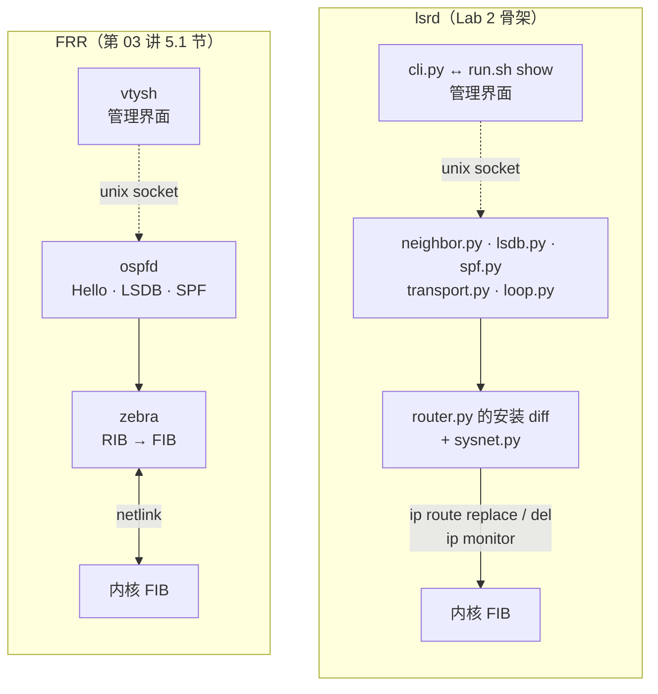
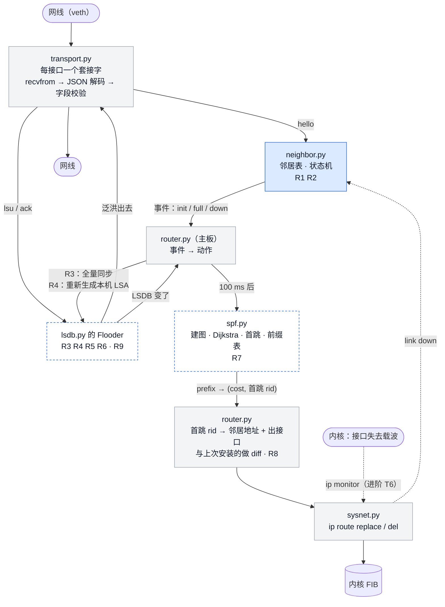
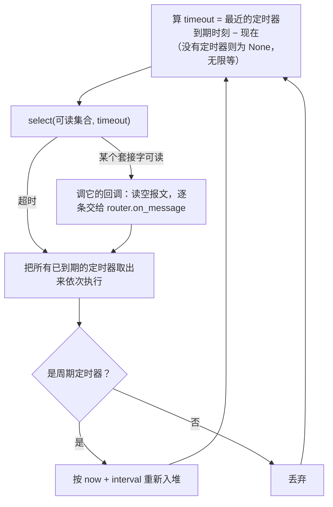
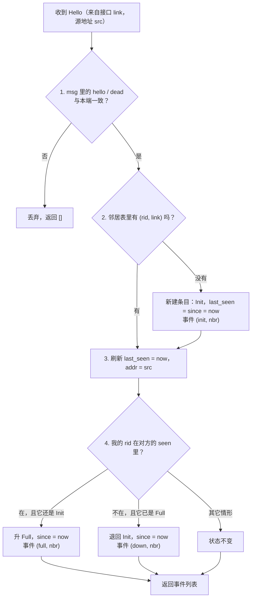
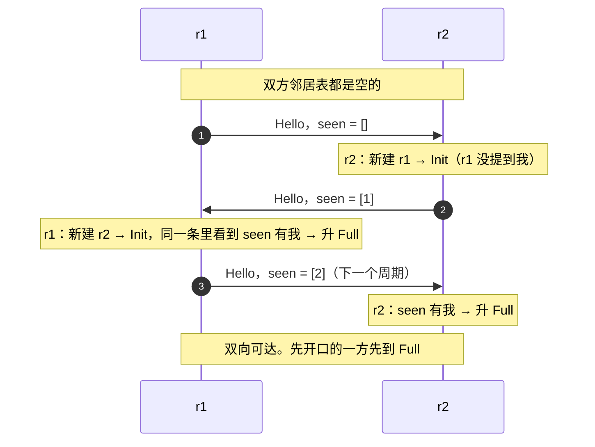
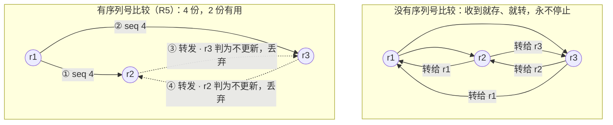
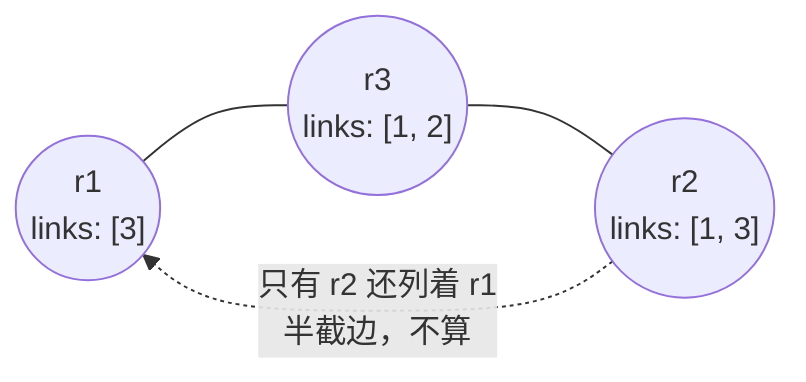
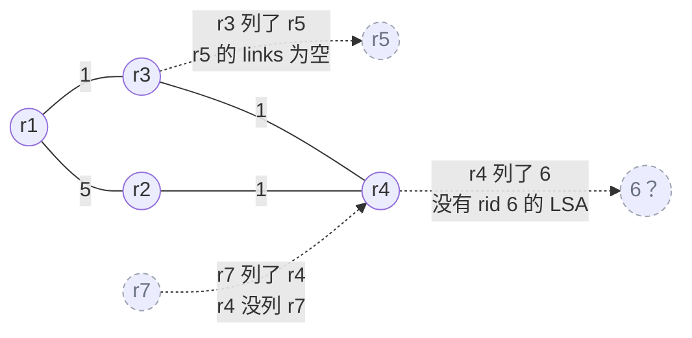

# 动手实现一个链路状态路由器

> **课程导读**：上一讲结束时，三台跑着 FRR 的路由器在三角形实验床上留下了三个数字——拔线 **0 丢包**、静默故障 **34.6 秒**、改一个 cost 就把流量**分到两条路**上。Lab 2 要你用 Python 把这三个数字自己做出来，给你的只有一页协议规范（LSR-lite v1，九条规则）和一个约 550 行的骨架。规范只有九条，为什么写出来要几百行？因为规范说的是“**什么时候该做什么**”，而程序要回答的是“**怎么知道时候到了**”——什么时候算收到了 Hello、什么时候算 8 秒没消息、什么时候该重跑一次 Dijkstra、算完了怎么让内核听你的。本讲就讲这一层：把九条规则拆成“定时器、报文、内核”三类事件，读懂骨架里每一个工程取舍为什么这样选，然后课上一起写出 Hello，让三台路由器互相认出来。之后用一份完整的实现演示三件事：泛洪为什么会停、去掉序列号它为什么停不下来、一张地图怎样变成内核里的路由——最后重启一台路由器，量一量业务断了多久，以及断在谁身上。
>
> 课前请完成 Lab 2 的任务 1（`uv sync`、跑一遍离线测试、读骨架），并把三个检查点的答案带到课堂上——本讲模块二会逐个讨论它们。

---

## 学习目标

1. **说出一个路由守护进程的五个部件**——I/O、事件循环、协议状态、计算、内核接口（外加管理接口）——以及一条 Hello、一条 LSA 各自在其间怎么流，并能与第 03 讲 5.1 节 FRR 的 zebra / ospfd / vtysh / netlink 一一对应。
2. **把规范读成事件**：能把 LSR-lite v1 的 R1–R9 每一条归到“定时器 / 报文 / 内核事件”三类，说出它的触发条件、改变的状态与动作。
3. **读懂给定代码的三个取舍**：一个 `select()` 同时伺候套接字与定时器、每个接口一个套接字、进程内 RIB 与内核 FIB 之间做 diff 安装——各自为什么这样选、代价是什么。
4. **亲手写出 Hello**：实现 `build_hello` 与 `process_hello`，在 `tcpdump -A` 里看到 `seen` 长出来、在 `show neighbors` 里看到邻居从 Init 到 Full，并说出这最多要几个 Hello 周期。
5. **解释泛洪为什么会停**：说出序列号比较在泛洪终止里的作用、三角形上一条 LSA 会在线上出现几份，以及去掉比较之后会发生什么。
6. **说出从地图到路由表的四步**（建图、Dijkstra 加首跳、前缀表、diff 安装）与“两只耳朵”（Hello 与 netlink），会用 `probe.py` 与 `ip -ts monitor` 把一次收敛拆成时间段。

---

## 模块一：从规范到进程——一个路由守护进程长什么样

### 1.1 上一讲的落点：三个数字，一页规范

第 03 讲模块六里，FRR 的 OSPF 在三台路由器上做到了三件事：拔掉 r1–r2 直连链路，100 个 ping **一个不丢**；把链路两端的协议报文悄悄丢掉（静默故障），丢包 **34.6 秒**后恢复；把直连口 cost 改成 20，去机架 2 的路由出现**两个下一跳**。这三个数字是 Lab 2 的验收目标，也是本讲每一段讨论的落点。

Lab 2 指导书 3.3 节那一页规范叫 **LSR-lite v1**，它是对 OSPF 做减法的结果。减掉了什么、为什么可以减，值得先看一眼：

| OSPF 有、LSR-lite 没有 | 它在 OSPF 里解决什么 | 为什么实验床上可以不要 |
| :--- | :--- | :--- |
| DR / BDR 选举 | 一个广播网段里多台路由器两两建邻是 $O(n^2)$ | 每条互联链路两端只有两台设备 |
| 区域（Area） | 限制泛洪与 SPF 重算的范围 | 三台路由器 |
| DBD / LS Request | 新邻居只索要自己缺的 LSA | 三条 LSA，全量发过去也就几百字节（R3） |
| LS age / MaxAge / 30 分钟刷新 | 清掉发布者已经消失的 LSA | 实验一轮几分钟，先不管“僵尸地图”（Lab 2 思考题会回来算这笔账） |
| 校验和、认证 | 防损坏、防伪造 | 明文 JSON，字段校验代替校验和；伪造留给挑战任务 |
| Network-LSA 等其它类型 | 描述广播网段、区域间路由、外部路由 | 只有 Router-LSA 就够画出三角形 |
| 直接封装在 IP 里（协议号 89） | 不依赖传输层 | 走 UDP 5200，`tcpdump -A` 直接可读 |

减掉的全是“规模、安全与广播网”三类问题的答案。留下来的，正是第 03 讲 1.4 节说的路由协议要做的四件事：**发现邻居、描述自己、同步地图、算路并写表**。R1–R8 就是这四件事的最小实现，R9（可靠泛洪）是进阶。

### 1.2 读规范的方法：每条规则都是“事件 → 状态 → 动作”

规范里每一条规则都可以拆成三段：**什么事件触发它**、**它改变哪个状态**、**它做什么动作**。按触发事件的来源把 R1–R9 重排一遍，得到下面这张表——它比按编号读规范更接近程序的样子：

| 事件来源 | 规则 | 触发条件 | 改变的状态 | 动作 |
| :--- | :--- | :--- | :--- | :--- |
| **定时器** | R1 | 每 `hello` 秒 | — | 在每个活动接口广播一条 Hello |
| **定时器** | R2 后半 | 某邻居 `dead` 秒没有 Hello | 邻居表：删除该条目 | 若它曾是 Full → 触发 R4 |
| **定时器** | R9 | 某条 LSU 发出 1 秒仍无 Ack | — | 重传（进阶） |
| **报文** | R2 前半 | 收到 Hello | 邻居表：新建 Init / 刷新心跳 / 升 Full / 退回 Init | 升 Full 时触发 R3、R4；退回时触发 R4 |
| **报文** | R5 | 收到 LSU | LSDB：更新才存入 | 转发给除来源外的 Full 邻居；安排一次 SPF |
| **报文** | R6 | 收到 `rid` 是自己、比本机新的 LSA | 本机 `seq` 下限抬高 | 重新生成本机 LSA（触发 R4 的动作） |
| **报文** | R9 | 收到 Ack | 待确认表：删条目 | （进阶） |
| **内部事件** | R3 | 某邻居刚进入 Full | — | 把整个 LSDB 单播给它 |
| **内部事件** | R4 | Full 邻居集合或前缀集合变了 | LSDB：本机 LSA `seq + 1` | 泛洪；安排一次 SPF |
| **内部事件** | R7 + R8 | LSDB 变了，且 100 ms 合并定时器到期 | RIB：重算前缀表 | 与上次安装的做 diff，`ip route replace / del` |
| **内核事件** | （进阶 T6） | 某接口失去载波 | 邻居表：该接口上的邻居立即删除 | 触发 R4 |

三点值得注意。第一，**没有一条规则是“主动”的**——守护进程不会自己想起来去做什么，它永远在等：等定时器到、等报文来、等内核说话。第二，R3、R4、R7 的触发条件都是**别的规则的副作用**（邻居表变了、LSDB 变了），所以程序里它们不是独立的入口，而是挂在 R2、R5、R6 后面的“后续动作”。第三，最后一行在基础任务里不存在——守护进程只有一只耳朵，5.5 节会回到这件事。

### 1.3 五个部件

有了这张表，一个路由守护进程该长什么样就很清楚了：需要一个地方**收发报文**，一个地方**等事件**，几张**表**记着协议状态，一段**计算**，以及一个**对内核说话**的出口。给定的骨架正是按这五块切的，外加一个给人看的管理接口：

| 部件 | 骨架里的文件 | 做什么 | FRR 里对应谁（第 03 讲 5.1 节） |
| :--- | :--- | :--- | :--- |
| I/O | `transport.py` | 每个接口一个 UDP 套接字；广播 Hello、单播 LSU；JSON 编解码与字段校验 | ospfd 的报文收发部分 |
| 事件循环 | `loop.py` | 一个 `select()` 同时等套接字与定时器 | FRR 的 libfrr 事件库 |
| 协议状态 | `neighbor.py`、`lsdb.py` | 邻居表与状态机；LSDB 与泛洪规则 | ospfd 的邻居状态机与 LSDB |
| 计算 | `spf.py` | 建图、Dijkstra、首跳、前缀表 | ospfd 的 SPF |
| 内核接口 | `sysnet.py` + `router.py` 的安装部分 | 读接口、写路由（diff）、听链路事件 | **zebra**（通过 netlink） |
| 管理接口 | `cli.py` ↔ `run.sh show` | 通过 unix socket 把邻居表 / LSDB / RIB / 计数器吐出来 | **vtysh** |



对照的意义在于：**结构是一样的**。zebra 与 ospfd 之间那条“RIB → FIB”的边界，在我们的进程里是 `router.py` 的 `rib` 字典与 `installed` 字典之间的那几行 diff；vtysh 与 ospfd 之间的 unix socket，在我们这里是 `cli.py`。基础任务里要写的两百多行，全部落在“协议状态”与“计算”两格里。

### 1.4 数据流：一条 Hello、一条 LSA 各走哪些文件

Lab 2 指导书 3.4 节画过数据流。这里再画一遍，多标一层：哪些是给定的、哪些今天课上一起写、哪些课后自己写。



灰底是给定的；实底蓝框 `neighbor.py` 今天课上一起写；虚线蓝框 `lsdb.py` 与 `spf.py` 是 Lab 2 任务 3、4 的产出。注意两条从 `router.py` 出去又回到 `lsdb.py` 的边——这就是 1.2 节说的“R3、R4 是别的规则的副作用”：邻居表报告“某邻居 Full 了”，主板决定“把地图发给它、把我的 LSA 改一版”。

### 1.5 三个工程取舍

骨架里有三个地方，换一种做法也能工作，但代价不同。读代码之前先把理由说清楚，读起来就不会奇怪“为什么不……”。

**单线程加 `select()`，而不是多线程。** 一个直觉的写法是：一个线程发 Hello，一个线程收包，一个线程跑 Dead 定时器。它们都要读写同一张邻居表，于是要加锁；加锁之后要担心死锁、担心状态机在两个线程之间被改乱；出了问题日志里的顺序还未必是真实的顺序。骨架的做法是**只有一个线程**，所有逻辑都在回调里顺序执行：收到一个包处理完再看下一个，定时器到了处理完再等下一个。没有锁，没有竞态，出了问题按日志时间顺序读一遍就能复现。代价是任何一个回调跑得慢都会拖住整个进程——协议的时间尺度是秒级，Python 处理一条 JSON 报文是几十微秒，绰绰有余。FRR 也是这样：每个守护进程内部是一个事件循环。

**JSON over UDP，而不是二进制 over IP 协议号 89。** OSPF 报文直接封装在 IP 里，字段按位排布，紧凑但要自己算校验和、自己解析。我们用 UDP 5200 加 JSON：`tcpdump -A` 抓下来就能读，两个同学的实现能否互操作一眼可辨，编解码只要 `json.dumps` / `json.loads`。代价是一条 Hello 约 60 字节（OSPF 的是 44 + 4n 字节，n 是邻居数），一条 LSU 约 200 字节，以及解析 JSON 比解析定长字段慢一个数量级。在三台路由器、每 2 秒一条 Hello 的规模上，这两笔代价都不值一提。

**两本账，只写差量。** 守护进程算出来的路由先放在自己的 `rib` 字典里，再与“上次写进内核的”`installed` 字典比对，只对有变化的那几条执行 `ip route replace` 或 `ip route del`——而不是每次算完都 `ip route flush proto 200` 再全部重装。这就是第 03 讲 1.3 节控制平面与数据平面的分界：RIB 是协议的账，FIB 是内核的账，两本账之间靠 diff 同步。5.4 节会算这两种做法在“拔线后收敛的那一刻”对正在转发的流量各有什么影响。

---

## 模块二：让进程听见——套接字、事件循环与定时器

本模块读的是给定的 `transport.py`、`loop.py`、`router.py`。每一节以一个问题开头——这三个问题正是 Lab 2 任务 1 的三个检查点，先想好你的答案再往下读。

### 2.1 为什么每个接口一个套接字

**问题**：`transport.py` 为每个活动接口开一个 UDP 套接字，而不是一个套接字监听全部接口。协议的哪一条规则要求“知道报文从哪个接口进来”？

看 `Transport.open()` 里建套接字的这几行：

```python
    sock = socket.socket(socket.AF_INET, socket.SOCK_DGRAM)
    sock.setsockopt(socket.SOL_SOCKET, socket.SO_REUSEADDR, 1)
    sock.setsockopt(socket.SOL_SOCKET, socket.SO_BROADCAST, 1)
    sock.setsockopt(socket.SOL_SOCKET, socket.SO_BINDTODEVICE, name.encode())
    sock.bind(("", self.port))
    sock.setblocking(False)
```

- `SO_BINDTODEVICE` 把套接字绑在一个接口上：从它收到的包一定来自这个接口，从它发出的包一定从这个接口出去。三个套接字都 `bind` 在同一个端口 5200 上，靠这个选项互不打架（`SO_REUSEADDR` 让它们能共存）。
- `SO_BROADCAST` 允许发往 `255.255.255.255`。这是**限制广播**（limited broadcast）地址——路由器绝不转发它，只在本链路上有效，而且不依赖接口是否配了 `brd` 地址。OSPF 用的是组播 `224.0.0.5`，要先加入组播组；我们的链路两端只有两台设备，广播就够了。
- `setblocking(False)`：非阻塞。收包的回调里用一个循环把套接字里积压的报文全读空，读到 `BlockingIOError` 就停。

答案在 R2 与 R8 里。R2 说邻居是**接口级**的：键是 `(rid, 接口名)`，同一个 router id 从两个接口都能听到时是两个邻居——所以处理 Hello 时必须知道它从哪个接口进来。R8 说下一跳要写成 `via <地址> dev <出接口>`——出接口也要知道。每接口一个套接字是最直白的办法：收到包的那个套接字属于哪个 `Link`，报文就来自哪个接口。单套接字也能做，要靠 `IP_PKTINFO` 辅助数据在每个包上带出入接口的索引——代码多、也难读。

还有一个细节在 `_on_readable()` 里：

```python
      if src == link.addr:
        continue                      # 自己发的广播会被内核回送一份，忽略
```

内核会把本机发出的广播回送一份给本机的套接字。不加这一行，每台路由器都会在邻居表里发现“自己”。第 01 讲 4.1 节讲过套接字与端口；这里第一次用到它们“绑在接口上”的形态。

### 2.2 一个 `select()` 怎样同时伺候两类事件

**问题**：事件循环里只有一个 `select()`。它怎么同时处理“套接字可读”与“定时器到期”？`call_every` 的定时器为什么不会因为回调跑得慢而“积压”？

`loop.py` 的核心是这几行：

```python
  def run(self) -> None:
    self._running = True
    while self._running:
      timeout = self._next_timeout()
      readable, _, _ = select.select(list(self._readers), [], [], timeout)
      for fd in readable:
        callback = self._readers.get(fd)
        if callback is not None:
          callback(fd)
      self._fire_due_timers()
```

`select()` 做的事是：给它一组文件描述符和一个超时，它睁眼等着，**任何一个描述符可读**或者**超时到了**就返回。两类事件的合流点就在 `timeout` 这个参数上——它等于**最近一个定时器还有多久到期**。于是每一轮循环：



定时器放在一个**小顶堆**里，堆顶永远是最早到期的那个，所以“最近的定时器还有多久”是 $O(1)$ 的。`call_later(delay, fn)` 与 `call_every(interval, fn)` 都只是往堆里放一个 `Timer`；`cancel()` 只做一个标记，被标记的定时器出堆时直接跳过。

第二个问题的答案在 `_fire_due_timers()` 的最后两行：

```python
      if timer.interval is not None and not timer.cancelled:
        timer.when = now + timer.interval
        heapq.heappush(self._timers, (timer.when, next(self._seq), timer))
```

周期定时器下一次的到期时刻是 **`now + interval`**，`now` 是**执行完回调之后**的时刻——而不是 `when + interval`（上一次“本该”到期的时刻加周期）。如果回调跑慢了 3 秒，前一种写法只是把下一次也顺延 3 秒，节拍漂移但每次只跑一次；后一种写法会发现“已经欠了一次”，立刻补跑，欠得多就连续补跑好几次——这就是“积压”。对 Hello 来说，漂移是可以接受的，连续补发好几条 Hello 则毫无意义。代价是长期看节拍会慢慢变慢——思考题 1 请你算这笔账。

### 2.3 时间：单调时钟与 0.5 秒的分辨率

`loop.now()` 返回的是 `time.monotonic()`，不是 `time.time()`。前者是**单调时钟**：只往前走，不受管理员改系统时间、NTP 校时的影响。协议里所有“多久没收到”——Dead 定时器、R9 的重传间隔——都用它。`time.time()` 只在日志与 CLI 的 `uptime` 里出现，那是给人看的。

Dead 定时器不是每个邻居一个，而是 `router.py` 每 0.5 秒调一次 `neighbors.expire(now)`，扫一遍邻居表，把 `now - last_seen > dead` 的删掉：

```python
    self.loop.call_every(self.cfg.hello, self._send_hellos)
    self.loop.call_every(0.5, self._tick)
```

于是 Dead 的**判定分辨率是 0.5 秒**：一个邻居死了，你最早在第 8.0 秒、最晚在第 8.5 秒发现。再加上 Dead 是从**最后一条收到的 Hello**算起的，而那条 Hello 可能是故障发生前 0 到 2 秒之间任何时刻到的——所以“只靠 Dead 发现故障”的时间落在 $[\text{dead} - \text{hello},\ \text{dead} + 0.5]$ = 6 到 8.5 秒之间，不是恰好 8 秒。6.11 节会实测到一个 7 秒左右的数。

### 2.4 先校验再处理

`transport.decode()` 把字节串变成字典之后，**按报文类型逐个字段校验**：`v` 必须是 1，`type` 必须是三种之一，`rid` 必须是整数，Hello 的 `hello` / `dead` 必须是正整数、`seen` 必须是整数列表，LSU 的每条 LSA 必须有整数 `rid` / `seq` 与格式正确的 `links` / `prefixes`。任何一项不对就抛 `MessageError`，`_on_readable()` 接住它、记一次 `bad_rx` 计数、丢弃报文继续收下一个。

这是 OSPF 校验和与认证的“穷人版”：能挡住格式错误与损坏，挡不住**格式正确的假话**——一条字段齐全、`seq` 很大、内容是编的 LSA 会顺利通过校验，交到 `lsdb.py` 手里。协议逻辑层面能挡住其中一种（R6：“收到自己的未来版本就跳过去”），Lab 2 任务 11 会拿伪造的 LSA 试试看。这里只记一个原则：**I/O 层负责“是不是一条合法报文”，协议层负责“这条报文说的对不对”**，两层分开，各自的错误处理才写得清楚。

### 2.5 主板：`router.py`

`router.py` 是把各部件接起来的“主板”，逻辑都在别处。它的文件头有一张时间线表，就是 1.2 节那张表的代码版：

| 事件 | 代码里的入口 | 交给谁 |
| :--- | :--- | :--- |
| 定时器，每 `hello` 秒 | `_send_hellos()` | 对每个活动接口 `transport.broadcast(link, neighbors.build_hello(link))`（R1） |
| 定时器，每 0.5 秒 | `_tick()` | `neighbors.expire(now)` → 事件 → `_handle_events()`（R2 的 Dead） |
| 定时器，每 1 秒（开了 R9） | `flooder.retransmit(now)` | 重传 |
| 套接字，收到 `hello` | `on_message()` | `neighbors.process_hello(...)` → 事件 → `_handle_events()` |
| 套接字，收到 `lsu` | `on_message()` | `flooder.on_lsu(...)` → 返回“LSDB 变了吗” → `schedule_spf()` |
| 套接字，收到 `ack` | `on_message()` | `flooder.on_ack(...)` |
| `ip monitor`（进阶 T6） | `on_link_change()` | `neighbors.link_down(link)` → 事件 → `_handle_events()` |

`_handle_events()` 是主板上最值得读的一段：

```python
  def _handle_events(self, events: Sequence[Event]) -> bool:
    """返回是否因此需要重新生成本机 LSA（并已安排）。"""
    changed = False
    for kind, nbr in events:
      if kind == "init":
        LOG.info("neighbor %s: Init", nbr)
      elif kind == "full":
        LOG.info("neighbor %s: Full", nbr)
        self.stats["neighbor_full"] += 1
        self.flooder.on_neighbor_full(nbr)        # R3
        changed = True
      elif kind == "down":
        LOG.info("neighbor %s: Down", nbr)
        self.stats["neighbor_down"] += 1
        self.flooder.on_neighbor_down(nbr)
        changed = True
      elif kind == "lost":
        LOG.info("neighbor %s: gone before Full", nbr)
    if changed:
      self.originate()                            # R4
    return changed
```

邻居模块**不直接**调用泛洪模块，它只**报告事件**——`("init", nbr)`、`("full", nbr)`、`("down", nbr)`、`("lost", nbr)`——由主板决定做什么：Full 了就全量同步（R3），Full 或 Down 都要改本机 LSA（R4）。这样切分有三个好处：`neighbor.py` 可以单独测试（喂几条 Hello，看返回的事件对不对）；今天课上写 `neighbor.py` 的时候完全不用碰泛洪；两周后你换掉 `lsdb.py` 的实现，`neighbor.py` 一个字不用改。

---

## 模块三：邻居发现——把 R1、R2 写成代码

本模块只讲设计。代码在模块六 6.4、6.5 节一起写。

### 3.1 三个状态，对照 OSPF 的七个

| LSR-lite | OSPF（第 03 讲 3.2 节） | 含义 |
| :--- | :--- | :--- |
| （不在表里） | Down | 从没听到过对方 |
| **Init** | Init | 听到了对方的 Hello，对方的 `seen` 里还没有我 |
| **Full** | 2-Way → ExStart → Exchange → Loading → Full | 对方的 `seen` 里有我：双向可达 |

OSPF 从 2-Way 到 Full 要走三步数据库同步（DBD、LS Request、LS Update）；LSR-lite 用 R3 的全量同步代替了它们，所以 2-Way 就是 Full。“Down”在我们这里不是一个状态，而是**从邻居表里删除**——一个不存在的条目不需要占一行。

### 3.2 数据结构：六个字段各为谁服务

`neighbor.py` 里给定的 `Neighbor` 数据类：

```python
@dataclass
class Neighbor:
  rid: int
  link: Link
  addr: str                  # 对方在这条链路上的地址 = 它 Hello 的源地址；R8 的下一跳就是它
  state: State
  last_seen: float           # 最近一次收到它 Hello 的时刻（loop.now()）
  since: float               # 进入当前状态的时刻
```

| 字段 | 谁用它 |
| :--- | :--- |
| `rid` | LSA 里 `links` 的 `nbr`（R4）；SPF 算出的首跳就是一个 rid（R7） |
| `link` | 出接口（R8 的 `dev`）；发单播 LSU 时用它的套接字 |
| `addr` | **R8 的下一跳地址**。SPF 只知道“首跳是路由器 2”，要把它翻译成 `via 10.0.12.2`，靠的就是邻居表里这一格 |
| `state` | Init / Full；只有 Full 邻居进 LSA、收泛洪 |
| `last_seen` | Dead 定时器的依据 |
| `since` | `show neighbors` 的 UP-FOR 列 |

邻居表的键是 `(rid, 接口名)` 而不是 `rid`。三角形实验床上不会有两条链路连着同一对路由器，但规范不排除：那时同一个 rid 会出现两个条目，各有各的地址和出接口。思考题 3 会问这个选择带来的一个后果。

### 3.3 R1：造一条 Hello

Hello 的六个字段里五个是常量，只有 `seen` 是活的：**本接口上听到过的所有邻居的 rid**——Init 的也算。

**预测一下再往下看**：如果 `seen` 里只放 Full 邻居，会发生什么？

会死锁。r1 听到 r2 的 Hello，把 r2 记成 Init；r1 的下一条 Hello 里若不带 `2`，r2 就永远看不到自己被听见，永远升不了 Full；r2 同样不带 `1`，r1 也永远升不了 Full。两边都在等对方先说“我听到你了”。`seen` 的语义就是这句话——“我听到你了”——所以只要听到过就要放进去。

### 3.4 R2：处理一条 Hello

`process_hello(link, src, msg, now)` 要做四步，顺序不能乱：



第 1 步是 OSPF 的老规矩：Hello / Dead 间隔两端必须一致，否则不能成为邻居（第 03 讲 3.2 节）——不一致的话，一边认为对方还活着、另一边已经把它删了。第 3 步是**心跳**：每一条 Hello 都要刷新 `last_seen`，不管状态怎样；`addr` 也顺手刷新，对方换地址不用重建邻居。第 4 步是双向确认，它决定 Init 与 Full 之间怎么走。

两台刚启动的路由器之间，Hello 会这样往来：



从第一条 Hello 到两边都 Full，**最多两个 Hello 周期**：第一条只能让对方知道我在，第二条才带着“我听到你了”。先开口的一方反而先到 Full——对方回它的第一条 Hello 里就已经带着它了。6.6 节的日志会印证这个数——同一个邻居的 Init 与 Full 两行相隔约 2 秒。

### 3.5 留白：Dead 定时器与“退回 Init”

今天课上写到第 4 步的前半（升 Full）。下面两处**留给 Lab 2 任务 2**，这里只给合同：

- **`expire(now)`**：删掉所有 `now - last_seen > dead` 的条目；曾经 Full 的产生 `("down", nbr)`，从没到过 Full 的产生 `("lost", nbr)`。`router.py` 每 0.5 秒调它一次。
- **第 4 步的后半**：对方的 `seen` 里**没有**我、而这个邻居**已经是** Full——说明对方重启过、或者它那边把我删掉了——退回 Init，`since = now`，产生 `("down", nbr)`。

写完之后用下面这张表自检（Lab 2 任务 2 的第 8 步就是第一行）：

| 情形 | 怎么制造 | r1 的 `show neighbors` 应显示 | r2 的应显示 |
| :--- | :--- | :--- | :--- |
| 单向阻断：r2 收不到 r1 的协议报文 | 在 r2 上 `iptables -I INPUT -i r2-r1 -p udp --dport 5200 -j DROP` | r2 先是 Full，约 8 秒后**退回 Init**（r2 的 Dead 先把 1 从 `seen` 里拿掉） | r1 的 LAST-HELLO 一路涨到 8 秒，然后**消失** |
| 对端重启 | `run.sh restart r2` | r2 立刻退回 Init（收到它 `seen = []` 的第一条 Hello），约 2 秒后重回 Full | 从空表开始，2 秒内到 Full |
| 拔线 | `ip -n r1 link set r1-r2 down` | r2 的 LAST-HELLO 涨到 8 秒左右后消失 | 同样 |

第三行“8 秒左右”的“左右”，就是 2.3 节说的 6 到 8.5 秒。

### 3.6 三面镜子

写对了没有，有三个地方可以看：

1. **`run.sh show r1 neighbors`**：一行一个邻居。STATE 是 Init 还是 Full；UP-FOR 是进入当前状态多久（`since`）；LAST-HELLO 是距上一条 Hello 多久（`last_seen`）——正常应在 0 到 2 秒之间来回，超过 2 秒说明对方的 Hello 没到。
2. **`tcpdump -n -l -A -i r1-r2 udp port 5200`**：`-A` 把 JSON 直接打出来，看 `seen` 里有没有对方。
3. **`/tmp/lsrd/r1.log`**：`neighbor rid=2 via r1-r2 (10.0.12.2): Init` 与 `...: Full` 两行，时间差就是从 Init 到 Full 花的时间。

最常见的三个错：`seen` 只放了 Full 邻居（3.3 节的死锁）；第 3 步忘了刷新 `last_seen`（写完 Dead 之后所有邻居每 8 秒消失一次）；第 1 步比较写反了（把一致的当成不一致，永远没有邻居）。

---

## 模块四：泛洪——序列号让洪水停下来

第 03 讲 3.4 节讲过可靠泛洪的流程图。这一模块从实现者的角度重看它：四条规则各解决什么问题、一条 LSA 在三角形上到底走了几步，以及把序列号比较拿掉之后会发生什么。代码是 Lab 2 任务 3 的产出，这里不给；6.9、6.10 节用一份完整的实现演示。

### 4.1 四条规则各解决一个问题

| 规则 | 它回答的问题 | LSR-lite 的做法 | OSPF 的做法（第 03 讲 3.4 节） |
| :--- | :--- | :--- | :--- |
| **R3** | 新邻居怎么拿到整张地图？ | 邻居一进 Full，把本机 LSDB 里的**全部** LSA 打包成一条 LSU 单播给它 | DBD 交换摘要 → LS Request 只索要缺的 → LS Update |
| **R4** | 什么时候该改地图？ | 本机的 Full 邻居集合或前缀集合变了：`seq + 1`，重新生成，泛洪 | 同样；另加每 30 分钟刷新一次 |
| **R5** | 洪水怎么停？ | 收到的 LSA 比 LSDB 里的**新**（没有这台路由器的、或 `seq` 更大）才存入并转发给**除来源外**的 Full 邻居；否则丢弃 | 同样，外加 LS Ack 与重传 |
| **R6** | 重启后 `seq` 从 1 开始怎么办？别人冒充我怎么办？ | 收到 `rid` 是自己、比本机新的 LSA → 把本机 `seq` 跳到它之上，重新生成并泛洪 | RFC 2328 13.4 节：收到自己发布的更新 LSA，以更大的序列号重发 |

R5 是这一组的核心。“除来源外”是空间上的止损——不把刚收到的东西原路送回；“更新才转发”是时间上的止损——同一条 LSA 每台路由器只转发一次。两个条件缺一不可，4.3 节会拿掉第二个看看。

R6 看起来是个边角料，其实每次调试都会用到：改完代码 `run.sh restart r1`，r1 从 `seq = 1` 重新开始，可 r2、r3 手里还有它上一版 `seq = 5` 的 LSA——按 R5，r1 的新 LSA 比旧的“旧”，会被所有人丢掉，r1 永远回不到地图上。有了 R6，r1 在全量同步（R3）里收到自己的旧版本，`seq` 跳到 6，重发，地图修好。6.12 节会在日志里看到这一跳。

### 4.2 一条 LSA 在三角形上走几步

**预测一下再往下看**：r1 重新生成一条 LSA（内容不变，`seq + 1`）。三角形的三条链路上，这条 LSA 一共会出现几份？其中几份被“存入”、几份被“丢弃”？

r1 有两个 Full 邻居，R4 让它把新 LSA 各发一份：**① 给 r2，② 给 r3**。r2 收到 ①：LSDB 里的 r1 是旧版本，更新 → 存入，转发给除 r1 外的 Full 邻居，**③ 给 r3**。r3 收到 ②：同样存入，**④ 给 r2**。然后 r3 收到 ③、r2 收到 ④：`seq` 相等，不更新，丢弃，**不再转发**。泛洪到此为止。



线上 **4 份，有用 2 份**——“有用”的份数等于要拿到这条 LSA 的路由器数，多出来的那些是环上两个方向撞在一起的结果。换成别的拓扑这两个数会怎样变，是 Lab 2 的思考题；6.9 节先用 `tcpdump` 和计数器把三角形上的 4 和 2 数出来。

### 4.3 拿掉序列号比较会怎样

把 R5 的“更新才存入并转发”改成“收到就存入并转发”——空间止损（除来源外）还在，时间止损没了。再看右边那张图：r2 收到 ① 转给 r3，r3 收到 ② 转给 r2；r3 收到 ③ 转给 **r1**（来源是 r2，r1 不是来源），r2 收到 ④ 也转给 r1；r1 收到它们，转给另一个……**每收到一份就发出一份**，两份 LSA 在三角形上永远绕圈，速度只受进程处理能力限制。在全连接的四台路由器上更糟：每收到一份发出两份，份数按 $2^k$ 增长。

第 02 讲 1.6 节讲过二层的广播风暴：以太网帧头里没有任何东西能告诉交换机“这一份我已经见过了”，所以有环必成灾，只能靠 STP 把环砍成树。链路状态泛洪跑在有环的拓扑上却不出事——**序列号就是那个“见过了”的标记**：每台路由器用它判断“这一份是不是新的”，不新就不转发，洪水自然停在环上。二层没有这个标记，是因为帧不是“描述”而是“货物”，每一帧都是新的。6.10 节会把这个标记拿掉，让你看一眼泛洪风暴长什么样。

> [!NOTE]
> OSPF 除序列号之外还有 **LS age**：一条 LSA 在 LSDB 里躺满 3600 秒（MaxAge）就作废，发布者每 30 分钟刷新一次。序列号解决的是“这一份新不新”，age 解决的是“发布者是不是已经不在了”——一台路由器彻底消失后，它的 LSA 没有人再刷新，到时间自然被清掉。LSR-lite 没有 age，所以一台路由器下线后它的 LSA 会一直留在别人的 LSDB 里（R7 的“半截边不算边”保证它不会把流量引进黑洞）。这是 Lab 2 思考题 3 的内容。

### 4.4 三张地图一致，怎么验

第 03 讲 6.6 节在三台路由器上分别 `show ip ospf database`，对照序列号与校验和逐行一致。LSR-lite 没有校验和，`run.sh check` 用的是**指纹**：把 LSDB 里所有 LSA 按 rid 排序、每条 LSA 的键排序、用 `json.dumps(..., sort_keys=True)` 序列化成唯一的字符串，取 SHA-1 前十位。三台的指纹相同，地图就相同。

```python
  def digest(self) -> str:
    """整个 LSDB 的指纹：三台路由器的地图一致，指纹就一致。"""
    canonical = json.dumps([lsa.to_dict() for lsa in self.all()], sort_keys=True,
                           separators=(",", ":"))
    return hashlib.sha1(canonical.encode()).hexdigest()[:10]
```

这也是 `transport.encode()` 坚持 `sort_keys=True` 的原因：同一条报文的编码唯一，抓包比对、两个实现互操作时排错都省心。

---

## 模块五：从地图到路由表——SPF、首跳、安装与两只耳朵

第 03 讲 3.5 节在三角形上手推过 Dijkstra。写成程序时，Dijkstra 本身只是四步中的一步——前面要**建图**，Dijkstra 要顺手多记一个**首跳**，后面还要把路由器的距离换成**网段的距离**，最后把“首跳是路由器 3”翻译成“`via 10.0.13.2 dev r1-r3`”并**写进内核**。代码是 Lab 2 任务 4 的产出，这里只讲每一步的规则和一个手推例子。

### 5.1 建图：半截边不算边

LSA 里的 `links` 是**单方面的声明**：“我连着 2，cost 10”。R7 规定，边 A–B 存在，当且仅当 A 的 `links` 列了 B **并且** B 的 `links` 列了 A。为什么要双向？看拔线后的一瞬间：



r1 已经发现 r2 不在了（Dead 或链路事件），新 LSA 里删掉了 r2；r2 的旧 LSA 还列着 r1。如果单方面声明就算边，r1 会算出“经 r2 去机架 2”——沿着一条已经不存在的链路。双向确认让这条“半截边”不存在，r1 只能绕 r3。Lab 2 的 `tests/graphs/halflink.json` 就是这个场景。

### 5.2 Dijkstra 多记一个集合：首跳

第 03 讲 3.5 节的 Dijkstra 算出的是“到每台路由器多远”。路由表要的却是“**去那里第一步迈向谁**”——首跳（first hop）。它不需要另算，在松弛的时候顺手记下来即可：

- root 的直接邻居 v：`first_hops[v] = {v}`。
- 经 u 松弛 v 时：若新距离**更短**，v 的首跳**继承** u 的首跳集合；若**相等**，取**并集**。

并集就是等价多路径的来源：到 v 有两条一样短的路，各从不同的首跳出发，`first_hops[v]` 里就有两个 rid，进阶任务 T8 把它们装成两个下一跳。

用 Lab 2 `tests/graphs/five.json` 的图手推一遍。五台路由器，cost 不对称，其中两条声明是单方面的：



建图之后只剩四条边：r1–r2（5）、r1–r3（1）、r2–r4（1）、r3–r4（1）。以 r1 为根：

| 步 | 取出（已确定） | 松弛 | 候选集（距离，首跳） |
| :--- | :--- | :--- | :--- |
| 0 | r1（0） | r2：0 + 5 = 5，首跳 {r2}；r3：0 + 1 = 1，首跳 {r3} | r3（1，{r3}）、r2（5，{r2}） |
| 1 | r3（1，{r3}） | r4：1 + 1 = 2，**继承** r3 的首跳 {r3}；r5：半截边，不存在 | r4（2，{r3}）、r2（5，{r2}） |
| 2 | r4（2，{r3}） | r2：2 + 1 = 3 **< 5**，改为（3，{r3}）；6：没有 LSA，不存在 | r2（3，{r3}） |
| 3 | r2（3，{r3}） | r1、r4 都不会更短 | 空。r5、6、r7 不可达 |

**到 r2 的首跳是 r3，不是 r2 自己**——虽然 r1–r2 直连，但绕 r3、r4 反而更近（3 < 5）。这就是为什么首跳要在松弛时“继承”：r2 的最短路是经 r4 来的，r4 的首跳是 r3，于是 r2 的首跳也是 r3。三角形上看不出这一点，因为每台路由器都是直接邻居。

### 5.3 前缀表：网段挂在路由器身上

路由器只是地图上的中转顶点，要写进路由表的是**网段**。每条 LSA 的 `prefixes` 列着这台路由器直连的网段及其 cost，R7 规定：

- 前缀 P 的距离 = **通告它的路由器的距离 + P 自己的 cost**；
- 多台路由器通告同一前缀，取最小；
- root 自己通告的前缀是直连的，**不出现在结果里**。

接着上面的例子：

| 前缀 | 谁通告、cost 多少 | 从 r1 出发的距离 | 首跳 |
| :--- | :--- | :--- | :--- |
| 10.3.0.0/24 | r3，1 | 1 + 1 = **2** | {r3} |
| 10.4.0.0/24 | r4，1 | 2 + 1 = **3** | {r3} |
| 10.2.0.0/24 | r2，1 | 3 + 1 = **4** | {r3} |
| 10.9.0.0/24 | r4 以 100；r7 以 1 | r4：2 + 100 = **102**；r7 不可达，不参与 | {r3} |
| 10.5.0.0/24 | r5，1 | r5 不可达 → **不出现** | — |
| 10.1.0.0/24 | r1 自己 | 直连 → **不出现** | — |

`tests/test_spf.py` 里 `five.json` 的期望结果就是前四行。测试不需要 root、不需要实验床——先在这里把 R7 调通，再上 namespace。

### 5.4 翻译与安装：两本账之间的 diff

SPF 的产出是 `{前缀: (cost, [首跳 rid, ...])}`。要变成内核认识的路由，还差三步，都在给定的 `router.run_spf()` 里：

**翻译**。首跳 rid → 查邻居表 `neighbors.full_by_rid(rid)` → 该邻居的 `(addr, link.name)`，也就是 `via 10.0.13.2 dev r1-r3`。这就是 3.2 节说的 `Neighbor.addr` 存在的理由：SPF 只知道路由器编号，邻居表知道它在这条链路上的地址。

**过滤**。直连网段**绝不安装**——内核已经有 `proto kernel` 的直连路由，再写一条只会添乱：

```python
      if prefix in connected:
        continue                                  # 直连网段绝不安装（R8）
```

**diff 安装**。与上次写进内核的 `installed` 比对，只动有变化的：

```python
    for prefix, nexthops in desired.items():
      if self.installed.get(prefix) != nexthops:
        if sysnet.route_replace(prefix, nexthops):
          self.installed[prefix] = nexthops
          replaced += 1
          self.stats["route_replaced"] += 1
          LOG.info("route replace %s via %s", prefix,
                   " + ".join(f"{via} dev {dev}" for via, dev in nexthops))
    for prefix in [p for p in self.installed if p not in desired]:
      if sysnet.route_del(prefix):
        deleted += 1
        self.stats["route_deleted"] += 1
        LOG.info("route del %s", prefix)
      del self.installed[prefix]
```

`ip route replace` 是幂等的：有这条就改，没有就加，所以不用区分“新增”与“修改”。每条路由都带 `proto 200 metric 20`——`proto 200` 是 iproute2 没占用的协议号，`ip route show proto 200` 一眼看出哪些路由是这个进程写的（第 02 讲 3.2 节的 `proto` 表在这里派上用场）；`metric 20` 与 FRR 的 OSPF 一致，所以第 03 讲 5.2 节那个 WARNING 在这里原样成立：谁手工加一条 `metric 0` 的静态路由，内核就会一直用它，守护进程算得再对也没用。

**问题**：为什么不每次算完都 `ip route flush proto 200`，再把结果全部装回去？代码更短。

| | flush 后全部重装 | 与上次比对，只动差量 |
| :--- | :--- | :--- |
| 拔线后收敛的那一刻 | 所有路由先消失再逐条回来，**每一条**都有几毫秒的黑洞——包括那些根本没受影响的路由 | 只有真正变化的路由被 replace，`replace` 是原子的：旧路由被新路由替换，中间没有“没有路由”的瞬间 |
| 稳态下收到一条无关的 LSA（例如邻居刷新） | 全表 flush + 重装，正在转发的流量抖一下 | diff 为空，什么也不做 |
| `ip` 命令的调用次数 | 1 + 路由条数 | 变化的条数 |
| zebra 的做法 | — | 同样是 diff |

`run.sh show r1 routes` 打出来的是 RIB（进程的账），最右一列 KERNEL 标着它是否已在内核里；`ip -n r1 route show proto 200` 打出来的是 FIB（内核的账）。两本账正常时应当一致；Lab 2 任务 10 的六种故障里，有一种只有把两本账放在一起才看得出来。

### 5.5 两只耳朵：Hello 与 netlink

第 03 讲 3.7 节把收敛时间拆成检测、传播、计算、安装四段，并说“检测几乎总是大头，而且差着三个数量级”：拔线是“响的故障”，内核立刻知道；对端死机是“静默的故障”，只有 Dead 定时器能发现。

从实现者的角度重看这句话：内核“立刻知道”没有用，除非**守护进程在听**。zebra 通过 netlink 订阅了内核的接口事件，接口一 down 它就收到通知，几毫秒内把邻居置 Down、重算、改路由——这是 FRR 拔线 0 丢包的全部秘密。基础版的 `lsrd` 只有一只耳朵：听网络里的 Hello。内核喊了，它听不见，只能等 8 秒 Dead——**一个响的故障，被它当成了静默故障**。

第二只耳朵不难装，`ip monitor` 就是 netlink 的命令行外壳。先学会用它看：

```bash
sudo ip -n r3 -ts monitor link route
```

`-ts` 给每一行加时间戳；`link route` 只订阅链路事件与路由事件。对端拔线时它会打出这样两类行（取自 6.11 节的实测）：

```
[2026-09-27T14:44:36.495426] 29: r3-r1@if30: <NO-CARRIER,BROADCAST,MULTICAST,UP> mtu 1500 qdisc noqueue state DOWN group default
    link/ether 2a:5e:a4:1b:ac:6b brd ff:ff:ff:ff:ff:ff link-netns r1
[2026-09-27T14:44:43.563059] 10.0.1.0/24 via 10.0.23.1 dev r3-r2 proto 200 metric 20
```

第一行是内核在说“`r3-r1` 没有载波了”（对端 down 掉，本端 veth 立刻 `NO-CARRIER`），第二行是七秒后守护进程改了路由——`proto 200` 说明是它写的。两行时间戳之差，就是这只耳朵没装上的代价。进阶任务 T6 会让守护进程自己起一个 `ip -o monitor link` 子进程，把它的输出挂进事件循环（1.2 节表格的最后一行）——那时这个差会从秒级降到百毫秒以内。

`ip monitor` 还有一个用处与协议无关：**任何**守护进程对内核路由表做的每一个动作它都看得见——FRR 的 zebra 也一样。调试时开一个终端挂着它，等于给内核路由表装了一台行车记录仪。

### 5.6 量一次收敛

拔线丢了几个包，第 03 讲用的是 `ping -O`。它有两个不够好的地方：往返把去程与回程的收敛混在一起（去程走 r1 的路由表，回程走 r2 的）；1 秒一个包，分辩率太粗。Lab 2 给了 `probe.py`：

- **单向**：`recv` 端先起，`send` 端每秒发 100 个 UDP 包，每包带**序号**与**发送时刻**。去程与回程可以分开量，把两端调换即可。
- **用发送端的时间戳算空洞**：接收端按序号找缺口，一个缺口的长度 = 首个丢失序号的发送时刻 → 缺口之后第一个收到的包的发送时刻。全部用发送端的时钟，所以不需要两端时钟同步（思考题 5 问这个选择的代价）。
- 100 pps，**分辨率 10 ms**；结束时打出最长中断与每个空洞的位置。

要把一次收敛拆成第 03 讲的四段，需要几处时间戳凑在一起：

| 段 | 从哪里拿时间 |
| :--- | :--- |
| 检测 | `ip -ts monitor link` 的链路事件 → 守护进程日志里 `neighbor ...: Down` 那一行 |
| 传播 | 日志里 `originated LSA(...)` → 邻居日志里 `LSA rid=... newer, stored` |
| 计算 | 日志里 `spf: 3 prefixes (3.5 ms)`——括号里就是 SPF 的耗时 |
| 安装 | 同一行后半 `installed 2, deleted 0 (3.8 ms)`；对照 `ip -ts monitor route` 里路由事件的时间戳 |

再加上 `run.sh show rN stats` 的计数器（`lsu_tx`、`route_replaced`、`spf_runs` ……），一次收敛的账就齐了。Lab 2 任务 5、6 用它填四段表；6.12 节先用它量一次“重启”。

---

## 模块六：动手实验——课上一起写 Hello，再看一份完整的实现把地图变成路由

> [!NOTE]
> **本模块是课堂跟做版**，分两种步骤。标着**跟做**的所有人一起敲：搭实验床、先看骨架怎么死、一起写 `neighbor.py`、看三台路由器互相认出来。标着**演示**的跑的是教师手里的**参考实现**（Lab 2 的规范全部实现完的样子），讲义里放的是它的输出，让你看到两周后自己的进程该长什么样、以及序列号被拿掉时和路由器重启时会发生什么——你做完 Lab 2 对应的任务之后，可以用同样的命令原样复现。一句话分工：**这里的任务是看懂现象，Lab 2 的任务是做出自己的。**
> 本模块默认你已经完成 Lab 2 任务 1（`uv sync`、离线测试、读过骨架）。所有命令从仓库根目录执行。

### 6.1 准备与自检　【跟做】

```bash
# 1. 进入 Lab 2 目录装好环境（任务 1 做过的话这一步一秒钟）
(cd 2026/experiments/02 && uv sync)

# 2. 离线测试：此刻应当 12 个失败、5 个通过——失败的正是要写的 R5 与 R7
(cd 2026/experiments/02 && uv run python -m unittest 2>&1 | tail -3)
```

```
Ran 17 tests in 0.004s

FAILED (failures=9, errors=3)
```

### 6.2 搭实验床　【跟做】

```bash
# 3. Lab 1 的两机架 + r3，并删掉 Lab 1 的两条静态路由
sudo bash 2026/experiments/02/topo.sh

# 4. r1 只剩三条直连路由——没有人再手工配路由了
sudo ip -n r1 route show
```

```
10.0.1.0/24 dev br1 proto kernel scope link src 10.0.1.1
10.0.12.0/30 dev r1-r2 proto kernel scope link src 10.0.12.1
10.0.13.0/30 dev r1-r3 proto kernel scope link src 10.0.13.1
```

### 6.3 先跑骨架，看它怎么死　【跟做】

**预测一下再往下看**：骨架里 `neighbor.py` 的三个函数都是一行 `raise NotImplementedError`。`run.sh start` 之后，进程起来后做的第一件事是什么？它会崩在哪个函数里？

```bash
# 5. 起三台守护进程——它们会立刻死掉
sudo bash 2026/experiments/02/run.sh start
```

```
[*] 启动守护进程：
  [FAIL] r1 没有起来，看日志：tail /tmp/lsrd/r1.log
```

```bash
# 6. 看 r1 日志的末尾
tail -n 14 /tmp/lsrd/r1.log
```

```
Traceback (most recent call last):
  File ".../2026/experiments/02/lsrd/__main__.py", line 107, in main
    router.start()
  File ".../2026/experiments/02/lsrd/router.py", line 99, in start
    self._send_hellos()       # 不等第一个周期，立刻打招呼
    ^^^^^^^^^^^^^^^^^^^
  File ".../2026/experiments/02/lsrd/router.py", line 113, in _send_hellos
    self.transport.broadcast(link, self.neighbors.build_hello(link))
                                   ^^^^^^^^^^^^^^^^^^^^^^^^^^^^^^^^
  File ".../2026/experiments/02/lsrd/neighbor.py", line 87, in build_hello
    raise NotImplementedError("neighbor.build_hello：规范 R1，第 04 讲课上一起写")
NotImplementedError: neighbor.build_hello：规范 R1，第 04 讲课上一起写
14:43:14.664 INFO    router: flushed proto 200 routes
14:43:14.665 INFO    lsrd: lsrd stopped
```

`run.sh` 报 `[FAIL]`，因为 `__main__.py` 把学生代码抛出的异常接住、记下 `daemon crashed`、清理（`flushed proto 200 routes`）、删掉 pid 文件后退出了——进程活了几毫秒。**把 traceback 当地图读**，从下往上：`__main__` 调 `router.start()`，它做的第一件事（打开套接字、登记定时器之后）是 `_send_hellos()`——“不等第一个周期，立刻打招呼”——于是调到 `neighbors.build_hello()`，撞上桩。这条调用链正是 1.4 节数据流图的第一段。

### 6.4 会说、不会听　【跟做】

打开 `2026/experiments/02/lsrd/neighbor.py`。三个函数一起改：`build_hello` 写真的（R1），`process_hello` 与 `expire` **先只返回空列表**——否则收到第一条 Hello、或 0.5 秒后第一次 tick，进程又会崩。

把 `build_hello` 里的两行桩换成：

```python
  def build_hello(self, link: Link) -> Dict[str, Any]:
    """（docstring 见骨架）"""
    return {
        "v": VERSION,
        "type": "hello",
        "rid": self.rid,
        "hello": self.hello,
        "dead": self.dead,
        "seen": sorted(n.rid for n in self.on_link(link)),   # 本接口上听到过的所有邻居，Init 也算
    }
```

六个字段里五个是常量，`seen` 是本接口上所有邻居的 rid（3.3 节：Init 也算）。`sorted` 让两条内容相同的 Hello 编码也相同，抓包时好比对。

`process_hello` 与 `expire` 的桩先换成一行：

```python
  def process_hello(self, link: Link, src: str, msg: Dict[str, Any], now: float) -> List[Event]:
    """（docstring 见骨架）"""
    return []                                                 # 先不处理：什么事件也不产生

  def expire(self, now: float) -> List[Event]:
    """（docstring 见骨架）"""
    return []                                                 # 先不处理：什么事件也不产生
```

**预测一下再往下看**：现在三台都会说 Hello、但谁也不处理收到的 Hello。抓包会看到什么？邻居表里会出现对方吗？会有人到 Full 吗？

```bash
# 7. 重新启动三台，抓 r1–r2 链路上的四条 Hello（-A 把 JSON 直接打出来）
sudo bash 2026/experiments/02/run.sh start
sudo ip netns exec r1 tcpdump -n -l -A -i r1-r2 udp port 5200 -c 4
```

```
tcpdump: verbose output suppressed, use -v[v]... for full protocol decode
listening on r1-r2, link-type EN10MB (Ethernet), snapshot length 262144 bytes
14:43:21.805409 IP 10.0.12.1.5200 > 255.255.255.255.5200: UDP, length 59
E..W"n@.@..(
........P.P.C.U{"dead":8,"hello":2,"rid":1,"seen":[],"type":"hello","v":1}
14:43:21.935119 IP 10.0.12.2.5200 > 255.255.255.255.5200: UDP, length 59
E..Wa]@.@..7
........P.P.C.V{"dead":8,"hello":2,"rid":2,"seen":[],"type":"hello","v":1}
14:43:23.806034 IP 10.0.12.1.5200 > 255.255.255.255.5200: UDP, length 59
E..W#.@.@...
........P.P.C.U{"dead":8,"hello":2,"rid":1,"seen":[],"type":"hello","v":1}
14:43:23.935612 IP 10.0.12.2.5200 > 255.255.255.255.5200: UDP, length 59
E..Wb.@.@...
........P.P.C.V{"dead":8,"hello":2,"rid":2,"seen":[],"type":"hello","v":1}
4 packets captured
4 packets received by filter
0 packets dropped by kernel
```

```bash
# 8. 邻居表是空的
sudo bash 2026/experiments/02/run.sh show r1 neighbors
```

```
 RID  IFACE    ADDR         STATE COST  UP-FOR LAST-HELLO
(no neighbors)
```

两边每 2 秒一条 Hello，发往 `255.255.255.255`，59 字节的 JSON，`seen` **永远是 `[]`**——因为没有人把收到的 Hello 记进邻居表，`build_hello` 的 `on_link(link)` 永远是空的。会说不会听，就永远是一群自言自语的路由器。

### 6.5 会听了　【跟做】

把 `process_hello` 那一行桩换成 3.4 节的四步——今天只写到第 4 步的前半：

```python
  def process_hello(self, link: Link, src: str, msg: Dict[str, Any], now: float) -> List[Event]:
    """（docstring 见骨架）"""
    events: List[Event] = []
    if msg["hello"] != self.hello or msg["dead"] != self.dead:   # 1. 定时器不一致：不是一伙的，丢弃
      return events
    key = (msg["rid"], link.name)
    nbr = self._table.get(key)
    if nbr is None:                                              # 2. 第一次听到它：新建，Init
      nbr = Neighbor(rid=msg["rid"], link=link, addr=src, state=State.INIT,
                     last_seen=now, since=now)
      self._table[key] = nbr
      events.append(("init", nbr))
    nbr.last_seen = now                                          # 3. 每条 Hello 都是心跳：刷新
    nbr.addr = src
    if self.rid in msg["seen"] and nbr.state is State.INIT:     # 4. 它也听到我了：双向可达，Full
      nbr.state = State.FULL
      nbr.since = now
      events.append(("full", nbr))
    return events
```

对照 3.4 节的流程图：第 1 步一致性检查，不一致直接返回空列表（报文被静静丢掉，`router.py` 什么也不会做）；第 2 步第一次听到就新建 Init 条目并报告 `init` 事件；第 3 步每条 Hello 都刷新心跳；第 4 步看到自己的 rid 在对方的 `seen` 里、而它还是 Init，就升 Full 并报告 `full` 事件。`expire` 仍然返回空列表——留给 Lab 2。

```bash
# 9. 改完代码要重启才生效。起来一秒内看一眼邻居表
sudo bash 2026/experiments/02/run.sh stop
sudo bash 2026/experiments/02/run.sh start
sudo bash 2026/experiments/02/run.sh show r1 neighbors
```

```
 RID  IFACE    ADDR         STATE COST  UP-FOR LAST-HELLO
   2  r1-r2    10.0.12.2    Init    10    1.1s       1.1s
   3  r1-r3    10.0.13.2    Init    10    1.0s       1.0s
```

### 6.6 邻居长出来　【跟做】

**预测一下再往下看**：从 Init 到 Full 要几个 Hello 周期？几秒后再看邻居表，UP-FOR 与 LAST-HELLO 两列各会是多少？

```bash
# 10. 几秒后再看
sudo bash 2026/experiments/02/run.sh show r1 neighbors
```

```
 RID  IFACE    ADDR         STATE COST  UP-FOR LAST-HELLO
   2  r1-r2    10.0.12.2    Full    10    4.2s       0.2s
   3  r1-r3    10.0.13.2    Full    10    4.0s       0.0s
```

```bash
# 11. 抓四条 Hello：seen 里有对方了
sudo ip netns exec r1 tcpdump -n -l -A -i r1-r2 udp port 5200 -c 4
```

```
tcpdump: verbose output suppressed, use -v[v]... for full protocol decode
listening on r1-r2, link-type EN10MB (Ethernet), snapshot length 262144 bytes
14:43:38.067045 IP 10.0.12.1.5200 > 255.255.255.255.5200: UDP, length 60
E..X*.@.@..z
........P.P.D.V{"dead":8,"hello":2,"rid":1,"seen":[2],"type":"hello","v":1}
14:43:38.182356 IP 10.0.12.2.5200 > 255.255.255.255.5200: UDP, length 60
E..Xi.@.@...
........P.P.D.W{"dead":8,"hello":2,"rid":2,"seen":[1],"type":"hello","v":1}
14:43:40.067729 IP 10.0.12.1.5200 > 255.255.255.255.5200: UDP, length 60
E..X*.@.@...
........P.P.D.V{"dead":8,"hello":2,"rid":1,"seen":[2],"type":"hello","v":1}
14:43:40.182697 IP 10.0.12.2.5200 > 255.255.255.255.5200: UDP, length 60
E..Xj.@.@..z
........P.P.D.W{"dead":8,"hello":2,"rid":2,"seen":[1],"type":"hello","v":1}
4 packets captured
4 packets received by filter
0 packets dropped by kernel
```

```bash
# 12. 日志里的两次状态变化
grep neighbor /tmp/lsrd/r1.log
```

```
14:43:30.183 INFO    router: neighbor rid=2 via r1-r2 (10.0.12.2): Init
14:43:30.317 INFO    router: neighbor rid=3 via r1-r3 (10.0.13.2): Init
14:43:32.181 INFO    router: neighbor rid=2 via r1-r2 (10.0.12.2): Full
14:43:32.181 WARNING lsdb: TODO 尚未实现：Flooder.on_neighbor_full（R3）
14:43:32.315 INFO    router: neighbor rid=3 via r1-r3 (10.0.13.2): Full
```

三面镜子（3.6 节）都对上了：邻居表里两个邻居 Full；Hello 从 59 字节变成 60 字节，多出来的一个字节就是 `seen` 里的那个数字；日志里同一个邻居的 Init 与 Full 相隔 **2.0 秒**——正好一个 Hello 周期，3.4 节时序图说的“最多两个周期”里的那个“一个”。日志里还有一行 `TODO 尚未实现：Flooder.on_neighbor_full（R3）`：邻居 Full 了，主板按 R3 想把地图发给它，`lsdb.py` 还是桩——这就是 Lab 2 任务 3 的起点。

```bash
# 13. LSDB 是空的、内核里也没有路由——地图和算路都还没写
sudo bash 2026/experiments/02/run.sh show r1 lsdb
sudo ip -n r1 route show proto 200
```

```
digest 97d170e155  (0 LSAs)
```

第二条命令什么也不打印。三台路由器互相认识了，但谁也不知道对方后面有哪些网段——这是今天课上能走到的最远处。

### 6.7 今天没写的三处　【说明】

现在的 `neighbor.py` 就是 Lab 2 任务 2 的起点。还差三处，都在 3.5 节给了合同：

| 留白 | 在哪 | 谁验收 |
| :--- | :--- | :--- |
| 第 4 步的后半：对方的 `seen` 里没有我而它已 Full → 退回 Init，报告 `down` | `process_hello` 末尾再加一个分支 | Lab 2 任务 2 第 8 步（单向阻断） |
| Dead 定时器 | `expire` | 同上；以及拔线后邻居是否会消失 |
| 链路失去载波时立刻删邻居 | `link_down` | Lab 2 任务 6（进阶） |

写完前两处，用 3.5 节的自检表对一遍。此后 `run.sh start` 起来的三台路由器会一直互相 Full——直到你在任务 3 里教它们交换地图。

### 6.8 演示：两周后你的进程是这个样子　【演示】

教师把 `lsrd/` 换成参考实现，重新启动：

```bash
# 14. （演示）换上完整实现，重新启动
sudo bash 2026/experiments/02/run.sh stop
sudo bash 2026/experiments/02/run.sh start

# 15. 六秒后：r1 手里的地图、算出来的路由表、内核里的路由
sudo bash 2026/experiments/02/run.sh show r1 lsdb
sudo bash 2026/experiments/02/run.sh show r1 routes
sudo ip -n r1 route show proto 200
```

```
rid=1 seq=3
    links     2:10, 3:10
    prefixes  10.0.1.0/24:10, 10.0.12.0/30:10, 10.0.13.0/30:10
rid=2 seq=3
    links     1:10, 3:10
    prefixes  10.0.12.0/30:10, 10.0.2.0/24:10, 10.0.23.0/30:10
rid=3 seq=3
    links     1:10, 2:10
    prefixes  10.0.13.0/30:10, 10.0.23.0/30:10
digest e2146bcf35  (3 LSAs)
```

```
PREFIX           COST  NEXTHOP(S)                           KERNEL
10.0.2.0/24        20  10.0.12.2 dev r1-r2                  installed
10.0.23.0/30       20  10.0.12.2 dev r1-r2                  installed
```

```
10.0.2.0/24 via 10.0.12.2 dev r1-r2 metric 20
10.0.23.0/30 via 10.0.12.2 dev r1-r2 metric 20
```

三条 LSA，正是第 03 讲 3.5 节手推 Dijkstra 用的那张地图；`show routes` 是 RIB，`ip route` 是 FIB，两本账一致（5.4 节）。与第 03 讲 6.7 节 FRR 装出来的路由比：同样的两条、同样的下一跳、同样的 `metric 20`，只是 `proto ospf` 变成了 `proto 200`——上面那条命令用 `proto 200` 作了过滤条件，`ip` 就把这一列省掉了；不带条件的 `ip -n r1 route show` 会把 `proto 200` 打出来。

```bash
# 16. 全套自检、跨机架 ping、traceroute
sudo bash 2026/experiments/02/run.sh check
sudo ip netns exec h1a ping -c 3 -i 0.2 10.0.2.11
sudo ip netns exec h1a traceroute -n -q 1 10.0.2.11
```

```
[*] 守护进程：
  [OK]   r1 在运行
  [OK]   r2 在运行
  [OK]   r3 在运行
[*] 邻接（每条路由器间链路的两端都应 Full；期望数 = 该路由器上非网桥的 IPv4 接口数）：
  [OK]   r1 Full={2,3}
  [OK]   r2 Full={1,3}
  [OK]   r3 Full={1,2}
[*] LSDB 一致性（指纹应完全相同）：
         r1 e2146bcf35
         r2 e2146bcf35
         r3 e2146bcf35
  [OK]   一致
[*] 内核里 lsrd 写的路由（proto 200）：
  r1: 2 条
  r2: 2 条
  r3: 3 条
[*] 静态路由自检（r1、r2 上不该再有手工配置的 via 路由）：
  [OK]   r1
  [OK]   r2
[*] 连通性自检：
  [OK]   h1a → h1b 10.0.1.12（同机架，二层直通）
  [OK]   h1a → h2a 10.0.2.11（跨机架）
  [OK]   h2b → h1a 10.0.1.11（跨机架，反向）
  [OK]   h1a → r3 10.0.13.2（机架 → 中转路由器）
  [OK]   r3  → h2a 10.0.2.11（中转路由器 → 机架 2）
```

```
PING 10.0.2.11 (10.0.2.11) 56(84) bytes of data.
64 bytes from 10.0.2.11: icmp_seq=1 ttl=62 time=0.057 ms
64 bytes from 10.0.2.11: icmp_seq=2 ttl=62 time=0.097 ms
64 bytes from 10.0.2.11: icmp_seq=3 ttl=62 time=0.106 ms

--- 10.0.2.11 ping statistics ---
3 packets transmitted, 3 received, 0% packet loss, time 405ms
rtt min/avg/max/mdev = 0.057/0.086/0.106/0.021 ms
```

```
traceroute to 10.0.2.11 (10.0.2.11), 30 hops max, 60 byte packets
 1  10.0.1.1  0.047 ms
 2  10.0.12.2  0.014 ms
 3  10.0.2.11  0.017 ms
```

`check` 就是 Lab 2 的验收脚本：三台在跑、六条邻接全 Full、三个指纹一致（4.4 节）、内核里 2 + 2 + 3 = 7 条路由、没有残留的静态路由、五组连通性。ping 的 `ttl=62` 与 traceroute 里目标之前的两跳（r1、r2）说明流量走的是直连链路，没有绕 r3。

### 6.9 演示：数泛洪的份数　【演示】

**预测一下再往下看**：让 r1 重新生成一条 LSA。三条链路上一共会出现几份？r2、r3 各收到几份、各存入几份、各丢弃几份？（4.2 节。）

```bash
# 17. 终端 1：在 r3 上同时监听两个接口，只抓比 Hello 长的报文（LSU 约 210 字节，Hello 60 字节）
sudo ip netns exec r3 tcpdump -n -l -i any "udp port 5200 and greater 150" -c 3

# 18. 终端 2：poke 之前先记下 r2、r3 的三个计数器
sudo bash 2026/experiments/02/run.sh show r2 stats | grep -E "lsu_rx|lsa_installed|lsa_dropped_stale"
sudo bash 2026/experiments/02/run.sh show r3 stats | grep -E "lsu_rx|lsa_installed|lsa_dropped_stale"

# 19. 终端 2：让 r1 重新生成一条 LSA（内容不变，seq + 1）
sudo bash 2026/experiments/02/run.sh poke r1

# 20. 终端 2：再看计数器，以及 r3 日志里关于这条 LSA 的两行
sudo bash 2026/experiments/02/run.sh show r2 stats | grep -E "lsu_rx|lsa_installed|lsa_dropped_stale"
sudo bash 2026/experiments/02/run.sh show r3 stats | grep -E "lsu_rx|lsa_installed|lsa_dropped_stale"
grep "LSA rid=1" /tmp/lsrd/r3.log | tail -2
```

终端 1 抓到的三个包：

```
tcpdump: data link type LINUX_SLL2
tcpdump: verbose output suppressed, use -v[v]... for full protocol decode
listening on any, link-type LINUX_SLL2 (Linux cooked v2), snapshot length 262144 bytes
14:43:55.255106 r3-r1 In  IP 10.0.13.1.5200 > 10.0.13.2.5200: UDP, length 210
14:43:55.255573 r3-r2 In  IP 10.0.23.1.5200 > 10.0.23.2.5200: UDP, length 210
14:43:55.255645 r3-r2 Out IP 10.0.23.2.5200 > 10.0.23.1.5200: UDP, length 210
3 packets captured
3 packets received by filter
0 packets dropped by kernel
```

终端 2 的计数器与日志：

```
r2，poke 之前：
  lsa_dropped_stale    3
  lsa_installed        5
  lsu_rx               7
r2，poke 之后：
  lsa_dropped_stale    4
  lsa_installed        6
  lsu_rx               9

r3，poke 之前：
  lsa_dropped_stale    3
  lsa_installed        4
  lsu_rx               5
r3，poke 之后：
  lsa_dropped_stale    4
  lsa_installed        5
  lsu_rx               7
```

```
14:43:55.255 INFO    lsdb: LSA rid=1 seq=4 from 10.0.13.1 on r3-r1: newer, stored, flooding
14:43:55.255 INFO    lsdb: LSA rid=1 seq=4 from 10.0.23.1 on r3-r2: not newer, dropped
```

对照 4.2 节的编号：`r3-r1 In` 是 ②（r1 直接发给 r3），`r3-r2 In` 是 ③（r2 转发来的），`r3-r2 Out` 是 ④（r3 转给 r2 的）；① 在 r1–r2 链路上，站在 r3 看不见。三个包的时间戳挤在**半毫秒**里——泛洪本身是很快的。计数器把账补齐：r2 与 r3 的 `lsu_rx` **各加 2**，线上共 4 份；`lsa_installed` **各加 1**，有用 2 份；`lsa_dropped_stale` 各加 1，被序列号挡下的 2 份。日志里 r3 的两行——同一条 `seq=4`，第一份“newer, stored, flooding”，第二份“not newer, dropped”——就是 R5 的两个分支各走了一次。

### 6.10 演示：把序列号比较拿掉　【演示】

参考实现里留了一个只供演示用的开关：环境变量 `LSRD_UNSAFE_NO_SEQ_CHECK=1` 让它**收到任何 LSA 都当作新的**——存入并转发，R5、R6 的比较全部跳过（骨架里没有这个变量，你写的 R5 也不该有）。

**预测一下再往下看**：三台这样启动后，`tcpdump -c 1000` 会不会停？停的话要多久？三个进程的 CPU 会怎样？

```bash
# 21. 停掉，用“不比较序列号”的开关重新启动
sudo bash 2026/experiments/02/run.sh stop
sudo env LSRD_UNSAFE_NO_SEQ_CHECK=1 bash 2026/experiments/02/run.sh start

# 22. 五秒后：抓 1000 个包要多久？
time sudo ip netns exec r3 tcpdump -n -i any udp port 5200 -c 1000
```

```
1000 packets captured
1590 packets received by filter
0 packets dropped by kernel

real    0m0.103s
user    0m0.001s
sys     0m0.009s
```

```bash
# 23. 相隔一秒看两次 r2 的计数器
sudo bash 2026/experiments/02/run.sh show r2 stats | grep -E "lsu_rx|lsu_tx|lsa_installed|spf_runs"
sleep 1
sudo bash 2026/experiments/02/run.sh show r2 stats | grep -E "lsu_rx|lsu_tx|lsa_installed|spf_runs"

# 24. 三个进程的 CPU
top -b -n 1 | grep -E "^%Cpu|python"
```

```
第一次：
  lsa_installed        40568
  lsu_rx               40566
  lsu_tx               40568
  spf_runs             33
一秒后：
  lsa_installed        53734
  lsu_rx               53732
  lsu_tx               53734
  spf_runs             44
```

```
%Cpu(s): 50.0 us, 10.0 sy,  0.0 ni, 30.0 id,  0.0 wa,  0.0 hi,  5.0 si,  5.0 st
 3917 root      20   0   24824  19184   9768 S  54.5   0.2   0:02.24 python
 3934 root      20   0   24824  19268   9840 S  54.5   0.2   0:02.13 python
 3952 root      20   0   24828  19116   9720 R  36.4   0.2   0:02.08 python
```

谁也没有 poke，三台一启动就进入了风暴：启动时各自的第一条 LSA 在三角形上绕起来，再也没停过。1000 个包 **0.1 秒**抓满；相隔一秒多的两次读数里，r2 的 `lsu_rx` 差了 **一万三千多**，每一条都被“存入”（`lsa_installed` 与 `lsu_rx` 同步增长）；三个进程各占三到五成 CPU——这台机器上已经做不了别的事了。这就是 4.3 节说的：拿掉“见过了”的标记，泛洪就成了第 02 讲 1.6 节的广播风暴，只是从二层搬到了三层。

```bash
# 25. 够了，停掉
sudo bash 2026/experiments/02/run.sh stop
```

```
[*] 停止守护进程：
  [OK]   r1 已停止
  [OK]   r2 已停止
  [OK]   r3 已停止
```

> [!NOTE]
> 这次 `stop` 会等上几秒才结束，而正常情况下是瞬间的。原因在 `transport._on_readable()`：它用一个 `while True` 循环把套接字读空才返回——风暴里套接字永远读不空，进程就一直待在这个循环里，`SIGTERM` 的处理函数虽然把 `loop.stop()` 的标志置上了，主循环却没有机会回去看它；`run.sh` 等 3 秒后只能 `kill -9`。一个更健壮的写法是每次最多读 N 个包就回主循环。这是思考题 6 的引子。

### 6.11 演示：两只耳朵　【演示】

**预测一下再往下看**：正常启动三台，在 r3 上订阅内核的链路与路由事件，然后在 r1 一端拔掉 r1–r3。r3 的内核会立刻说什么？r3 的路由表什么时候变？变成什么？

```bash
# 26. 正常启动；六秒后看 r3 现在的路由表
sudo bash 2026/experiments/02/run.sh start
sudo ip -n r3 route show proto 200
```

```
10.0.1.0/24 via 10.0.13.1 dev r3-r1 metric 20
10.0.2.0/24 via 10.0.23.1 dev r3-r2 metric 20
10.0.12.0/30 via 10.0.13.1 dev r3-r1 metric 20
```

```bash
# 27. 终端 1：在 r3 上订阅链路事件与路由事件，带时间戳，挂着不动
sudo ip -n r3 -ts monitor link route

# 28. 终端 2：在 r1 这一端拔掉 r1–r3
sudo ip -n r1 link set r1-r3 down

# 29. 终端 2：十秒后看 r3 的路由表，然后把线插回去
sudo ip -n r3 route show proto 200
sudo ip -n r1 link set r1-r3 up
```

终端 1 前后共打出这些行：

```
[2026-09-27T14:44:36.495426] 29: r3-r1@if30: <NO-CARRIER,BROADCAST,MULTICAST,UP> mtu 1500 qdisc noqueue state DOWN group default
    link/ether 2a:5e:a4:1b:ac:6b brd ff:ff:ff:ff:ff:ff link-netns r1
[2026-09-27T14:44:43.563059] 10.0.1.0/24 via 10.0.23.1 dev r3-r2 proto 200 metric 20
[2026-09-27T14:44:43.564915] 10.0.12.0/30 via 10.0.23.1 dev r3-r2 proto 200 metric 20
[2026-09-27T14:44:47.503376] 29: r3-r1@if30: <BROADCAST,MULTICAST,UP,LOWER_UP> mtu 1500 qdisc noqueue state UP group default
    link/ether 2a:5e:a4:1b:ac:6b brd ff:ff:ff:ff:ff:ff link-netns r1
[2026-09-27T14:44:51.276606] 10.0.1.0/24 via 10.0.13.1 dev r3-r1 proto 200 metric 20
[2026-09-27T14:44:51.278329] 10.0.12.0/30 via 10.0.13.1 dev r3-r1 proto 200 metric 20
```

拔线后 r3 的路由表：

```
10.0.1.0/24 via 10.0.23.1 dev r3-r2 metric 20
10.0.2.0/24 via 10.0.23.1 dev r3-r2 metric 20
10.0.12.0/30 via 10.0.23.1 dev r3-r2 metric 20
```

```bash
# 30. 终端 2：r3 的日志里这段时间发生了什么
grep -E "neighbor rid=1|originated|route|spf:" /tmp/lsrd/r3.log
```

只列拔线前后的部分：

```
14:44:43.454 INFO    router: neighbor rid=1 via r3-r1 (10.0.13.1): Down
14:44:43.457 INFO    router: originated LSA(rid=3 seq=4 links=[2:10] prefixes=[10.0.23.0/30:10])
14:44:43.563 INFO    router: route replace 10.0.1.0/24 via 10.0.23.1 dev r3-r2
14:44:43.565 INFO    router: route replace 10.0.12.0/30 via 10.0.23.1 dev r3-r2
14:44:43.565 INFO    router: spf: 3 prefixes (3.5 ms), installed 2, deleted 0 (3.8 ms)
14:44:43.787 INFO    router: spf: 3 prefixes (5.2 ms), installed 0, deleted 0 (0.0 ms)
14:44:49.167 INFO    router: neighbor rid=1 via r3-r1 (10.0.13.1): Init
14:44:49.549 INFO    router: spf: 3 prefixes (3.8 ms), installed 0, deleted 0 (0.0 ms)
14:44:51.168 INFO    router: neighbor rid=1 via r3-r1 (10.0.13.1): Full
14:44:51.168 INFO    lsdb: neighbor rid=1 via r3-r1 (10.0.13.1): sending full LSDB (3 LSAs)
14:44:51.171 INFO    router: originated LSA(rid=3 seq=5 links=[1:10,2:10] prefixes=[10.0.13.0/30:10,10.0.23.0/30:10])
14:44:51.276 INFO    router: route replace 10.0.1.0/24 via 10.0.13.1 dev r3-r1
14:44:51.278 INFO    router: route replace 10.0.12.0/30 via 10.0.13.1 dev r3-r1
14:44:51.278 INFO    router: spf: 3 prefixes (3.4 ms), installed 2, deleted 0 (3.7 ms)
```

读这条时间线：**拔线后 3 毫秒**，r3 的内核就报告 `r3-r1` 变成 `NO-CARRIER`——veth 的一端 down 掉，对端立刻失去载波，这就是“响的故障”。可是去机架 1 与去 `10.0.12.0/30` 的两条路由，直到 **7 秒之后**才改走 r2。这 7 秒里守护进程在做什么？什么也没做——它在等 Dead。日志里 `neighbor rid=1 ...: Down` 出现在路由变化前 110 毫秒，之后的每一段都是毫秒级：重新生成 LSA 3 ms，等 100 ms 合并窗口，SPF 3.5 ms，安装 3.8 ms。**检测占了 98%**。第 03 讲 3.7 节的那张表，在这里第一次以你自己的守护进程为主角出现。

为什么是 7 秒而不是 8 秒，2.3 节解释过：Dead 从最后一条收到的 Hello 算起，那条 Hello 到得比拔线早 1 秒左右。插回去之后邻居用了约 4 秒回到 Full（两个 Hello 周期，3.4 节），路由随即改回直连。

这条链路不在 h1a → h2a 的路径上，所以这次没有业务受影响。Lab 2 任务 5 要你拔的是 r1–r2，那时业务会断 6 到 8.5 秒；任务 6 让守护进程装上第二只耳朵，把这个数压到 100 毫秒以内。

### 6.12 演示 · 关键观察：重启一台路由器，业务断多久　【演示】

现在流量正常地从 h1a 经 r1、r2 到 h2a。重启 r2 上的守护进程——不是拔线，不是重启机器，只是控制平面的一个进程退出再启动。

**预测一下再往下看**：h1a → h2a 的探针流会断多久？断在哪台路由器上？r2 重启期间它自己的内核还能不能转发？

```bash
# 31. 先让 r2 的 LSA 版本号多长几个，模拟一台跑了很久的路由器；记下它现在的 seq
for i in 1 2 3; do sudo bash 2026/experiments/02/run.sh poke r2; sleep 0.3; done
sudo bash 2026/experiments/02/run.sh show r2 lsdb | grep -A2 "rid=2"
```

```
rid=2 seq=6
    links     1:10, 3:10
    prefixes  10.0.12.0/30:10, 10.0.2.0/24:10, 10.0.23.0/30:10
```

```bash
# 32. 终端 1：接收端先起，在 h2a 上
sudo ip netns exec h2a python3 2026/experiments/02/probe.py recv

# 33. 终端 2：在 r1 上订阅路由事件
sudo ip -n r1 -ts monitor route

# 34. 终端 3：发送端，100 pps 跑 20 秒
sudo ip netns exec h1a python3 2026/experiments/02/probe.py send --to 10.0.2.11 --seconds 20

# 35. 终端 4：五秒后重启 r2 的守护进程，前后各打一个时间戳
date +%T.%3N; sudo bash 2026/experiments/02/run.sh restart r2; date +%T.%3N
```

```
14:45:08.500
  [OK]   r2 已停止
  [OK]   r2  rid=2 --passive br2   (pid 4532, 日志 /tmp/lsrd/r2.log)
14:45:10.292
```

探针跑完后，终端 1 的报告：

```
listening on udp/9100 (Ctrl-C or END marker to finish)
received 1800 / 2000 (up to seq 1999), lost 200 (10.0%)
1 gap(s):
longest interruption: 2010 ms (200 packets)
```

终端 2 里 r1 的路由事件：

```
[2026-09-27T14:45:10.344012] 10.0.23.0/30 via 10.0.13.2 dev r1-r3 proto 200 metric 20
[2026-09-27T14:45:10.345987] Deleted 10.0.2.0/24 via 10.0.12.2 dev r1-r2 proto 200 metric 20
[2026-09-27T14:45:12.342448] 10.0.2.0/24 via 10.0.12.2 dev r1-r2 proto 200 metric 20
[2026-09-27T14:45:12.344202] 10.0.23.0/30 via 10.0.12.2 dev r1-r2 proto 200 metric 20
```

```bash
# 36. r2 日志里 seq 的来龙去脉，以及它现在的 LSA
grep -E "originated|own LSA|neighbor rid=1" /tmp/lsrd/r2.log | head -9
sudo bash 2026/experiments/02/run.sh show r2 lsdb | grep -A2 "rid=2"
```

```
14:45:10.236 INFO    router: originated LSA(rid=2 seq=1 links=[] prefixes=[10.0.12.0/30:10,10.0.2.0/24:10,10.0.23.0/30:10])
14:45:11.175 INFO    router: neighbor rid=1 via r2-r1 (10.0.12.1): Init
14:45:11.175 INFO    router: neighbor rid=1 via r2-r1 (10.0.12.1): Full
14:45:11.175 INFO    lsdb: neighbor rid=1 via r2-r1 (10.0.12.1): sending full LSDB (1 LSAs)
14:45:11.178 INFO    router: originated LSA(rid=2 seq=2 links=[1:10] prefixes=[10.0.12.0/30:10,10.0.2.0/24:10,10.0.23.0/30:10])
14:45:11.449 INFO    router: originated LSA(rid=2 seq=3 links=[1:10,3:10] prefixes=[10.0.12.0/30:10,10.0.2.0/24:10,10.0.23.0/30:10])
14:45:12.235 WARNING lsdb: received my own LSA with seq=6 (mine is 3): jumping ahead
14:45:12.235 WARNING lsdb: received my own LSA with seq=6 (mine is 3): jumping ahead
14:45:12.289 INFO    router: originated LSA(rid=2 seq=7 links=[1:10,3:10] prefixes=[10.0.12.0/30:10,10.0.2.0/24:10,10.0.23.0/30:10])
```

```
rid=2 seq=7
    links     1:10, 3:10
    prefixes  10.0.12.0/30:10, 10.0.2.0/24:10, 10.0.23.0/30:10
```

```bash
# 37. r1 日志里对应的九行
grep -E "neighbor rid=2|route |spf:" /tmp/lsrd/r1.log | tail -9
```

```
14:45:10.237 INFO    router: neighbor rid=2 via r1-r2 (10.0.12.2): Down
14:45:10.344 INFO    router: route replace 10.0.23.0/30 via 10.0.13.2 dev r1-r3
14:45:10.346 INFO    router: route del 10.0.2.0/24
14:45:10.346 INFO    router: spf: 1 prefixes (2.4 ms), installed 1, deleted 1 (3.9 ms)
14:45:12.234 INFO    router: neighbor rid=2 via r1-r2 (10.0.12.2): Full
14:45:12.235 INFO    lsdb: neighbor rid=2 via r1-r2 (10.0.12.2): sending full LSDB (3 LSAs)
14:45:12.342 INFO    router: route replace 10.0.2.0/24 via 10.0.12.2 dev r1-r2
14:45:12.344 INFO    router: route replace 10.0.23.0/30 via 10.0.12.2 dev r1-r2
14:45:12.344 INFO    router: spf: 2 prefixes (2.4 ms), installed 2, deleted 0 (3.6 ms)
```

把预测、实测、解释填成一张表：

| | 预测 | 实测 | 解释 |
| :--- | :--- | :--- | :--- |
| 断多久 | 1 到 2 个 Hello 周期 | **2010 ms，200 个包**，一个空洞 | r1 在收到 r2 重启后第一条 Hello（`seen = []`）时把 r2 退回 Init 并**删掉了去机架 2 的路由**；要等 r2 的**下一条** Hello 带上 `seen = [1]`，r1 才重新 Full、重新同步、重新算路——恰好一个 Hello 周期，加 100 ms 合并窗口与几毫秒安装 |
| 断在谁身上 | r1 | r1：`Deleted 10.0.2.0/24` → 2 秒后装回 | 探针包到 r1 时没有路由，被丢弃。**r2 的内核全程都能转发**——机架 2 是它的直连网段，`proto kernel` 的路由从未消失 |
| r2 的 seq | 从 1 重新开始，然后跳到旧值之上 | 1 → 2 → 3，收到自己的 `seq=6` 后跳到 **7** | R6。旧版本是 r1、r3 全量同步（R3）时送回来的，日志里那两行 `jumping ahead` 各来自一个邻居。没有 R6，r2 的新 LSA 会被全网当成旧的丢掉，机架 2 永远回不到地图上 |
| 顺带发生的事 | — | `10.0.23.0/30` 先改走 r3，2 秒后改回 r2 | r2 消失时这个网段只剩 r3 在通告，cost 20；r2 回来后经 r2 也是 20，基础版取 rid 小的首跳 |

这个 2 秒值得多想一步：**数据平面根本没坏**。r2 的内核一直能把包转到机架 2，链路一根没断，是 r1 因为“邻居重启了”主动撤掉了路由。控制平面的一次抖动，造成了数据平面 2 秒的中断。真实网络里路由器软件升级、进程崩溃重启是常事，于是 OSPF 有了 **graceful restart**（RFC 3623）：重启的路由器先告诉邻居“我要重启了，请在 grace 期内继续用旧路由转发、别把我从地图上抹掉”，重启完成后再悄悄接上。它的代价是什么、grace 期内拓扑真的变了怎么办，是思考题 4。

### 6.13 环境清理（Teardown）　【跟做】

```bash
# 38. 停掉守护进程——每台退出时 flush 掉自己写的路由；确认内核里已经没有 proto 200 的路由
sudo bash 2026/experiments/02/run.sh stop
sudo ip -n r1 route show proto 200

# 39. 拆实验床，确认没有残留的 namespace
sudo bash 2026/experiments/02/topo.sh down
sudo ip netns list
```

```
[*] 停止守护进程：
  [OK]   r1 已停止
  [OK]   r2 已停止
  [OK]   r3 已停止
```

```
[*] 拆除 Lab 2 实验床：先停 lsrd，删掉 r3 与机架 3，再拆 Lab 1 的部分...
[*] 拆除实验床...
[*] 完成。
```

后两条命令都不该有输出。如果 `ip route show proto 200` 还有东西——守护进程被 `kill -9` 了、或者你的 `shutdown` 没走到 `route_flush()`——手工 `sudo ip -n rN route flush proto 200`；这也是 Lab 2 排错表的第一条。今天改过的 `neighbor.py` 留着，它就是任务 2 的起点。

---

## 模块七：课后思考与拓展

### 思考题

1. **定时器的两种重排**
   - `loop.py` 的周期定时器用 `now + interval` 重排下一次到期时刻（2.2 节）。如果改成 `when + interval`（上一次“本该”到期的时刻加周期）会怎样？在单机虚拟机上，某次回调被 CPU 争用拖慢了 3 秒，两种做法各对 Hello 的发送与 Dead 的判定造成什么影响？哪一种更可能把活着的邻居误判为 Dead？
   - *思考提示：一个漂移、一个积压。画一条时间轴，标出原定的 Hello 时刻与实际的时刻。再想想 Dead = 4 × Hello 这个比例给谁留了余量——发送方还是接收方。*

2. **为什么 SPF 要等 100 毫秒**
   - `router.py` 收到一条 LSA 不立刻算路，而是等 `spf_delay` = 100 ms，把这段时间里的所有变化合并成一次计算（2.5 节）。什么场景下立刻算更好、什么场景下合并更好？OSPF 的 SPF 节流（初始延迟、保持时间、最大延迟三个参数的指数退避）在解决什么问题？把 `--spf-delay` 设成 0 和 1 各会看到什么现象？
   - *思考提示：6.11 节的时间线里有一段 100 ms 就是它。再看 6.12 节：r2 重启那一刻 r1 与 r3 几乎同时改了 LSA，如果不合并，r1 会算几次、装几次？Lab 2 任务 6 的四段拆分里，这一段叫“合并等待”。*

3. **并行链路**
   - 邻居表的键是 `(rid, 接口)`（3.2 节）：两台路由器之间接两条链路时，邻居表里有两个条目、两个地址、两个出接口。但 `router.originate()` 生成 LSA 时，`links` 里每个 rid 只出现一次，cost 取较小的那个。丢了什么信息？会算错什么？两条链路 cost 相同时，SPF 的首跳集合会不会把它们都算进去？OSPF 的 Router-LSA 用 Link ID + Link Data 每条链路一项，是怎么表示并行链路的？
   - *思考提示：从 5.4 节的“翻译”一步想——首跳 rid 翻译成 `(addr, dev)` 时，`full_by_rid(rid)` 会返回几个邻居？给定代码在这里其实已经做了一件事，去读一读 `run_spf()` 里那个集合推导。*

4. **给 LSR-lite 加 graceful restart**
   - 6.12 节里数据平面没坏、业务却断了 2 秒。要让邻居在我重启期间继续用旧路由转发，规范要改哪几条？Hello 里要加什么字段、R2 的哪一步要改、R4 什么时候不该触发、什么情况下邻居必须放弃 grace 期立刻改路？RFC 3623 的 grace-LSA 是怎么做的？
   - *思考提示：先想清楚“重启期间拓扑真的变了”怎么办——grace 期内邻居继续用旧地图，旧地图里有一条已经断掉的链路，流量会怎样。再想想重启的路由器怎么知道自己“已经追上了”。*

5. **单向探针与时钟**
   - `probe.py` 用**发送端**的时间戳算空洞，从不看接收端的时钟（5.6 节）。为什么这样选？它量出来的“中断 2010 ms”，与接收端“多久没收到包”这个数，在什么情况下会不一样？如果发送端和接收端在两台真实机器上、各用自己的时钟，能测出单向延迟吗？需要什么？
   - *思考提示：实验床上所有 namespace 共用一个内核时钟，所以这个问题在这里看不出来。查一下 NTP 能把两台机器对到多准、PTP（IEEE 1588）又能到多准；第 08 讲会回到报文时间戳。*

6. **读 traceback，接住异常**
   - 6.3 节的 traceback 从 `__main__` 一路到 `build_hello`。如果异常发生在 `process_hello` 里（收到一条 Hello 时），调用链会是什么？为什么一条报文就能让整个守护进程退出——`__main__.py` 明明接住了异常？该在哪一层接住它、接住之后该做什么（丢弃并计数，还是让它崩）？6.10 节 `stop` 要等几秒的那个问题，又该在哪一层修？
   - *思考提示：2.4 节说 I/O 层只挡格式错误。想想“一条内容合法但逻辑上出人意料的报文”（比如 `seen` 里有几万个 rid）会走到哪里。FRR 的选择是：协议解析错误丢包计数，内部断言失败则崩掉重启——查一下为什么后者反而被认为更安全。*

---

### 拓展资料

- RFC 2328 的三节，对应我们的三个文件：第 10 节“The Neighbor Data Structure”（邻居状态机，`neighbor.py`）、第 13 节“The Flooding Procedure”（泛洪，`lsdb.py`；13.4 节就是 R6）、第 16 节“Calculation of the routing table”（SPF，`spf.py`）。读的时候对照 1.2 节的表，看它多出来的每一条规则在解决什么。
- FRRouting 的 `ospfd/` 源码目录：`ospf_nsm.c`（邻居状态机）、`ospf_flood.c`（泛洪）、`ospf_spf.c`（SPF）、`ospf_zebra.c`（与 zebra 的接口）——与我们四个文件一一对应，只是各长了二十倍。<https://github.com/FRRouting/frr/tree/master/ospfd>
- 手册页：`man 2 select`、`man 7 epoll`（`loop.py` 长大以后的样子），Python 标准库的 `selectors` 模块；`man 7 rtnetlink`、`man 8 ip-monitor`。
- RFC 3623 *Graceful OSPF Restart*：思考题 4 的原始答案。
- 上一讲：动态路由协议。
- 下一讲预告：数据中心网络架构——5.2 节那个“首跳集合”在 leaf-spine 拓扑里会同时装出好几个下一跳，ECMP 是数据中心网络的地基。

### 后续衔接实验

- Lab 2：让网络自己找路——今天写的 `neighbor.py` 是任务 2 的起点；任务 3、4 补上 `lsdb.py` 与 `spf.py`，任务 5 起开始量数字。本周请完成基础任务，进阶与挑战量力而行。

### 核心规范

- RFC 2328：*OSPF Version 2*（第 10、13、16 节）
- RFC 3623：*Graceful OSPF Restart*
- RFC 8259：*The JavaScript Object Notation (JSON) Data Interchange Format*
- RFC 1122：*Requirements for Internet Hosts — Communication Layers*（1.2.2 节“Robustness Principle”，与 2.4 节“先校验再处理”对照）
