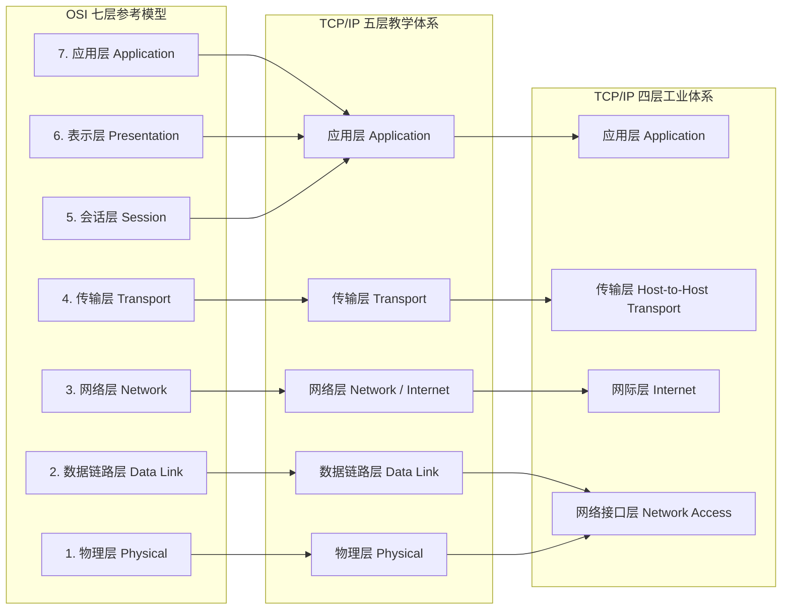
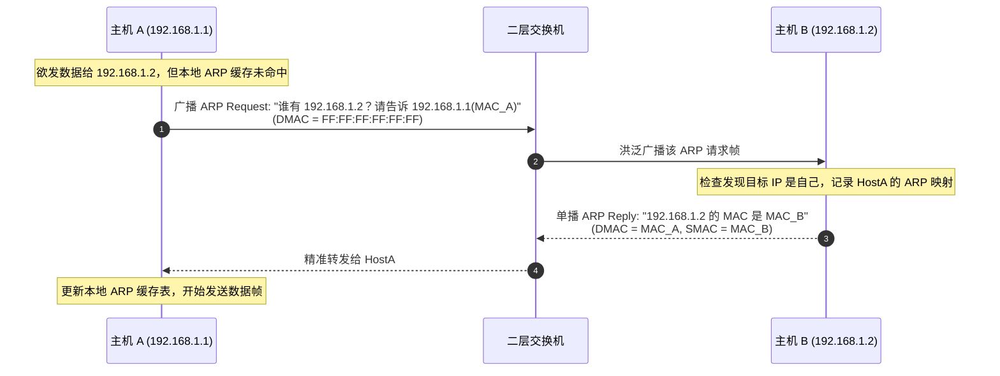
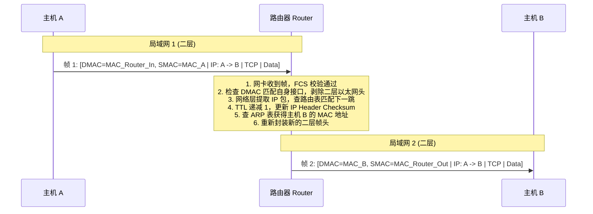

# 计算机网络基础与 Linux 网络虚拟化讲义

> **课程导读**：本讲义专为网络与分布式系统系列实验设计，旨在系统梳理计算机网络核心理论体系，并将其与 Linux 内核级网络虚拟化技术无缝衔接。学完本讲义后，你将能够建立从**物理信号、数据链路层以太网帧、网络层 IP 路由、传输层 TCP/UDP** 到 **Linux Network Namespace / veth 虚拟网络搭建** 的立体认知，为后续深入学习路由协议、流量测量与分布式系统打下坚实基础。

---

## 学习目标

1. **分层体系认知**：理解 OSI 七层模型与 TCP/IP 四层/五层模型的设计哲学、协议分工与解耦思想。
2. **报文结构与机制**：掌握以太网帧（Ethernet II）、IPv4 / IPv6 数据报、TCP 报文段的完整字段结构与关键机制（MTU、IP 分片、TTL、TCP 滑动窗口与标志位）。
3. **端到端传输轨迹**：建立微观视角，清晰追踪一段应用层数据在发送端封装、中间网络设备转发、接收端解封装的完整生命周期。
4. **Linux 网络虚拟化实操**：熟练掌握 Linux Network Namespace 和 `veth pair` 的构建、连通性配置与抓包分析，具备独立搭建网络拓扑的实验能力。

---

## 模块一：网络体系结构与分层模型

### 1.1 为什么需要分层体系？

计算机网络连接着异构的硬件设备、操作系统与应用程序。如果采用单一单体架构实现通信，任何物理介质或上层应用的变更都会导致整个网络协议栈重构。

分层模型遵循**关注点分离（Separation of Concerns）**与**高内聚低耦合**的工程原则：
- **独立性**：每层仅定义对等层之间的通信规范（协议），以及对相邻上层提供的服务接口（API），下层实现细节对上层完全透明。
- **灵活性**：各层技术可独立演进。例如，从有线以太网切换到 Wi-Fi、从铜缆切换到光纤，网络层（IP）及之上的应用均无需修改代码。
- **标准化**：促成不同厂商设备和开源软件之间的互联互通。

各层交换的数据单元通称为 **PDU（Protocol Data Unit，协议数据单元）**：
- **应用层**：报文 / 消息（Message / Data）
- **传输层**：数据段（Segment，针对 TCP）/ 数据报（Datagram，针对 UDP）
- **网络层**：分组 / 数据报 / 包（Packet / Datagram）
- **数据链路层**：帧（Frame）
- **物理层**：比特流（Bits）

---

### 1.2 OSI 七层模型与 TCP/IP 模型映射

国际标准化组织（ISO）提出了理论完备的 **OSI（Open Systems Interconnection）七层参考模型**，而工业界实际部署并主导互联网的则是工程导向的 **TCP/IP 体系**。



#### OSI 各层核心职责与典型协议

| 层级 | 层名称 | 核心职责 | 典型协议与标准 | 常见网络设备 |
| :--- | :--- | :--- | :--- | :--- |
| **7** | **应用层 (Application)** | 为终端用户的应用程序直接提供网络服务接口。 | HTTP/HTTPS, DNS, SSH, FTP, SMTP, DHCP | 主机终端、应用网关 |
| **6** | **表示层 (Presentation)** | 数据格式转换、加密解密、压缩解压缩，确保异构系统语法可识。 | SSL/TLS, ASCII, UTF-8, JSON, JPEG | 终端操作系统运行库 |
| **5** | **会话层 (Session)** | 建立、管理和终止应用程序之间的通信会话，提供同步检查点。 | RPC, NetBIOS, SIP | 终端会话管理器 |
| **4** | **传输层 (Transport)** | 提供端到端（进程到进程）的逻辑通信、可靠性保证、流量控制与复用。 | TCP, UDP, QUIC, SCTP | 四层负载均衡器 (LVS) |
| **3** | **网络层 (Network)** | 负责逻辑寻址（IP）、数据分片与跨多网段的路径选择（路由转发）。 | IPv4, IPv6, ICMP, OSPF, BGP | 路由器 (Router)、三层交换机 |
| **2** | **数据链路层 (Data Link)** | 负责同一局域网（链路上）相邻节点间的帧封装、介质访问控制与差错检测。 | Ethernet (802.3), Wi-Fi (802.11), ARP, VLAN | 二层交换机 (Switch)、网桥 (Bridge) |
| **1** | **物理层 (Physical)** | 在物理介质上透明传输无结构的原始比特流（定义电压、时钟、引脚）。 | 1000BASE-T, 光纤规程, RJ45, 曼彻斯特编码 | 中继器 (Repeater)、集线器 (Hub) |

> [!NOTE]
> 在实际生产开发（如 Linux 内核与 Web 开发）中，通常采用 **TCP/IP 四层/五层模型**。OSI 的会话层与表示层功能已全部融入现代应用层（例如 HTTPS 中的 TLS 握手及 Protobuf/JSON 序列化）。

---

## 模块二：数据链路层与以太网帧

数据链路层解决的是**局域网（LAN）内“相邻节点之间如何可靠传输一个数据单元”**的问题。在现代局域网中，以太网（Ethernet）占据绝对统治地位。

### 2.1 MAC 地址体系

每个连接到以太网的网络接口卡（NIC）都拥有一个全局唯一的物理地址，称为 **MAC（Media Access Control）地址**：
- **长度与表示**：长度为 48 位（6 字节），采用 12 位十六进制数表示，形如 `08:00:27:1a:2b:3c`。
- **地址分配**：
  - 前 24 位（高位）：**OUI（Organizationally Unique Identifier，组织唯一标识符）**，由 IEEE 分配给网卡制造商。
  - 后 24 位（低位）：由厂商自行分配的网卡序列号。
- **三种寻址模式**：
  - **单播（Unicast）**：最高字节的最低有效位（b0）为 `0`，发送给单一特定接口。
  - **组播（Multicast）**：最高字节的最低有效位（b0）为 `1`，例如 IPv4 组播映射 MAC 地址段 `01:00:5E:xx:xx:xx`。
  - **广播（Broadcast）**：48 位全为 `1`，即 `FF:FF:FF:FF:FF:FF`，同一二层广播域内的所有主机均会接收并处理该帧。

---

### 2.2 以太网帧结构（Ethernet II）

工业界最主流的以太网帧标准为 **Ethernet II（DIX 帧）**：

```
+-------------------+---------------+------------------+------------------+-------------------+----------------------------+-----------------+
| 前导码 Preamble   | 起始符 SFD    | 目的 MAC (DMAC)  | 源 MAC (SMAC)    | 类型 (EtherType)  | 数据载荷 (Data Payload)    | 校验序列 (FCS)  |
| 7 字节            | 1 字节        | 6 字节           | 6 字节           | 2 字节            | 46 ~ 1500 字节             | 4 字节          |
+-------------------+---------------+------------------+------------------+-------------------+----------------------------+-----------------+
|<--- 物理层同步前导码 (8 字节) --->|<--------------------------- 经典以太网帧 (64 ~ 1518 字节) -------------------------->|
```

#### 字段详解

| 字段名称 | 字节大小 | 作用说明 |
| :--- | :--- | :--- |
| **Preamble (前导码)** | 7 字节 | 连续 56 位的 `10101010` 交互电平，供接收方网卡锁定物理时钟频率与位同步。 |
| **SFD (帧起始定界符)** | 1 字节 | 二进制固定为 `10101011`，最后两位 `11` 标示前导码结束，下一比特进入真正的帧头。 |
| **Destination MAC** | 6 字节 | 接收端网卡的 MAC 地址。 |
| **Source MAC** | 6 字节 | 发送端网卡的 MAC 地址。 |
| **EtherType (类型)** | 2 字节 | 标识上层协议类型。常用值：<br>• `0x0800`：IPv4 协议<br>• `0x86DD`：IPv6 协议<br>• `0x0806`：ARP 协议 |
| **Data Payload (载荷)** | 46~1500 字节 | 上层协议传递下来的数据包（如 IP 报文）。标准 MTU 为 1500 字节。如果载荷小于 46 字节，必须填充 Padding 字节至 46 字节。 |
| **FCS (帧校验序列)** | 4 字节 | 采用 CRC-32 循环冗余校验。发送方计算后写入，接收方重新校验，若不匹配则静默丢弃该帧。 |

> [!IMPORTANT]
> **为什么以太网帧的最小长度是 64 字节？（46 字节载荷 + 18 字节首部/尾部）**  
> 早期半双工以太网使用 CSMA/CD（载波侦听多路访问/冲突检测）机制。主机边发边听，为了确保发送方能在**帧发送完毕前**检测到最远距离传输发生的最坏碰撞，帧的传输时延必须大于争用期（即端到端往返时延 $2\tau$）。在 10 Mbps、最远 2500 米网络中，该最小长度计算得出为 512 比特（即 64 字节）。虽然现代全双工交换以太网不再发生物理冲突，但为了协议向下兼容，64 字节最小帧长一直沿用至今。

---

### 2.3 MTU 与巨型帧（Jumbo Frames）

- **MTU（Maximum Transmission Unit，最大传输单元）**：
  - 数据链路层对上层数据载荷的最大长度限制。
  - 标准以太网的 MTU 默认为 **1500 字节**。整个以太网帧的最大物理开销为 $1500 + 14 \text{ (帧头)} + 4 \text{ (FCS)} = 1518$ 字节（若算上 VLAN Tag 则为 1522 字节）。
- **巨型帧（Jumbo Frames）**：
  - 在现代数据中心、高速局域网（10G/40G/100G）和存储区域网（iSCSI, RDMA）中，频繁处理 1500 字节小帧会给 CPU 带来巨大中断负荷。
  - 巨型帧允许将 MTU 扩大至 **9000 字节**，显著降低协议开销与内核处理开销，提升吞吐量。**要求传输链路上所有网卡与交换机统一开启 Jumbo Frames 支持**。

---

### 2.4 ARP 协议（地址解析协议）

在局域网内，两台主机即便知道对方的 IP 地址，也无法直接发送二层以太网帧，必须先将 **目标 IP 映射为目标 MAC 地址**。这就是 ARP 协议（RFC 826）的核心作用。



在 Linux 中，可以通过以下命令查看与管理 ARP 缓存：
```bash
# 查看本地邻居/ARP 缓存
ip neigh show
# 或使用经典命令
arp -n
```

---

## 模块三：网络层与 IP 协议体系

网络层的核心目标是解决**异构网络互联与跨网络路由转发**问题，提供“无连接、尽最大努力交付（Best Effort）”的数据报传输服务。

### 3.1 IPv4 协议体系

#### 1. IPv4 地址结构与表示
- **长度**：32 位（4 字节），通常采用**点分十进制**表示，例如 `192.168.1.1`。
- **层次结构**：逻辑上划分为两部分：
  - **网络号（Network ID）**：标识该主机所属的网络段。
  - **主机号（Host ID）**：标识该特定网段内的独立主机接口。

#### 2. 经典分类寻址（Classful Addressing）

早期互联网将 IP 地址划分为五类：

| 类别 | 首字节高位特征 | 地址范围 | 默认子网掩码 | 适用网络类型 |
| :--- | :--- | :--- | :--- | :--- |
| **A 类** | `0...` | `1.0.0.0` ~ `126.255.255.255` | `255.0.0.0` (/8) | 超大型跨国网络（每个网络容纳 1677 万台主机） |
| **B 类** | `10...` | `128.0.0.0` ~ `191.255.255.255` | `255.255.0.0` (/16) | 中型园区网络（每个网络容纳 65534 台主机） |
| **C 类** | `110...` | `192.0.0.0` ~ `223.255.255.255` | `255.255.255.0` (/24) | 小型局域网（每个网络容纳 254 台主机） |
| **D 类** | `1110...` | `224.0.0.0` ~ `239.255.255.255` | 无 | 多播/组播专有地址（Multicast） |
| **E 类** | `1111...` | `240.0.0.0` ~ `255.255.255.255` | 无 | 保留科研实验与未来用途 |

> [!NOTE]
> `127.0.0.0/8` 段被保留用作本机环回接口（Loopback），最常见的是 `127.0.0.1` (`localhost`)。

#### 3. 私网地址与 NAT（网络地址转换）

为了缓解 IPv4 地址耗尽危机，RFC 1918 预留了三段专用私网地址（Private IP），这些地址在公共互联网路由器上不可路由：
- **A 类私网**：`10.0.0.0` ~ `10.255.255.255`（掩码 `10.0.0.0/8`）
- **B 类私网**：`172.16.0.0` ~ `172.31.255.255`（掩码 `172.16.0.0/12`）
- **C 类私网**：`192.168.0.0` ~ `192.168.255.255`（掩码 `192.168.0.0/16`）

内网设备访问互联网时，必须通过出口路由器部署的 **NAT（Network Address Translation / NAPT）** 将私网源 IP 转换为公网全局单播 IP。

#### 4. CIDR（无类别域间路由）与子网计算

分类寻址造成了巨大的地址块浪费。现代网络全面采用 **CIDR（Classless Inter-Domain Routing，RFC 1519）**，打破了 A/B/C 类刚性界限，使用任意长度的网络前缀（Slash 记法，如 `/24`）划分网络。

**计算实例**：分析 IP 地址 `192.168.1.100/26`
- **子网掩码**：前 26 位为 `1`，后 6 位为 `0` $\rightarrow$ `255.255.255.192`。
- **网络地址（Network ID）**：将 IP 与掩码按位与运算，主机位全置 `0` $\rightarrow$ `192.168.1.64`。
- **广播地址（Broadcast）**：主机位 6 位全置 `1` $\rightarrow$ `192.168.1.127`。
- **可用主机范围**：`192.168.1.65` ~ `192.168.1.126`（共 $2^6 - 2 = 62$ 个可用主机 IP）。

---

### 3.2 IPv4 报文格式剖析

IPv4 报文由 **IP 首部（20 ~ 60 字节）** 和 **数据载荷（Data Payload）** 组成。

#### IPv4 报头标准位图（按 32 位字长排布）

```
 0                   1                   2                   3
 0 1 2 3 4 5 6 7 8 9 0 1 2 3 4 5 6 7 8 9 0 1 2 3 4 5 6 7 8 9 0 1
+-+-+-+-+-+-+-+-+-+-+-+-+-+-+-+-+-+-+-+-+-+-+-+-+-+-+-+-+-+-+-+-+
|Version|  IHL  |Type of Service|          Total Length         |
+-+-+-+-+-+-+-+-+-+-+-+-+-+-+-+-+-+-+-+-+-+-+-+-+-+-+-+-+-+-+-+-+
|         Identification        |Flags|     Fragment Offset     |
+-+-+-+-+-+-+-+-+-+-+-+-+-+-+-+-+-+-+-+-+-+-+-+-+-+-+-+-+-+-+-+-+
|  Time to Live |    Protocol   |        Header Checksum        |
+-+-+-+-+-+-+-+-+-+-+-+-+-+-+-+-+-+-+-+-+-+-+-+-+-+-+-+-+-+-+-+-+
|                       Source IP Address                       |
+-+-+-+-+-+-+-+-+-+-+-+-+-+-+-+-+-+-+-+-+-+-+-+-+-+-+-+-+-+-+-+-+
|                    Destination IP Address                     |
+-+-+-+-+-+-+-+-+-+-+-+-+-+-+-+-+-+-+-+-+-+-+-+-+-+-+-+-+-+-+-+-+
|                    Options                    |    Padding    |
+-+-+-+-+-+-+-+-+-+-+-+-+-+-+-+-+-+-+-+-+-+-+-+-+-+-+-+-+-+-+-+-+
```

#### IPv4 首部字段详解

| 字段名称 | 比特长度 | 功能与机制说明 |
| :--- | :--- | :--- |
| **Version (版本)** | 4 bits | 协议版本号。IPv4 固定为 `4`（二进制 `0100`）。 |
| **IHL (首部长度)** | 4 bits | Internet Header Length。以 **32 位字（4 字节）** 为计数单位。无选项时最小值为 `5`（即 $5 \times 4 = 20$ 字节），最大值为 `15`（即 60 字节）。 |
| **ToS / DSCP / ECN** | 8 bits | 服务类型/区分服务字段。前 6 位用于 DSCP（QoS 优先级），后 2 位用于 ECN（显式拥塞通知）。 |
| **Total Length (总长度)** | 16 bits | IP 报文整体长度（首部 + 数据载荷），以字节为单位。最大值为 $2^{16}-1 = 65535$ 字节。 |
| **Identification (标识)** | 16 bits | 发送端赋予每个数据包的唯一序列标识。同一数据包分片后，**所有分片拥有相同的标识值**。 |
| **Flags (标志)** | 3 bits | 控制分片行为：<br>• Bit 0：保留（必须置 0）<br>• Bit 1（**DF, Don't Fragment**）：置 1 表示不允许路由器分片，若包超 MTU 则丢弃并回复 ICMP 差错<br>• Bit 2（**MF, More Fragments**）：置 1 表示后续还有分片，置 0 表示这是最后一个分片 |
| **Fragment Offset (片偏移)** | 13 bits | 标识该分片在原始未分片数据载荷中的相对起始位置。以 **8 字节（64 位）** 为基本度量单位。 |
| **TTL (Time to Live)** | 8 bits | 数据报生存时间（路由器跳数上限）。每经过一个路由器，TTL 递减 1。**若 TTL 归零，路由器丢弃该包并向源地址发送 ICMP Time Exceeded 报文**，有效防止路由环路死循环。 |
| **Protocol (协议号)** | 8 bits | 指示载荷中封装的高层协议类型。常用值：<br>• `1`：ICMP<br>• `6`：TCP<br>• `17`：UDP<br>• `89`：OSPF |
| **Header Checksum (首部校验和)** | 16 bits | 专门校验 IP 首部是否发生比特翻转（不校验载荷数据）。每过一跳路由器，由于 TTL 递减，校验和必须重新计算。 |
| **Source IP Address** | 32 bits | 发送端主机的 IP 地址。 |
| **Destination IP Address** | 32 bits | 目标主机的 IP 地址。 |
| **Options & Padding** | 可变长度 | 可选字段（如安全标签、源路由、时间戳）。若选项长度非 4 字节整数倍，通过 Padding 补零填充对齐。 |

---

### 3.3 IP 分片与重组实战分析

当上层传递给 IP 层的报文总长度超过底层网络接口的 **MTU（通常为 1500 字节）** 时，IP 层必须启动分片（Fragmentation）。

**案例场景**：发送一个总长度为 4000 字节的 IPv4 数据报（20 字节 IP 头部 + 3980 字节数据载荷），通过 MTU = 1500 字节的以太网接口：

```
原始数据包:
[IP头: 20B][Payload: 3980 字节] (ID = 1000, Total Length = 4000)

分片计算过程 (每个分片载荷必须是 8 字节整数倍):
• 最大载荷空间 = 1500 - 20 (新IP头) = 1480 字节 (1480 能被 8 整除)
• 分片 1: 载荷 1480 字节 (字节 0 ~ 1479)
• 分片 2: 载荷 1480 字节 (字节 1480 ~ 2959)
• 分片 3: 剩余载荷 3980 - 1480*2 = 1020 字节 (字节 2960 ~ 3979)
```

| 分片编号 | Total Length 字段 | Identification | Flags (DF, MF) | Fragment Offset 字段值 | 对应的载荷字节区间 |
| :--- | :--- | :--- | :--- | :--- | :--- |
| **分片 1** | 1500 字节 (20+1480) | 1000 | DF=0, **MF=1** | $0 / 8 = \mathbf{0}$ | 0 ~ 1479 |
| **分片 2** | 1500 字节 (20+1480) | 1000 | DF=0, **MF=1** | $1480 / 8 = \mathbf{185}$ | 1480 ~ 2959 |
| **分片 3** | 1040 字节 (20+1020) | 1000 | DF=0, **MF=0** | $2960 / 8 = \mathbf{370}$ | 2960 ~ 3979 |

> [!WARNING]
> **分片的工程弊端**：
> 1. **脆弱性倍增**：IP 协议本身不具备重传功能。任一分片在传输中丢失，目标端在重组超时后将丢弃全部已收到的分片，迫使上层（如 TCP）重传整个报文段。
> 2. **路由器性能损耗**：现代路由器推崇 **Path MTU Discovery (PMTUD)** 机制，通过探测预先调整 TCP MSS，避免在传输路径中产生任何 IP 分片。

---

### 3.4 IPv6 协议与下一代互联网

#### 1. IPv6 的演进动因与核心优势
- **巨大地址空间**：采用 **128 位地址**，可提供 $2^{128} \approx 3.4 \times 10^{38}$ 个独立地址，彻底解决地址枯竭问题。
- **定长简化头部**：基本头部固定为 **40 字节**，取消了变长 Options，改为模块化的**扩展首部（Extension Headers）**，大幅提高路由器硬件转发效率。
- **原生取消广播**：以更精准的组播（Multicast）和任播（Anycast）替代广播，彻底避免全网广播风暴。
- **即插即用（SLAAC）**：支持无状态地址自动配置，设备无需 DHCP 服务器即可自动配置网络。
- **免去 NAT**：恢复互联网最初端到端（End-to-End）直接对等通信的架构设计。
- **原生内建安全机制**：在协议体系中原生集成 IPsec。

#### 2. IPv6 地址表示与压缩书写规则

IPv6 采用十六进制表示，分为 8 组，每组 16 位，组间以冒号 `:` 分隔：
- **完整格式**：`2001:0db8:85a3:0000:0000:8a2e:0370:7334`
- **压缩规则 1（前导零省略）**：每组内部的前导 `0` 可省略。例如 `:0000:` $\rightarrow$ `:0:`，`:0370:` $\rightarrow$ `:370:`。
- **压缩规则 2（双冒号压缩）**：连续的一串或多组全 `0` 可用双冒号 `::` 替换。**注意：为避免二义性，双冒号在一个地址中仅能出现一次**。
  - 示例 1：`2001:0db8:0000:0000:0000:ff00:0042:8329` $\rightarrow$ `2001:db8::ff00:42:8329`
  - 示例 2（环回地址）：`0000:0000:0000:0000:0000:0000:0000:0001` $\rightarrow$ `::1`
  - 示例 3（未指定地址）：`0000:...:0000` $\rightarrow$ `::`

#### 3. IPv6 地址分类

| 地址类型 | 前缀范围 | 作用与特征 | 对应 IPv4 概念 |
| :--- | :--- | :--- | :--- |
| **全球单播地址 (GUA)** | `2000::/3` | 公网全局唯一，互联网全局可路由。 | 公网 IPv4 地址 |
| **链路本地地址 (Link-Local)** | `fe80::/10` | 局域网链路内自动生成，不跨路由器路由。用于邻居发现与局域网引导。 | `169.254.0.0/16` (APIPA) |
| **唯一本地地址 (ULA)** | `fc00::/7` | 专用私网地址，在组织内部跨网段路由，不在公共互联网路由。 | RFC 1918 私网地址 (如 `10.0.0.0/8`) |
| **组播地址 (Multicast)** | `ff00::/8` | 发往特定订阅群组（如 `ff02::1` 为链路所有节点，`ff02::2` 为所有路由器）。 | IPv4 组播与广播 |
| **任播地址 (Anycast)** | 共享单播空间 | 多个接口配置同一任播地址，由路由协议路由至拓扑距离最近的一个节点。 | Anycast DNS / CDN 节点 |

#### 4. 邻居发现协议（NDP，Neighbor Discovery Protocol）

IPv6 完全弃用了 ARP 和广播，转而使用基于 ICMPv6 的 **NDP 协议** 实现链路层通信管理：
- **地址解析（替代 ARP）**：
  - **NS（Neighbor Solicitation，邻居请求）**：单播或向被请求节点组播地址发送查询。
  - **NA（Neighbor Advertisement，邻居通告）**：回复自身链路层 MAC 地址。
- **路由器发现与无状态自动配置（SLAAC）**：
  - **RS（Router Solicitation，路由器请求）**：主机开机接入网络时主动发送，请求网关信息。
  - **RA（Router Advertisement，路由器通告）**：路由器周期性广播或针对 RS 单播应答，携带网络前缀与默认网关信息。主机将该 64 位前缀与自身自动生成的 64 位接口 ID 组合，瞬间完成全球单播 IP 地址配置。

#### 5. IPv4 到 IPv6 的过渡演进机制

- **双栈技术（Dual Stack）**：路由器与终端主机同时配置 IPv4 和 IPv6 两种协议栈，自动根据对端能力适配。
- **隧道技术（Tunneling）**：将 IPv6 报文封装在 IPv4 报文中穿透纯 IPv4 骨干网络（如 6to4, GRE 隧道）。
- **网络转换（NAT64 / DNS64）**：在网关处进行协议头与地址翻译，允许纯 IPv6 主机透明访问纯 IPv4 服务器。

---

## 模块四：传输层与端到端传输

网络层提供的是“主机到主机（Host-to-Host）”的通信服务，而传输层则在套接字层面上实现了**“进程到进程（Process-to-Process）”**的端到端逻辑传输。

### 4.1 端口复用与套接字（Socket）

操作系统上运行着成百上千个并发进程。传输层利用 **16 位端口号（Port Number）** 实现多路复用与多路分用：
- 端口号范围：$0 \sim 65535$。
  - **熟知端口（Well-Known Ports）**：$0 \sim 1023$（系统级关键服务，如 HTTP 80, HTTPS 443, SSH 22, DNS 53）。
  - **注册端口（Registered Ports）**：$1024 \sim 49151$。
  - **动态/私有端口（Ephemeral Ports）**：$49152 \sim 65535$（客户端发起连接时系统临时随机分配）。
- **网络通信五元组**：唯一确定一个网络连接的五项元数据：
  $$\text{Connection} = (\text{源 IP}, \text{源端口}, \text{目的 IP}, \text{目的端口}, \text{传输层协议})$$

---

### 4.2 TCP vs UDP 核心机制对比

| 对比维度 | TCP (Transmission Control Protocol) | UDP (User Datagram Protocol) |
| :--- | :--- | :--- |
| **连接状态** | **面向连接**（需经过三次握手建立连接，四次挥手拆除） | **无连接**（无需建链，随时直接发送数据） |
| **传输可靠性** | **百分之百可靠交付**（确认 ACK、重传、数据校验、按序重排） | **尽力而为**（不保证递达、不保证有序、无重传机制） |
| **数据流形态** | **面向字节流（Byte Stream）**（应用层无边界，需自行分包） | **面向报文（Datagram）**（保留应用层报文边界） |
| **头部开销** | 基础首部 **20 字节**（带有选项最大可达 60 字节） | 基础首部仅 **8 字节** |
| **传输开销与时延** | 包含流控与拥塞控制算法，建链有 RTT 握手时延 | 无连接时延，即刻发送，实时性极高 |
| **典型应用场景** | Web 浏览 (HTTP/HTTPS)、文件传输 (FTP)、远程终端 (SSH)、数据库交互 | 实时音视频通话 (WebRTC)、DNS 查询、网络对战游戏、广播/多播 |

---

### 4.3 TCP 报文段结构深度解析

```
 0                   1                   2                   3
 0 1 2 3 4 5 6 7 8 9 0 1 2 3 4 5 6 7 8 9 0 1 2 3 4 5 6 7 8 9 0 1
+-+-+-+-+-+-+-+-+-+-+-+-+-+-+-+-+-+-+-+-+-+-+-+-+-+-+-+-+-+-+-+-+
|          Source Port          |       Destination Port        |
+-+-+-+-+-+-+-+-+-+-+-+-+-+-+-+-+-+-+-+-+-+-+-+-+-+-+-+-+-+-+-+-+
|                        Sequence Number                        |
+-+-+-+-+-+-+-+-+-+-+-+-+-+-+-+-+-+-+-+-+-+-+-+-+-+-+-+-+-+-+-+-+
|                    Acknowledgment Number                      |
+-+-+-+-+-+-+-+-+-+-+-+-+-+-+-+-+-+-+-+-+-+-+-+-+-+-+-+-+-+-+-+-+
|  Data |           |U|A|P|R|S|F|                               |
| Offset| Reserved  |R|C|S|S|Y|I|            Window             |
|       |           |G|K|H|T|N|N|                               |
+-+-+-+-+-+-+-+-+-+-+-+-+-+-+-+-+-+-+-+-+-+-+-+-+-+-+-+-+-+-+-+-+
|           Checksum            |        Urgent Pointer         |
+-+-+-+-+-+-+-+-+-+-+-+-+-+-+-+-+-+-+-+-+-+-+-+-+-+-+-+-+-+-+-+-+
|                    Options                    |    Padding    |
+-+-+-+-+-+-+-+-+-+-+-+-+-+-+-+-+-+-+-+-+-+-+-+-+-+-+-+-+-+-+-+-+
|                             data                              |
+-+-+-+-+-+-+-+-+-+-+-+-+-+-+-+-+-+-+-+-+-+-+-+-+-+-+-+-+-+-+-+-+
```

#### 关键字段剖析

| 字段名称 | 比特长度 | 详细功能说明 |
| :--- | :--- | :--- |
| **Source Port (源端口)** | 16 bits | 发送端应用程序的端口号。 |
| **Destination Port (目的端口)** | 16 bits | 接收端目标应用程序的端口号。 |
| **Sequence Number (序列号, Seq)** | 32 bits | 标识本报文段所发送数据载荷的**第一个字节的顺序编号**。在建立连接（SYN）时用来同步 Initial Sequence Number (ISN)。用于接收端按序拼接重组数据流。 |
| **Acknowledgment Number (确认号, Ack)** | 32 bits | 期望收到对方下一个报文段的第一个数据字节序号。**采用累计确认机制**，表示此序号之前的所有字节均已完整无误接收。 |
| **Data Offset (数据偏移)** | 4 bits | 标明 TCP 首部的长度（以 4 字节为单位）。标准 20 字节首部此字段为 `5`。 |
| **Reserved (保留位)** | 3 bits | 预留未来扩展，目前全部置 0。 |
| **Flags (控制标志位)** | 9 bits | 驱动 TCP 状态机转换的关键标志：<br>• **URG**：紧急指针字段有效<br>• **ACK**：确认号字段有效（连接建立后所有报文该位均为 1）<br>• **PSH**：指示接收方尽快将缓冲区数据向上投递给应用程序<br>• **RST**：连接复位（遇到严重错误或连接非法时强制切断）<br>• **SYN**：同步序列号，在发起连接的三次握手阶段使用<br>• **FIN**：发送方完成数据发送，请求释放连接 |
| **Window Size (窗口大小)** | 16 bits | 流量控制核心指标。接收方向发送方通告当前允许对方连续发送的最大字节数（基于自身当前空闲接收缓冲区）。 |
| **Checksum (校验和)** | 16 bits | 包含伪首部（Pseudo Header）、TCP 首部和应用载荷的全量端到端数据完整性校验。 |
| **Urgent Pointer (紧急指针)** | 16 bits | 当 URG 标志置位时有效，指向紧急数据在载荷中的偏移末端。 |
| **Options (选项)** | 可变长度 | 协商高级特性：**MSS（最大报文段长度）**、SACK（选择性确认）、Window Scale（窗口扩大因子，突破 64KB 限制）、Timestamps（时间戳防回绕与精准 RTT 估算）。 |

---

## 模块五：数据端到端传输全景剖析

为了将各层理论融会贯通，我们以最经典的教学案例进行端到端追踪：  
**“主机 A 向 主机 B 发送 10 字节字符串 `'Hello TCP!'`”**

### 5.1 数据逐层封装过程（Encapsulation）

在主机 A（发送端）的操作系统内核中，数据自顶向下经历层层封装：

```
[应用层 Application]       用户生成原始数据: "Hello TCP!" (10 字节)
                                       │
                                       ▼
[传输层 Transport]        +-------------+------------------+
                         | TCP 头 (20B)| "Hello TCP!"(10B)|  -> TCP Segment (共 30 字节)
                         +-------------+------------------+
                                       │
                                       ▼
[网络层 Network]   +-------------+-------------+------------------+
                   | IP 头 (20B) | TCP 头 (20B)| "Hello TCP!"(10B)|  -> IP Packet (共 50 字节)
                   +-------------+-------------+------------------+
                                       │
                                       ▼
[数据链路层 Data Link]
+-------------+-------------+-------------+------------------+-------------+
| 以太头 (14B)| IP 头 (20B) | TCP 头 (20B)| "Hello TCP!"(10B)| FCS 尾 (4B) | -> Ethernet Frame (共 68 字节)
+-------------+-------------+-------------+------------------+-------------+
                                       │
                                       ▼
[物理层 Physical]         网卡将 68 字节帧转换为物理高低电平或光脉冲信号编码发出
```

1. **应用层**：用户进程调用 `send()` 系统调用，写入 10 字节数据。
2. **传输层**：TCP 模块分配序号 `Seq`，填充源端口与目的端口，构造 20 字节 TCP 首部，组合成 30 字节的 TCP Segment。
3. **网络层**：IP 模块为报文装配 20 字节 IPv4 首部，写入主机 A 的源 IP 与主机 B 的目的 IP，TTL 设为 64，协议号置为 6（TCP），生成 50 字节 IP Packet。
4. **数据链路层**：查询本地 ARP 缓存表确定下一跳的 MAC 地址，装配 14 字节以太网帧头（目的 MAC、源 MAC、EtherType=`0x0800`），并计算追加 4 字节的 CRC-32 尾部校验和（FCS）。此时载荷 50 字节已大于 46 字节，无需额外 Padding，生成 68 字节的标准以太网帧。
5. **物理层**：网卡控制器在前追加 7 字节前导码与 1 字节 SFD，串行转化为物理电信号通过网线发射。

---

### 5.2 跨网段转发中的路由器行为

如果主机 A 与主机 B 处于不同子网，数据包必须经过中间路由器（Router）：



> [!IMPORTANT]
> **在传统无 NAT 的路由转发过程中**：
> - **IP 首部的源 IP 和目的 IP 始终保持不变**（全程指向端到端两端主机）；
> - **每跨越一跳路由器，二层帧头的源 MAC 与目的 MAC 都会被彻底刷新**（始终只标示当前一跳链路的发送者与接收者）。

---

### 5.3 接收端逐层解封装（De-encapsulation）

在主机 B 侧，硬件网卡到操作系统的解封装步骤严格逆向执行：
1. **物理层**：网卡物理层芯片同步时钟，识别帧定界符，将信号还原为比特流。
2. **数据链路层**：
   - 校验 FCS：网卡硬件重新计算 CRC，若有误码则直接丢弃；
   - 匹配目的 MAC：确认是送往自身的单播帧或广播帧；
   - 剥除以太网头尾，根据 EtherType = `0x0800`，将 50 字节的 IP 包分发给内核网络层处理。
3. **网络层**：
   - 校验 IP 头部校验和；
   - 检查目的 IP 确实是本机接口 IP；
   - 剥除 IP 头部，根据 Protocol = 6，将 30 字节的 TCP Segment 递交传输层。
4. **传输层**：
   - 校验 TCP 首部与数据校验和；
   - 校验序列号 `Seq`，确认数据有序；
   - 向主机 A 构造并回送确认报文（ACK）；
   - 根据目的端口号定位对应的监听 Socket，将 10 字节数据放入该 Socket 的接收缓冲区。
5. **应用层**：目标应用程序通过 `recv()` 或 `read()` 从缓冲区读取 `"Hello TCP!"`。

---

## 模块六：Linux 网络命名空间与虚拟化实操

在云计算与容器技术（如 Docker、Kubernetes）中，隔离不同租户的网络环境并不需要物理网卡，而是依赖 Linux 内核提供的 **Network Namespace（网络命名空间）**。

### 6.1 什么是 Network Namespace？

**Network Namespace（netns）** 是 Linux 内核提供的网络协议栈级逻辑隔离机制。当创建一个独立的 netns 时，它拥有完全私有且隔离的：
- **网络设备（Network Interfaces）**：拥有独立的网卡（如虚拟的 `veth`、`eth0`、`lo` 回环设备）。
- **IP 协议栈与地址**：可配置独立的 IPv4/IPv6 地址。
- **路由表（Routing Tables）**：各 namespace 间路由互不相干。
- **端口空间（Socket Ports）**：不同 namespace 内的进程可以同时监听同一个端口（如 `0.0.0.0:80`）而毫无冲突。
- **ARP/邻居表（Neighbor Table）**。
- **防火墙规则（iptables / nftables）**。

```mermaid
graph TD
    subgraph Host_Root_NS [Host 根网络命名空间 Default NS]
        eth0[物理网卡 eth0]
        lo0[回环 lo]
        rt0[宿主机路由表]
    end

    subgraph Netns_1 [命名空间 ns1]
        veth1[虚拟网卡 veth1: 192.168.1.1/24]
        lo1[回环 lo]
        rt1[ns1 私有路由表]
    end

    subgraph Netns_2 [命名空间 ns2]
        veth2[虚拟网卡 veth2: 192.168.1.2/24]
        lo2[回环 lo]
        rt2[ns2 私有路由表]
    end

    veth1 <=== Virtual Ethernet Cable (veth pair) ===> veth2
```

---

### 6.2 虚拟线缆：veth pair 工作原理

两个隔离的 namespace 之间无法直接通信，正如两台断网的物理机。Linux 提供了 **veth（Virtual Ethernet）网卡对**：
- `veth` 设备总是**成对创建**（Peer）。
- 可以把 `veth pair` 形象地理解为**一根虚拟的双绞线（网线）**：从一端输入的所有数据包，都会直接从另一端被内核原封不动地送出。
- 将 `veth` 对的两端分别置入不同的 namespace 中，便建立了一条直连的点对点链路。

---

### 6.3 常用 `ip netns` 命令集

在现代 Linux 系统中，使用 `iproute2` 工具集的 `ip` 命令进行管理：

```bash
# 1. 创建命名空间
sudo ip netns add <ns_name>

# 2. 列出系统当前所有命名空间
ip netns list

# 3. 在指定命名空间内部执行命令
sudo ip netns exec <ns_name> <command>

# 4. 删除指定命名空间 (其中的虚拟网卡会自动被清理或回退到根命名空间)
sudo ip netns del <ns_name>
```

---

### 6.4 动手实验：搭建双节点隔离互通环境

下面我们将使用标准的 `iproute2` 命令从零搭建两个互通的 Namespace，并使用 `ping` 与 `tcpdump` 验证网络层与链路层行为。

#### 步骤一：创建拓扑与虚拟网卡

```bash
# 1. 创建两个独立的网络命名空间 ns1 与 ns2
sudo ip netns add ns1
sudo ip netns add ns2

# 2. 创建一对 veth 设备: 一端命名为 veth1，另一端命名为 veth2
sudo ip link add veth1 type veth peer name veth2

# 3. 将 veth1 塞入 ns1，将 veth2 塞入 ns2
sudo ip link set veth1 netns ns1
sudo ip link set veth2 netns ns2
```

#### 步骤二：配置 IP 地址并激活接口

```bash
# 4. 激活 ns1 和 ns2 内部的本地回环接口 (lo)
sudo ip netns exec ns1 ip link set lo up
sudo ip netns exec ns2 ip link set lo up

# 5. 为 ns1 的 veth1 配置 IP: 192.168.1.1/24 并启动
sudo ip netns exec ns1 ip addr add 192.168.1.1/24 dev veth1
sudo ip netns exec ns1 ip link set veth1 up

# 6. 为 ns2 的 veth2 配置 IP: 192.168.1.2/24 并启动
sudo ip netns exec ns2 ip addr add 192.168.1.2/24 dev veth2
sudo ip netns exec ns2 ip link set veth2 up
```

#### 步骤三：验证与抓包剖析

```bash
# 7. 在 ns1 内部查看当前网络接口状态
sudo ip netns exec ns1 ip addr show

# 8. 连通性测试: 从 ns1 发送 ICMP 请求到 ns2
sudo ip netns exec ns1 ping -c 3 192.168.1.2

# 9. 查看 ns1 内部自动学习到的 ARP 邻居表
sudo ip netns exec ns1 ip neigh show
```

> [!TIP]
> **动手挑战（抓包观察封装）**：  
> 打开两个终端窗口：  
> 窗口 1：在 ns2 内启动抓包监听 `sudo ip netns exec ns2 tcpdump -n -e -i veth2`  
> 窗口 2：在 ns1 内执行 `sudo ip netns exec ns1 ping -c 1 192.168.1.2`  
> 你将清晰地在终端 1 中亲眼目睹：  
> 1. 第一帧：广播 ARP Request 寻找 `192.168.1.2` 的 MAC；  
> 2. 第二帧：单播 ARP Reply 给出 `veth2` 的 MAC；  
> 3. 第三帧：ICMP Echo Request（附带 IP 头和 MAC 头）；  
> 4. 第四帧：ICMP Echo Reply 应答。

#### 步骤四：环境清理（Teardown）

```bash
# 只需删除 namespace，附着在其上的 veth 设备会被 Linux 自动回收销毁
sudo ip netns del ns1
sudo ip netns del ns2
```

---

## 模块七：课后思考与拓展

通过理论与动手实验，请尝试回答以下深度思考题：

1. **MAC 与 IP 的双重必要性**：
   - 既然以太网帧通过 MAC 地址寻址，为什么通信还需要 IP 地址？如果全球所有设备只使用 MAC 地址，路由器能否正常工作？
   - *思考提示：MAC 地址是扁平非层次化的，无法实现跨大洲、跨网络的高效聚合路由（路由表将无限膨胀爆炸）。*
2. **MTU 与 TCP MSS 的联动**：
   - 当我们在以太网中传输数据（MTU = 1500 字节）时，TCP 的最大报文段大小（MSS, Maximum Segment Size）在不带可选头部时推荐配置为多少字节？为什么？
   - *思考提示：$1500 - 20 \text{ (IP Header)} - 20 \text{ (TCP Header)} = 1460$ 字节。*
3. **veth pair 跨网段路由思考**：
   - 若将 `veth1` 配置为 `192.168.1.1/24`，`veth2` 配置为 `10.0.0.1/24`，直接执行 `ping 10.0.0.1` 能否成功？如果失败，除了配置 IP 外，操作系统还需要什么规则（路由表、ARP 响应）？
4. **命名空间与容器云**：
   - Docker 容器中的 `-p 8080:80` 端口映射本质上利用了 Linux 内核的哪两项核心特性？
   - *思考提示：Network Namespace（网络隔离）与 iptables / NAT（宿主机端口流量重定向）。*

---

### 拓展学习资料与后续实验

- [知识库拓展思考笔记与问题研讨](https://www.wolai.com/orjAbmeooQUs21hm4ZvcfE)
- **后续衔接实验**：
  - [Lab 1：从一根虚拟网线到多跳网络](../experiments/README.md)（本讲与下一讲的配套实验，指导书编写中）
  - 参考（2025 版）：[五节点环形拓扑与静态路由脚本](../../2025/experiments/01/ns.sh)
  - 参考（2025 版）：[Linux 软件网桥 (Bridge) 交换实验脚本](../../2025/experiments/01/ns_bridge.sh)
  - 参考（2025 版，英文）：[路由与实验进阶指南](../../2025/docs/route.md)
- **核心网络规范 (RFCs)**：
  - RFC 791: *Internet Protocol (IPv4)*
  - RFC 8200: *Internet Protocol, Version 6 (IPv6) Specification*
  - RFC 9293: *Transmission Control Protocol (TCP)*