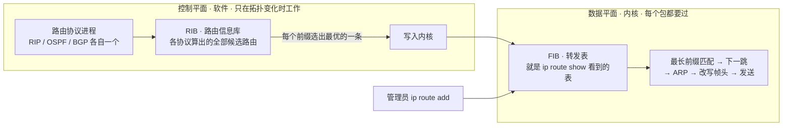
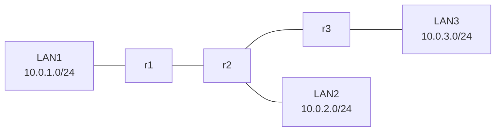
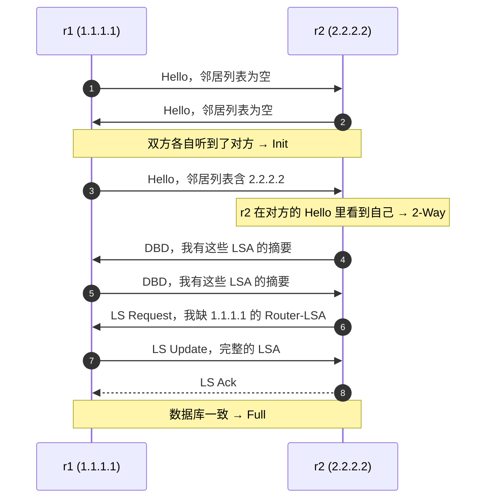
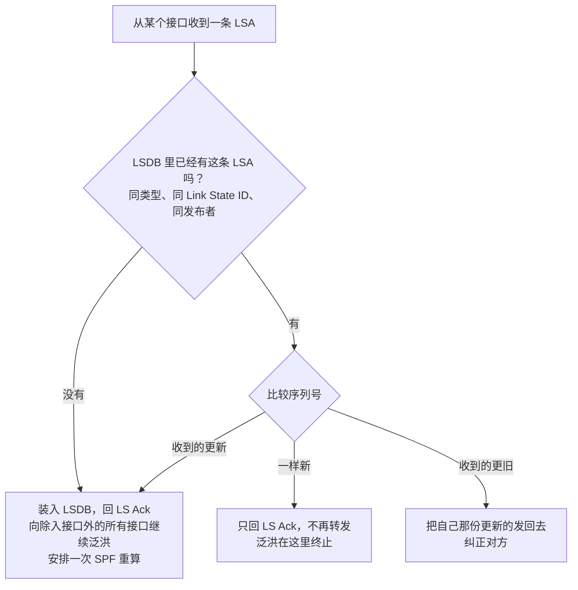
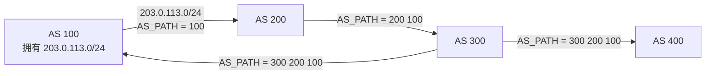
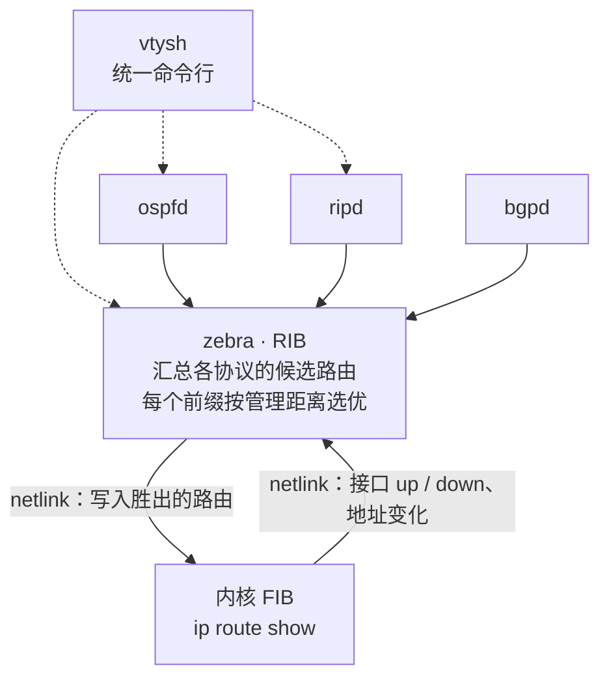
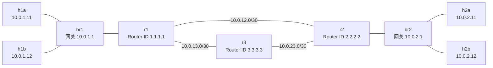

# 动态路由协议讲义

> **课程导读**：上一讲结束时，我们的网络已经能跨网段转发了，代价是每一条路都要有人用 `ip route add` 亲手写进路由表。Lab 1 让你把实验床扩到三个机架，顺手数出了一个数字：静态路由的条数随机架数按 $N(N-1)$ 增长，而且每加一个机架都要登录全部路由器改配置——链路一断，包就黑洞，没有任何人会替你改道。真实的网络不可能这样运转。本讲回答的问题是：**路由器之间怎样互相交换信息，让每一台都能自己算出去往任何地方的路，并在网络变化时自动修正？** 这就是动态路由协议。我们会依次走过三种思路——只和邻居说话的**距离向量**（RIP）、把整张地图发给所有人的**链路状态**（OSPF），以及把整条路径带在身上、能表达策略的**路径向量**（BGP）——然后在 Lab 1 的实验床上跑起一个真实的 OSPF，亲眼看它建立邻居、同步数据库、把算出来的路由写进内核，再拔掉一根线看它多久修好。这套观察就是 Lab 2 的参照物：那里你要自己写一个链路状态路由守护进程。

---

## 学习目标

1. **说清静态路由的极限**：能用 Lab 1 的数据解释为什么配置量、改动范围与故障恢复三件事逼出了动态路由，并能区分控制平面与数据平面、RIB 与 FIB。
2. **距离向量**：能写出 Bellman-Ford 方程并在小拓扑上逐轮推演；能解释“计数到无穷”是怎么发生的，以及水平分割、毒性逆转、触发更新各自堵住了哪一步、堵不住哪一步。
3. **链路状态**：能按“Hello 发现邻居 → LSA 描述自己 → 可靠泛洪同步 LSDB → Dijkstra 算最短路”四步复述 OSPF 的工作流程，能读懂 `show ip ospf neighbor` / `database` 的输出，并说出收敛时间由哪几段构成。
4. **路径向量**：能解释 Internet 为什么不能用 OSPF、AS_PATH 如何天然防环、BGP 为什么“策略高于最短”，并知道大型数据中心为什么反而拿 BGP 当内部路由协议。
5. **路由协议与内核**：能读懂 `ip route show` 里的 `proto ospf`、`metric 20` 与多下一跳路由，说清 FRR 的 zebra 与内核 FIB 的关系，并能在实验床上跑起 OSPF、观察收敛与等价多路径。

---

## 模块一：为什么需要动态路由

### 1.1 上一讲的落点：静态路由的三笔账

第 02 讲 3.4 节留下一句话：静态路由“不会自己适应拓扑变化”。Lab 1 的任务 3 把这句话变成了数字。回顾一下那三笔账：

| 账目 | 两个机架 | 三个机架 | $N$ 个机架 |
| :--- | :--- | :--- | :--- |
| 每台路由器要手工配的路由条数 | 1 | 2 | $N-1$ |
| 全网静态路由总条数 | 2 | 6 | $N(N-1)$ |
| 新增一个机架要改动的设备数 | — | 全部 | 全部 $N$ 台 |

第三笔账最要命：**新增一个机架，所有已有的路由器都要改**。一个 40 机架的数据中心是 1560 条路由、40 次登录，而且每一条都可能敲错。

还有一笔账 Lab 1 没让你算，但第 02 讲 5.5 节演示过它的现象：**静态路由不会换路**。链路一断，要么这条路由跟着接口一起从表里消失、路由器回 ICMP 不可达，要么路由还留在表里指向一条死链路——总之不会有任何东西替你改走别的路，哪怕旁边就有一条好好的备用链路。

动态路由协议要同时解决这三件事：**配置不随规模增长**（每台设备只描述自己），**变化自动传播**（加机架、断链路都不用人管），**故障自动绕行**（有备用路径就用上，而且要快）。

### 1.2 路由问题就是图上的最短路

把网络抽象一下：**路由器是顶点，链路是边，每条边有一个代价（cost，也叫 metric / 度量）**。“到某个网段该走哪条路”就变成了“图上从我到那个网段所在顶点的最小代价路径是什么”。这是一个有几十年历史的图论问题，Dijkstra 算法与 Bellman-Ford 算法是全部路由协议的数学内核。

代价怎么定，是协议设计者和网络管理员的选择，不同协议差别很大：

| 协议 | 代价的含义 | 说明 |
| :--- | :--- | :--- |
| RIP | 跳数（hop count） | 每经过一台路由器加 1，上限 15，16 表示不可达；一条 10 Gbit 链路和一条 10 Mbit 链路对它没有区别 |
| OSPF | 每个接口一个 16 位整数 cost，路径代价为沿途接口 cost 之和 | 习惯上按带宽反比配置（Cisco 的默认公式是 $10^8 / \text{带宽}$），FRR 未额外配置时每个接口都是 10 |
| IS-IS | 与 OSPF 类似的接口代价（默认 10） | “宽度量”扩展后可达 24 位 |
| BGP | 没有单一数值代价 | 用一组属性按固定顺序比较，最短 AS 路径只是其中一条规则；策略优先 |

Lab 1 里 `traceroute` 数出来的“跳数”，就是 cost 全为 1 时的路径代价。本讲后面的推演一律用 RIP 的约定（直连网段计 1，每经一台路由器加 1）或 OSPF 的约定（每个接口 10），会随时说明用的是哪一种。

### 1.3 控制平面与数据平面

第 02 讲我们一直在看**数据平面**（data plane）：一个包进来，查表、改 MAC、减 TTL、发出去——这条流水线每个包都要走，必须快，全部在内核里（硬件路由器里则在专用芯片里）。

本讲的主角是**控制平面**（control plane）：决定路由表里该有哪些条目的那一套逻辑。它不碰每一个数据包，只在拓扑变化时工作，允许慢一些、复杂一些，通常是用户态的守护进程（daemon）。

两个平面之间有一张清晰的接口：



- **RIB**（Routing Information Base）：控制平面自己的表，同一个前缀可以有多个来源的多条候选路由（OSPF 算出一条、BGP 学到一条、管理员配了一条）。
- **FIB**（Forwarding Information Base）：数据平面用的表，每个前缀只留胜出的那一条（或等价的几条）。在 Linux 上，**FIB 就是 `ip route show` 看到的路由表**。

第 02 讲 3.2 节读过 `proto kernel` 这个字段，当时只见过 `kernel` 和手工添加两种来源。本讲结束时，你会在同一张表里看到 `proto ospf` 与 `proto rip`——那就是控制平面写进来的行。

### 1.4 一个路由协议要做的四件事

不论采用哪种思路，一个路由协议都要回答四个问题：

1. **邻居是谁**（neighbor discovery）：我的每个接口对面接着谁？它还活着吗？
2. **交换什么**（information exchange）：我告诉邻居什么——是“我到各处有多远”，还是“我的邻居是谁、链路多贵”，还是“我到各处走的整条路”？
3. **怎么算**（route computation）：拿到这些信息后，用什么算法得到每个目的地的下一跳？
4. **变化了怎么办**（convergence）：链路断了、加了新设备，多久之后全网的路由表重新一致、包不再丢？从变化发生到全网路由表重新稳定的这段时间叫**收敛时间**（convergence time），它是评价路由协议最重要的指标之一。

第 2 个问题的三种答案，就是本讲三个模块的标题：

| 思路 | 我告诉邻居的是 | 谁知道整张拓扑 | 代表协议 |
| :--- | :--- | :--- | :--- |
| **距离向量**（Distance Vector） | 我到每个目的地的距离 | 没有人 | RIP、EIGRP |
| **链路状态**（Link State） | 我自己的邻居与链路代价（再转发给所有人） | 每一台路由器 | OSPF、IS-IS |
| **路径向量**（Path Vector） | 我到每个目的地走的整条路（经过哪些网络） | 没有人，但每条路自带来历 | BGP |

### 1.5 网络的行政边界：自治系统、IGP 与 EGP

还有一件事决定了协议的分工。Internet 不是一张统一管理的网，而是几万个各自为政的网络拼起来的。每一个“归同一个机构管理、有统一路由策略的网络”叫一个**自治系统**（Autonomous System，AS），用一个全球唯一的 **AS 号**（ASN）标识：早期是 16 位，2007 年起扩展到 32 位（RFC 4893，现行 RFC 6793）；`64512–65534` 与 `4200000000–4294967294` 是私有 AS 号，与私有 IP 地址一样可以在内部随意使用。举几个例子：中国教育网 CERNET 是 AS4538，中国电信骨干网是 AS4134，Google 是 AS15169，Cloudflare 是 AS13335。

于是路由协议分成两族：

| 族 | 全称 | 跑在哪 | 目标 | 协议 |
| :--- | :--- | :--- | :--- | :--- |
| **IGP** | Interior Gateway Protocol，内部网关协议 | 一个 AS 内部 | 找**最短**路，越快收敛越好 | RIP、OSPF、IS-IS、EIGRP |
| **EGP** | Exterior Gateway Protocol，外部网关协议 | AS 之间 | 找**允许**走的路，可扩展、可控 | BGP（事实上唯一的选择） |

模块二、三讲 IGP，模块四讲 EGP。你会发现它们的差别不只是算法，更是**信任模型**：AS 内部的路由器彼此完全信任、目标一致；AS 之间则是不同公司在谈生意。

---

## 模块二：距离向量——只和邻居说话

### 2.1 核心思想：Bellman-Ford 方程

距离向量的想法朴素到可以一句话说完：**每台路由器把自己“到各处有多远”这张表定期发给所有邻居；收到邻居的表后，用它更新自己的表。**

形式化一点：设 $c(x,v)$ 是 $x$ 到邻居 $v$ 的链路代价，$D_v(y)$ 是邻居 $v$ 声称自己到目的地 $y$ 的距离，那么 $x$ 到 $y$ 的最短距离满足

$$D_x(y) = \min_{v \in N(x)} \lbrace\ c(x,v) + D_v(y) \ \rbrace$$

其中 $N(x)$ 是 $x$ 的邻居集合。每台路由器只需反复执行这条方程，不需要知道拓扑长什么样——它甚至不知道 $y$ 在哪里，只知道“经哪个邻居过去最便宜”。这就是**分布式 Bellman-Ford 算法**，ARPANET 1969 年上线时用的就是它。

它给每个目的地维护的信息只有两项：**距离**与**下一跳**。表本身就叫“距离向量”——一个以目的地为下标、以距离为分量的向量。

### 2.2 逐轮推演：三机架链上的距离向量

用 Lab 1 任务 3 的三机架链来推一遍。为了看得清楚，只关注三个机架网段，路由器互联的 /30 省略；采用 RIP 的约定，直连网段距离记为 1，每经过一台路由器加 1。



| 轮次 | r1 的表 | r2 的表 | r3 的表 | 这一轮发生了什么 |
| :--- | :--- | :--- | :--- | :--- |
| 0（刚启动） | LAN1 = 1 | LAN2 = 1 | LAN3 = 1 | 每台只知道自己直连的网段 |
| 1 | LAN1 = 1<br>**LAN2 = 2 via r2** | **LAN1 = 2 via r1**<br>LAN2 = 1<br>**LAN3 = 2 via r3** | LAN3 = 1<br>**LAN2 = 2 via r2** | 每台把表发给邻居；r2 有两个邻居，一轮就学到两边 |
| 2 | LAN1 = 1<br>LAN2 = 2 via r2<br>**LAN3 = 3 via r2** | 不变 | LAN3 = 1<br>LAN2 = 2 via r2<br>**LAN1 = 3 via r2** | r2 把上一轮新学到的转告两端；r1 听到 r2 说“LAN1 = 2”，2 + 1 = 3 比自己的 1 差，忽略 |
| 3 | 不变 | 不变 | 不变 | 没有人再变——**收敛** |

两个观察：

- 收敛用了两轮——等于网络的**直径**（最远两点间的跳数）。信息一轮只能传一跳，这是距离向量的天然节拍。
- r1 从头到尾不知道 LAN3 挂在谁身上、中间经过谁；它只知道“找 r2，3 跳”。**信息是二手的**，这既是它简单的原因，也是下面所有麻烦的根源。

### 2.3 RIP：把距离向量做成协议

**RIP**（Routing Information Protocol）是距离向量最直接的实现，从 1980 年代 BSD Unix 的 `routed` 守护进程演变而来，1988 年写成 RFC 1058，1998 年的 RIPv2（RFC 2453）加上了子网掩码（支持 CIDR）、下一跳与认证字段。它的全部规格可以列在一张表里：

| 项目 | RIPv2 的取值 |
| :--- | :--- |
| 传输 | UDP，源、目的端口均为 **520** |
| 目的地址 | 组播 **224.0.0.9**（RIPv1 用广播） |
| 度量 | 跳数，直连为 1，**16 = 无穷（不可达）** |
| 更新周期 | 每 **30 秒**把**整张表**发给所有邻居（带少量随机抖动，避免全网同步） |
| 超时（timeout） | **180 秒**没再听到某条路由，标为不可达（16） |
| 垃圾回收（garbage collection） | 再过 **120 秒**才真正从表里删除，期间继续向邻居宣告它为 16 |
| 一个报文最多装 | 25 条路由，$4 + 25 \times 20 = 504$ 字节 |

报文格式同样简单：一个 4 字节首部，后面跟若干条 20 字节的路由项（RFC 2453 §4）：

```
 0                   1                   2                   3
 0 1 2 3 4 5 6 7 8 9 0 1 2 3 4 5 6 7 8 9 0 1 2 3 4 5 6 7 8 9 0 1
+---------------+---------------+-------------------------------+
| command (1)   | version (2)   |         must be zero          |
+---------------+---------------+-------------------------------+
| address family identifier (2) |          route tag            |
+-------------------------------+-------------------------------+
|                          IP address                           |
+---------------------------------------------------------------+
|                          subnet mask                          |
+---------------------------------------------------------------+
|                           next hop                            |
+---------------------------------------------------------------+
|                            metric                             |
+---------------------------------------------------------------+
|              ... 同样的 20 字节路由项，最多 25 条 ...              |
```

`command` 为 1 是 Request（刚启动时“谁能把表发我一份”），为 2 是 Response（例行更新与应答）。模块六的选做观察会用 `tcpdump` 把这样一份“距离向量”原样抓下来——你会看到它真的就是一串 `前缀, metric` 对。

> [!NOTE]
> 15 跳的上限不是拍脑袋定的，它和 2.4 节的“计数到无穷”直接相关：无穷必须是一个**有限的小数字**，否则坏消息要传到天荒地老。代价是 RIP 只能用在直径不超过 15 跳的小网络里。

### 2.4 坏消息传得慢：计数到无穷

好消息在距离向量里传得很顺——2.2 节两轮就收敛了。**坏消息却可能传得极慢**，这是距离向量最著名的缺陷。还是那条链，LAN1 挂在 r1 上，正常时 r1 认为 LAN1 = 1，r2 认为 LAN1 = 2 via r1，r3 认为 LAN1 = 3 via r2。现在 r1 通往 LAN1 的接口断了。

看最坏情况——**r2 的例行更新恰好比 r1 的坏消息先到**：

| 时刻 | 事件 | r1 认为 LAN1 | r2 认为 LAN1 | r3 认为 LAN1 |
| :--- | :--- | :--- | :--- | :--- |
| $t_0$ | r1 的 LAN1 接口断，r1 把它标成 16 | 16 | 2 via r1 | 3 via r2 |
| $t_1$ | r2 的例行更新到达 r1，说“LAN1 = 2”。r1 不知道 r2 这个 2 就是从自己这儿学的，以为 r2 另有出路：2 + 1 = 3 < 16，采纳 | **3 via r2** | 2 via r1 | 3 via r2 |
| $t_2$ | r1 更新“LAN1 = 3”。r2 的下一跳正是 r1，规则要求**来自当前下一跳的更新必须接受，哪怕变差** | 3 via r2 | **4 via r1** | 3 via r2 |
| $t_3$ | r2 更新“LAN1 = 4”，r1 与 r3 各加一 | **5 via r2** | 4 via r1 | **5 via r2** |
| $t_4$ | r1 更新“LAN1 = 5” | 5 via r2 | **6 via r1** | 5 via r2 |
| … | 每一轮更新把数字推高 1，一轮最长 30 秒 | … | … | … |
| 结束 | 数到 16 才停下。期间发往 LAN1 的包在 r1 与 r2 之间来回弹，直到 TTL 耗尽 | 16 | 16 | 16 |

从 3 数到 16，最坏要十几轮、好几分钟。这就是**计数到无穷**（count to infinity）。根子在 2.2 节末尾那句话——信息是二手的：r1 无法从“r2 说 LAN1 = 2”这句话里看出这个 2 其实经过了自己。

### 2.5 三剂药：水平分割、毒性逆转、触发更新

RIP 用三个补丁堵这个洞，每个都只堵住一部分：

| 补丁 | 做法 | 堵住了什么 |
| :--- | :--- | :--- |
| **水平分割**（split horizon） | 从某个接口学来的路由，**不再从这个接口宣告回去** | r2 不会对 r1 说“LAN1 = 2”，2.4 节的 $t_1$ 就不会发生。两台路由器之间的环路彻底消失 |
| **毒性逆转**（poison reverse） | 水平分割的加强版：不是不说，而是**说成 16**（“别指望我”） | 主动打断对方可能残留的错误路由，比沉默等超时快 |
| **触发更新**（triggered update） | 路由一变就**立刻**发更新，不等 30 秒的例行周期 | 坏消息传播从“最长 30 秒一跳”变成“毫秒一跳”，大幅缩短收敛时间 |

有些实现（如 Cisco）还加了**抑制定时器**（holddown）：一条路由刚变差时，在一段时间内拒绝接受关于它的“更好”消息，防止旧信息回流。

> [!IMPORTANT]
> 水平分割只能防住**两台路由器之间**的环。如果三台路由器连成三角形（r1–r2、r2–r3、r3–r1，正好是模块六的拓扑），LAN1 断掉后 r2 和 r3 会互相告诉对方“我到 LAN1 只要 2 跳”——这两条消息都不是从对方那里学的，水平分割拦不住，计数到无穷照样发生。所以 15 跳这个“无穷”上限一直保留着，作为最后的兜底。**距离向量在原理上无法保证不成环**，只能让环活得短一点。模块七的思考题会请你在真实拓扑上把这个环做出来。

### 2.6 距离向量的遗产

RIP 今天几乎只出现在教材和极小的网络里，但距离向量这个思路没有过时：

- **EIGRP**：Cisco 的“高级距离向量”协议，用 DUAL 算法在本地预先算好无环的备用路径，解决了收敛慢的问题；长期是私有协议，2016 年才以 RFC 7868 公开。
- **Babel**（RFC 8966）：面向无线 mesh 网络的现代距离向量协议，用“可行性条件”保证无环，是 Linux 社区网络里的常客。
- **BGP**：模块四会看到，路径向量本质上是“把整条路径带上的距离向量”——正是为了从根上解决 2.4 节的问题。

---

## 模块三：链路状态——把地图发给所有人

### 3.1 核心思想

距离向量的问题出在“二手信息”。链路状态（Link State）的解法是釜底抽薪：**每台路由器只发布一手信息——“我是谁、我的邻居是谁、到每个邻居的代价是多少”——但把它发给网络里的每一台路由器。** 于是每台路由器手里都有一张**完整且相同的地图**（链路状态数据库，LSDB），各自在地图上跑 Dijkstra 算法，算出以自己为根的最短路径树，再把树上每个目的地的第一跳写进路由表。

因为地图相同、算法相同，所有路由器算出的结果彼此一致，**稳态下不会有持久的环路**；因为发布的是一手信息，也不存在“我说的其实是你告诉我的”这种误会。ARPANET 在 1979 年就是因为距离向量的收敛问题换成了链路状态，OSPF（1989 年 RFC 1131，现行 OSPFv2 是 1998 年的 RFC 2328）与 IS-IS 都属于这一族。

整个流程分四步，下面各用一节展开，模块六会在实验床上把每一步都抓出来看。

### 3.2 第一步：Hello——发现邻居并确认双向可达

每台路由器在每个启用了 OSPF 的接口上，**每 10 秒**（HelloInterval 的默认值）向组播地址 **224.0.0.5**（AllSPFRouters）发一个 Hello 报文，里面带着：

- 自己的 **Router ID**：一个 32 位数，写法像 IP 地址但**不是地址**，只是路由器在这张地图上的名字（实践中常手工配成 `1.1.1.1` 这样好认的值，或取某个环回地址）；
- 所属的**区域**（Area）、Hello 间隔、**Dead 间隔**（默认 40 秒 = 4 个 Hello）——**这几项两端必须一致**，否则不能成为邻居；
- **它在这个接口上已经听到过哪些邻居的 Router ID**。

最后一项是关键。只听到对方的 Hello，还不能证明对方也听得到我——链路可能是单向的。所以状态机分两步走：

| 状态 | 含义 |
| :--- | :--- |
| Down | 从没听到过对方 |
| **Init** | 听到了对方的 Hello，但对方的邻居列表里还没有我 |
| **2-Way** | 在对方的 Hello 里看到了我自己的 Router ID——**双向可达确认** |
| ExStart / Exchange / Loading | 开始同步数据库（下面说） |
| **Full** | 数据库一致，邻接关系完全建立 |

如果连续 Dead 间隔（40 秒）没再收到对方的 Hello，就宣告邻居死亡，把它从地图上抹掉。**Hello 既是握手，也是心跳。**

双向确认之后，两台路由器要把各自的数据库对齐：先交换 **DBD**（Database Description，只含每条 LSA 的摘要），发现自己缺的或旧的就发 **LS Request** 索要，对方用 **LS Update** 送来完整内容，收到的一方回 **LS Ack**。全部对齐后进入 Full。模块六的第一段抓包就是下面这张图在真实网络上的样子：



> [!NOTE]
> 在以太网这样的**广播型网络**上，一个网段里可能有很多台路由器，两两建立邻接要发 $O(n^2)$ 份 LSA。OSPF 的做法是选出一台**指定路由器**（DR）和一台备份（BDR），大家只和 DR / BDR 建立完全邻接。选举要等一个 Dead 间隔（40 秒）才能确定。我们的实验床里每条路由器互联链路两端只有两台设备，模块六会把接口声明为**点到点**（point-to-point）类型，跳过选举，几秒钟就能到 Full。

### 3.3 第二步：LSA——用一手信息描述自己

每台路由器把自己的信息写成一条**链路状态通告**（Link State Advertisement，LSA）。最基本的一种是 **Router-LSA**（类型 1），内容是：我的 Router ID，以及我的每一条链路——“连到路由器 2.2.2.2，代价 10”、“连着网段 10.0.1.0/24，代价 10”。

每条 LSA 有一个 20 字节的首部（RFC 2328 A.4.1）：

```
 0                   1                   2                   3
 0 1 2 3 4 5 6 7 8 9 0 1 2 3 4 5 6 7 8 9 0 1 2 3 4 5 6 7 8 9 0 1
+-------------------------------+---------------+---------------+
|            LS age             |    Options    |    LS type    |
+-------------------------------+---------------+---------------+
|                        Link State ID                          |
+---------------------------------------------------------------+
|                     Advertising Router                        |
+---------------------------------------------------------------+
|                     LS sequence number                        |
+-------------------------------+-------------------------------+
|         LS checksum           |            length             |
+-------------------------------+-------------------------------+
```

三个字段值得记住，它们让泛洪变得可靠、可终止：

- **LS sequence number**：32 位有符号整数，从 `0x80000001` 开始，**发布者每次修改内容就加 1**。收到两份同一条 LSA，序列号大的更新。
- **LS age**：这条 LSA 已经存在了多少秒，在传播和存储过程中不断增长，到 **3600 秒**（MaxAge）就作废。发布者每 **30 分钟**（LSRefreshTime = 1800 秒）主动重发一次以刷新它——这也是链路状态协议在稳态下除 Hello 之外唯一的周期性流量。
- **LS checksum**：校验和，防止数据库里躺着一条被损坏的地图。

### 3.4 第三步：可靠泛洪与 LSDB 同步

LSA 要送到网络里的每一台路由器，用的办法叫**泛洪**（flooding）：从一个接口收到，就向其余所有接口转发。第 02 讲 1.6 节说过，以太网帧的泛洪一旦有环就是广播风暴，因为帧头里没有任何东西能告诉交换机“这一份我已经见过了”。链路状态泛洪不会有这个问题——**序列号就是那个“已经见过”的标记**：



每一份 LSA 都要被邻居用 LS Ack 确认，没收到确认就在 5 秒（RxmtInterval）后重传——这就是“**可靠**泛洪”。一台路由器同时从两个接口收到同一条 LSA 时，第二份会被判为“一样新”而止步，所以泛洪总会停下来。

泛洪结束后，全网每台路由器的 **LSDB**（Link State Database）内容完全相同——模块六会在三台路由器上分别执行 `show ip ospf database`，对照它们的序列号与校验和逐行一致。

### 3.5 第四步：Dijkstra——在地图上算最短路径树

有了地图，每台路由器以自己为根跑 **Dijkstra 算法**（OSPF 文献里叫 SPF，Shortest Path First）。算法只要两个集合：**已确定**（到这些顶点的最短路已经算出）和**候选**（已知一条路、但可能还有更短的）。每一步从候选里取代价最小的一个放进已确定，再用它的 LSA 里列出的邻接更新候选集。

用模块六的拓扑算一遍（三台路由器连成三角形，每个接口 cost 10）。站在 r1：

| 步 | 放进“已确定” | 候选集 | 说明 |
| :--- | :--- | :--- | :--- |
| 0 | r1（0） | r2（10，直连）、r3（10，直连） | 从 r1 自己的 LSA 读出两条邻接 |
| 1 | r2（10，下一跳 r2） | r3（10） | 候选里 r2、r3 并列最小，先取 r2。读 r2 的 LSA：经 r2 到 r3 是 10 + 10 = 20，不比现有的 10 好，不更新 |
| 2 | r3（10，下一跳 r3） | 空 | 读 r3 的 LSA：经 r3 到 r2 是 20，不更新。算法结束 |

路由器只是地图上的“中转顶点”，真正要写进路由表的是各个**网段**。每台路由器的 LSA 里还列着它直连的网段（stub network）及代价，把它们挂到树上即可：

| 目的网段 | 挂在谁身上 | 从 r1 出发的代价 | 下一跳 |
| :--- | :--- | :--- | :--- |
| 10.0.1.0/24 | r1 自己 | 10 | 直连 |
| 10.0.2.0/24 | r2 | 10 + 10 = **20** | r2 |
| 10.0.12.0/30 | r1、r2 | 10（自己）或 20（经 r2） | 直连 |
| 10.0.13.0/30 | r1、r3 | 10 | 直连 |
| 10.0.23.0/30 | r2、r3 | 10 + 10 = 20（经 r2）**或** 10 + 10 = 20（经 r3） | **两个下一跳并列** |

最后一行是**等价多路径**（Equal-Cost Multi-Path，ECMP）：两条路代价相同，OSPF 会把两个下一跳都交给内核，内核按流分摊。模块六会看到内核路由表里这条路由真的有两行 `nexthop`，5.3 节解释内核怎样在两者间选择。

链路一断，发布者改写自己的 LSA（序列号加 1）并泛洪，每台路由器收到后**重跑一遍 Dijkstra**——不是修补旧结果，而是整体重算。在三台路由器的图上这一步只要微秒级，几百台路由器也只要毫秒级；OSPF 会用节流定时器（SPF throttling）把密集到来的多次变化合并成一次计算。

### 3.6 OSPF 概览

把 OSPFv2 的规格也列成表，和 2.3 节的 RIP 对照着看：

| 项目 | OSPFv2（RFC 2328） |
| :--- | :--- |
| 传输 | **直接封装在 IP 里，协议号 89**，不用 TCP 也不用 UDP；可靠性由自己的 LS Ack 保证 |
| 目的地址 | 组播 **224.0.0.5**（所有 OSPF 路由器）与 **224.0.0.6**（DR / BDR）；单播用于重传等 |
| 报文类型 | 5 种：**Hello**、**DBD**（Database Description）、**LS Request**、**LS Update**、**LS Ack** |
| 定时器 | Hello 10 秒、Dead 40 秒（广播与点到点网络）；LSA 每 30 分钟刷新，60 分钟作废 |
| 代价 | 每接口 16 位 cost，路径代价为出接口 cost 之和；支持 ECMP |
| 层次 | **区域**（Area）：Area 0 为骨干，其它区域必须与它相连；LSDB 与 SPF 都以区域为单位 |
| 常用 LSA 类型 | 1 Router-LSA（路由器自身）；2 Network-LSA（广播网段，由 DR 发布）；3 Summary-LSA（区域间路由）；5 AS-External-LSA（从别的协议引入的外部路由） |

**为什么要分区域**：LSDB 的大小和 SPF 的开销都随区域内路由器数量增长，而且任何一条链路抖动都会让全区域重算。大网络把路由器分成若干区域，区域间只传汇总后的路由（类型 3 LSA），把泛洪和重算的范围限制在区域内部。我们的实验床只有一个 Area 0。

### 3.7 收敛时间由什么决定

链路状态协议“收敛快”是相对距离向量说的。把一次链路故障从发生到全网路由表修好的时间拆开，有四段：

| 阶段 | 内容 | 典型时长 |
| :--- | :--- | :--- |
| **检测** | 发现链路坏了 | 接口物理 down：**毫秒级**（内核立刻通知）；线还通着但对面没反应（静默故障）：只能等 **Dead 间隔 40 秒** |
| 传播 | 新 LSA 泛洪到全网 | 每跳毫秒级 |
| 计算 | 每台路由器重跑 SPF | 微秒到毫秒级，加上节流定时器 |
| 安装 | 把新路由写进内核 FIB | 毫秒级 |

**检测几乎总是大头，而且差着三个数量级**：拔线是“响的”故障，内核一秒都不到就告诉路由进程“接口没了”；而对端路由器死机、中间某台交换机把包全丢了，链路灯还亮着，这是“静默的”故障，只有 Dead 定时器能发现。模块六会分别制造这两种故障，一种一个包都不丢，另一种丢三十多秒。

工程上的对策是缩短检测时间：把 Hello / Dead 调到 1 秒 / 3 秒，或者用专门的 **BFD**（Bidirectional Forwarding Detection，RFC 5880）以几十毫秒的间隔探测转发路径。代价是更多的控制报文，以及在链路只是短暂抖动时更容易误判。

### 3.8 IS-IS 与两种思路的对比

**IS-IS**（Intermediate System to Intermediate System，ISO 10589 / RFC 1195）是与 OSPF 同一时代、同样基于链路状态的协议，最初为 OSI 协议族设计。它不跑在 IP 上，而是**直接封装在二层帧里**，报文用 TLV（Type-Length-Value）结构，扩展起来非常方便；大型运营商骨干网和一些超大规模数据中心更偏爱它。原理上与 OSPF 是一回事：Hello 发现邻居、LSP（相当于 LSA）泛洪、Dijkstra 算路。

回头把两种思路放在一起：

| | 距离向量 | 链路状态 |
| :--- | :--- | :--- |
| 交换的信息 | 二手：我到各处的距离 | 一手：我的邻居与链路代价 |
| 信息传给谁 | 只给邻居 | 泛洪给区域内所有路由器 |
| 谁知道拓扑 | 没有人 | 每一台 |
| 计算 | 分布式 Bellman-Ford，逐轮松弛 | 每台各自跑 Dijkstra |
| 一致性 | 无保证，可能成环、计数到无穷 | LSDB 一致则结果一致，稳态无环 |
| 收敛 | 慢，受周期性更新节拍限制 | 快，受故障检测时间限制 |
| 稳态流量 | 每 30 秒全表 | 只有 Hello，LSA 每 30 分钟刷新 |
| 内存与 CPU | 只存一张距离表，很省 | 要存整张地图、重算整棵树 |
| 规模 | 直径 ≤ 15 跳 | 靠区域划分扩展到上千台 |

---

## 模块四：路径向量与 BGP——当网络属于不同的人

### 4.1 Internet 是网络的网络

1.5 节说过，Internet 由几万个自治系统拼成——2025 年全球在用的 AS 号超过七万个，全球路由表里有约一百万条 IPv4 前缀。这些 AS 属于不同的公司、大学、政府，彼此之间是**商业关系**：

| 关系 | 含义 | 钱怎么流 |
| :--- | :--- | :--- |
| **客户–提供商**（customer–provider） | 小网络付钱接入大网络 | 客户付给提供商 |
| **对等**（peering） | 两个规模相当的网络互相免费交换**各自客户**的流量 | 不付钱，但只转客户的流量，不替对方转第三方的 |

一个 AS 愿意替谁转发流量、愿意从哪条路走，取决于合同，而不是哪条路最短。

### 4.2 为什么 OSPF 管不了 Internet

把 OSPF 放到 Internet 上会在三件事上撞墙：

1. **规模**：一百万条前缀、七万多个顶点，LSDB 装不下，SPF 算不完，任何一处链路抖动都会引发全球重算。
2. **策略**：OSPF 只会算最短路。但一个 AS 可能就是**不想**从某条更短的路走——那条路经过竞争对手、经过某个国家、或者要付钱。IGP 没有表达“不想”的语法。
3. **信任与隐私**：链路状态要求把自己内部的拓扑发给所有人。没有哪家运营商愿意把自己的骨干网地图交给竞争对手。

所以 AS 之间需要一种协议：**只交换“我能到达哪些前缀”这种可达性信息，不交换拓扑；每条信息带足够的来历让接收方做策略判断；而且不依赖“大家算法一致”来防环。**

### 4.3 路径向量：把“路”本身带上

答案是**路径向量**（Path Vector）：形式上像距离向量——只和邻居交换“我能到 X”——但每条通告里附带**到达 X 要经过的全部 AS 的列表**，即 **AS_PATH**。每个 AS 把通告转给下一个邻居时，把自己的 AS 号加到列表最前面。



图中最后一条箭头：AS 300 把这条路由转回给 AS 100，AS 100 在 AS_PATH 里**看见了自己的号码**，直接丢弃。**环路检测就这么简单**——2.4 节计数到无穷的根源（“我不知道你说的这条路经过了我”）被彻底消除，不需要“无穷 = 16”这种兜底。同时，AS_PATH 也给了策略一个抓手：AS_PATH 越短通常越好，但你也可以规定“凡是经过 AS 666 的一律不要”。

### 4.4 BGP 的骨架

**BGP**（Border Gateway Protocol）是路径向量的唯一实用实现，1989 年诞生（据说最初的设计写在两张餐巾纸上），现行版本 BGP-4 定义于 RFC 4271。它的“规格表”与前两个协议风格迥异：

| 项目 | BGP-4 |
| :--- | :--- |
| 传输 | **TCP，端口 179**。两台路由器之间是一条长连接，称为一个**会话**（session）、双方互为**对等体**（peer） |
| 报文 | OPEN（建会话）、**UPDATE**（宣告或撤销前缀）、KEEPALIVE（默认每 60 秒）、NOTIFICATION（报错并断开） |
| 更新方式 | **只发增量**：建立会话时交换一次全表，之后只在变化时发 UPDATE，没有周期性全表刷新——因为 TCP 已经保证了可靠交付 |
| 邻居发现 | **没有**。对等体由管理员手工配置（对方地址、对方 AS 号），这是有意为之：谁和谁建立会话，是商务决定 |
| 两种会话 | **eBGP**：不同 AS 之间；**iBGP**：同一 AS 内部，把从外面学到的路由传给自己的其他边界路由器（iBGP 学到的路由不再转发给别的 iBGP 对等体，所以内部要么全互联，要么用路由反射器） |

一条 BGP 路由不是“前缀 + 度量”，而是“前缀 + 一组**路径属性**”：

| 属性 | 含义 | 谁设置 |
| :--- | :--- | :--- |
| **AS_PATH** | 经过的 AS 列表，防环并粗略度量距离 | 每个转发它的 AS 自动追加 |
| **NEXT_HOP** | 下一跳边界路由器的地址 | 宣告者 |
| **LOCAL_PREF** | 本 AS 内部的偏好值，越大越好；**只在 AS 内传播** | 接收方按策略设置（“客户来的路由设 200，对等体的设 100”） |
| **MED** | 多出口区分器，建议邻居 AS 从我的哪个入口进来，越小越好 | 宣告者，用于影响**入向**流量 |
| ORIGIN | 路由最初怎么进入 BGP 的 | 宣告者 |
| **COMMUNITY** | 一组 32 位标签，给路由“贴便签”让对方按约定处理 | 双方约定 |

### 4.5 策略高于最短：BGP 的选路顺序

当一个前缀从多个对等体学到多条路时，BGP 按**固定顺序**逐项比较，第一个分出胜负的属性决定结果：

1. **LOCAL_PREF** 大者胜 —— 管理员的意志排第一
2. **AS_PATH** 短者胜 —— 然后才轮到“距离”
3. ORIGIN 更“原生”者胜
4. **MED** 小者胜（只在来自同一邻居 AS 的路由之间比）
5. eBGP 学到的胜过 iBGP 学到的 —— 尽快把流量送出本 AS
6. 到 NEXT_HOP 的 IGP 代价小者胜 —— 这是选路顺序里唯一借用 IGP（如 OSPF）结果的地方
7. 还分不出，就比路由器 ID 等打破平局

注意第 1 条压在第 2 条上面。典型的用法：一个企业接了两家运营商，把从便宜那家学到的路由 LOCAL_PREF 设成 200、贵的设成 100，出向流量就全走便宜的，哪怕它的 AS_PATH 更长。反过来，运营商之间普遍遵守“**客户 > 对等体 > 提供商**”的偏好（客户付钱给我，我当然优先走客户的路；从提供商那里走要付钱，最后才用），业界称为 Gao–Rexford 模型，它也解释了为什么 Internet 上的路径常常不是最短的。

### 4.6 BGP 的另一面：慢、脆、靠信任

BGP 的设计目标是**可扩展与可控**，它在另外几件事上付出了代价：

- **收敛慢**。一条前缀被撤销后，各 AS 会依次尝试并宣告一条又一条备用路径（路径探索），全球范围的收敛以**分钟**计。为了减少抖动，实现上还有“最小通告间隔”（MRAI，常见值 30 秒）这类定时器，进一步拉长收敛。
- **只认来历，不验真假**。任何 AS 都可以宣告任何前缀。2008 年巴基斯坦电信为了在国内屏蔽 YouTube 宣告了 YouTube 的一个更长前缀，被上游运营商转发到全球，YouTube 在全世界不可达约两小时。这类事件叫**路由劫持**或**路由泄露**，至今仍时有发生。
- **它是 Internet 的单点**。2021 年 10 月 Facebook 的一次骨干网配置变更切断了数据中心之间的连接，其 DNS 服务器随即按设计撤回了自己的 BGP 宣告——于是 facebook.com 从全球路由表上消失了六个小时。

针对第二点，业界从 2010 年代起部署 **RPKI**（Resource Public Key Infrastructure，RFC 6480）：地址持有者签发 ROA 声明“这个前缀只允许由 AS X 宣告”，路由器据此丢弃非法宣告。它验证的是**起源**（谁有权宣告），还不能验证整条路径的真实性。

### 4.7 数据中心里的 BGP

有一件事乍看很反常：BGP 是为 AS 之间设计的，但**今天大型数据中心内部普遍用 eBGP 作为唯一的路由协议**，而不是 OSPF 或 IS-IS。RFC 7938（*Use of BGP for Routing in Large-Scale Data Centers*，由来自 Facebook、Arista、Microsoft 的工程师撰写）系统地说明了理由：

- **规模与故障域**：一个数据中心有成千上万台交换机，链路状态泛洪的范围太大；BGP 只在直连邻居之间交换信息，一次链路故障只影响相关的几台设备。
- **可控**：每台交换机（或每个机架）分一个私有 AS 号，用 AS_PATH 天然防环，用策略精确控制哪些前缀往哪里宣告。
- **简单**：只需一种协议、一种配置模板；ECMP 用 BGP 的多路径能力实现。
- **成熟**：所有厂商的 BGP 实现都经过了 Internet 规模的考验。

第 05 讲讲 leaf-spine 架构时会再见到它。到那时你会发现，在多层 Clos 网络里“每台交换机一个 AS、上下互为 eBGP 邻居”这一套，与本讲的三角形实验床只是规模的差别。

---

## 模块五：路由协议如何驾驭内核——RIB、FIB 与 FRR

### 5.1 守护进程、RIB 与内核 FIB

1.3 节的图在 Linux 上的具体形态如下。路由协议跑在用户态守护进程里，通过 **netlink** 套接字向内核下发路由、并从内核接收接口 up / down、地址变化等事件——你在第 02 讲用的 `ip route add`，底层走的是同一条 netlink 通道。

本课程用 **FRRouting**（FRR）作为路由协议的实现。它是开源世界事实上的标准路由软件栈（1996 年的 GNU Zebra → 2002 年的 Quagga → 2017 年分叉为 FRRouting，现由 Linux Foundation 托管），也是 NVIDIA Cumulus、SONiC 等数据中心网络操作系统里的路由核心。它的架构正好把 RIB 与 FIB 的分工做实了：



- **每种协议一个进程**（`ospfd`、`ripd`、`bgpd`……），各自只管自己的算法；
- **`zebra`** 是 RIB 管理者：收下各协议算出的路由，同一前缀多个来源时选出一条（下一节），只把胜出者写进内核；同时把内核的接口事件转告各协议——3.7 节“接口 down 毫秒级检测”就靠这条通道；
- **`vtysh`** 是统一的命令行，语法与 Cisco IOS 相近（`show ip route`、`configure terminal`）。

内核这边，`ip route show` 的 **`proto` 字段**记录了每条路由是谁写的。第 02 讲见过 `kernel`，现在补全这张表：

| `proto` 显示为 | 含义 |
| :--- | :--- |
| `kernel` | 配 IP 时内核自动生成的直连路由 |
| （不显示） | `ip route add` 不带 `proto` 参数时的默认值 `boot`，`ip` 对默认值不打印 |
| `static` | 配置工具写入的、或加了 `proto static` 参数的手工路由 |
| `ospf` / `rip` / `bgp` / `isis` | 对应路由守护进程写入的（数值 188 / 189 / 186 / 187，名字对照表在 `/etc/iproute2/rt_protos` 或 `/usr/share/iproute2/rt_protos`） |
| `zebra` | 老版本 Quagga / FRR 统一用这个值（11）写路由；新版 FRR 改用上一行的分协议值 |

### 5.2 多个协议同时说话时谁赢：管理距离

同一个前缀，OSPF 算出一条，管理员又静态配了一条，该信哪条？zebra 给每个**来源**一个优先级，叫**管理距离**（administrative distance），越小越可信（FRR 的默认值，沿用了业界通行的 Cisco 取值）：

| 来源 | 管理距离 |
| :--- | :--- |
| 直连（connected）、内核已有路由（kernel） | 0 |
| 静态（static） | 1 |
| eBGP | 20 |
| **OSPF** | **110** |
| IS-IS | 115 |
| **RIP** | **120** |
| iBGP | 200 |

模块六 `show ip route` 的输出里会看到 `[110/20]` 这样的标注——方括号里就是“管理距离 / 协议自己的度量”。同一前缀直连路由与 OSPF 路由并存时，只有直连那条带 `*`（已写入 FIB），OSPF 那条只在 RIB 里候着。

> [!WARNING]
> **内核不懂管理距离**。写进内核的每条路由只有一个 `metric` 字段（FRR 写入的路由统一是 `metric 20`），同一前缀有多条时内核只比 `metric`，越小越优先；而你用 `ip route add` 手工加的路由 `metric` 是 0。所以**如果 Lab 1 的静态路由还留在表里，OSPF 算出的同一条路由永远轮不到**——zebra 看到内核里已有一条距离为 0 的路由，甚至不会把 OSPF 的那条写进去。模块六第一件事就是把静态路由删掉。这也是真实运维里的常见事故来源：一条忘了删的静态路由，让动态协议算得再对也没用。

### 5.3 等价多路径在内核里长什么样

3.5 节算出 r1 到 `10.0.23.0/30` 有两条等价路径。写进内核后，这条路由长这样：

```
10.0.23.0/30 proto ospf metric 20
        nexthop via 10.0.12.2 dev r1-r2 weight 1
        nexthop via 10.0.13.2 dev r1-r3 weight 1
```

一条路由、两个下一跳、权重相等。内核对每个包**算一个哈希值**决定走哪个下一跳，哈希的输入由 `sysctl` 参数 `net.ipv4.fib_multipath_hash_policy` 决定：

| 取值 | 哈希输入 | 效果 |
| :--- | :--- | :--- |
| **0**（默认） | 源 IP、目的 IP | 同一对主机之间的所有流量走同一条路 |
| 1 | 源 IP、目的 IP、协议、源端口、目的端口（五元组） | 同一对主机之间的**不同连接**可以分到不同的路 |
| 2 | 隧道封装时用内层的源 / 目的 IP | 给 overlay 网络用（第 05 讲） |

为什么不干脆一个包一条路轮着发？因为**同一条 TCP 连接的包会被打乱顺序**，接收方会误判丢包、缩小窗口，吞吐反而下降。所以 ECMP 一律是**按流**（per-flow）分摊：一条流从头到尾走同一条路，不同的流靠哈希打散。它的副作用——几条大流恰好哈希到同一条链路上、把它压满而旁边的链路空着——正是第 05 讲要研究的“大象流碰撞”问题。

### 5.4 FRR 的用法速览

模块六会用到 FRR 的这几样东西，先认识一下：

| 东西 | 作用 |
| :--- | :--- |
| `/etc/frr/daemons` | 一张开关表，决定启动哪些协议进程（`ospfd=yes`） |
| `/etc/frr/frr.conf` | 统一配置文件，语法与 `vtysh` 命令行相同 |
| `vtysh` | 命令行：`vtysh -c "show ip ospf neighbor"` 单条执行；`vtysh` 进入交互模式后 `configure terminal` 可以在线改配置 |
| `/usr/lib/frr/frrinit.sh start` / `stop` | 启停脚本（`systemctl start frr` 背后调用的就是它） |
| **`-N <名字>`（pathspace）** | 让 FRR **多开**：配置读 `/etc/frr/<名字>/`，运行时文件放 `/var/run/frr/<名字>/`，`vtysh -N <名字>` 连到对应的那一套 |

最后一行是我们能在一台机器上跑三台“路由器”的关键：每个 namespace 一套 FRR，配置目录就叫 namespace 的名字。再配合第 01 讲的 `ip netns exec`，把进程放进对应的 namespace 里，它就只看得见那台“路由器”的接口——和三台真机各跑一份 FRR 没有任何区别。

### 5.5 一张表看完本讲

| | RIP | OSPF | IS-IS | BGP |
| :--- | :--- | :--- | :--- | :--- |
| 思路 | 距离向量 | 链路状态 | 链路状态 | 路径向量 |
| 用在 | AS 内（小网络） | AS 内 | AS 内（大型骨干） | AS 之间；大型数据中心内部 |
| 传输 | UDP 520 | IP 协议 89 | 直接在二层帧里 | TCP 179 |
| 邻居发现 | 无（组播即邻居） | Hello | Hello | 无，手工配置对等体 |
| 交换的信息 | 全表，每 30 秒 | LSA，变化时泛洪，30 分钟刷新 | LSP，同左 | 前缀 + 属性，只发增量 |
| 度量 | 跳数 ≤ 15 | 接口 cost 之和 | 接口 cost 之和 | 属性按顺序比较，策略优先 |
| 防环 | 水平分割 + 无穷 = 16，不彻底 | 全网同一张地图 | 同左 | AS_PATH 里看到自己就丢弃 |
| 收敛 | 分钟级 | 亚秒到秒级，受检测时间限制 | 同左 | 分钟级 |
| 规范 | RFC 2453 | RFC 2328 | ISO 10589 / RFC 1195 | RFC 4271 |

EIGRP（Cisco，RFC 7868）介于 RIP 与 OSPF 之间：距离向量的信息模型加上无环的备用路径预计算，此处不展开。

---

## 模块六：动手实验——让网络自己找路

> [!NOTE]
> **本模块是课堂跟做版**，目标是亲眼看见一个真实的链路状态协议怎样发现邻居、同步地图、把路由写进内核，以及两种故障下它各花多久修好。请一步步敲下去，重点放在每一步的观察上。
> 课后的 **Lab 2** 不再使用 FRR，而是让你**自己写一个**简化的链路状态路由守护进程（Hello、LSA 泛洪、Dijkstra），把算出来的路由写进内核路由表，再测量收敛时间与收敛期间的丢包。今天看到的每一个输出，都是你到时候检验自己作品的参照。一句话分工——**这里的任务是看懂一个真的，Lab 2 的任务是做出一个自己的。**

### 6.1 拓扑与地址规划

在 Lab 1 的两机架实验床上加一台**只做中转、不带机架的路由器 r3**，用两条新链路把它接到 r1 与 r2 上。三台路由器于是连成一个三角形——这是本模块最重要的设计：**有了第二条路，路由协议才有“绕行”可绕。**



| 链路 | 网段 | 一端 | 另一端 |
| :--- | :--- | :--- | :--- |
| r1 ↔ r2（Lab 1 已有） | `10.0.12.0/30` | r1：`10.0.12.1`（`r1-r2`） | r2：`10.0.12.2`（`r2-r1`） |
| r1 ↔ r3（新增） | `10.0.13.0/30` | r1：`10.0.13.1`（`r1-r3`） | r3：`10.0.13.2`（`r3-r1`） |
| r2 ↔ r3（新增） | `10.0.23.0/30` | r2：`10.0.23.1`（`r2-r3`） | r3：`10.0.23.2`（`r3-r2`） |

两个机架的地址与 Lab 1 完全相同。接口命名沿用 `<本端>-<对端>`。

> [!NOTE]
> 本模块需要 **FRRouting**：`sudo apt install frr`（Ubuntu 22.04 装的是 8.1，24.04 是 8.4；下面的命令与输出来自 8.4.4，两个版本行为一致）。安装时系统会顺带启动一个全局的 `frr` 服务，它不影响我们在 namespace 里启动的实例；只要记住**本模块所有 `vtysh` 命令都要带 `-N <路由器名>`**，不带就连到那个全局实例上去了。6.9 节还会用到 `iptables`（Ubuntu 自带）。

### 6.2 搭建实验床并加入第三台路由器

```bash
# 1. 用 Lab 1 的脚本搭起两机架实验床（含 Lab 1 的两条静态路由）
sudo bash 2026/experiments/01/ns_topo.sh

# 2. 新增路由器 r3：一个 namespace，打开转发
sudo ip netns add r3
sudo ip -n r3 link set lo up
sudo ip netns exec r3 sysctl -qw net.ipv4.ip_forward=1

# 3. 两条新链路：r1–r3 与 r2–r3
sudo ip link add r1-r3 type veth peer name r3-r1
sudo ip link set r1-r3 netns r1
sudo ip link set r3-r1 netns r3
sudo ip -n r1 addr add 10.0.13.1/30 dev r1-r3 ; sudo ip -n r1 link set r1-r3 up
sudo ip -n r3 addr add 10.0.13.2/30 dev r3-r1 ; sudo ip -n r3 link set r3-r1 up

sudo ip link add r2-r3 type veth peer name r3-r2
sudo ip link set r2-r3 netns r2
sudo ip link set r3-r2 netns r3
sudo ip -n r2 addr add 10.0.23.1/30 dev r2-r3 ; sudo ip -n r2 link set r2-r3 up
sudo ip -n r3 addr add 10.0.23.2/30 dev r3-r2 ; sudo ip -n r3 link set r3-r2 up
```

> [!TIP]
> 这些命令同样值得追加进你自己的拓扑脚本（第 02 讲 5.2 节的做法），`r3` 记得加进清理列表。做过 Lab 1 任务 3 三机架版本的同学，`r3` 与 `10.0.23.0/30` 链路已经在了，只需补 `r1–r3` 这一条。

此时 r1 的路由表里还有 Lab 1 写的那条静态路由：

```bash
# 4. 看一眼 r1 现在的路由表
sudo ip -n r1 route show
```

```
10.0.1.0/24 dev br1 proto kernel scope link src 10.0.1.1
10.0.2.0/24 via 10.0.12.2 dev r1-r2
10.0.12.0/30 dev r1-r2 proto kernel scope link src 10.0.12.1
10.0.13.0/30 dev r1-r3 proto kernel scope link src 10.0.13.1
```

第二行没有 `proto` 字段——它就是 `ns_topo.sh` 用 `ip route add` 写的静态路由（5.1 节）。r3 上则一条去往机架的路由都没有。

### 6.3 拆掉静态路由

5.2 节解释过原因：静态路由留在内核里，OSPF 算出的同一条路由永远轮不到。

```bash
# 5. 删掉 Lab 1 配置的两条静态路由（只删手工加的，直连路由不动）
sudo ip -n r1 route del 10.0.2.0/24
sudo ip -n r2 route del 10.0.1.0/24
```

**预测一下再往下看**：现在从 h1a ping h2a，会看到什么？是超时没有回应，还是某个设备会回一个 ICMP 差错？如果是后者，是谁回的、回的是哪一种？

```bash
# 6. 跨机架已经不通了
sudo ip netns exec h1a ping -c 1 -W 1 10.0.2.11
```

```
PING 10.0.2.11 (10.0.2.11) 56(84) bytes of data.
From 10.0.1.1 icmp_seq=1 Destination Net Unreachable

--- 10.0.2.11 ping statistics ---
1 packets transmitted, 0 received, +1 errors, 100% packet loss, time 0ms
```

`From 10.0.1.1`：是网关 r1 回的 **Destination Net Unreachable**——h1a 的默认路由把包交给了 r1，r1 查表却没有任何一条能匹配 `10.0.2.11` 的路由（第 02 讲 3.1 节流程图“匹配不到 → 丢弃并回 ICMP 不可达”那一支）。从现在起，没有任何人再手工配路由。

### 6.4 配置 FRR

每台路由器一个配置目录，目录名就是 namespace 名，里面三个文件：`daemons`（开哪些协议）、`frr.conf`（配置）、`vtysh.conf`（可为空）。

```bash
# 7. 为三台路由器各建一个配置目录，从系统模板复制 daemons 并打开 ospfd
for r in r1 r2 r3; do
  sudo mkdir -p /etc/frr/$r
  sudo cp /etc/frr/daemons /etc/frr/$r/daemons
  sudo sed -i 's/^ospfd=no/ospfd=yes/' /etc/frr/$r/daemons
  sudo touch /etc/frr/$r/vtysh.conf
done
```

r1 的配置——五个部分，逐段读：

```bash
# 8. r1 的配置
sudo tee /etc/frr/r1/frr.conf >/dev/null <<'EOF'
frr defaults traditional
hostname r1
!
no zebra nexthop kernel enable
!
interface r1-r2
 ip ospf network point-to-point
!
interface r1-r3
 ip ospf network point-to-point
!
router ospf
 ospf router-id 1.1.1.1
 passive-interface br1
 network 10.0.1.0/24 area 0
 network 10.0.12.0/30 area 0
 network 10.0.13.0/30 area 0
!
EOF
```

| 段 | 含义 |
| :--- | :--- |
| `frr defaults traditional` / `hostname` | 固定写法：用传统的默认参数集；主机名只影响提示符 |
| `no zebra nexthop kernel enable` | 让 zebra 按第 02 讲里你熟悉的样子写路由（每条路由自带下一跳），而不用内核较新的“下一跳对象”。转发行为完全相同，只是 `ip route show` 的输出更好读 |
| `interface … / ip ospf network point-to-point` | 把两条路由器互联链路声明为**点到点**类型：跳过 3.2 节说的 DR / BDR 选举，几秒钟就能建立邻接 |
| `ospf router-id 1.1.1.1` | 这台路由器在地图上的名字（3.2 节） |
| `passive-interface br1` | 机架 LAN 上没有别的路由器，不往里发 Hello，但它的网段仍然要宣告出去 |
| `network <网段> area 0` | 哪些接口参加 OSPF、属于哪个区域：地址落在这些网段里的接口都会被启用 |

r3 没有机架，只有两条互联链路：

```bash
# 9. r3 的配置
sudo tee /etc/frr/r3/frr.conf >/dev/null <<'EOF'
frr defaults traditional
hostname r3
!
no zebra nexthop kernel enable
!
interface r3-r1
 ip ospf network point-to-point
!
interface r3-r2
 ip ospf network point-to-point
!
router ospf
 ospf router-id 3.3.3.3
 network 10.0.13.0/30 area 0
 network 10.0.23.0/30 area 0
!
EOF
```

**r2 的配置请照着 r1 自己写**（写到 `/etc/frr/r2/frr.conf`），它与 r1 完全对称，需要改的地方都在下表里：

| r1（已给出） | r2（你来写） |
| :--- | :--- |
| `hostname r1` | `hostname r2` |
| `interface r1-r2`、`interface r1-r3` | `interface r2-r1`、`interface r2-r3` |
| `ospf router-id 1.1.1.1` | `ospf router-id 2.2.2.2` |
| `passive-interface br1` | `passive-interface br2` |
| `network 10.0.1.0/24 area 0` | `network 10.0.2.0/24 area 0` |
| `network 10.0.12.0/30 area 0`、`network 10.0.13.0/30 area 0` | `network 10.0.12.0/30 area 0`、`network 10.0.23.0/30 area 0` |

最后把三个目录交给 FRR 的运行用户：

```bash
# 10. 配置文件归 frr 用户所有
sudo chown -R frr:frr /etc/frr/r1 /etc/frr/r2 /etc/frr/r3
```

### 6.5 启动，观察邻居建立

**预测一下再往下看**：三台路由器启动后，r1 会有几个邻居？全网的 LSDB 里会有几条 LSA？r1 去 `10.0.23.0/30`（r2–r3 之间那条链路）会怎么走？

先在 r1–r2 链路上把抓包开起来，再启动，这样能抓到邻接建立的全过程：

```bash
# 11. 终端 1：在 r1-r2 链路上抓 OSPF 报文（-v 才能看到 Router ID 与邻居列表）
sudo ip netns exec r1 tcpdump -n -v -i r1-r2 proto ospf

# 12. 终端 2：三台路由器各自在自己的 namespace 里启动一套 FRR
for r in r1 r2 r3; do sudo ip netns exec $r /usr/lib/frr/frrinit.sh start $r; done
```

```
 * Starting watchfrr with command: '  /usr/lib/frr/watchfrr -N r1 -d  -F traditional   zebra ospfd staticd'
 * Started watchfrr
 * Starting watchfrr with command: '  /usr/lib/frr/watchfrr -N r2 -d  -F traditional   zebra ospfd staticd'
 * Started watchfrr
 * Starting watchfrr with command: '  /usr/lib/frr/watchfrr -N r3 -d  -F traditional   zebra ospfd staticd'
 * Started watchfrr
```

`watchfrr -N r1` 里的 `-N r1` 就是 5.4 节的 pathspace：这套进程读 `/etc/frr/r1/`。启动后**马上**看邻居：

```bash
# 13. 启动后 3 秒左右
sudo vtysh -N r1 -c "show ip ospf neighbor"
```

```
Neighbor ID     Pri State           Up Time         Dead Time Address         Interface                        RXmtL RqstL DBsmL
2.2.2.2           1 Init/-          3.210s            36.789s 10.0.12.2       r1-r2:10.0.12.1                      0     0     0
3.3.3.3           1 Init/-          3.058s            36.941s 10.0.13.2       r1-r3:10.0.13.1                      0     0     0
```

两个邻居都在 **Init**：r1 听到了它们的 Hello，但对方的 Hello 里还没有 r1——因为对方发第一个 Hello 时也还没听到 r1。要等**下一轮 Hello**（10 秒后），双方才能在对方的邻居列表里看到自己。`Dead Time` 是倒计时：再有 36.8 秒收不到对方的 Hello 就宣告它死亡，每收到一个 Hello 就重置回 40。

```bash
# 14. 再过十几秒
sudo vtysh -N r1 -c "show ip ospf neighbor"
```

```
Neighbor ID     Pri State           Up Time         Dead Time Address         Interface                        RXmtL RqstL DBsmL
2.2.2.2           1 Full/-          6.401s            33.736s 10.0.12.2       r1-r2:10.0.12.1                      1     0     0
3.3.3.3           1 Full/-          6.400s            33.888s 10.0.13.2       r1-r3:10.0.13.1                      1     0     0
```

两个邻居都到了 **Full**——数据库已经同步完毕。`Full/-` 里的 `-` 表示点到点链路上没有 DR / BDR 角色。（`RXmtL` 是等待对方确认的 LSA 重传队列长度，刚建立邻接时短暂非零，稍后归零。）

回到终端 1 的抓包，能看到 3.2 节那张时序图的每一步。下面是其中最有代表性的六个报文：

```
20:51:24.649053 IP (tos 0xc0, ttl 1, id 49101, offset 0, flags [none], proto OSPF (89), length 64)
    10.0.12.1 > 224.0.0.5: OSPFv2, Hello, length 44
        Router-ID 1.1.1.1, Backbone Area, Authentication Type: none (0)
        Options [External]
          Hello Timer 10s, Dead Timer 40s, Mask 255.255.255.252, Priority 1
20:51:24.786995 IP (tos 0xc0, ttl 1, id 49101, offset 0, flags [none], proto OSPF (89), length 64)
    10.0.12.2 > 224.0.0.5: OSPFv2, Hello, length 44
        Router-ID 2.2.2.2, Backbone Area, Authentication Type: none (0)
        Options [External]
          Hello Timer 10s, Dead Timer 40s, Mask 255.255.255.252, Priority 1
20:51:34.649076 IP (tos 0xc0, ttl 1, id 49103, offset 0, flags [none], proto OSPF (89), length 68)
    10.0.12.1 > 224.0.0.5: OSPFv2, Hello, length 48
        Router-ID 1.1.1.1, Backbone Area, Authentication Type: none (0)
        Options [External]
          Hello Timer 10s, Dead Timer 40s, Mask 255.255.255.252, Priority 1
          Neighbor List:
            2.2.2.2
20:51:34.649312 IP (tos 0xc0, ttl 1, id 49103, offset 0, flags [none], proto OSPF (89), length 52)
    10.0.12.2 > 224.0.0.5: OSPFv2, Database Description, length 32
        Router-ID 2.2.2.2, Backbone Area, Authentication Type: none (0)
        Options [External], DD Flags [Init, More, Master], MTU: 1500, Sequence: 0x421fef0f
20:51:34.649590 IP (tos 0xc0, ttl 1, id 49105, offset 0, flags [none], proto OSPF (89), length 56)
    10.0.12.2 > 224.0.0.5: OSPFv2, LS-Request, length 36
        Router-ID 2.2.2.2, Backbone Area, Authentication Type: none (0)
          Advertising Router: 1.1.1.1, Router LSA (1), LSA-ID: 1.1.1.1
20:51:34.649623 IP (tos 0xc0, ttl 1, id 49108, offset 0, flags [none], proto OSPF (89), length 108)
    10.0.12.1 > 224.0.0.5: OSPFv2, LS-Update, length 88
        Router-ID 1.1.1.1, Backbone Area, Authentication Type: none (0), 1 LSA
          LSA #1
          Advertising Router 1.1.1.1, seq 0x80000003, age 11s, length 40
            Router LSA (1), LSA-ID: 1.1.1.1
            Options: [External]
            Router LSA Options: [none]
              Stub Network: 10.0.1.0, Mask: 255.255.255.0
                topology default (0), metric 10
              Stub Network: 10.0.12.0, Mask: 255.255.255.252
                topology default (0), metric 10
              Stub Network: 10.0.13.0, Mask: 255.255.255.252
                topology default (0), metric 10
```

对照着读：

| 报文 | 对应 3.2 节的哪一步 |
| :--- | :--- |
| 前两个 Hello（`length 44`，没有邻居列表） | 双方各自喊话，进入 Init |
| 10 秒后 r1 的 Hello 多了 `Neighbor List: 2.2.2.2`（`length 48`） | r2 收到它的瞬间确认双向可达 → 2-Way |
| 紧跟着的 `Database Description` | 同一毫秒内开始交换数据库摘要 |
| r2 的 `LS-Request`：索要 `Advertising Router: 1.1.1.1` 的 Router LSA | r2 发现自己缺 r1 那条 LSA |
| r1 的 `LS-Update`：完整的 Router LSA，三条 `Stub Network`，每条 `metric 10` | 3.3 节说的 LSA 内容——就是 r1 对自己的描述 |

还要注意两点：所有报文的目的地都是 `224.0.0.5`，IP 首部里 `proto OSPF (89)`、`ttl 1`——OSPF 报文只在一条链路上走，绝不被转发。而这条 LS-Update 里的 LSA 是 `seq 0x80000003`，此刻还只有三条 stub 链路；等邻接全部建立、r1 把两条点到点邻接也写进去时，序列号会涨到 `0x80000005`（下一节）。

一分钟后再看链路上还有什么流量：

```bash
# 15. 稳态下的 OSPF 流量（抓 4 个报文即可，Ctrl-C 结束终端 1 后执行）
sudo ip netns exec r1 tcpdump -n -i r1-r2 -c 4 proto ospf
```

```
20:53:04.649228 IP 10.0.12.1 > 224.0.0.5: OSPFv2, Hello, length 48
20:53:04.787134 IP 10.0.12.2 > 224.0.0.5: OSPFv2, Hello, length 48
20:53:14.649252 IP 10.0.12.1 > 224.0.0.5: OSPFv2, Hello, length 48
20:53:14.787184 IP 10.0.12.2 > 224.0.0.5: OSPFv2, Hello, length 48
```

**每 10 秒两个 Hello，48 字节，没有别的**。这就是 3.8 节对比表里“稳态流量”那一行——和选做观察里 RIP 每 30 秒的全表广播对照着看。

### 6.6 观察二：三台路由器的 LSDB 一模一样

```bash
# 16. 分别在 r1 与 r3 上看链路状态数据库
sudo vtysh -N r1 -c "show ip ospf database"
sudo vtysh -N r3 -c "show ip ospf database"
```

r1 上：

```
       OSPF Router with ID (1.1.1.1)

                Router Link States (Area 0.0.0.0)

Link ID         ADV Router      Age  Seq#       CkSum  Link count
1.1.1.1        1.1.1.1           10 0x80000005 0x184b 5
2.2.2.2        2.2.2.2            7 0x80000005 0xc484 5
3.3.3.3        3.3.3.3            6 0x80000004 0xdb8d 4
```

r3 上：

```
       OSPF Router with ID (3.3.3.3)

                Router Link States (Area 0.0.0.0)

Link ID         ADV Router      Age  Seq#       CkSum  Link count
1.1.1.1        1.1.1.1           11 0x80000005 0x184b 5
2.2.2.2        2.2.2.2            6 0x80000005 0xc484 5
3.3.3.3        3.3.3.3            5 0x80000004 0xdb8d 4
```

三条 Router-LSA，**每台路由器一条**，`Seq#` 与 `CkSum` 逐行相同——两台路由器手里的地图完全一致（Age 差几秒是各自本地的计时）。`Link count`：r1 与 r2 各有 5 条链路（2 条点到点邻接 + 3 个网段），r3 有 4 条（2 + 2）。

到 r2 上看它保存的**r1 的** LSA——这份信息是 r1 写的、经泛洪送到 r2 的，r2 从未和 r1 的机架直接打过交道：

```bash
# 17. 在 r2 上看 r1 发布的 Router-LSA 全文
sudo vtysh -N r2 -c "show ip ospf database router 1.1.1.1"
```

```
       OSPF Router with ID (2.2.2.2)
                Router Link States (Area 0.0.0.0)
  LS age: 10
  Options: 0x2  : *|-|-|-|-|-|E|-
  LS Flags: 0x6
  Flags: 0x0
  LS Type: router-LSA
  Link State ID: 1.1.1.1
  Advertising Router: 1.1.1.1
  LS Seq Number: 80000005
  Checksum: 0x184b
  Length: 84
   Number of Links: 5
    Link connected to: Stub Network
     (Link ID) Net: 10.0.1.0
     (Link Data) Network Mask: 255.255.255.0
      Number of TOS metrics: 0
       TOS 0 Metric: 10
    Link connected to: another Router (point-to-point)
     (Link ID) Neighboring Router ID: 2.2.2.2
     (Link Data) Router Interface address: 10.0.12.1
      Number of TOS metrics: 0
       TOS 0 Metric: 10
    Link connected to: Stub Network
     (Link ID) Net: 10.0.12.0
     (Link Data) Network Mask: 255.255.255.252
      Number of TOS metrics: 0
       TOS 0 Metric: 10
    Link connected to: another Router (point-to-point)
     (Link ID) Neighboring Router ID: 3.3.3.3
     (Link Data) Router Interface address: 10.0.13.1
      Number of TOS metrics: 0
       TOS 0 Metric: 10
    Link connected to: Stub Network
     (Link ID) Net: 10.0.13.0
     (Link Data) Network Mask: 255.255.255.252
      Number of TOS metrics: 0
       TOS 0 Metric: 10
```

这就是 3.3 节的 LSA 首部加正文：`LS Seq Number 80000005`（改了四次），5 条链路——两条 `another Router (point-to-point)` 指向 2.2.2.2 与 3.3.3.3，三条 `Stub Network` 是 r1 挂着的三个网段，每条 `Metric: 10`。**r2 就是从这份描述里得知 `10.0.1.0/24` 挂在 r1 身上的。**

### 6.7 观察三：算出来的路由进了内核

```bash
# 18. FRR 眼里的路由表（RIB）
sudo vtysh -N r1 -c "show ip route"
```

```
Codes: K - kernel route, C - connected, S - static, R - RIP,
       O - OSPF, I - IS-IS, B - BGP, E - EIGRP, N - NHRP,
       T - Table, v - VNC, V - VNC-Direct, A - Babel, F - PBR,
       f - OpenFabric,
       > - selected route, * - FIB route, q - queued, r - rejected, b - backup
       t - trapped, o - offload failure

O   10.0.1.0/24 [110/10] is directly connected, br1, weight 1, 00:00:21
C>* 10.0.1.0/24 is directly connected, br1, 00:00:21
O>* 10.0.2.0/24 [110/20] via 10.0.12.2, r1-r2, weight 1, 00:00:06
O   10.0.12.0/30 [110/10] is directly connected, r1-r2, weight 1, 00:00:21
C>* 10.0.12.0/30 is directly connected, r1-r2, 00:00:21
O   10.0.13.0/30 [110/10] is directly connected, r1-r3, weight 1, 00:00:21
C>* 10.0.13.0/30 is directly connected, r1-r3, 00:00:21
O>* 10.0.23.0/30 [110/20] via 10.0.12.2, r1-r2, weight 1, 00:00:06
  *                       via 10.0.13.2, r1-r3, weight 1, 00:00:06
```

读法（5.2 节）：`O` 是 OSPF 算出的，`C` 是直连；`>` 表示这条被选中，`*` 表示已写进内核 FIB；`[110/20]` 是“管理距离 110 / OSPF 代价 20”。三条直连网段 OSPF 也算出来了，但被管理距离 0 的直连路由压住，没有 `>*`。`10.0.23.0/30` 有**两行**——3.5 节算出的等价多路径。

```bash
# 19. 内核的路由表（FIB）——第 02 讲的老朋友
sudo ip -n r1 route show
```

```
10.0.1.0/24 dev br1 proto kernel scope link src 10.0.1.1
10.0.2.0/24 via 10.0.12.2 dev r1-r2 proto ospf metric 20
10.0.12.0/30 dev r1-r2 proto kernel scope link src 10.0.12.1
10.0.13.0/30 dev r1-r3 proto kernel scope link src 10.0.13.1
10.0.23.0/30 proto ospf metric 20
        nexthop via 10.0.12.2 dev r1-r2 weight 1
        nexthop via 10.0.13.2 dev r1-r3 weight 1
```

`proto ospf metric 20`：这两条是 `ospfd` 算出来、由 `zebra` 写进来的，没有任何人手工配置。`10.0.23.0/30` 一条路由两个 `nexthop`——5.3 节说的 ECMP 在内核里的样子。再看 r3：

```bash
# 20. r3 一条路由都没配过，现在两个机架它都认识
sudo ip -n r3 route show
```

```
10.0.1.0/24 via 10.0.13.1 dev r3-r1 proto ospf metric 20
10.0.2.0/24 via 10.0.23.1 dev r3-r2 proto ospf metric 20
10.0.12.0/30 proto ospf metric 20
        nexthop via 10.0.13.1 dev r3-r1 weight 1
        nexthop via 10.0.23.1 dev r3-r2 weight 1
10.0.13.0/30 dev r3-r1 proto kernel scope link src 10.0.13.2
10.0.23.0/30 dev r3-r2 proto kernel scope link src 10.0.23.2
```

```bash
# 21. 接口的 OSPF 参数：类型、cost、定时器
sudo vtysh -N r1 -c "show ip ospf interface r1-r2"
```

```
r1-r2 is up
  ifindex 28, MTU 1500 bytes, BW 10000 Mbit <UP,BROADCAST,RUNNING,MULTICAST>
  Internet Address 10.0.12.1/30, Broadcast 10.0.12.3, Area 0.0.0.0
  MTU mismatch detection: enabled
  Router ID 1.1.1.1, Network Type POINTOPOINT, Cost: 10
  Transmit Delay is 1 sec, State Point-To-Point, Priority 1
  No backup designated router on this network
  Multicast group memberships: OSPFAllRouters
  Timer intervals configured, Hello 10s, Dead 40s, Wait 40s, Retransmit 5
    Hello due in 9.350s
  Neighbor Count is 1, Adjacent neighbor count is 1
```

`Network Type POINTOPOINT, Cost: 10`，`Hello 10s, Dead 40s`——3.2 与 3.6 节的默认值都在这里。最后验证数据平面：

```bash
# 22. 连通性与路径
sudo ip netns exec h1a ping -c 3 10.0.2.11
sudo ip netns exec h1a traceroute -n 10.0.2.11
```

```
PING 10.0.2.11 (10.0.2.11) 56(84) bytes of data.
64 bytes from 10.0.2.11: icmp_seq=1 ttl=62 time=0.055 ms
64 bytes from 10.0.2.11: icmp_seq=2 ttl=62 time=0.063 ms
64 bytes from 10.0.2.11: icmp_seq=3 ttl=62 time=0.067 ms

--- 10.0.2.11 ping statistics ---
3 packets transmitted, 3 received, 0% packet loss, time 2036ms
rtt min/avg/max/mdev = 0.055/0.061/0.067/0.005 ms
```

```
traceroute to 10.0.2.11 (10.0.2.11), 30 hops max, 60 byte packets
 1  10.0.1.1  0.025 ms  0.004 ms  0.003 ms
 2  10.0.12.2  0.011 ms  0.004 ms  0.003 ms
 3  10.0.2.11  0.013 ms  0.005 ms  0.005 ms
```

三跳、`ttl=62`，与第 02 讲静态路由时一模一样——**数据平面看不出路由是谁写的**。区别只在于：从此以后表会自己变。

### 6.8 关键观察一：拔线——收敛有多快

**预测一下再往下看**：拔掉 r1–r2 直连链路，跨机架的流量会改走 r3。这个过程中会丢几个包？traceroute 会变成几跳、经过哪些地址？三台路由器的 LSDB 里哪几条 LSA 的序列号会变？

```bash
# 23. 终端 1：每 0.2 秒一个 ping，共 100 个（-O 会在某个回复迟迟不到时立刻报出来）
sudo ip netns exec h1a ping -i 0.2 -c 100 -O 10.0.2.11

# 24. 终端 2：等 ping 跑起来几秒后，拔掉 r1 侧的直连接口
sudo ip -n r1 link set r1-r2 down

# 25. 终端 2：拔线一秒后看 r1 的路由表、邻居表，以及 r2 那一端的接口状态
sudo ip -n r1 route show
sudo vtysh -N r1 -c "show ip ospf neighbor"
sudo ip -n r2 -br link show r2-r1
```

```
10.0.1.0/24 dev br1 proto kernel scope link src 10.0.1.1
10.0.2.0/24 via 10.0.13.2 dev r1-r3 proto ospf metric 20
10.0.13.0/30 dev r1-r3 proto kernel scope link src 10.0.13.1
10.0.23.0/30 via 10.0.13.2 dev r1-r3 proto ospf metric 20
```

```
Neighbor ID     Pri State           Up Time         Dead Time Address         Interface                        RXmtL RqstL DBsmL
3.3.3.3           1 Full/-          2m01s             38.313s 10.0.13.2       r1-r3:10.0.13.1                      1     0     0
```

```
r2-r1@if28       DOWN           ae:96:23:b5:d8:f9 <NO-CARRIER,BROADCAST,MULTICAST,UP>
```

拔线一秒后：r1 的两条 OSPF 路由**已经全部改走 r3**（`via 10.0.13.2`），邻居表里 r2 已消失，`10.0.12.0/30` 直连路由随接口一起没了。r2 那头的 `r2-r1` 显示 `NO-CARRIER`——veth 一端 down 掉，对端立刻感知到“没有载波”，r2 的 ospfd 也同时收到了内核的接口事件。

```bash
# 26. 终端 2：路径变成四跳
sudo ip netns exec h1a traceroute -n 10.0.2.11

# 27. 终端 2：在 r3 上看 LSDB
sudo vtysh -N r3 -c "show ip ospf database"
```

```
traceroute to 10.0.2.11 (10.0.2.11), 30 hops max, 60 byte packets
 1  10.0.1.1  0.038 ms  0.003 ms  0.002 ms
 2  10.0.13.2  0.027 ms  0.004 ms  0.004 ms
 3  10.0.23.1  0.010 ms  0.006 ms  0.017 ms
 4  10.0.2.11  0.014 ms  0.008 ms  0.007 ms
```

```
       OSPF Router with ID (3.3.3.3)

                Router Link States (Area 0.0.0.0)

Link ID         ADV Router      Age  Seq#       CkSum  Link count
1.1.1.1        1.1.1.1            4 0x80000007 0xc7fd 3
2.2.2.2        2.2.2.2            4 0x80000007 0xcadd 3
3.3.3.3        3.3.3.3          119 0x80000004 0xdb8d 4
```

r1 与 r2 的 LSA 序列号从 `0x80000005` 涨到了 `0x80000007`、`Link count` 从 5 降到 3（少了一条点到点邻接、一个 stub 网段），`Age` 只有 4 秒——这是刚泛洪过来的新地图；r3 自己的 LSA 没变（它的链路一条都没坏）。r3 拿到新地图重跑 Dijkstra，得出“去两个机架都只能经我中转”。

等终端 1 的 100 个 ping 跑完：

```
PING 10.0.2.11 (10.0.2.11) 56(84) bytes of data.

--- 10.0.2.11 ping statistics ---
100 packets transmitted, 100 received, 0% packet loss, time 20185ms
rtt min/avg/max/mdev = 0.052/0.087/1.461/0.139 ms
```

**一个包都没丢**。最大 RTT 1.46 毫秒——那就是重新收敛的那一个包。3.7 节的账在这里对上了：接口 down 是“响的”故障，内核毫秒级通知 ospfd，泛洪、SPF、写 FIB 全在 200 毫秒的 ping 间隔内完成。

```bash
# 28. 恢复链路，十几秒后邻接重建，路径切回三跳
sudo ip -n r1 link set r1-r2 up
sleep 15
sudo vtysh -N r1 -c "show ip ospf neighbor"
sudo ip -n r1 route show
sudo ip netns exec h1a traceroute -n 10.0.2.11
```

```
Neighbor ID     Pri State           Up Time         Dead Time Address         Interface                        RXmtL RqstL DBsmL
3.3.3.3           1 Full/-          2m35s             35.189s 10.0.13.2       r1-r3:10.0.13.1                      0     0     0
2.2.2.2           1 Full/-          16.039s           33.960s 10.0.12.2       r1-r2:10.0.12.1                      0     0     0
```

```
10.0.1.0/24 dev br1 proto kernel scope link src 10.0.1.1
10.0.2.0/24 via 10.0.12.2 dev r1-r2 proto ospf metric 20
10.0.12.0/30 dev r1-r2 proto kernel scope link src 10.0.12.1
10.0.13.0/30 dev r1-r3 proto kernel scope link src 10.0.13.1
10.0.23.0/30 proto ospf metric 20
        nexthop via 10.0.12.2 dev r1-r2 weight 1
        nexthop via 10.0.13.2 dev r1-r3 weight 1
```

```
traceroute to 10.0.2.11 (10.0.2.11), 30 hops max, 60 byte packets
 1  10.0.1.1  0.202 ms  0.160 ms  0.153 ms
 2  10.0.12.2  0.146 ms  0.132 ms  0.124 ms
 3  10.0.2.11  0.117 ms  0.099 ms  0.090 ms
```

路径切回直连，`10.0.23.0/30` 也重新变成两个下一跳。恢复需要十几秒，是因为邻接要重新走一遍 6.5 节的 Hello → 2-Way → 数据库同步 → Full。

### 6.9 关键观察二：静默故障——Dead 定时器登场

真实世界里更多的故障不是拔线：对端路由器死机、中间某个光模块把包全丢了、某处配置把流量黑洞掉——**链路灯还亮着，接口还是 UP，但对面就是没反应**。用防火墙规则模拟它：把 r1–r2 链路两端收到的所有报文都丢掉，接口状态保持不变。

**预测一下再往下看**：这一次会丢多少个包？OSPF 靠什么发现问题？

```bash
# 29. 终端 1：这次跑 300 个 ping（60 秒）
sudo ip netns exec h1a ping -i 0.2 -c 300 -O 10.0.2.11

# 30. 终端 2：等几秒后，在链路两端把从这条链路进来的所有报文丢掉（接口本身不动）
sudo ip netns exec r1 iptables -I INPUT   -i r1-r2 -j DROP
sudo ip netns exec r1 iptables -I FORWARD -i r1-r2 -j DROP
sudo ip netns exec r2 iptables -I INPUT   -i r2-r1 -j DROP
sudo ip netns exec r2 iptables -I FORWARD -i r2-r1 -j DROP

# 31. 终端 2：每隔 20 秒看一次邻居表
sudo ip -n r1 -br link show r1-r2
sudo vtysh -N r1 -c "show ip ospf neighbor"
```

接口仍是 `UP,LOWER_UP`：

```
r1-r2@if27       UP             fe:14:06:97:e2:69 <BROADCAST,MULTICAST,UP,LOWER_UP>
```

故障后 2 秒的邻居表：

```
Neighbor ID     Pri State           Up Time         Dead Time Address         Interface                        RXmtL RqstL DBsmL
3.3.3.3           1 Full/-          2m55s             34.354s 10.0.13.2       r1-r3:10.0.13.1                      0     0     0
2.2.2.2           1 Full/-          36.874s           33.125s 10.0.12.2       r1-r2:10.0.12.1                      0     0     0
```

22 秒时——注意 `2.2.2.2` 那一行的 `Dead Time` 在**一直往下数**，再没有 Hello 来把它重置回 40 秒：

```
Neighbor ID     Pri State           Up Time         Dead Time Address         Interface                        RXmtL RqstL DBsmL
3.3.3.3           1 Full/-          3m15s             34.310s 10.0.13.2       r1-r3:10.0.13.1                      0     0     0
2.2.2.2           1 Full/-          56.918s           13.081s 10.0.12.2       r1-r2:10.0.12.1                      0     0     0
```

42 秒时，倒计时归零，r2 被宣告死亡，从邻居表里消失，路由随即改走 r3：

```
Neighbor ID     Pri State           Up Time         Dead Time Address         Interface                        RXmtL RqstL DBsmL
3.3.3.3           1 Full/-          3m36s             34.274s 10.0.13.2       r1-r3:10.0.13.1                      0     0     0
```

```
10.0.2.0/24 via 10.0.13.2 dev r1-r3 proto ospf metric 20
```

终端 1 的 300 个 ping 跑完：

```
PING 10.0.2.11 (10.0.2.11) 56(84) bytes of data.
no answer yet for icmp_seq=16
no answer yet for icmp_seq=17
…（中间省略）…
no answer yet for icmp_seq=187
no answer yet for icmp_seq=188

--- 10.0.2.11 ping statistics ---
300 packets transmitted, 127 received, 57.6667% packet loss, time 61018ms
rtt min/avg/max/mdev = 0.050/0.074/0.176/0.015 ms
```

**丢了 173 个包，即 34.6 秒**——从故障发生到 Dead 定时器到期。为什么不是整 40 秒？因为倒计时从**上一个** Hello 算起，故障发生时它已经走掉了几秒。这就是 3.7 节那张表最后一行：同样的协议、同样的拓扑，故障“响”与“不响”，收敛时间差了两个数量级。Lab 2 会请你测量自己的路由守护进程在这两种故障下的表现。

```bash
# 32. 撤掉防火墙规则，十几秒后邻接自动恢复
sudo ip netns exec r1 iptables -F
sudo ip netns exec r2 iptables -F
sleep 20
sudo vtysh -N r1 -c "show ip ospf neighbor"
```

### 6.10 关键观察三：cost 与等价多路径

现在 h1a 到 h2a 只有一条最短路（直连，代价 20）。把直连链路两端的 cost 从 10 改成 20，经 r3 绕行的代价（10 + 10 + 10 = 30）就和直连（20 + 10 = 30）打平了。

**预测一下再往下看**：改完之后 r1 上 `10.0.2.0/24` 这条路由会变成什么样？h1a 到 h2a 的流量会走哪条？

```bash
# 33. 在线修改 r1、r2 上直连接口的 cost（vtysh 的 -c 可以连用，相当于依次输入这几行）
sudo vtysh -N r1 -c "configure terminal" -c "interface r1-r2" -c "ip ospf cost 20"
sudo vtysh -N r2 -c "configure terminal" -c "interface r2-r1" -c "ip ospf cost 20"

# 34. 几秒后看 r1 的路由
sudo ip -n r1 route show 10.0.2.0/24
sudo vtysh -N r1 -c "show ip route ospf"
```

```
10.0.2.0/24 proto ospf metric 20
        nexthop via 10.0.12.2 dev r1-r2 weight 1
        nexthop via 10.0.13.2 dev r1-r3 weight 1
```

```
O>* 10.0.2.0/24 [110/30] via 10.0.12.2, r1-r2, weight 1, 00:00:04
  *                      via 10.0.13.2, r1-r3, weight 1, 00:00:04
```

代价 `[110/30]`，两个下一跳——机架到机架的流量现在有两条等价的路。它们怎么分？

```bash
# 35. 让内核说出它对几对源 / 目的地址的选择（默认按源、目的 IP 哈希）
sudo ip netns exec r1 sysctl net.ipv4.fib_multipath_hash_policy
for s in 10.0.1.11 10.0.1.12; do for d in 10.0.2.11 10.0.2.12; do
  sudo ip netns exec r1 ip route get $d from $s iif br1 | head -1
done; done
```

```
net.ipv4.fib_multipath_hash_policy = 0
10.0.2.11 from 10.0.1.11 via 10.0.12.2 dev r1-r2
10.0.2.12 from 10.0.1.11 via 10.0.12.2 dev r1-r2
10.0.2.11 from 10.0.1.12 via 10.0.12.2 dev r1-r2
10.0.2.12 from 10.0.1.12 via 10.0.12.2 dev r1-r2
```

默认策略 0 只看源、目的 IP：四台主机两两之间只有四个组合，这次恰好全落在了 r2 一侧——**哈希不保证均匀，只保证同一条流始终走同一条路**。换成五元组哈希再看：

```bash
# 36. 改成按五元组哈希，再问内核几条不同源端口的 TCP 流各走哪边
sudo ip netns exec r1 sysctl -w net.ipv4.fib_multipath_hash_policy=1
for p in 40000 40001 40002 40003 40004 40005; do
  sudo ip netns exec r1 ip route get 10.0.2.11 from 10.0.1.11 iif br1 ipproto tcp sport $p dport 80 | head -1
done
```

```
10.0.2.11 from 10.0.1.11 via 10.0.12.2 dev r1-r2
10.0.2.11 from 10.0.1.11 via 10.0.13.2 dev r1-r3
10.0.2.11 from 10.0.1.11 via 10.0.12.2 dev r1-r2
10.0.2.11 from 10.0.1.11 via 10.0.13.2 dev r1-r3
10.0.2.11 from 10.0.1.11 via 10.0.13.2 dev r1-r3
10.0.2.11 from 10.0.1.11 via 10.0.13.2 dev r1-r3
```

同一对主机之间，**不同的连接被分到了两条路上**。此时再跑一次 traceroute 会看到一个真实 Internet 上很常见的现象：

```bash
# 37. traceroute 的每个探测包端口不同，于是各走各的路
sudo ip netns exec h1a traceroute -n 10.0.2.11
```

```
traceroute to 10.0.2.11 (10.0.2.11), 30 hops max, 60 byte packets
 1  10.0.1.1  0.214 ms  0.174 ms  0.166 ms
 2  10.0.13.2  0.160 ms  0.143 ms  0.136 ms
 3  10.0.2.11  0.129 ms 10.0.12.2  0.110 ms  0.098 ms
```

第 3 跳出现了两个地址：有的探测包走直连三跳就到了目的地 `10.0.2.11`，有的走 r3 绕行、第 3 跳还在 r2 上（r2 回 ICMP 差错时按 Linux 的默认规则用了出接口地址 `10.0.12.2`）。这就是 5.3 节说的“按流分摊”——第 05 讲的 leaf-spine 网络里，每一台交换机都在做这件事。

```bash
# 38. 把哈希策略改回默认
sudo ip netns exec r1 sysctl -w net.ipv4.fib_multipath_hash_policy=0
```

### 6.11 选做观察：换成 RIP，看一眼距离向量

把 OSPF 换成 RIP 只需改配置。先停掉三套 FRR，把 `daemons` 里的 `ospfd=yes` 改回 `no`、`ripd=no` 改成 `yes`，再把 `frr.conf` 里 `interface` 与 `router ospf` 两段换成 `router rip`（r1 的如下；r2、r3 照 6.4 节的对应关系改）：

```bash
# 39. 停 FRR，切换守护进程
for r in r1 r2 r3; do sudo /usr/lib/frr/frrinit.sh stop $r; done
for r in r1 r2 r3; do sudo sed -i 's/^ospfd=yes/ospfd=no/; s/^ripd=no/ripd=yes/' /etc/frr/$r/daemons; done

# 40. r1 的 RIP 配置
sudo tee /etc/frr/r1/frr.conf >/dev/null <<'EOF'
frr defaults traditional
hostname r1
!
no zebra nexthop kernel enable
!
router rip
 version 2
 passive-interface br1
 network 10.0.1.0/24
 network 10.0.12.0/30
 network 10.0.13.0/30
!
EOF
```

```bash
# 41. 先开抓包（RIP 是 UDP 520），再启动
sudo ip netns exec r1 tcpdump -n -v -i r1-r2 udp port 520          # 终端 1
for r in r1 r2 r3; do sudo ip netns exec $r /usr/lib/frr/frrinit.sh start $r; done   # 终端 2

# 42. 几秒后看内核路由表与 RIP 自己的表
sudo ip -n r1 route show
sudo vtysh -N r1 -c "show ip rip"
```

```
10.0.1.0/24 dev br1 proto kernel scope link src 10.0.1.1
10.0.2.0/24 via 10.0.12.2 dev r1-r2 proto rip metric 20
10.0.12.0/30 dev r1-r2 proto kernel scope link src 10.0.12.1
10.0.13.0/30 dev r1-r3 proto kernel scope link src 10.0.13.1
10.0.23.0/30 via 10.0.12.2 dev r1-r2 proto rip metric 20
```

```
Codes: R - RIP, C - connected, S - Static, O - OSPF, B - BGP
Sub-codes:
      (n) - normal, (s) - static, (d) - default, (r) - redistribute,
      (i) - interface

     Network            Next Hop         Metric From            Tag Time
C(i) 10.0.1.0/24        0.0.0.0               1 self              0
R(n) 10.0.2.0/24        10.0.12.2             2 10.0.12.2         0 02:53
C(i) 10.0.12.0/30       0.0.0.0               1 self              0
C(i) 10.0.13.0/30       0.0.0.0               1 self              0
R(n) 10.0.23.0/30       10.0.12.2             2 10.0.12.2         0 02:53
```

`proto rip`——换了个守护进程写表。RIP 自己的表里 `Metric` 列就是 2.2 节的距离向量：直连为 1，隔一台路由器为 2。抓包里则能看到这个向量在线上的样子（挑了三个报文）：

```
20:57:40.825554 IP (tos 0xc0, ttl 1, id 47760, offset 0, flags [DF], proto UDP (17), length 72)
    10.0.12.1.520 > 224.0.0.9.520:
        RIPv2, Response, length: 44, routes: 2 or less
          AFI IPv4,        10.0.1.0/24, tag 0x0000, metric: 1, next-hop: self
          AFI IPv4,       10.0.13.0/30, tag 0x0000, metric: 1, next-hop: self
20:57:41.007554 IP (tos 0xc0, ttl 1, id 48202, offset 0, flags [DF], proto UDP (17), length 72)
    10.0.12.2.520 > 224.0.0.9.520:
        RIPv2, Response, length: 44, routes: 2 or less
          AFI IPv4,        10.0.2.0/24, tag 0x0000, metric: 1, next-hop: self
          AFI IPv4,       10.0.23.0/30, tag 0x0000, metric: 1, next-hop: self
20:58:12.830171 IP (tos 0xc0, ttl 1, id 47876, offset 0, flags [DF], proto UDP (17), length 72)
    10.0.12.1.520 > 224.0.0.9.520:
        RIPv2, Response, length: 44, routes: 2 or less
          AFI IPv4,        10.0.1.0/24, tag 0x0000, metric: 1, next-hop: self
          AFI IPv4,       10.0.13.0/30, tag 0x0000, metric: 1, next-hop: self
```

三个观察，每一个都能对回模块二：

- 报文体就是 `前缀, metric` 对——**这就是“距离向量”本身**。目的地 `224.0.0.9`、端口 520。
- r1 向 r2 只报了 `10.0.1.0/24` 与 `10.0.13.0/30`，**没有**报它从 r2 学来的 `10.0.2.0/24`、`10.0.23.0/30`——这就是 2.5 节的**水平分割**在起作用。
- 第三个报文与第一个相隔 32 秒，内容一模一样：**稳态下每 30 秒全表重发一遍**，对比 6.5 节 OSPF 稳态只有 Hello。

有余力的话再拔一次 r1–r2 的线（步骤 24），在 r1–r3 链路上抓包，会看到 r1 立刻发出一个把三条路由都标成 `metric: 16` 的更新——2.5 节的**触发更新**与**毒性逆转**——然后从 r3 学到新路：

```
20:59:02.806209 IP (tos 0xc0, ttl 1, id 20994, offset 0, flags [DF], proto UDP (17), length 92)
    10.0.13.1.520 > 224.0.0.9.520:
        RIPv2, Response, length: 64, routes: 3 or less
          AFI IPv4,        10.0.2.0/24, tag 0x0000, metric: 16, next-hop: self
          AFI IPv4,       10.0.12.0/30, tag 0x0000, metric: 16, next-hop: self
          AFI IPv4,       10.0.23.0/30, tag 0x0000, metric: 16, next-hop: self
20:59:02.806352 IP (tos 0xc0, ttl 1, id 1070, offset 0, flags [DF], proto UDP (17), length 72)
    10.0.13.2.520 > 224.0.0.9.520:
        RIPv2, Response, length: 44, routes: 2 or less
          AFI IPv4,        10.0.2.0/24, tag 0x0000, metric: 2, next-hop: self
          AFI IPv4,       10.0.12.0/30, tag 0x0000, metric: 16, next-hop: self
```

“响的”故障下 RIP 也能秒级收敛（实测同样 0 丢包）；换成 6.9 节那种静默故障，它就只能等 180 秒的超时了。恢复链路后进入 6.12 清理。

### 6.12 环境清理（Teardown）

```bash
# 43. 停掉三台路由器上的 FRR（进程用 pathspace 区分，不必进 namespace）
for r in r1 r2 r3; do sudo /usr/lib/frr/frrinit.sh stop $r; done

# 44. 拆实验床与 r3（删除 namespace 会一并回收 veth；r1-r3、r2-r3 两条链路随 r1、r2 消失）
sudo bash 2026/experiments/01/ns_topo.sh down
sudo ip netns del r3

# 45. 配置目录可以留着下次复用，也可以删掉
sudo rm -rf /etc/frr/r1 /etc/frr/r2 /etc/frr/r3

# 46. 自检：三条都应无输出
ip netns list
ip link show type veth
pgrep -a zebra
```

> [!WARNING]
> 如果 `pgrep -a zebra` 还有输出，说明某套 FRR 没停干净（比如 `frrinit.sh stop` 时对应的配置目录已被删掉，脚本找不到 pid 文件）。用 `sudo pkill -f -- "-N r1"` 这样按 pathspace 名字结束它们，再检查一遍。

---

## 模块七：课后思考与拓展

### 思考题

1. **三角形上的计数到无穷**
   - 2.5 节断言：在三台路由器连成的三角形上，水平分割挡不住计数到无穷。请在 6.11 节的 RIP 实验床上把它做出来：在三台路由器的互联接口上用 `no ip rip split-horizon` 关掉水平分割，把 `timers basic 5 15 10` 调快节拍，然后用 `ip link set br1 down` 让机架 1 的网段消失，在 r2、r3 上反复 `show ip rip` 观察 `10.0.1.0/24` 的 metric 如何一路涨到 16。
   - *思考提示：先在纸上按 2.4 节的表格推一遍三角形的情况——r2 与 r3 互相学到的“LAN1 = 2”都不是从对方那里来的。再想想为什么这个实验要把机架网段“拿掉”而不是拔互联链路。这个实验的时序不容易撞上，可能要多试几次（本题的实验部分未经实机验证）。*

2. **收敛时间的账**
   - 6.8 与 6.9 两次实验的差距几乎全部来自故障检测。如果把 Hello / Dead 调成 1 秒 / 3 秒（`ip ospf hello-interval 1`、`ip ospf dead-interval 3`），静默故障下会丢多少包？代价是什么？如果链路只是每隔几秒抖动一下，会发生什么？
   - *思考提示：估算控制报文开销时，算一算 1000 台路由器、每台 32 个接口、每秒一个 48 字节的 Hello 是多少流量——然后想想这个数字和链路带宽比是不是真的重要，真正的代价在哪里（提示：误判、SPF 重算、路由表抖动）。查一下 BFD（RFC 5880）是怎样把探测做到几十毫秒的。*

3. **为什么 OSPF 不用 TCP，而 BGP 用**
   - OSPF 自己实现了确认与重传（LS Ack），直接跑在 IP 上；BGP 却把可靠性全部交给 TCP。两种选择各自的理由是什么？
   - *思考提示：从两点想——OSPF 的 Hello 与泛洪要用组播一对多，TCP 是一对一的；BGP 的对等体是手工配置的一对一长连接，而且一次要传上百万条路由。再想想“不发周期性全表”这件事对可靠传输的依赖。*

4. **ECMP 与 TCP 的关系**
   - 6.10 节里内核坚持“按流分摊”而不是“按包轮转”。请设计一个实验，用 `iperf3` 在两台主机间跑一条长连接，分别在策略 0、策略 1 下观察它走哪条路、吞吐如何；再想一想如果强制每个包轮流走两条路（Linux 没有这个选项，可以只推理），TCP 会看到什么。
   - *思考提示：第 01 讲 4.3 节讲过 TCP 用累积确认；乱序到达的报文段会触发重复 ACK。两条路径的延迟如果不同（可以用 `tc netem` 给 r3 的接口加几毫秒），乱序就会成为常态。这正是第 05 讲“大象流碰撞”与第 07 讲拥塞控制的伏笔。*

5. **同一台路由器上两个协议打架**
   - 在 6.7 节的状态下，再往 r1 上手工加一条 `ip route add 10.0.2.0/24 via 10.0.13.2`（走 r3）。内核会保留哪一条？`vtysh` 的 `show ip route` 里会显示什么？拔掉 r1–r3 链路后又会怎样？
   - *思考提示：分清两层规则——zebra 用管理距离（5.2 节的表），内核只看 `metric`。手工那条的 `metric` 是 0，OSPF 那条是 20。想想 `show ip route` 里 `K` 前缀的含义。*

6. **数据中心为什么选 BGP 而不是 OSPF**
   - RFC 7938 列出的理由中，哪些在只有三台路由器的实验床上根本体现不出来？如果实验床扩成第 05 讲的 2 spine × 4 leaf，OSPF 的哪一步开销会最先显现？
   - *思考提示：数一数在 2 × 4 的 leaf-spine 里，一条 leaf–spine 链路断掉时 OSPF 要向多少台设备泛洪、多少台要重跑 SPF；再数一数用 eBGP 时这个消息实际只需要传到哪几台。*

---

### 拓展资料

- FRRouting 用户手册：<https://docs.frrouting.org/>（`ospfd`、`ripd`、`bgpd`、`zebra` 各章，以及 *Basic Setup* 里关于 `-N` pathspace 的说明）
- 手册页：`man 8 vtysh`、`man 8 ip-route`（`nexthop`、`proto`、`metric` 各字段），`man 7 rtnetlink`
- Linux 内核文档 *IP Sysctl* 里 `fib_multipath_hash_policy` 一节：<https://docs.kernel.org/networking/ip-sysctl.html>
- Dinesh G. Dutt, *BGP in the Data Center*（O'Reilly，2017）：RFC 7938 那套做法的通俗版，篇幅不长
- 看一眼真实的 Internet 路由表：<https://bgp.he.net/>（按 AS 号或前缀查 AS_PATH）、<https://www.cidr-report.org/>（全球路由表规模的每周统计）
- 上一讲：二层交换与静态路由
- 下一讲预告：动手实现一个链路状态路由器——把 Hello、LSA 泛洪、Dijkstra 与写内核路由表拆成可以一步步实现的模块。

### 后续衔接实验

- Lab 2：让网络自己找路（实现一个简化的链路状态路由守护进程，写内核路由表，在断链下测量收敛时间与丢包；本模块的 OSPF 是它的参照实现）

### 核心规范

- RFC 2453：*RIP Version 2*
- RFC 2328：*OSPF Version 2*
- RFC 5340：*OSPF for IPv6*（OSPFv3）
- **ISO/IEC 10589** 与 RFC 1195：*IS-IS*（非 RFC 的部分为 ISO 标准）
- RFC 4271：*A Border Gateway Protocol 4 (BGP-4)*
- RFC 4456：*BGP Route Reflection*
- RFC 6793：*BGP Support for Four-Octet AS Number Space*
- RFC 7938：*Use of BGP for Routing in Large-Scale Data Centers*
- RFC 6480：*An Infrastructure to Support Secure Internet Routing*（RPKI）
- RFC 5880：*Bidirectional Forwarding Detection (BFD)*
- RFC 7868：*Cisco's Enhanced Interior Gateway Routing Protocol (EIGRP)*
- RFC 8966：*The Babel Routing Protocol*
- RFC 1812：*Requirements for IP Version 4 Routers*（§7 路由协议相关要求）
