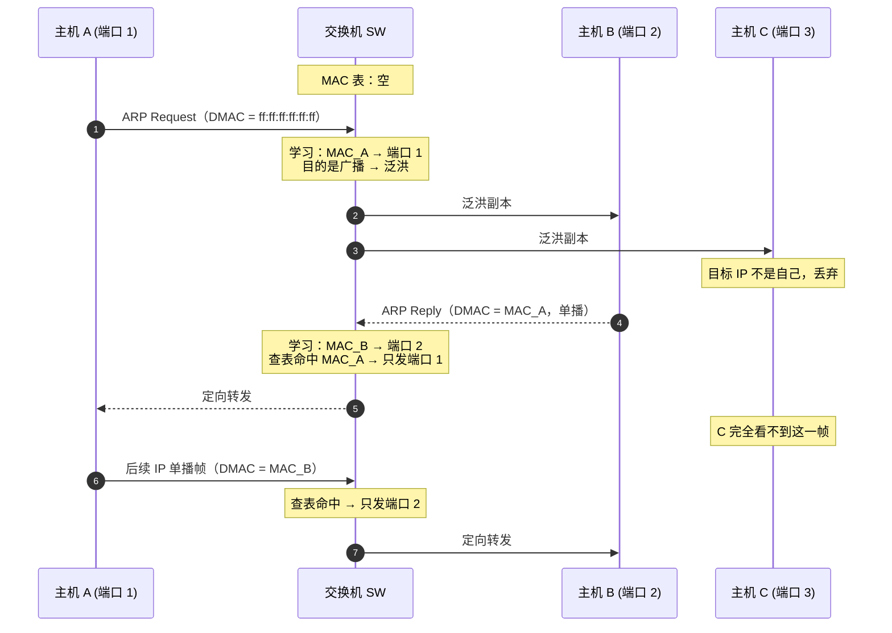
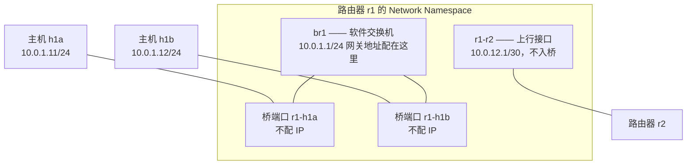
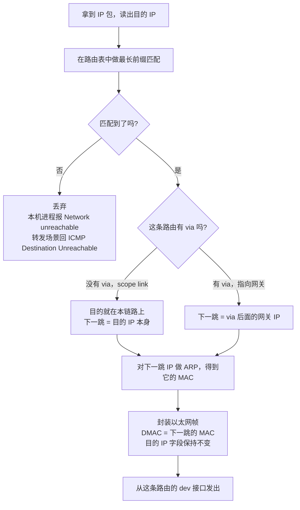
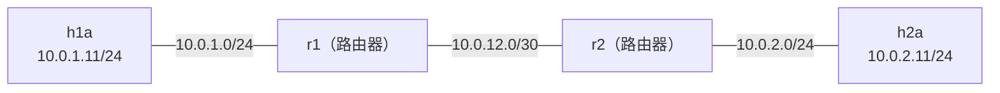
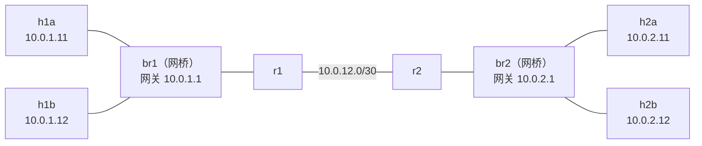

# 二层交换与静态路由讲义

> **课程导读**：上一讲我们用一对 veth 把两个 Network Namespace 直连了起来，那是一根"网线"能做到的极限——两台机器、一个网段。真实的网络远不止于此：一个机架里几十台服务器要互通，几十个机架之间还要互通。本讲回答两个承接性的问题：**同一个网段内，多台主机靠什么连在一起？不同网段之间，数据包又是靠什么被一跳一跳送到目的地的？** 前者的答案是二层交换（switching），后者的答案是三层路由（routing）。学完本讲，你将能读懂 Linux 的 MAC 地址表与路由表，能用 `bridge` 和 `ip route` 亲手搭出一个多跳、多网段的网络，并能在它不通的时候说清楚是哪一层出了问题。这套拓扑就是 Lab 1 的实验床，后续所有实验都在它的基础上生长。

---

## 学习目标

1. **二层转发机制**：理解透明网桥的"学习—转发—泛洪—老化"四个动作，能解释未知单播为什么要泛洪，以及广播域与冲突域的区别。
2. **Linux 软件网桥**：掌握 `ip link ... type bridge` 与 `bridge` 命令，能创建网桥、挂载端口、查看并解读 MAC 地址表（FDB）。
3. **路由表与转发决策**：能逐字段读懂 `ip route show` 的输出，掌握最长前缀匹配（Longest Prefix Match）原则，并能用 `ip route get` 验证内核的选路结果。
4. **把主机变成路由器**：理解 `net.ipv4.ip_forward` 的作用、回程路由（return path）的必要性，以及 TTL 递减与 ICMP 差错报文如何支撑起 `traceroute`。
5. **多跳网络实操**：能独立搭建"两个机架 + 两台路由器"的多网段拓扑，用 `ping`、`tcpdump`、`traceroute` 验证逐跳 MAC 改写与 TTL 递减，并定位常见的单向不通故障。

---

## 模块一：二层交换——从一根线到一台交换机

### 1.1 上一讲的落点与本讲的起点

第 01 讲我们已经建立了这些认知，本讲直接使用，不再重复：

- 以太网帧的结构，MAC 地址的单播 / 组播 / 广播三种形态；
- ARP 如何把"目标 IP"解析成"目标 MAC"；
- IPv4 编址与 CIDR，如何判断两个地址是否属于同一网段；
- 跨网段转发时路由器的行为：**IP 地址端到端不变，MAC 地址逐跳改写，TTL 每跳减一**；
- `ip netns` 与 veth pair，以及两节点直连的搭建方法。

上一讲的拓扑有一个根本限制：**veth 是点对点的**，一根线只能接两个人。要把一个网段里的 N 台主机连起来，我们需要一个能接多口、还能把帧送对地方的设备。这就是本讲的第一个主角。

---

### 1.2 从共享介质到交换机

最早的以太网是**共享介质**：所有主机接在同一根同轴电缆上，任何时刻只能有一个人说话，两个人同时发就会**冲突（Collision）**，双方都要退避重发。集线器（Hub）只是把这根电缆换了个形态——它在物理层把收到的比特原样广播到所有其他端口，并不理解帧，所以**所有端口仍然处在同一个冲突域**（Collision Domain）中。接的人越多，冲突越频繁，有效带宽被均分甚至更差。

交换机（Switch，其规范名称是**透明网桥 / Transparent Bridge**，见 IEEE 802.1D）改变了这一点。它工作在数据链路层，**看得懂以太网帧的目的 MAC**，因此可以只把帧送到该去的那个端口：

- 每个端口成为**独立的冲突域**，端口之间可以同时通信，总带宽随端口数增长；
- 现代交换机端口全双工，物理冲突已经不存在，CSMA/CD 形同虚设（但第 01 讲讲过的 64 字节最小帧长仍作为历史遗留保留下来）。

> [!NOTE]
> 交换机消除了冲突域，但**没有**消除广播域——广播帧仍然要送到所有端口。这是 1.4 节的主题，也是为什么"再大的交换网络也总要被路由器切开"。

---

### 1.3 透明网桥的三个动作：学习、转发、泛洪

交换机出厂时对网络一无所知，它靠观察流量自学，整个过程只有三个动作。

**动作一：学习（Learning）**——每收到一个帧，就把"**源 MAC → 入端口**"这条映射记进 **MAC 地址表**（Linux 里叫 **FDB，Forwarding Database**；硬件交换机上常称 CAM 表）。注意学的是**源** MAC：帧从哪个口进来的，就说明发帧的那台机器挂在哪个口上。

**动作二：转发（Forwarding）/ 过滤（Filtering）**——查帧的**目的** MAC：

| 查表结果 | 处理 | 说明 |
| :--- | :--- | :--- |
| 命中，出端口 ≠ 入端口 | **转发**到该端口 | 正常的定向转发 |
| 命中，出端口 = 入端口 | **过滤**（丢弃） | 收发双方在同一段上，帧已经到过了，再发回去是多余的 |
| 未命中（**未知单播**） | **泛洪** | 不知道人在哪，只好挨个问 |
| 目的 MAC 是广播 / 组播 | **泛洪** | 本来就是发给一群人的 |

**动作三：泛洪（Flooding）**——把帧复制到除入端口之外的所有端口。泛洪是交换机在"不知道"时的兜底策略，代价是浪费带宽。好在只要对方回一个帧，源 MAC 就被学到了，后续通信立即变成定向转发。

**老化（Aging）**：表项不是永久的。Linux 网桥的默认老化时间是 **300 秒**，超时未刷新的条目会被删除。这样主机换端口、换网卡后，表能自动收敛到正确状态。

下面用一次典型的 ARP 交互，把三个动作串起来（`SW` 为交换机，三台主机 A / B / C 分别接在端口 1 / 2 / 3）：



这张图里最值得记住的一点是：**C 只看到了第一个广播帧，之后的所有帧都与它无关**。这正是交换机相对集线器的价值所在，也是模块六要亲手验证的现象。

---

### 1.4 广播域与冲突域

| 设备 | 工作层次 | 冲突域 | 广播域 | 是否看得懂帧 |
| :--- | :--- | :--- | :--- | :--- |
| 集线器 Hub | 物理层 | 所有端口共 **1 个** | 所有端口共 1 个 | 否，只转发比特 |
| 交换机 Switch / 网桥 Bridge | 数据链路层 | **每端口 1 个** | 所有端口共 1 个 | 是，看目的 MAC |
| 路由器 Router | 网络层 | 每端口 1 个 | **每端口 1 个** | 是，看目的 IP |

一句话结论：**交换机切分冲突域，路由器切分广播域。**

广播域为什么必须被切开？因为广播的成本随规模超线性增长：ARP 请求、DHCP 发现、各类服务发现协议都在广播，域内每台主机的网卡都要收下并由 CPU 判断是否与自己相关。一个几千台主机的扁平二层网络会被广播流量拖垮，而且一旦出现环路就是灾难（1.6 节）。所以真实的数据中心里，**广播域被限制在机架或 Pod 级别**，跨机架一律走三层路由——这正是第 05 讲 leaf-spine 架构的出发点。

---

### 1.5 交换机为什么是"透明"的

"透明网桥"里的透明，指的是**对上层协议完全不可见**：

| | 交换机 / 网桥 | 路由器 |
| :--- | :--- | :--- |
| 决策依据 | 目的 **MAC** | 目的 **IP** |
| 查什么表 | MAC 地址表（FDB） | 路由表（FIB） |
| 表怎么来的 | **自学习**，无需配置 | 管理员静态配置，或路由协议动态学习 |
| 改写帧头 | **不改** | 重写源 / 目的 MAC |
| 动 TTL 吗 | **不动** | 每跳减 1，归零则丢弃并回 ICMP |
| 需要 IP 吗 | 不需要（管理口除外） | 每个接口都要有 IP |
| 表项找不到时 | **泛洪** | **丢弃**，并回 ICMP 不可达 |

最后一行的对比很值得玩味：二层"不知道就问所有人"，三层"不知道就直接拒绝"。这个差异决定了二层网络无法做大——泛洪的代价随规模爆炸，而三层的路由表可以靠前缀聚合保持精简。

> [!IMPORTANT]
> 因为网桥既不改 MAC 也不减 TTL，所以**在 `ping` 和 `traceroute` 的输出里，你看不到交换机的存在**。一台主机 ping 同网段的另一台主机，无论中间隔了几台交换机，TTL 都是 64，traceroute 都只有一跳。这不是工具的缺陷，而是分层设计的直接体现。

---

### 1.6 环路、广播风暴与 STP

二层网络里如果出现物理环路，会同时引发两个问题：

1. **广播风暴**：IP 报文有 TTL 可以兜底，**以太网帧没有任何跳数字段**。一个广播帧进了环，就会被无限复制、无限转发，瞬间打满链路。
2. **MAC 地址表抖动**：同一个源 MAC 会先后从不同端口进来，表项反复改写，定向转发彻底失效。

**STP**（Spanning Tree Protocol，生成树协议，IEEE 802.1D）的作用就是在有环的物理拓扑上算出一棵无环的生成树，把多余的链路置为 blocking 状态，链路故障时再把它们激活。

> [!NOTE]
> **Linux 网桥默认不开 STP**（`stp_state 0`）。本讲和 Lab 1 的拓扑没有二层环路，所以不需要打开它。数据中心里也普遍不依赖 STP——它收敛慢、且会白白闲置一半链路。取而代之的做法是把冗余交给三层的 ECMP 多路径，这是第 05 讲的内容。

---

## 模块二：Linux 软件网桥

Linux 内核自带一个功能完整的软件交换机，就叫 **bridge**。Docker 的 `docker0`、Kubernetes 的多数 CNI 插件、KVM 虚拟机的虚拟交换机，底层都是它。

### 2.1 bridge 设备与桥端口

Linux 的 bridge 是一种**网络设备类型**。使用它需要理解两个角色：

- **bridge 设备本身**（如 `br1`）：既是这台"交换机"的化身，也是**本机接入这台交换机的那个端口**。给它配 IP，就相当于给交换机接了一台主机（通常就是网关）。
- **桥端口（bridge port）**：任何一个普通网络设备（veth 的一端、物理网卡、VLAN 子接口）执行 `ip link set <dev> master <bridge>` 之后，就"插进"了这台交换机。此后该设备收到的帧不再交给本机的 IP 协议栈，而是交给网桥的转发逻辑。



### 2.2 三条必须记住的规矩

> [!WARNING]
> 1. **桥端口不配 IP**。帧已经被网桥接管，配在端口上的地址不会按你预期的方式工作。三层地址一律配在 bridge 设备上。
> 2. **bridge 设备和每个桥端口都要 `up`**。少 up 一个，现象是"配置看着全对但就是不通"。
> 3. **把已有接口加入网桥前，先把它上面的 IP 删掉再配到 bridge 上**。模块六会完整演示这个迁移过程。

### 2.3 基本操作

```bash
# 1. 创建一个名为 br1 的网桥并启用
sudo ip link add name br1 type bridge
sudo ip link set br1 up

# 2. 把接口 eth-x 插到 br1 上，并启用该端口
sudo ip link set eth-x master br1
sudo ip link set eth-x up

# 3. 把接口从网桥上拔下来
sudo ip link set eth-x nomaster

# 4. 给这台"交换机"本身配一个三层地址（通常作为本网段的网关）
sudo ip addr add 10.0.1.1/24 dev br1
```

### 2.4 查看网桥状态与 MAC 地址表

`bridge` 命令（同属 `iproute2`）是观察二层行为的主要工具：

```bash
# 5. 查看有哪些端口挂在网桥上，以及各端口的 STP 状态
sudo ip netns exec r1 bridge link show

# 6. 查看 MAC 地址表（FDB）
sudo ip netns exec r1 bridge fdb show br br1

# 7. 查看网桥参数（老化时间、STP 开关等）
sudo ip -n r1 -d link show br1
```

第 5 条命令的实测输出：

```
5: r1-h1a@if6: <BROADCAST,MULTICAST,UP,LOWER_UP> mtu 1500 master br1 state forwarding priority 32 cost 2
11: r1-h1b@if12: <BROADCAST,MULTICAST,UP,LOWER_UP> mtu 1500 master br1 state forwarding priority 32 cost 2
```

`master br1` 表明该端口属于 br1，`state forwarding` 是 STP 的端口状态（未开 STP 时所有端口都直接处于转发态）。

第 6 条命令的实测输出：

```
f2:b7:b4:06:2b:0e dev r1-h1a master br1 permanent
12:d2:96:8e:ba:65 dev r1-h1a master br1
d2:29:2a:88:ce:ee dev r1-h1b master br1
```

读法：

- 带 **`permanent`** 的是**本地条目**——桥端口自己的 MAC 地址，由内核静态写入，用于把发往本机的帧向上递交，不会老化。
- **不带任何标志**的才是**自学习来的条目**：`12:d2:...` 是主机 h1a 的 MAC，网桥从它发出的帧里学到它挂在 `r1-h1a` 这个端口上。这正是 1.3 节"动作一"的产物。

第 7 条命令的输出很长，关注其中两个字段：

```
bridge forward_delay 1500 hello_time 200 max_age 2000 ageing_time 30000 stp_state 0 ...
```

- `ageing_time 30000`：老化时间，**单位是 1/100 秒**，即默认 300 秒。
- `stp_state 0`：STP 关闭（对应 1.6 节的说明）。

> [!TIP]
> 想只看自学习到的条目，把本地条目过滤掉即可：
> `sudo ip netns exec r1 bridge fdb show br br1 | grep -v permanent`
> 这个命令在模块六里会反复用到。

---

## 模块三：网络层转发——路由表与最长前缀匹配

交换机解决了"一个网段内部怎么连"，现在轮到"网段之间怎么走"。

### 3.1 一次转发决策到底在决定什么

很多同学以为路由表决定的是"包往哪个方向走"。更准确的说法是：**路由表决定的是"这一帧的目的 MAC 该填谁"。**

主机（或路由器）拿到一个待发送的 IP 包后，流程是固定的：



> [!IMPORTANT]
> **主机 ARP 的是下一跳，不是目的地。** 当 h1a（10.0.1.11）访问另一个网段的 10.0.2.12 时，它发出的 ARP 请求问的是"谁有 **10.0.1.1**（网关）"，而不是"谁有 10.0.2.12"。这是理解逐跳转发的关键一步，模块六会用抓包直接验证它。

### 3.2 逐字段读懂 Linux 路由表

下面是模块五里路由器 `r1` 的真实路由表：

```
10.0.1.0/24 dev r1-h1a proto kernel scope link src 10.0.1.1
10.0.2.0/24 via 10.0.12.2 dev r1-r2
10.0.12.0/30 dev r1-r2 proto kernel scope link src 10.0.12.1
```

| 字段 | 含义 |
| :--- | :--- |
| 行首的前缀（如 `10.0.2.0/24`） | **目的网络**。写作 `default` 时等价于 `0.0.0.0/0`。 |
| `via <IP>` | **下一跳网关**。没有这个字段，说明目的网络与本机**直连**，下一跳就是目的地本身。 |
| `dev <接口>` | **出接口**：从哪块网卡发出去。 |
| `proto kernel` | 这条路由的**来源**。`kernel` 表示内核自动生成；手工用 `ip route add` 加的默认记为 `boot`，`ip route show` 不显示这个默认值（上面第二行就没有 `proto` 字段，`ip -d route show` 才会把它打印出来）；网络配置工具写入的、或加了 `proto static` 参数的显示为 `static`；路由协议下发的会标成 `ospf`、`bgp` 等，第 03 讲会看到。 |
| `scope link` | **作用域**：`link` 表示目的地在本链路上可直接到达；`global` 表示需要经过网关（有 `via` 的路由默认就是 global，故不显示）；`host` 表示目的就是本机。 |
| `src <IP>` | **源地址提示**：本机主动发往该网段时，默认用哪个地址作为源 IP。 |
| `metric <n>`（此处未出现） | **度量值 / 优先级**。当多条路由前缀长度相同时，metric 小的胜出。 |

> [!NOTE]
> 第一行和第三行是**直连路由**，没有人配置过它们——**只要你给一个接口配上 `10.0.1.1/24`，内核就会自动生成一条 `10.0.1.0/24 dev <该接口> scope link` 的路由**。这就是为什么配完 IP 之后，同网段立刻就能 ping 通。第二行才是我们手工加的静态路由。

### 3.3 最长前缀匹配（Longest Prefix Match）

当多条路由都能匹配同一个目的 IP 时，**前缀最长（最具体）的那条胜出**，与书写顺序无关。这是 IP 转发最核心的一条规则，CIDR 的地址聚合能力完全建立在它之上。

下面的实验在主机 h1a 上刻意构造了三条互相重叠、且下一跳各不相同的路由：

```bash
# 1. 制造三条重叠路由（10.0.1.12 是同网段的另一台主机，这里只借它的地址做对照）
sudo ip -n h1a route add 10.0.2.0/24  via 10.0.1.1
sudo ip -n h1a route add 10.0.2.12/32 via 10.0.1.12

# 2. 查看路由表
sudo ip -n h1a route show
```

```
default via 10.0.1.1 dev h1a-r1
10.0.1.0/24 dev h1a-r1 proto kernel scope link src 10.0.1.11
10.0.2.0/24 via 10.0.1.1 dev h1a-r1
10.0.2.12 via 10.0.1.12 dev h1a-r1
```

`ip route get` 让内核把选路结果直接告诉你，是排查选路问题最高效的命令：

```bash
# 3. 让内核对三个不同的目的地分别做一次查表
sudo ip netns exec h1a ip route get 10.0.2.11   # 命中 /24
sudo ip netns exec h1a ip route get 10.0.2.12   # 命中 /32
sudo ip netns exec h1a ip route get 10.9.9.9    # 命中 default
```

实测输出（每次查询的第二行 `cache` 是内核的下一跳缓存标记，可忽略）：

```
10.0.2.11 via 10.0.1.1 dev h1a-r1 src 10.0.1.11 uid 0
    cache
10.0.2.12 via 10.0.1.12 dev h1a-r1 src 10.0.1.11 uid 0
    cache
10.9.9.9 via 10.0.1.1 dev h1a-r1 src 10.0.1.11 uid 0
    cache
```

`10.0.2.12` 同时匹配 `/32`、`/24` 和 `default` 三条路由，内核选了最长的 `/32`；`10.0.2.11` 只匹配后两条，选了 `/24`；`10.9.9.9` 只剩 `default` 可选。**这就是最长前缀匹配。**

### 3.4 路由的四种常见形态

| 形态 | 写法 | 用途 |
| :--- | :--- | :--- |
| **直连路由** | `10.0.1.0/24 dev X scope link` | 配 IP 时内核自动生成，标识"本链路可直达" |
| **静态路由** | `ip route add 10.0.2.0/24 via 10.0.12.2` | 管理员手工指定某个网段走哪个下一跳 |
| **默认路由** | `ip route add default via 10.0.1.1` | 前缀长度为 0，兜底匹配所有目的地；终端主机通常只需要这一条 |
| **主机路由** | `ip route add 10.0.2.12/32 via ...` | 前缀 /32，只针对单个 IP，优先级最高，常用于临时改道或引流 |

静态路由简单、可控、零开销，缺点是**不会自己适应拓扑变化**：链路一断，包就黑洞掉，必须人工改表。规模一大，配置量是 $O(N^2)$ 量级的。让网络自己学路径、自己收敛，正是第 03、04 讲动态路由协议要解决的问题。

### 3.5 `ip route` 常用操作速查

```bash
# 1. 查看主路由表
sudo ip -n <ns> route show

# 2. 新增 / 删除一条静态路由
sudo ip -n <ns> route add 10.0.2.0/24 via 10.0.12.2
sudo ip -n <ns> route del 10.0.2.0/24

# 3. 新增或覆盖（不存在则添加，存在则替换，脚本里比 add 更省心）
sudo ip -n <ns> route replace 10.0.2.0/24 via 10.0.12.2

# 4. 问内核"去这个地址你会怎么走"——排查选路问题的第一命令
sudo ip netns exec <ns> ip route get 10.0.2.12

# 5. 查看本机地址与广播地址所在的 local 表（了解即可）
sudo ip -n <ns> route show table local
```

---

## 模块四：把一台 Linux 变成路由器

主机和路由器跑的是同一个内核，区别只在于**是否愿意转发不属于自己的包**，以及**表里有没有相应的路由**。

### 4.1 开关：`net.ipv4.ip_forward`

Linux 默认**不转发**目的地不是本机的 IP 包——收到就丢，这是一台"主机"的安全默认行为。要让它变成路由器，必须显式打开转发：

```bash
# 1. 在指定 namespace 内打开 IPv4 转发（该参数是 netns 隔离的，每个 ns 要单独设置）
sudo ip netns exec r1 sysctl -w net.ipv4.ip_forward=1

# 2. 确认当前取值
sudo ip netns exec r1 sysctl net.ipv4.ip_forward
```

> [!NOTE]
> `net.ipv4.ip_forward` 属于网络命名空间的私有参数，在 `r1` 里打开不会影响宿主机或其他 namespace。这也正是 netns 能用来模拟多台独立路由器的原因。

### 4.2 双向可达：别忘了回程路由

这是初学者最常踩的坑，没有之一。**一次成功的 ping 需要去程和回程两条路都通**，而这两条路是由不同设备上的不同路由表分别决定的。

在本讲的拓扑里，要让 h1a 与 h2a 互通，至少需要：

| 设备 | 需要的路由 | 方向 |
| :--- | :--- | :--- |
| h1a | `default via 10.0.1.1` | 去程 |
| r1 | `10.0.2.0/24 via 10.0.12.2` | 去程 |
| r2 | `10.0.1.0/24 via 10.0.12.1` | **回程** |
| h2a | `default via 10.0.2.1` | **回程** |

少配后两条中的任何一条，现象都是"ping 不通"，但**原因完全不同**：去程包已经顺利到达 h2a，h2a 也生成了回复，只是回复在半路被丢掉了。模块 5.5 会用抓包把这个过程摊开给你看。

> [!TIP]
> **"ping 不通"的定位顺序**，按从近到远逐段排除：
> 1. `ip addr show` —— 地址配对了吗？接口 `up` 了吗？
> 2. `ip route get <目的IP>` —— 内核打算怎么走？走的接口对吗？
> 3. `ip neigh show` —— 下一跳的 MAC 解析出来了吗？（`FAILED` 说明二层不通）
> 4. `sysctl net.ipv4.ip_forward` —— 中间每一跳都开转发了吗？
> 5. 在**中间节点**上 `tcpdump` —— 包走到哪一跳就消失了？消失的是去程还是回程？

### 4.3 TTL 与 ICMP 差错报文

每台路由器转发一个包时都会把 **TTL 减 1**；减到 0 就丢弃，并向源地址回一个 **ICMP Time Exceeded（类型 11）**。这个机制是为了防止路由环路让包永远在网里打转。

Linux 发出的包初始 TTL 通常是 **64**。所以从 ping 回显里的 `ttl=` 值，可以反推出中间经过了几台路由器：

```
64 bytes from 10.0.2.11: icmp_seq=1 ttl=62 time=0.839 ms
```

`ttl=62` 意味着**回程**经过了 2 台路由器（64 − 62）。注意这里读到的是**回复包**的 TTL，反映的是回程路径，去程和回程不一定对称。

用 `ping -t` 手工指定 TTL，可以一跳一跳地把路径"点亮"：

```bash
# 1. TTL 设为 1：只能走到第一跳，由第一台路由器回 ICMP 超时
sudo ip netns exec h1a ping -c 1 -t 1 10.0.2.11

# 2. TTL 设为 2：走到第二跳后超时
sudo ip netns exec h1a ping -c 1 -t 2 10.0.2.11
```

实测输出：

```
From 10.0.1.1 icmp_seq=1 Time to live exceeded
From 10.0.12.2 icmp_seq=1 Time to live exceeded
```

两台路由器分别用**自己收到这个包的那个接口的地址**回了 ICMP 超时——路径上的两跳就这样被暴露了出来。

### 4.4 traceroute 的原理

把上面这个手工过程自动化，就是 `traceroute`：它依次发出 TTL = 1, 2, 3, … 的探测包，收集沿途每一跳回的 ICMP Time Exceeded，直到探测包抵达目的地。

```bash
# 3. 逐跳打印到目的地的路径（-n 表示不做反向 DNS 解析，输出更快）
sudo ip netns exec h1a traceroute -n 10.0.2.11
```

```
traceroute to 10.0.2.11 (10.0.2.11), 30 hops max, 60 byte packets
 1  10.0.1.1  0.022 ms  0.002 ms  0.003 ms
 2  10.0.12.2  0.006 ms  0.003 ms  0.005 ms
 3  10.0.2.11  0.009 ms  0.004 ms  0.004 ms
```

每行三个时间，是因为每一跳默认发 3 个探测包。Linux 版 `traceroute` 默认用 **UDP** 探测（目的端口从 33434 起递增，故意选没有进程监听的高端口，好让目的主机回 ICMP Port Unreachable 来标志"到了"）；`traceroute -I` 改用 ICMP Echo 探测，`-T` 改用 TCP SYN，后者在防火墙环境下更容易穿透。

> [!NOTE]
> Ubuntu 默认不带 `traceroute`，需要 `sudo apt install traceroute`。若不便安装，可以用 `iputils` 自带的 `tracepath`，或者退回到 4.3 节的 `ping -t` 手工法——原理完全一样。
>
> 另外要记住模块一的结论：**traceroute 只能看见路由器，看不见交换机**。输出里"看起来只有一跳"，不代表中间真的只有一根线。

### 4.5 一个补充：反向路径过滤

Linux 有一个 `rp_filter`（反向路径过滤）机制：收到一个包时，检查"如果我要回复它的源地址，会不会从收到它的这个接口发出去"，不一致就丢弃。它能防住一部分地址伪造，但在**非对称路由**的场景下会造成莫名其妙的丢包。

本讲的拓扑去回程完全对称，不会触发它。但如果你日后在实验中遇到"抓包看到包进来了，协议栈却没反应"，记得检查一下 `net.ipv4.conf.all.rp_filter` 与对应接口的同名参数（内核取两者的较大值）。

---

## 模块五：动手实验（一）——三跳线性网络与静态路由

> [!NOTE]
> **本模块与下一模块是课堂跟做版**，目标是亲眼看见二层与三层各自在做什么。请一步步敲下去，重点放在中间的观察环节；两个模块前后相接，中途不要清理。
> 课后的 **Lab 1** 不重复这套搭建过程，而是在它之上往前一步：把拓扑固化成幂等的 `up` / `down` 脚本（后续九个实验都要复用它）、扩展到更多机架、施加延迟做测量、以及做故障盲测。一句话分工——**这里的任务是看懂现象，Lab 1 的任务是做出产出。**

### 5.1 拓扑与地址规划

第一阶段先搭一条线性链路：两台主机分别挂在两台路由器上，两台路由器之间用一条 /30 点对点链路相连。



| 链路 | 网段 | 一端 | 另一端 |
| :--- | :--- | :--- | :--- |
| h1a ↔ r1 | `10.0.1.0/24` | h1a：`10.0.1.11`（接口 `h1a-r1`） | r1：`10.0.1.1`（接口 `r1-h1a`） |
| r1 ↔ r2 | `10.0.12.0/30` | r1：`10.0.12.1`（接口 `r1-r2`） | r2：`10.0.12.2`（接口 `r2-r1`） |
| r2 ↔ h2a | `10.0.2.0/24` | r2：`10.0.2.1`（接口 `r2-h2a`） | h2a：`10.0.2.11`（接口 `h2a-r2`） |

两个约定：

- **接口命名用 `<本端>-<对端>`**，例如 `r1-h1a` 表示"r1 上朝向 h1a 的那个口"。拓扑一大，规范命名能省掉大量排查时间。
- **路由器互联链路用 /30**，只有 2 个可用地址，正好一人一个，不浪费。主机所在网段用 /24，方便后面往里加机器。

> [!TIP]
> 本模块起大量使用 `ip -n <ns>` 这个简写，它完全等价于 `ip netns exec <ns> ip`。非 `ip` 的命令（`ping`、`tcpdump`、`bridge`、`sysctl`）仍需写全 `ip netns exec <ns> <命令>`。

### 5.2 搭建拓扑

> [!TIP]
> **把搭建命令存成脚本**。下面第 1–6 步有二十多条命令，只要敲错一条，或者 5.5 节做故障演示时把环境弄乱了，手工从头再敲一遍既费时又容易再错。建议一边敲、一边把命令追加进一个脚本文件，比如 `topo.sh`：
>
> ```bash
> #!/usr/bin/env bash
> set -Eeuo pipefail    # 任何一条命令失败就立即停下，不带着错误往下跑
>
> # 先删掉上一次留下的 namespace，保证脚本可以反复执行
> for n in h1a r1 r2 h2a; do ip netns del "$n" 2>/dev/null || true; done
>
> # 下面依次粘贴第 1–6 步的命令，去掉其中的 sudo（整个脚本会以 root 身份运行）
> ip netns add h1a
> # ……
> ```
>
> 此后环境一乱，执行 `sudo bash topo.sh` 就能回到干净的初始状态。模块六会在这个拓扑上继续加网桥和主机，那些命令也可以接着追加进同一个脚本，新增的 `h1b`、`h2b` 记得也加进开头的清理列表。
>
> Lab 1 会提供一个更完整的实验床脚本 `ns_topo.sh`（带 `down` 子命令、出错自动清理、便于扩展机架），到时拿你自己写的这份对照着读。

```bash
# 1. 创建四个 namespace：两台主机 + 两台路由器
sudo ip netns add h1a
sudo ip netns add r1
sudo ip netns add r2
sudo ip netns add h2a

# 2. 创建三条链路（每条链路 = 一对 veth，两端分别塞进对应的 namespace）
sudo ip link add h1a-r1 type veth peer name r1-h1a
sudo ip link set h1a-r1 netns h1a
sudo ip link set r1-h1a netns r1

sudo ip link add r1-r2 type veth peer name r2-r1
sudo ip link set r1-r2 netns r1
sudo ip link set r2-r1 netns r2

sudo ip link add r2-h2a type veth peer name h2a-r2
sudo ip link set r2-h2a netns r2
sudo ip link set h2a-r2 netns h2a

# 3. 启用各 namespace 的回环接口
for n in h1a r1 r2 h2a; do sudo ip -n $n link set lo up; done

# 4. 配置 IP 地址并启用接口
sudo ip -n h1a addr add 10.0.1.11/24 dev h1a-r1 ; sudo ip -n h1a link set h1a-r1 up
sudo ip -n r1  addr add 10.0.1.1/24  dev r1-h1a ; sudo ip -n r1  link set r1-h1a up
sudo ip -n r1  addr add 10.0.12.1/30 dev r1-r2  ; sudo ip -n r1  link set r1-r2 up
sudo ip -n r2  addr add 10.0.12.2/30 dev r2-r1  ; sudo ip -n r2  link set r2-r1 up
sudo ip -n r2  addr add 10.0.2.1/24  dev r2-h2a ; sudo ip -n r2  link set r2-h2a up
sudo ip -n h2a addr add 10.0.2.11/24 dev h2a-r2 ; sudo ip -n h2a link set h2a-r2 up

# 5. 让两台路由器真的开始转发
sudo ip netns exec r1 sysctl -qw net.ipv4.ip_forward=1
sudo ip netns exec r2 sysctl -qw net.ipv4.ip_forward=1

# 6. 配置静态路由：两台主机各配一条默认路由，两台路由器各配一条到对端网段的路由
sudo ip -n h1a route add default via 10.0.1.1
sudo ip -n h2a route add default via 10.0.2.1
sudo ip -n r1 route add 10.0.2.0/24 via 10.0.12.2
sudo ip -n r2 route add 10.0.1.0/24 via 10.0.12.1
```

**预测一下再往下看**：第 6 步只加了 4 条路由，但 `ip route show` 在 r1 上会显示 3 条。多出来的是哪些？为什么？

```bash
# 7. 核对路由表
sudo ip -n r1 route show
```

```
10.0.1.0/24 dev r1-h1a proto kernel scope link src 10.0.1.1
10.0.2.0/24 via 10.0.12.2 dev r1-r2
10.0.12.0/30 dev r1-r2 proto kernel scope link src 10.0.12.1
```

第 1、3 行带 `proto kernel`，是第 4 步配 IP 时内核自动生成的直连路由（3.2 节）；只有第 2 行是我们手工加的。

### 5.3 验证连通性、TTL 与路径

```bash
# 8. 端到端连通性
sudo ip netns exec h1a ping -c 3 10.0.2.11
```

```
64 bytes from 10.0.2.11: icmp_seq=1 ttl=62 time=0.839 ms
64 bytes from 10.0.2.11: icmp_seq=2 ttl=62 time=0.071 ms
```

`ttl=62`：回复包出发时是 64，经过 r2、r1 两跳各减 1（4.3 节）。作为对照，ping 直连的网关 `10.0.1.1` 会看到 `ttl=64`。

```bash
# 9. 逐跳路径
sudo ip netns exec h1a traceroute -n 10.0.2.11
```

```
 1  10.0.1.1  0.022 ms  0.002 ms  0.003 ms
 2  10.0.12.2  0.006 ms  0.003 ms  0.005 ms
 3  10.0.2.11  0.009 ms  0.004 ms  0.004 ms
```

### 5.4 关键观察：IP 不变，MAC 逐跳改写

这是本讲最值得亲手做一遍的实验。在三条链路上**同时**抓包，看同一个 ICMP 包在每一段的帧头。

```bash
# 10. 先清空各节点的 ARP 缓存，让 ARP 过程可见
for n in h1a r1 r2 h2a; do sudo ip netns exec $n ip neigh flush all; done

# 11. 开三个终端，分别在三条链路上抓包（-e 显示二层帧头）
sudo ip netns exec h1a tcpdump -n -e -i h1a-r1     # 终端 1：链路 1
sudo ip netns exec r1  tcpdump -n -e -i r1-r2      # 终端 2：链路 2
sudo ip netns exec r2  tcpdump -n -e -i r2-h2a     # 终端 3：链路 3

# 12. 在第四个终端里发一个 ICMP 包
sudo ip netns exec h1a ping -c 1 10.0.2.11
```

三个终端的实测输出（只保留 ICMP echo request 一行）：

```
链路 1  12:d2:96:8e:ba:65 > f2:b7:b4:06:2b:0e, IPv4, 10.0.1.11 > 10.0.2.11: ICMP echo request
链路 2  66:35:06:b2:3e:3b > ea:8b:7b:b7:a4:4f, IPv4, 10.0.1.11 > 10.0.2.11: ICMP echo request
链路 3  82:e2:98:2d:f9:18 > e2:f5:08:50:cd:51, IPv4, 10.0.1.11 > 10.0.2.11: ICMP echo request
```

**三行的 IP 地址对完全相同，MAC 地址对三段三样。** 这就是第 01 讲 5.2 节那张时序图在真实内核上的样子：IP 是端到端的身份，MAC 只是当前这一跳的收发双方。

同时注意三条链路上各自出现的 ARP 请求：

```
链路 1  Request who-has 10.0.1.1  tell 10.0.1.11
链路 2  Request who-has 10.0.12.2 tell 10.0.12.1
链路 3  Request who-has 10.0.2.11 tell 10.0.2.1
```

**没有任何一台设备去 ARP "10.0.2.11" 这个最终目的地——除了最后一跳。** 每一跳只关心自己的下一跳是谁（3.1 节）。

再加上 `-v` 就能看到 TTL 字段逐跳递减：

```bash
# 13. 观察 TTL（对比链路 1 与链路 3 上同一个包）
sudo ip netns exec h1a tcpdump -n -v -i h1a-r1 icmp
sudo ip netns exec r2  tcpdump -n -v -i r2-h2a icmp
```

```
链路 1  IP (tos 0x0, ttl 64, id 19071, ...) 10.0.1.11 > 10.0.2.11: ICMP echo request
链路 3  IP (tos 0x0, ttl 62, id 19071, ...) 10.0.1.11 > 10.0.2.11: ICMP echo request
```

`id` 相同说明是同一个包，`ttl` 从 64 变成了 62。

### 5.5 故障演示：把它弄坏，再看懂它

把一个跑通的网络亲手弄坏一次，比看十遍正确配置更能建立因果。这里演示最反直觉的那一种：**去程一切正常，回程断掉。**

```bash
# 14. 删掉 r2 上通往左侧网段的路由 —— 只动回程，去程一个字没改
sudo ip -n r2 route del 10.0.1.0/24 via 10.0.12.1

# 15. 在 r2 靠近 h2a 的那条链路上抓包，同时从 h1a 发 ping
sudo ip netns exec r2 tcpdump -n -i r2-h2a icmp      # 终端 1
sudo ip netns exec h1a ping -c 1 -W 1 10.0.2.11      # 终端 2

# 16. 恢复
sudo ip -n r2 route add 10.0.1.0/24 via 10.0.12.1
```

ping 显示 `100% packet loss`，但抓包的结果耐人寻味：

```
IP 10.0.1.11 > 10.0.2.11: ICMP echo request
IP 10.0.2.11 > 10.0.1.11: ICMP echo reply
```

**去程完整到达了，h2a 也确实回复了，回复却死在 r2 上**——因为 r2 查不到去往 `10.0.1.0/24` 的路由。

> [!IMPORTANT]
> 换一种故障：如果不是删路由，而是"忘了在 r2 上打开 `ip_forward`"（`sysctl -w net.ipv4.ip_forward=0`），h1a 侧看到的现象**一模一样**，同样是 100% 丢包。但两者的本质截然不同——前者去程根本没走出 r2，后者去程走完了全程、死在回程。**站在源主机上无法区分它们，只有到中间节点抓包才行**。这就是 4.2 节那份定位清单存在的理由。
> Lab 1 会把这件事做成盲测：脚本随机破坏拓扑中的一处，你按清单把它找出来并说明判据。

---

## 模块六：动手实验（二）——用 bridge 把端点扩成机架 LAN

现在每台路由器下面只挂了一台主机，这条 `10.0.1.0/24` 其实是根"点对点的线"，还称不上局域网。本模块把两端各扩成一个**挂着多台主机的广播域**——可以把它想象成一个机架：`r1` 是这个机架的接入交换机兼网关，`br1` 是它的交换平面。

### 6.1 目标拓扑



注意 `br1` 是建在 `r1` 这个 namespace **内部**的——一个 namespace 里可以同时存在网桥（二层）和路由表（三层），这正是现实中"三层交换机"或"带网关的接入交换机"的形态。

### 6.2 在 r1 上建网桥并迁移已有接口

最考验理解的是**迁移**：把原来直接配在 `r1-h1a` 上的网关地址挪到网桥上，同时把这个接口变成桥端口。顺序很重要。

```bash
# 1. 在 r1 内创建网桥 br1 并启用
sudo ip -n r1 link add name br1 type bridge
sudo ip -n r1 link set br1 up

# 2. 先摘掉原接口上的 IP —— 桥端口不配 IP（2.2 节规矩一）
sudo ip -n r1 addr del 10.0.1.1/24 dev r1-h1a

# 3. 把原来的直连接口插进网桥，它从此变成一个桥端口
sudo ip -n r1 link set r1-h1a master br1

# 4. 网关地址配到网桥设备上
sudo ip -n r1 addr add 10.0.1.1/24 dev br1
```

这四步做完，h1a 到网关的连通性应当**没有任何变化**——对 h1a 而言，网络里凭空多了一台交换机，但它是透明的（1.5 节）。

### 6.3 往这个广播域里加第二台主机

```bash
# 5. 创建主机 h1b，并用一对 veth 把它接到 br1 上
sudo ip netns add h1b
sudo ip link add h1b-r1 type veth peer name r1-h1b
sudo ip link set h1b-r1 netns h1b
sudo ip link set r1-h1b netns r1

# 6. r1 侧的一端插进网桥并启用
sudo ip -n r1 link set r1-h1b master br1
sudo ip -n r1 link set r1-h1b up

# 7. h1b 侧配置地址与默认路由
sudo ip -n h1b link set lo up
sudo ip -n h1b addr add 10.0.1.12/24 dev h1b-r1
sudo ip -n h1b link set h1b-r1 up
sudo ip -n h1b route add default via 10.0.1.1
```

### 6.4 右侧机架：留给你对称地再做一遍

左侧机架的两组动作已经完整演示过——建桥与迁移接口（第 1–4 步）、加入一台新主机（第 5–7 步）。**右侧机架请照着它们自己完成**，这也是 Lab 1 的第一项基础任务。需要的全部信息都在下表里：

| 左侧（已演示） | 右侧（你来做） |
| :--- | :--- |
| 网桥 `br1`，建在 `r1` 内 | 网桥 `br2`，建在 `r2` 内 |
| 待迁移的接口 `r1-h1a` | 待迁移的接口 `r2-h2a` |
| 网关 `10.0.1.1/24` 配到 `br1` 上 | 网关 `10.0.2.1/24` 配到 `br2` 上 |
| 新主机 `h1b`，地址 `10.0.1.12/24` | 新主机 `h2b`，地址 `10.0.2.12/24` |
| veth 对 `h1b-r1` / `r1-h1b` | veth 对 `h2b-r2` / `r2-h2b` |
| 默认路由 `via 10.0.1.1` | 默认路由 `via 10.0.2.1` |

> [!TIP]
> **做完先自检这三条，三条都对再往下做 6.5**：
> ```bash
> # 8. 网桥上应当有两个端口：r2-h2a 与 r2-h2b
> sudo ip -n r2 link show master br2
>
> # 9. 网关地址应当在 br2 上
> sudo ip -n r2 addr show br2
>
> # 10. 原接口上不该再有 IP（应看不到 inet 行）
> sudo ip -n r2 addr show r2-h2a
> ```
> 卡住的话回头核对模块二 2.2 节的三条规矩——九成的问题出在"端口忘了 up"或"IP 忘了从端口挪到网桥上"。

### 6.5 验证：四台主机两两可达

```bash
# 11. 同一广播域内（不经过路由器）
sudo ip netns exec h1a ping -c 1 10.0.1.12

# 12. 跨两个机架（经过 r1、r2 两跳）
sudo ip netns exec h1b ping -c 1 10.0.2.12
```

注意两次 ping 回显里的 TTL：同网段是 `ttl=64`（网桥不减 TTL），跨机架是 `ttl=62`。再跑一次 traceroute：

```bash
# 13. 跨机架的逐跳路径
sudo ip netns exec h1b traceroute -n 10.0.2.12
```

```
 1  10.0.1.1  0.220 ms  0.006 ms  0.003 ms
 2  10.0.12.2  0.107 ms  0.005 ms  0.003 ms
 3  10.0.2.12  0.013 ms  0.004 ms  0.004 ms
```

**路径上有两台网桥，traceroute 一台也没显示。** 再次印证 1.5 节的结论。

### 6.6 关键观察一：MAC 地址表是怎么长出来的

```bash
# 14. 只看自学习到的条目
sudo ip netns exec r1 bridge fdb show br br1 | grep -v permanent
```

```
12:d2:96:8e:ba:65 dev r1-h1a master br1
d2:29:2a:88:ce:ee dev r1-h1b master br1
```

两条，正好对应 h1a 和 h1b 各自挂的端口。没有人配置过它们，全部来自 1.3 节的"动作一"。

### 6.7 关键观察二：泛洪与定向转发的分界

这是验证交换机价值的核心实验。在 **h1b** 上抓包，然后让 **h1a** 去 ping 网关——h1b 与这次通信毫无关系，它到底能看到什么？

```bash
# 15. 清空 ARP 缓存，确保 ARP 过程会真实发生
sudo ip netns exec h1a ip neigh flush all
sudo ip netns exec r1  ip neigh flush all

# 16. 终端 1：在 h1b 上抓取全部流量（不加过滤条件）
sudo ip netns exec h1b tcpdump -n -e -i h1b-r1

# 17. 终端 2：h1a ping 网关两次
sudo ip netns exec h1a ping -c 2 10.0.1.1
```

h1b 抓到的**全部**内容，实测只有一行：

```
12:d2:96:8e:ba:65 > ff:ff:ff:ff:ff:ff, ARP, Request who-has 10.0.1.1 tell 10.0.1.11
```

结论非常干净：

| 帧 | h1b 看得到吗 | 为什么 |
| :--- | :--- | :--- |
| h1a 的 ARP 请求（广播） | **看得到** | 目的 MAC 是全 F，网桥必须泛洪 |
| 网关的 ARP 回复（单播） | 看不到 | 网桥刚从上一帧学到了 h1a 的 MAC，定向转发 |
| 两个 ICMP 请求与回复（单播） | 看不到 | 同上，全部定向转发 |

**一个广播帧换来后续所有单播帧的精准投递**——这就是交换机相对集线器的全部意义。如果这里是集线器，h1b 会看到全部 6 个帧。

### 6.8 关键观察三：同网段与跨网段，差别在哪一个字段

在 h1a 的接口上抓 ICMP，先 ping 同网段的 h1b，再 ping 跨机架的 h2b：

```bash
# 18. 终端 1
sudo ip netns exec h1a tcpdump -n -e -i h1a-r1 icmp

# 19. 终端 2
sudo ip netns exec h1a ping -c 1 10.0.1.12   # 同一广播域
sudo ip netns exec h1a ping -c 1 10.0.2.12   # 跨两个机架
```

实测输出（只看 echo request）：

```
12:d2:96:8e:ba:65 > d2:29:2a:88:ce:ee, IPv4, 10.0.1.11 > 10.0.1.12: ICMP echo request
12:d2:96:8e:ba:65 > ba:0b:69:c6:63:5d, IPv4, 10.0.1.11 > 10.0.2.12: ICMP echo request
```

对照一下这两个目的 MAC 的归属：`d2:29:2a:88:ce:ee` 是 **h1b 自己的 MAC**，`ba:0b:69:c6:63:5d` 是 **网桥 br1（即网关）的 MAC**。

```bash
# 20. 核对两个 MAC 各属于谁
sudo ip -n h1b -br link show h1b-r1     # h1b 的 MAC
sudo ip -n r1  -br link show br1        # 网关的 MAC
```

同一台主机、同一块网卡发出的两个包，**目的 IP 不同导致查表结果不同，查表结果不同导致目的 MAC 不同**。这就是 3.1 节流程图在一行 tcpdump 输出里的浓缩，也是"路由表决定帧的目的 MAC"这句话最直观的证据。用 `ip route get` 可以把这个决策过程再确认一遍：

```bash
# 21. 让内核解释它的选择
sudo ip netns exec h1a ip route get 10.0.1.12   # 直连：没有 via
sudo ip netns exec h1a ip route get 10.0.2.12   # 经网关：via 10.0.1.1
```

```
10.0.1.12 dev h1a-r1 src 10.0.1.11 uid 0
10.0.2.12 via 10.0.1.1 dev h1a-r1 src 10.0.1.11 uid 0
```

### 6.9 环境清理（Teardown）

```bash
# 22. 删除 namespace 即可，附着其上的 veth 与网桥会被内核自动回收
for n in h1a h1b r1 r2 h2a h2b; do sudo ip netns del $n; done

# 23. 确认清理干净（应无输出）
ip netns list
```

> [!WARNING]
> veth 是成对的，删除一端另一端会一并消失；但如果某次实验中途失败，可能有 veth 残留在根命名空间里。用 `ip link show type veth` 检查，必要时 `sudo ip link del <名字>` 手工清理。Lab 1 的脚本会提供幂等的 `down` 子命令来统一处理这件事。

---

## 模块七：课后思考与拓展

### 思考题

1. **泛洪的代价**
   - 一个广播域里有 100 台主机，某台主机要访问一个刚上线、MAC 从未被学习过的目的地。这一帧会产生多少份副本？如果把这个数字放大到 4000 台主机的扁平二层网络，会发生什么？
   - *思考提示：从 1.3 节的"未知单播泛洪"出发，再想想 ARP 请求本身就是广播——每台主机的网卡都要收下并中断 CPU。这是数据中心坚持"跨机架走三层"的直接原因。*

2. **老化时间的两难**
   - Linux 网桥默认老化时间 300 秒。如果把它改成 5 秒，网络会出现什么现象？改成 24 小时又会怎样？
   - *思考提示：太短 → 表项频繁失效 → 泛洪比例上升；太长 → 主机迁移到新端口后，旧表项在很长时间内把帧送错地方。可以用 `sudo ip -n r1 link set br1 type bridge ageing_time 500`（单位 1/100 秒，即 5 秒）在模块六的拓扑上实测。*

3. **迁移后为什么没断**
   - 模块六第 2–4 步把 `10.0.1.1/24` 从 `r1-h1a` 挪到了 `br1` 上，而 `br1` 的 MAC 与 `r1-h1a` 的 MAC 并不相同。h1a 的 ARP 缓存里存的还是旧 MAC，为什么它没有立刻断网？
   - *思考提示：回到 2.4 节 `bridge fdb show` 的输出，注意那些带 `permanent` 的条目是谁的 MAC、指向哪个端口，以及网桥拿到一个目的 MAC 为本地条目的帧时会怎么处理。*

4. **少配一条路由的两种死法**
   - 模块 5.5 指出，`ip_forward=0` 与缺回程路由这两种故障，在 h1a 侧看到的现象完全一样。请设计一个**只在 h1a 上执行**的命令序列，尽可能区分它们。
   - *思考提示：想想这两种情况下，路径上的设备分别会不会回 ICMP 差错报文、由谁回、回的是哪一类。`ping -t` 与 `traceroute` 的输出会在第几跳开始变成星号？*

5. **为什么路由器互联要用 /30**
   - 本讲把 `r1`–`r2` 的互联链路规划成 `/30`，而主机网段用 `/24`。如果把互联链路也写成 `/24` 会有什么后果？如果用 `/31` 呢？
   - *思考提示：`/30` 有 4 个地址，扣掉网络地址与广播地址剩 2 个，正好一人一个；`/31` 是 RFC 3021 专为点对点链路定义的，2 个地址全部可用。数据中心里路由器互联链路数量巨大，这点地址浪费是要计较的。*

6. **静态路由的规模上限**
   - 本讲的拓扑有 2 个主机网段，每台路由器手工配了 1 条路由。如果扩展到第 05 讲的 4 个 leaf、8 台主机、2 个 spine，每台设备要配多少条静态路由？加一个新机架时要改动几台设备？
   - *思考提示：估算一下量级，你就能明白第 03、04 讲为什么要让网络自己学路径。这也是 Lab 2 的出发点。*

---

### 拓展资料

- Linux 内核网桥文档：<https://docs.kernel.org/networking/bridge.html>
- 手册页：`man 8 ip-route`、`man 8 ip-link`、`man 8 bridge`、`man 8 ip-neighbour`
- Linux 路由表的底层数据结构是 **LPC-trie**（`fib_trie`），它让最长前缀匹配在大规模路由表下仍能保持很低的查找开销。`cat /proc/net/fib_trie` 可以直接看到这棵树。
- 上一讲：计算机网络基础与 Linux 网络虚拟化
- 下一讲预告：静态路由配不动了怎么办——距离向量、链路状态与路径向量（RIP / OSPF / BGP）。

### 后续衔接实验

- Lab 1：从一根虚拟网线到多跳网络（本讲模块五、六的后续：脚本化实验床、扩展到三个机架、加延迟做测量、故障盲测）

### 核心规范

- **IEEE 802.1D**：*MAC Bridges*（透明网桥的学习 / 转发 / 泛洪与生成树协议；非 RFC）
- RFC 1812：*Requirements for IP Version 4 Routers*（路由器转发行为的权威定义，含 TTL 处理）
- RFC 1122：*Requirements for Internet Hosts — Communication Layers*（§3.3.1 主机的选路决策）
- RFC 792：*Internet Control Message Protocol*（Time Exceeded 与 Destination Unreachable）
- RFC 4632：*Classless Inter-domain Routing (CIDR)*（地址聚合与最长前缀匹配）
- RFC 3021：*Using 31-Bit Prefixes on IPv4 Point-to-Point Links*
