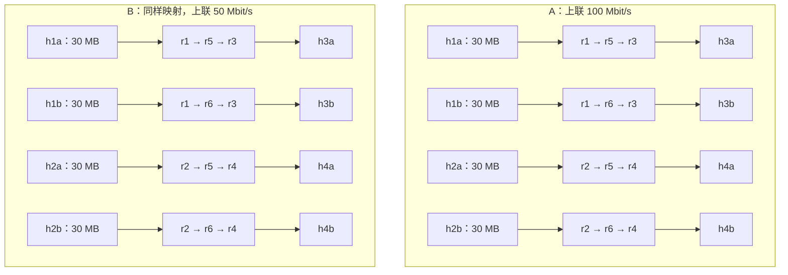
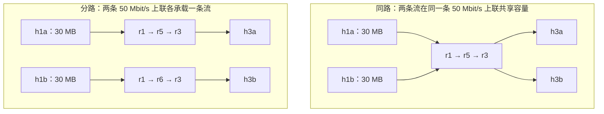
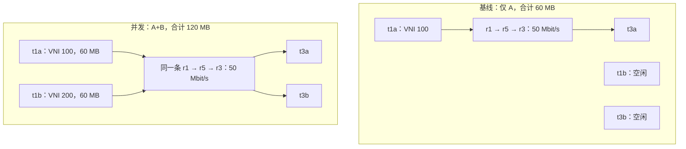

# Lab 3　搭一个迷你数据中心

> 对应第 05 讲　｜　建议用时 1 周（基础约 3 小时；进阶任务 5 约 1.5 小时、任务 6 约 2 小时；挑战任务 7、8 各约 1.5 小时）　｜　产出：2 spine × 4 leaf × 8 host 的数据中心实验床——Lab 4 至 Lab 9 都在它上面跑

第 05 讲的课堂观察里，你已经在一张**给定的** leaf-spine 实验床上预测、观察、解释过六组现象。本实验把这张"老师给的实验床"变成"你自己搭的实验床"：把课堂脚本里的拓扑整理成你自己的 `topo.sh`，接入你在 Lab 2 写的路由守护进程，再把课堂上看到的现象亲手做出来、量出来——收敛比、哈希与上联、VXLAN 租户。这张实验床一旦稳定，后续实验都直接复用，**约定比跑通更重要**。

任务分三层：**基础**人人完成；**进阶**拉开区分度；**挑战**为综合项目铺路。进阶任务 6 与挑战任务 7、8 是同一条 VXLAN 链——任务 6 没做，7、8 就没有前提——时间紧可以整条跳过，这也是全课程预留的缓冲点。

---

## 一、实验目标

1. 把课堂观察用的拓扑整理成自己维护的 `topo.sh`：节点名、接口名、地址、限速与课堂约定完全一致，支持 `up` / `check` / `rate` / `show` / `down`，重复搭建与清理可恢复到明确状态。
2. 接入自己实现的 `lsrd --ecmp`，逐链路验证连通，确认检查跨机架路由有两个下一跳。
3. 按同一方向计算收敛比，结合路径上的共享链路推导吞吐上界与完成时间下界，再用测量检查。
4. 量化哈希对完成时间的影响：同路与分路的流传同样的数据量，比较完成时间与理论下界；并搞清"换端口能不能把流搬到另一条上联"。
5. （进阶）在 underlay 上自建双租户 VXLAN，验证隔离性；用测量说明"网络隔离不等于带宽保证"。
6. （挑战）验证 VTEP 的外层源端口策略如何决定 overlay 与 underlay ECMP 的关系；建立"封装开销"的测量口径。

---

## 二、预备知识与工具

**先读**：

- [第 05 讲](../../docs/datacenter_network.md)全文：2.2 节拓扑与地址约定、2.5 节同机架/跨机架抓包、模块三（ECMP）、模块四（收敛比）、模块五（VXLAN）以及 6.6 节"从课堂实践走向 Lab 3"。
- [Lab 2 指导书](../02/README.md)任务 8：**你的 `lsrd` 必须实现 `--ecmp`**（并列首跳装成内核 multipath 路由）。没有它，本实验所有"两个下一跳"的观察都不成立——`topo.sh` 的就绪断言会替你检查这一点。

**环境**：与课堂观察相同——Linux（`sudo`）、`iproute2`、`iputils-ping`、`traceroute`、`tcpdump`、`ethtool`、`iperf3`、Python 3.12 与 `uv`；内核支持 namespace、veth、bridge、HTB、fq 与 VXLAN。先检查 VXLAN 模块：

```bash
# 1. 内核应能创建 VXLAN 设备；报错则 sudo modprobe vxlan，或安装 linux-modules-extra-$(uname -r)
sudo ip link add vxprobe0 type vxlan id 1 dstport 4789 && sudo ip link del vxprobe0
```

**准备 Python 环境**（路由器复用 Lab 2 的环境，传输工具用本实验的环境）：

```bash
# 1. 按各自锁文件初始化两个实验的独立环境
uv sync --project 2026/experiments/02 --frozen
uv sync --project 2026/experiments/03 --frozen
```

**约定**：以下所有命令**从仓库根目录执行**，需要 root 的步骤显式写了 `sudo`。与 Lab 2 不同，学生拓扑的验收靠 `topo.sh check`、抓包对账和测量记录；教师维护用的测量分类测试见 `tests/`。任务连续复用同一张拓扑；执行 `down` 后需要重新 `up` 并重建 overlay。`down` 保留结果目录；重启主机可能清除 `/tmp`，需要长期保存时另行复制。

---

## 三、目录与资源

### 3.1 文件

| 文件 | 说明 |
| :--- | :--- |
| `topo.sh` | **实验床，你要补全**。TODO 1（机架接入）、TODO 2（leaf–spine 上联）、TODO 3（check 自检）。命令面：`up [--reference]` / `check` / `rate 50\|100` / `show` / `down`。幂等。 |
| `classroom.sh` | 第 05 讲的课堂观察脚本，保持原样。它与你自己的 `topo.sh` 是两套独立资源（各自的登记目录），不能混用，也不要同时搭建。 |
| `measure.py` | 重启本轮服务端、等待就绪、并发传输、共同计时、按五元组／VNI 分类抓包；不改变路由与限速。 |
| `overlay_down.sh` | 只清理任务 6 登记的租户资源；`topo.sh down` 自动调用。 |
| `transfer.py` | 定量 TCP 传输：客户端绑定源端口，服务端确认收到全部应用字节后回执。本实验的测量工具。 |
| `pyproject.toml`、`.python-version`、`uv.lock` | 本实验的 uv 环境（只用标准库）。 |
| `/run/lab03/` | `topo.sh` 的资源登记、pid 与控制套接字 |
| `/tmp/lab03-results/` | 路由日志与各任务的测量输出；`down` 之后仍保留 |

自查时可以显式执行 `up --reference` 加载 [Lab 2 的参考实现](../02/README.md)，把"拓扑问题"和"路由问题"分开定位；**提交与验收以你自己的 `lsrd` 为准**。

### 3.2 实验床与地址约定

```
        ┌─ h1a（10.0.1.11）      每个 leaf 的机架网桥上接两台 host
  机架 1│
        └─ br1 ─ r1（leaf）─┬── 10.1.0.0/30 ── r5（spine）
                             └── 10.1.1.0/30 ── r6（spine）
  机架 2、3、4 与机架 1 同构：r2、r3、r4 各有两条上联，全网共 8 条 leaf–spine 链路。
```

*图 1：从上到下读 spine、leaf namespace、独立 host namespace。每个 leaf 分别连接 r5、r6，共八条点到点上联；实线／虚线只用于区分连接哪台 spine，交叉处不相连。机架内的 bridge 与 leaf 在同一 namespace，主机各自独立。上联双向可切换 100／50 Mbit/s，主机接入双向固定 100 Mbit/s。*

| 项目 | 约定 | 与已有实验的关系 |
| :--- | :--- | :--- |
| leaf / spine | leaf 为 `r1`–`r4`，spine 为 `r5`、`r6`，均为 network namespace | 延续 Lab 1、Lab 2 的路由器命名 |
| 机架网络 | 第 $i$ 个机架用 `10.0.i.0/24`；网关 `br{i}` = `.1`；host `h{i}a`/`h{i}b` = `.11`/`.12`，接口 `eth0` | 延续 Lab 1、Lab 2 的机架地址与主机名 |
| 机架内网桥 | `br1`–`br4`，网关地址放在 bridge 上 | `lsrd` 用 `--passive` 通告它，不在网桥上建邻 |
| 上联 | 每个 leaf 两条，`10.1.0.0/30`–`10.1.7.0/30`；leaf `.1`、spine `.2`，第 $k$ 条链路 $k = 2(\text{leaf}-1) + (\text{spine}-5)$ | 与课堂脚本完全一致 |

| leaf | 到 r5 | 到 r6 |
| :--- | :--- | :--- |
| r1 | `10.1.0.1/30` / `10.1.0.2/30` | `10.1.1.1/30` / `10.1.1.2/30` |
| r2 | `10.1.2.1/30` / `10.1.2.2/30` | `10.1.3.1/30` / `10.1.3.2/30` |
| r3 | `10.1.4.1/30` / `10.1.4.2/30` | `10.1.5.1/30` / `10.1.5.2/30` |
| r4 | `10.1.6.1/30` / `10.1.6.2/30` | `10.1.7.1/30` / `10.1.7.2/30` |

限速：host 接入口两个方向固定 100 Mbit/s；leaf–spine 链路两个方向可切换 100 / 50 Mbit/s（`topo.sh rate`）。**这张表就是 Lab 4–9 依赖的约定**：节点名、接口名、地址与档位都在这里固化。

### 3.3 测量口径

与课堂一致的四个习惯，报告里要一直带着：

- **应用字节与链路字节分开**：`transfer.py` 报告的是应用有效字节；链路上还有 TCP/IP 与封装开销。
- **MB 与 Mbit/s 分清**：本实验的"30 MB"是十进制 30 000 000 字节；速率换算用 $8 \times \text{字节} / \text{秒}$。
- **共同窗口**：从启动第一条客户端进程前，到观察到最后一条客户端成功退出；包含进程启动、建连、慢启动、完整回执与退出开销。助手每 5 ms 检查一次退出状态；每流应用速率另用客户端内部计时，二者不可混用。
- **SYN 抓包定路径**：SYN 说明建连时的上联；只有路由、哈希与连接路径稳定时才可代表后续传输。测量助手同时统计目标连接的数据包出口，遇到多个出口不能强行归成一条路径。

本文保留的课堂实测样例来自 2026-10-04 的 Ubuntu 24.04、Linux `6.8.0-142-generic`（ARM64、4 核 4 GB）备课沙箱；修订后任务的验证范围与日期见末尾“维护与验证”。理论下界与预期输出单独标注，不要求复现固定端口、路径比例或用时。

---

## 四、课堂观察回顾（第 05 讲已完成）

课堂上用 `classroom.sh` 完成了六组观察。这里留一张速查表；现象与数据的带读在讲义对应小节，本实验的任务是**在你自己的实验床上重建并扩展它们**。

| 观察 | 命令（课堂脚本） | 现象一句话 | 讲义 |
| :--- | :--- | :--- | :--- |
| locality | `classroom.sh locality` | 同机架帧从网桥端口出，跨机架帧走上联；traceroute 4 跳 | 2.5 节 |
| ecmp | `classroom.sh ecmp` | 单流被钉在一条 50 Mbit 上联，8 流聚合翻倍，但不保证 4:4 | 模块三 |
| matrix | `classroom.sh matrix` | 总量相同，接收端集中后受 100 Mbit 接入口限制 | 模块四 |
| capacity | `classroom.sh capacity` | 上联 200→100 Mbit/s，完成时间约增至两倍 | 模块四 |
| vxlan | `classroom.sh vxlan` | 同 VNI 往返、异 VNI 隔离（相同 IP 互不干扰） | 模块五 |
| mtu | `classroom.sh mtu` | 内层 1422 B 可发，1423 B 被源租户接口拒绝 | 模块五 |

> [!NOTE]
> `classroom.sh down` 只清理课堂脚本自己登记的资源。课堂的参考数据同样来自备课沙箱（见讲义"材料状态"），你在自己的实验床上测到的分布可能与它不同——先解释，再决定是否重跑。

---

## 五、实验步骤

### 基础任务

#### 任务 1　补全 topo.sh：机架与上联

`topo.sh` 已经把与教学无关的部分写好了：namespace 登记与幂等清理（`new_ns`/`down`）、HTB+fq 限速封装（`limit_port`/`set_rate`）、路由器 sysctl、`lsrd` 启动、offload 关闭、就绪断言（`ready`）。你补三块：**TODO 1** 机架接入网、**TODO 2** 上联、**任务 2 的 TODO 3** 自检。

先对照阅读 `classroom.sh` 的 `up()`，回答两个检查点（写进报告）：

1. `new_ns` 比裸 `ip netns add` 多做了哪两件事？漏掉登记，`down` 时会发生什么？
2. host 的 `eth0` 和 leaf 侧的接入端口**两边都**限速 100 Mbit/s，为什么一边不够？（提示：HTB 限的是 egress，想一想发与收两个方向。）

然后补全 TODO 1 与 TODO 2。地址表见 3.2 节；上联**不在** TODO 里限速——`up()` 结尾的 `set_rate` 会按当前档位统一配置，这是为了任务中能整体切换。

```bash
# 1. 每次改动后先做语法检查，不创建任何网络资源
bash -n 2026/experiments/03/topo.sh
```

```bash
# 2. 搭建实验床（先清理再搭建，幂等），用你自己的 lsrd --ecmp 起路由
sudo bash 2026/experiments/03/topo.sh up
```

```
[*] 全部 leaf–spine 链路两端 egress = 100 Mbit/s；host 接入口保持 100 Mbit/s。
[*] 6 台路由器全部 Full；r1 的跨机架路由有两个下一跳。实验床就绪。
[*] 下一步自检：sudo bash 2026/experiments/03/topo.sh check
```

就绪断言只看三件事：每台路由器的 Full 邻居数（leaf 2 个、spine 4 个）、LSDB 里 6 个节点、`r1` 去往 `10.0.3.0/24` 的路由有两个下一跳。断言不过，看 `/tmp/lab03-results/r*.log`；最常见的原因是 Lab 2 任务 8 的 ECMP 还没实现。

#### 任务 2　连通性自检（TODO 3）与逐链路验证

补全 `check()`：8 条上联两端互 ping、8 台 host ping 网关、注释指定的三项跨机架 ping，全过后打印约定的 `[OK]` 行和 `r1` 的路由。

```bash
# 3. 数据平面自检
sudo bash 2026/experiments/03/topo.sh check
```

```
[OK] 8 条上联往返、8 台 host 网关可达、跨机架往返。
10.0.3.0/24 proto 200 metric 20
	nexthop via 10.1.0.2 dev r1-r5 weight 1
	nexthop via 10.1.1.2 dev r1-r6 weight 1
```

```bash
# 4. 全网地址与路由总览
sudo bash 2026/experiments/03/topo.sh show
```

```
== r1 ==
br1              UP             10.0.1.1/24 fe80::44a1:ff:fe26:2d47/64
r1-h1a@if2       UP             fe80::cb3:b0ff:fe2d:4bfd/64
r1-h1b@if2       UP             fe80::70ab:2cff:fe98:520a/64
r1-r5@if2        UP             10.1.0.1/30 fe80::2451:fcff:fed6:28aa/64
r1-r6@if2        UP             10.1.1.1/30 fe80::e080:6ff:feba:3222/64
10.0.1.0/24 dev br1 proto kernel scope link src 10.0.1.1
10.0.2.0/24 proto 200 metric 20
	nexthop via 10.1.0.2 dev r1-r5 weight 1
	nexthop via 10.1.1.2 dev r1-r6 weight 1
...
10.1.0.0/30 dev r1-r5 proto kernel scope link src 10.1.0.1
10.1.2.0/30 via 10.1.0.2 dev r1-r5 proto 200 metric 20
10.1.3.0/30 via 10.1.1.2 dev r1-r6 proto 200 metric 20
...
```

（地址列的 IPv6 链路本地地址每次不同，略。）

**把两行放在一起看**：去往**机架前缀**（`10.0.2.0/24` 等）的路由有两个下一跳——这是 ECMP；去往**上联网段**（`10.1.2.0/30`、`10.1.3.0/30`）的路由只有一个下一跳，而且 r2–r5 的网段经 r5、r2–r6 的网段经 r6。为什么？提示：这两个网段分别挂在哪台 spine 身上，绕另一台 spine 的 cost 是多少。

```bash
# 5. 验证幂等：重复搭建与重复清理都不应报错；结束后重建，继续后面的任务
sudo bash 2026/experiments/03/topo.sh down
sudo bash 2026/experiments/03/topo.sh down
sudo bash 2026/experiments/03/topo.sh up
```

#### 任务 3　收敛比：先分散路径，再改变容量

**问题**：当四条流在发送侧与接收侧都不争用同一个上联出口时，上联从 100 降到 50 Mbit/s，通信完成时间怎样变化？

| 要素 | 本任务约定 |
| :--- | :--- |
| 数据量 | 四条流各 30 MB，共 120 MB，十进制应用字节 |
| 接收映射 | `h1a→h3a`、`h1b→h3b`、`h2a→h4a`、`h2b→h4b` |
| 固定路径 | `h1a/h2a` 经 r5，`h1b/h2b` 经 r6；接入均为 100 Mbit/s |
| 唯一改变 | 全部 leaf–spine 链路两端的 egress 从 100 改成 50 Mbit/s |
| 指标 | 每流完成时间、共同窗口、聚合应用有效速率 |



*图 2：两场景采用相同的四行路径布局；F1–F4 每条各传 30 MB。蓝色区域标明改变容量的 fabric，外侧 host 接入口始终为 100 Mbit/s。路径展开中的同名路由器表示同一设备，不是新增节点；四条流分别经过源 leaf r1/r2 与目的 leaf r3/r4。省略 bridge、ACK 回程和未使用的候选路径；A/B 改变全部 fabric 链路两个方向。*

**先预测**：一个 leaf 的下联单向总容量是 $2\times100$，上联是 $2\times100$ 或 $2\times50$；全网也应按 $8\times100$ 对 $8\times100$ 或 $8\times50$ 计算，不能只在一侧把全双工翻倍。写出两档收敛比、每流完成时间下界与四流聚合速率上界。

**测量助手怎样工作**：`--flow h1a:h3a:40001:5201` 表示源节点、目的节点、TCP 源端口、服务端端口，IP 从 3.2 节约定表读取。助手在**接收节点**启动一次性 `transfer.py server`，用 `ss -ltn` 确认监听后启动客户端；每轮自动重启服务端。它只等待本轮客户端，在收到完整回执并退出后结束共同窗口，再停止自己的抓包与服务端。失败或 Ctrl+C 会清理本轮进程，但**不会恢复你手工设置的路由和限速**。

`--leaf r1 --leaf r2` 在四个源 leaf 出口上用 `tcpdump --immediate-mode -U -s 0 -Q out` 抓取完整 pcap。`-Q out` 限定发送方向，`-s 0` 保留完整报文，`--immediate-mode` 减少交付到抓包进程的缓冲等待。按目标五元组归组，不直接数所有 SYN，也不把多行文本当成多包。原始包、抓包丢失计数、服务端回执、每流 JSON 与 `summary.json` 都在本轮目录；抓包丢失或路径证据不完整时，不能给出确定性路径结论。

```bash
# 6. 设置本次结果根路径；以后重跑需另取名称，助手拒绝覆盖已有轮次
RUN=/tmp/lab03-results/run-$(date +%Y%m%d-%H%M%S)
PY=2026/experiments/03/.venv/bin/python
MEASURE=2026/experiments/03/measure.py
```

下面整个块在子 shell 中执行。正常退出、命令失败与 Ctrl+C 都删除本任务的钉路并恢复 100 档；发生断电等无法捕获的中断时，按第六节清理。

```bash
# 7. 设置临时路径，完成两档对照；只等待测量工具，不等待其他终端的抓包
(
  set -Eeuo pipefail
  restore_t3() {
    for r in r1 r2; do
      for table in 105 106; do
        sudo ip -n "$r" rule del priority "$table" 2>/dev/null || true
        sudo ip -n "$r" route flush table "$table" 2>/dev/null || true
      done
    done
    sudo bash 2026/experiments/03/topo.sh rate 100
  }
  trap restore_t3 EXIT
  trap 'exit 130' INT
  trap 'exit 143' TERM
  for rack in 1 2; do
    k=$((2 * (rack - 1)))
    sudo ip -n r$rack route add table 105 default via 10.1.$k.2 dev r$rack-r5 onlink
    sudo ip -n r$rack route add table 106 default via 10.1.$((k + 1)).2 dev r$rack-r6 onlink
    sudo ip -n r$rack rule add priority 105 from 10.0.$rack.11/32 lookup 105
    sudo ip -n r$rack rule add priority 106 from 10.0.$rack.12/32 lookup 106
  done
  for rate in 100 50; do
    sudo bash 2026/experiments/03/topo.sh rate "$rate"
    base=$((40000 + (100 - rate) * 20))
    sudo "$PY" "$MEASURE" --leaf r1 --leaf r2 --output "$RUN/t3-r$rate" \
      --flow h1a:h3a:$((base+1)):5201 --flow h1b:h3b:$((base+3)):5203 \
      --flow h2a:h4a:$((base+5)):5205 --flow h2b:h4b:$((base+7)):5207
  done
)
```

```bash
# 8. 查配置与真实报文：路径策略已恢复，抓包仍记录刚才的实际路径
sudo ip -n r1 rule show
sudo ip -n r2 rule show
sudo tcpdump -n -r "$RUN/t3-r100/r1-r5.pcap" 'tcp[13] & 0x12 = 0x02'
cat "$RUN/t3-r100/summary.json"
```

**预期字段（结构示意，数值以本轮为准）**：`bytes` 应为 `120000000`；`wall_seconds` 是共同窗口；`shared_window_mbps = 8 × bytes / wall_seconds / 10^6`；各流 `received_bytes` 应为 `30000000`。`capture.syn_paths` 与 `capture.groups` 分别给建连出口与实际数据包统计。例如 `h1a` 应只在 `r1-r5` 留下目标连接，`h1b` 应在 `r1-r6`；也要核对 `r2` 的两条流。

理论模型的核对答案：两档收敛比为 **1:1 / 2:1**，每流下界 **2.4 / 4.8 s**，四流应用速率上界 **400 / 200 Mbit/s**。这些上界忽略首部与启动成本，不能当作实测要求。用测得的窗口自行算聚合速率；实际与下界的差距可能包括首部、重传、启动、调度与接收确认，当前数据不能把各部分精确拆开。

**修订后实测样例（2026-10-05，末尾所列沙箱）**：

| 档位 | 共同窗口 | 四流聚合应用速率 | 实际出口 |
| :--- | ---: | ---: | :--- |
| 100 Mbit/s | 2.543 s | 377.53 Mbit/s | r1-r5、r1-r6、r2-r5、r2-r6，各一流 |
| 50 Mbit/s | 5.051 s | 190.07 Mbit/s | 与上一轮相同 |

例如 $8\times120/2.543\approx377.5$ Mbit/s；样例用原始精度计算，表内时间已四舍五入。两轮都收到 120 MB，路径保持分散，因此支持本轮容量约束的解释；仍不能把首部、启动和调度等差额拆成唯一原因。

**附加诊断（选做）**：保持 100 档及相同钉路，只把映射改回 `h1a→h3a`、`h1b→h4a`、`h2a→h3b`、`h2b→h4b`。在上述子 shell 的两档循环后增加一轮，换新源端口与目录。两条 a 流会汇合于 `r5→r3`，两条 b 流汇合于 `r6→r4`；每个共享出口承载 60 MB，整体下界升到 4.8 s，而收敛比仍是 1:1。这说明容量比必须与流量和实际路径一起读。

#### 任务 4　复现课堂对照：交换与路由的边界

在自己的实验床上手敲 locality 观察。终端 1 先运行抓包，它最多等待 8 秒；终端 2 再产生请求。命令需要 root 写结果时用 `tee`，避免普通 shell 向 root 创建的目录重定向失败。

```bash
# 9. 终端 1：同机架观察，收到一包就退出；无包时 timeout 返回 124
sudo ip netns exec r1 timeout 8 tcpdump -n -l -i any -Q out -c 1 \
  'icmp and src host 10.0.1.11 and dst host 10.0.1.12'
```

```bash
# 10. 终端 2：同机架请求
sudo ip netns exec h1a ping -c 1 -W 2 10.0.1.12
```

**课堂实测节选**：

```output
r1-h1b Out IP 10.0.1.11 > 10.0.1.12: ICMP echo request, id 3870, seq 1, length 64
```

```bash
# 11. 终端 1：跨机架观察
sudo ip netns exec r1 timeout 8 tcpdump -n -l -i any -Q out -c 1 \
  'icmp and src host 10.0.1.11 and dst host 10.0.3.11'
```

```bash
# 12. 终端 2：跨机架请求与逐跳追踪
sudo ip netns exec h1a ping -c 1 -W 2 10.0.3.11
sudo ip netns exec h1a traceroute -n -I -q 1 -w 1 10.0.3.11
```

预期出口为 `r1-r5` 或 `r1-r6`；通常看到 `r1 → spine → r3 → h3a` 四行，最后一行是目的 host，bridge 不是 IP 跳。把两次出口、对应设备和 traceroute 中的地址写进报告。不同探测可走不同分支，不能要求 traceroute 与之前的 ping 同路，更不能由 RTT 推断带宽。

---

### 进阶任务

#### 任务 5　哈希碰撞：同路与分路

**5.1 先预测，再观察端口与路径**

改变端口会改变部分哈希输入，但两个不同输入仍可能落到同一条路径；“换端口必换路”不是 ECMP 的保证。本机 namespace/veth 还可能携带内核已有的流哈希，不能直接将结果推广到独立物理交换机。

```bash
# 13. 终端 1：自然 ECMP 的 SYN，观察源端口与 seq；等待 20 秒后自动停止
sudo ip netns exec r1 timeout 20 tcpdump -n -l -S -i any -Q out \
  'tcp dst port 5299 and tcp[13] & 0x12 = 0x02'
```

```bash
# 14. 终端 2：新五元组的十次建连尝试；不设服务端，预期 Connection refused
for i in $(seq 1 10); do
  sudo ip netns exec h1a python3 - <<'PY'
import socket
with socket.socket() as s:
    s.settimeout(0.4)
    s.bind(("10.0.1.11", 46001))
    try:
        s.connect(("10.0.3.11", 5299))
    except OSError as error:
        print(type(error).__name__, error)
PY
  sleep 0.3
done
```

另开一次 20 秒窗口，终端 1 将过滤式改为 `'udp dst port 5299'`，终端 2 运行下列命令。相同五元组发十个，再改一个端口；即使两组走同路，也应保留结果。

```bash
# 15. 两组 UDP 探针；无 UDP 服务端，发送成功不代表应用收到
for port in 46001 46002; do
  sudo ip netns exec h1a python3 - "$port" <<'PY'
import socket, sys, time
with socket.socket(socket.AF_INET, socket.SOCK_DGRAM) as s:
    s.bind(("10.0.1.11", int(sys.argv[1])))
    for i in range(10):
        s.sendto(f"probe-{i}".encode(), ("10.0.3.11", 5299))
        time.sleep(0.2)
PY
done
```

填写 `协议 / 五元组 / 尝试次数 / r5 与 r6 的观测 / 边界`。TCP SYN 重传不能当作新连接，结合源端口、绝对初始序号 `seq` 和尝试次数核对；不要直接把原始行数当连接数。若 TCP 相同五元组的新连接选路不同，说明本实验的哈希输入不止你看到的报文字段；这不证明单条连接在逐包轮流转发。Linux 6.8 的 [`fib_multipath_hash`](https://github.com/torvalds/linux/blob/v6.8/net/ipv4/route.c) 会复用已有 L4 哈希，[socket 哈希代码](https://github.com/torvalds/linux/blob/v6.8/include/net/sock.h)提供实现线索，作为拓展而非基础实现要求。

**5.2 并发测量，当场分类**

| 条件 | 保持相同 | 实际比较 |
| :--- | :--- | :--- |
| 同路 / 分路 | `h1a→h3a`、`h1b→h3b` 各 30 MB；上联 50、接入 100 Mbit/s；无钉路 | 当轮连接的实际出口与共同窗口 |



*图 3：两场景保持相同节点位置；细蓝线表示候选路径，紫色实线 F1 与虚线 F2 分别跟踪两条 TCP 流。同路时，两条紫线共用一条上联的 50 Mbit/s，并非各有 50 Mbit/s。同路也可能经 r6，分路也可交换 r5/r6。省略网桥、ACK 回程及其他节点；每台 host 接入为 100 Mbit/s。图示是分类条件，不预先指定自然哈希结果。*

先预测：同路与分路下界分别是多少？然后固定做六轮，不以“必须出现某种分组”作为结束条件。

```bash
# 16. 检查自然选路、设置 50 档，并完成六轮；每轮自动重启服务端、使用新源端口
sudo ip -n r1 rule show
sudo bash 2026/experiments/03/topo.sh rate 50
for trial in $(seq 1 6); do
  sudo "$PY" "$MEASURE" --output "$RUN/t5-$trial" \
    --flow h1a:h3a:$((42000+trial)):5201 --flow h1b:h3b:$((43000+trial)):5203
done
sudo bash 2026/experiments/03/topo.sh rate 100
```

先读每轮 `summary.json` 中每流的 SYN 出口，再看 `capture.groups` 中**有数据载荷**的出口是否一致；路由变化、多出口或抓包丢失时标为“路径变化／证据不足”，不要硬分组。理论下界为同路 **9.6 s**、分路 **4.8 s**，实测不要求精确两倍。按分组报告样本数、各轮值和中位数；某组没有样本就写“本轮未观察到”，可以另加固定数量的补充轮次并全部保留。

修订后实测六轮（2026-10-05）：分路四轮窗口为 5.039、5.044、5.038、5.044 s；同路两轮为 10.070、10.064 s。对应分路约 95.2、同路约 47.7 Mbit/s。这是本轮分布，不能据六次样本估计稳定的碰撞概率。

#### 任务 6　双租户 VXLAN（选做）

**6.1 自建 overlay 并登记生命周期**

保留自己的 underlay。以下给出关键搭建命令；运行前先画出 `t1a → br100 → vx100 → underlay → vx100 → br100 → t3a`，说明 VNI 100 与 200 的网桥为什么必须分开。租户 bridge 不配 IP，避免将重叠租户前缀通告进 underlay。

下面是一个完整 Bash 块，使用 root 写清理清单；失败会调用清理工具。运行前检查所有同名资源，不会先删除其他实验。重复搭建前显式调用 `overlay_down.sh`。

```bash
# 17. 创建租户 namespace、无 IP 的 bridge、静态 remote VTEP 和接入口
sudo bash <<'BASH'
set -Eeuo pipefail
state=/run/lab03/overlay-resources
[[ -f /run/lab03/namespaces ]] || { echo '先搭好自己的 topo.sh'; exit 1; }
[[ ! -e "$state" ]] || { echo '先执行 overlay_down.sh'; exit 1; }
for ns in t1a t3a t1b t3b; do
  [[ ! -e /run/netns/$ns ]] || { echo "$ns 已占用"; exit 1; }
done
for rack in 1 3; do
  for dev in br100 br200 vx100 vx200 r$rack-t${rack}a r$rack-t${rack}b; do
    if ip -n r$rack link show "$dev" >/dev/null 2>&1; then
      echo "r$rack/$dev 已占用"; exit 1
    fi
  done
done
: >"$state"
trap 'status=$?; if [[ $status -ne 0 ]]; then bash 2026/experiments/03/overlay_down.sh; fi' EXIT
trap 'exit 130' INT
trap 'exit 143' TERM
for ns in t1a t3a t1b t3b; do
  ip netns add "$ns"
  echo "ns $ns -" >>"$state"
  ip -n "$ns" link set lo up
done
for rack in 1 3; do
  peer=3; [[ "$rack" == 3 ]] && peer=1
  for tenant in a b; do
    vni=100; [[ "$tenant" == b ]] && vni=200
    ns=t$rack$tenant
    for dev in br$vni vx$vni; do
      if [[ "$dev" == br* ]]; then
        ip -n r$rack link add "$dev" type bridge
      else
        ip -n r$rack link add "$dev" type vxlan id "$vni" \
          local 10.0.$rack.1 remote 10.0.$peer.1 dstport 4789
      fi
      echo "link r$rack $dev" >>"$state"
    done
    ip -n r$rack link add r$rack-$ns type veth peer name eth0 netns "$ns"
    echo "link r$rack r$rack-$ns" >>"$state"
    for dev in r$rack-$ns vx$vni; do
      ip -n r$rack link set "$dev" mtu 1450 master br$vni up
      ip netns exec r$rack ethtool -K "$dev" gro off gso off tso off
    done
    ip -n r$rack link set br$vni mtu 1450 up
    ip -n "$ns" link set eth0 mtu 1450 up
    ip netns exec "$ns" ethtool -K eth0 gro off gso off tso off
    octet=11; [[ "$rack" == 3 ]] && octet=12
    ip -n "$ns" addr add 192.168.10.$octet/24 dev eth0
  done
done
trap - EXIT INT TERM
BASH
```

```bash
# 18. 核对 offload 的实际状态，保留输出；不能用“忽略报错”代替验证
sudo ip netns exec t1a ethtool -k eth0
sudo ip netns exec r1 ethtool -k vx100
sudo ip -n r1 -d link show vx100

# 19. 同 VNI 的两个方向都要验证；两个租户使用相同的 IP
for tenant in a b; do
  sudo ip netns exec t1$tenant ping -c 1 -W 2 192.168.10.12
  sudo ip netns exec t3$tenant ping -c 1 -W 2 192.168.10.11
done
```

应看到租户侧 `generic-receive-offload`、`generic-segmentation-offload`、`tcp-segmentation-offload` 为 off；设备固定不支持的特性以实际 `[fixed]` 状态记录。本任务关闭这三个分段／聚合特性，不声称关闭所有 checksum offload。

**6.2 同一包的内外层证据与隔离反例**

分别在两个终端启动以下抓包，再在第三个终端运行一次 `ping -s 32`。这次比较的是**同一次请求**：核对 ICMP `id/seq`，不能拿不同时间的两个 ping 当同包。

```bash
# 20. 终端 1：租户侧；终端 2 单独执行下一条 underlay 抓包
sudo ip netns exec t1a timeout 10 tcpdump -n -vv -i eth0 -c 1 'icmp[0] = 8'
```

```bash
# 21. 终端 2：VNI 100 内的 IPv4 ICMP 请求（无 VLAN，内层 IPv4 无选项）
sudo ip netns exec r1 timeout 10 tcpdump -n -vv -i any -Q out -c 1 \
  'udp dst port 4789 and udp[12:4] = 0x00006400 and udp[28:2] = 0x0800 and udp[39] = 1 and udp[50] = 8'
```

```bash
# 22. 终端 3：只发一次请求
sudo ip netns exec t1a ping -c 1 -W 2 -s 32 192.168.10.12
```

读偏移：UDP 起点后 12–14 是 VNI，15 是 **VXLAN 保留字节**，所以 `udp[12:4]` 包含三字节 VNI 和一字节保留值；28–29 是内层 EtherType；39 是内层 IP 协议；50 是无选项 IPv4 后的 ICMP 类型。这些固定偏移只适用于上述封装条件。

请求内层 IP 总长应为 $20+8+32=60$ B，外层 IP 总长应为 $20+8+8+14+60=110$ B。记录外层地址、源端口、4789 与 VNI，并用同一 ICMP 标识关联两处观察。

```bash
# 23. A 目的口关闭后应失败；B 仍可达；退出时总是恢复 A
(
  trap 'sudo ip -n t3a link set eth0 up' EXIT
  trap 'exit 130' INT
  trap 'exit 143' TERM
  sudo ip -n t3a link set eth0 down
  if sudo ip netns exec t1a ping -c 1 -W 1 192.168.10.12; then
    echo '隔离反例不成立，先排查桥接关系'; exit 1
  fi
  sudo ip netns exec t1b ping -c 1 -W 2 192.168.10.12
)
```

这验证给定配置中的同 VNI 可达与 A/B 分离，不代表 VNI 提供加密或覆盖所有安全威胁。

**6.3 隔离不等于带宽保证**

先预测 A 单独运行与 A+B 同时运行的差别。为消除自然 ECMP 的变化，两种条件都把**外层目的地址**固定经 r5；固定源 leaf 上联 50 Mbit/s，A 始终两条 30 MB。改变的只是 B 是否同时发送两条 30 MB。



*图 4：两场景保留相同节点位置；青绿实线代表租户 A 的两条 TCP 流，虚线代表租户 B 的两条流，均为逻辑流量标记。蓝色路径是共同的 underlay；并行画出的租户流量不代表独立的上联容量。只画正向实际路径，省略独立租户 bridge/VTEP、ACK 回程与 r6 候选分支。租户接入口未单独限速，underlay 两端的 50 Mbit/s 出口共享。A、B 虚拟地址重叠，但 VNI 与网桥分开。*

```bash
# 24. 三次交替测基线与并发；每轮源端口换新，结束恢复路由和 100 档
(
  set -Eeuo pipefail
  restore_t6() {
    sudo ip -n r1 route del 10.0.3.1/32 via 10.1.0.2 dev r1-r5 2>/dev/null || true
    sudo bash 2026/experiments/03/topo.sh rate 100
  }
  trap restore_t6 EXIT
  trap 'exit 130' INT
  trap 'exit 143' TERM
  sudo ip -n r1 route add 10.0.3.1/32 via 10.1.0.2 dev r1-r5
  sudo bash 2026/experiments/03/topo.sh rate 50
  for trial in 1 2 3; do
    base=$((44000 + trial * 10))
    sudo "$PY" "$MEASURE" --capture vxlan --output "$RUN/t6-base-$trial" \
      --flow t1a:t3a:$((base+1)):5201 --flow t1a:t3a:$((base+2)):5202
    sudo "$PY" "$MEASURE" --capture vxlan --output "$RUN/t6-both-$trial" \
      --flow t1a:t3a:$((base+3)):5201 --flow t1a:t3a:$((base+4)):5202 \
      --flow t1b:t3b:$((base+5)):5203 --flow t1b:t3b:$((base+6)):5204
  done
)
```

每组列出 A 的每流速率、A 从本轮共同起点到两个 A 客户端都完成的时间、全体共同窗口、A+B 聚合速率和实际出口。助手为每流记录相对本轮起点的 `launch_offset_seconds` 与 `finish_offset_seconds`；取两个 A 的完成偏移最大值就是 A 的子组共同窗口，按 $8\times60\times10^6/T_A$ 算 A 的同窗口速率。进程完成由 5 ms 轮询观察，计时包含启动和收尾，不是线速时间戳；不能把两条各自速率直接相加。固定路径的忽略开销下界为基线 9.6 s、并发 19.2 s；TCP 不保证各流均分，也不要求 A 恰好减半。

修订后实测样例（2026-10-05，三轮中位数）：仅 A 时，共同窗口 10.431 s、A 同窗口速率 46.02 Mbit/s；A+B 时，全体窗口 20.835 s、总速率 46.08 Mbit/s，A 子组窗口 20.799 s、A 同窗口速率 23.08 Mbit/s。两种条件的目标数据都经过 r1-r5，A/B 均有完整字节回执。这里支持的是共享容量导致相互影响，不是 TCP 保证公平分配。

如果 A 没明显变慢，检查 B 是否真的收到 60 MB、两租户是否确实共享 r1-r5、背景负载和抓包丢失。结论应来自 VNI、字节回执、出口与时间的关联，不能只看一张吞吐表。

**此时保留 overlay 继续任务 7、8。** 若跳过后续，执行任务 8 末尾的统一清理。需要重建 overlay 时先执行 `sudo bash 2026/experiments/03/overlay_down.sh`；它同时回收 bridge/VTEP 和租户进程，重复执行不报错。

---

### 挑战任务

#### 任务 7　按目标连接核对 VXLAN 外层源端口

[RFC 7348 第 5 节](https://www.rfc-editor.org/rfc/rfc7348#section-5)建议由内层报文字段生成外层源端口，为 ECMP 提供区分信息；它没有要求每个包选择不同路径。Linux 6.8 的 [`udp_flow_src_port`](https://github.com/torvalds/linux/blob/v6.8/include/net/udp.h) 调用 [`skb_get_hash`](https://github.com/torvalds/linux/blob/v6.8/include/linux/skbuff.h)，可能复用已有哈希。**每包调用哈希函数不等于每包哈希值不同。** 在单机 veth 上看到连接重建或重传后的变化，也不能直接概括所有 Linux、物理 NIC 与交换机。

| 组 | 条件 | 要回答的问题 |
| :--- | :--- | :--- |
| 默认 | 自然 ECMP，默认源端口范围 | 同一 VNI、同一内层连接的数据用了几个源端口和出口？ |
| 窄范围 | 两端 `srcport 40000 40100`，自然 ECMP | 取值范围缩小后，实际路径是否改变？范围内仍有多个可能值。 |
| 钉路 | 窄范围保持不变，外层 `/32` 固定经 r5 | 无论源端口如何变化，目标数据是否均经过 r1-r5？ |

每组各做两次，源端口不同。先记录预测，不预设一定分路或一定单路。

```bash
# 25. 默认组：两次独立 30 MB 连接，捕获完整外层包
sudo bash 2026/experiments/03/topo.sh rate 100
for trial in 1 2; do
  sudo "$PY" "$MEASURE" --capture vxlan --output "$RUN/t7-default-$trial" \
    --flow t1a:t3a:$((47000+trial)):5201
done
```

```bash
# 26. 窄范围组：重建两端 VTEP；清理清单中的同名设备记录仍有效
for rack in 1 3; do
  peer=3; [ "$rack" = 3 ] && peer=1
  sudo ip -n r$rack link del vx100
  sudo ip -n r$rack link add vx100 type vxlan id 100 \
    local 10.0.$rack.1 remote 10.0.$peer.1 dstport 4789 srcport 40000 40100
  sudo ip -n r$rack link set vx100 mtu 1450 master br100 up
  sudo ip netns exec r$rack ethtool -K vx100 gro off gso off tso off
done
for trial in 1 2; do
  sudo "$PY" "$MEASURE" --capture vxlan --output "$RUN/t7-narrow-$trial" \
    --flow t1a:t3a:$((47100+trial)):5201
done
```

```bash
# 27. 钉路组：结束后自动移除 /32；不改内层连接数据量
(
  set -Eeuo pipefail
  trap 'sudo ip -n r1 route del 10.0.3.1/32 via 10.1.0.2 dev r1-r5 2>/dev/null || true' EXIT
  trap 'exit 130' INT
  trap 'exit 143' TERM
  sudo ip -n r1 route add 10.0.3.1/32 via 10.1.0.2 dev r1-r5
  for trial in 1 2; do
    sudo "$PY" "$MEASURE" --capture vxlan --output "$RUN/t7-pinned-$trial" \
      --flow t1a:t3a:$((47200+trial)):5201
  done
)
```

```bash
# 28. 将汇总对回原始报文；按两条上联分别检查
cat "$RUN/t7-default-1/summary.json"
sudo tcpdump -n -vv -r "$RUN/t7-default-1/r1-r5.pcap" 'udp dst port 4789'
sudo tcpdump -n -vv -r "$RUN/t7-default-1/r1-r6.pcap" 'udp dst port 4789'
```

`capture.groups` 按 **VNI + 内层源/目的 IP、TCP 端口**筛选本轮发送连接，再按出口和外层源端口计数。`data_packets` 才是携带目标 TCP 数据的包；`tcp_payload_bytes_with_retransmissions` 包括重传，不能冒充应用有效字节。未匹配的 ARP、IPv6、其他租户与反向业务记在 `unmatched_packets`；同一 VXLAN 包会被 tcpdump 输出为多行，**禁止用 `wc -l` 当包数**。

提交 `组别 / 内层连接 / 外层源端口集合 / 各出口数据包数 / 应用速率 / 抓包丢失情况`。若同一连接有多个外层端口，进一步按时间、TCP 序号、重传与路由日志定位；这是待解释的观测，不能直接写成“默认逐包负载均衡”。窄范围也不保证单路；该结论只有第三组的路由控制提供确定性条件。

修订后实测节选（2026-10-05，每组第 1 轮）：

| 组别 | 目标流外层源端口 | r1-r5 / r1-r6 的目标数据包数 |
| :--- | :--- | :--- |
| 默认 | 36376 | 21467 / 0 |
| 窄范围 | 40088 | 0 / 21460 |
| 窄范围 + 钉路 | 40098 | 21460 / 0 |

每一轮内层源端口不同；表中每条目标连接的数据只出现一个外层源端口，捕获丢失计数为 0。包数含重传，不能据 21467 比 21460 多就说应用多发送了数据。本轮没有观察到同一目标流多外层端口；允许其他运行出现不同结果，按上面的排查方法解释。

#### 任务 8　封装开销：近似模型与实测边界

**先算 MTU**：外层 IPv4 无选项、内层 Ethernet 无 VLAN 时，1450 B 内层 IP + 14 B 内层 Ethernet + 8 B VXLAN + 8 B UDP + 20 B 外层 IPv4 = 1500 B 外层 IP。下面验证源租户接口边界；第二条命令预期失败，失败位置是本地，不是远端丢包。

```bash
# 29. IP 头 20 + ICMP 头 8 + 数据 1422 = 1450；再多一个字节应被本地拒绝
sudo ip netns exec t1a ping -M do -c 1 -W 2 -s 1422 192.168.10.12
sudo ip netns exec t1a ping -M do -c 1 -W 2 -s 1423 192.168.10.12
```

忽略 TCP 选项时，MSS 预算为 overlay 1410、underlay 1460 B，应用效率比近似 $1410/1460\approx0.966$。若连接使用 12 B TCP 时间戳等选项，满长数据段载荷可能是 1398 与 1448 B，应再核对 $1398/1448\approx0.9655$。SYN 的 MSS 声明与数据包实际载荷不是同一个量；用 `tcpdump -vv` 的 options 和数据 `length` 读实际情况，不预先假定没有选项。

**公平对照**：上联 100 档；两种传输各 30 MB，均显式钉到 r5；overlay 为 `t1a→t3a`，underlay 为 `h1a→h3a`。租户接入未限速，underlay host 接入口为 100 Mbit/s，这是仍存在的结构差异，报告要说明；网络整体空闲时二者目标瓶颈都是同一条 100 Mbit/s 上联。交替做五次，报告所有值与中位数。

```bash
# 30. 分别固定 VTEP 与 underlay host 的 /32 路径；退出时移除两条临时路由
(
  set -Eeuo pipefail
  restore_t8() {
    for addr in 10.0.3.1 10.0.3.11; do
      sudo ip -n r1 route del "$addr/32" via 10.1.0.2 dev r1-r5 2>/dev/null || true
    done
  }
  trap restore_t8 EXIT
  trap 'exit 130' INT
  trap 'exit 143' TERM
  sudo bash 2026/experiments/03/topo.sh rate 100
  for addr in 10.0.3.1 10.0.3.11; do
    sudo ip -n r1 route add "$addr/32" via 10.1.0.2 dev r1-r5
  done
  for trial in 1 2 3 4 5; do
    sudo "$PY" "$MEASURE" --output "$RUN/t8-underlay-$trial" \
      --flow h1a:h3a:$((48000+trial)):5201
    sudo "$PY" "$MEASURE" --capture vxlan --output "$RUN/t8-overlay-$trial" \
      --flow t1a:t3a:$((48100+trial)):5201
  done
)
```

```bash
# 31. 汇总每流应用速率，打印全部值与中位数；比值不是因果分解
python3 - "$RUN" <<'PY'
import json, pathlib, statistics, sys
root = pathlib.Path(sys.argv[1])
medians = {}
for kind in ("underlay", "overlay"):
    values = [json.loads((root / f"t8-{kind}-{n}/summary.json").read_text())["flows"][0]["application_mbps"] for n in range(1, 6)]
    medians[kind] = statistics.median(values)
    print(kind, [round(v, 2) for v in values], "中位数", round(medians[kind], 2))
print("overlay/underlay", medians["overlay"] / medians["underlay"])
PY
```

修订后实测样例（2026-10-05，五轮客户端应用速率）：underlay 为 95.60、95.63、95.63、95.59、95.63 Mbit/s，overlay 为 92.28、92.33、92.33、92.33、92.33 Mbit/s；中位数比值用原始精度计算为 0.9655。抓包可见 TCP 时间戳选项，与实际段长预算一致。这是每流客户端计时口径，不要与含进程启动的 `shared_window_mbps` 混用。

测得比值接近模型只说明**与封装效率预期相符**，不能证明全部差额由 MSS 损耗解释；还应检查实际段长、重传、限速统计、CPU 与计时开销。不要求精确等于 0.966，也不能由五次稳定值断言 CPU 一定不是瓶颈。

**offload 拓展（不计基础验收）**：先保存 `ethtool -k` 输出，再只改租户接入口与 VTEP 的 GRO/GSO/TSO 状态，重复同一套固定路径对照。记录哪些特性真正变了、捕获长度如何变化；结束恢复原状态。不要同时改变速率、路径或流数，也不要把未出现巨型报文当成 offload 一定未生效。

```bash
# 32. 完成或异常中断后的统一清理；结果目录保留，可先复制到长期保存位置
sudo bash 2026/experiments/03/overlay_down.sh
sudo bash 2026/experiments/03/overlay_down.sh
sudo bash 2026/experiments/03/topo.sh down
sudo bash 2026/experiments/03/topo.sh down
ip netns list
```

---

## 六、故障排查

| 现象 | 先查什么 |
| :--- | :--- |
| `topo.sh` 报 TODO 未完成 | 按注释完成学生代码；语法检查通过不等于拓扑正确 |
| 路由未就绪或单下一跳 | 路由日志、Lab 2 ECMP 与实际 FIB；可用 `up --reference` 分离问题 |
| 结果目录已存在 | 保存旧轮次，换 `RUN` 或轮次名；不覆盖失败记录 |
| `Address already in use` | 源端口是否仍在 TIME_WAIT；换新端口；服务端端口是否被其他进程占用 |
| 客户端 `Connection refused` | 服务端是否在正确的接收 namespace；核对 `ss -ltn` 和本轮 stderr |
| 没有 `summary.json` | 本轮失败或中断；不能将残留客户端 JSON 当作完整对照 |
| 没有路径证据或存在多个出口 | `--leaf`、五元组、VNI、路由变化和 `capture_stats` 丢失计数；不强行分类 |
| overlay 重建 `File exists` | 先用 `overlay_down.sh` 清理本次登记的租户与 router 侧资源 |
| `ethtool` 失败 | 应为 `ip netns exec ... ethtool`；保留报错，查实际 `-k` 状态 |
| 正常传输已结束，手工 `wait` 不返回 | 不带 PID 的 `wait` 可能在等待抓包；只等待自己的客户端 PID |
| 中断后路径或容量异常 | 重新 `topo.sh down`、`up`、`check`；overlay 重新搭建，结果保留 |

辅助工具只结束自己创建的子进程；不要使用全局 `pkill -f tcpdump`。若要从某个中间任务继续，先确认上一任务的策略路由、`/32`、限速档位和 overlay 状态，不能只检查 ping 通不通。

---

## 七、思考题

1. **1:1 为什么仍可能慢？** 任务 3 的附加映射没有改变容量比，却让流共享接收侧出口。用链路负载下界解释，不把无量纲比值本身叫作吞吐上界。
   *思考提示：逐链路求数据量，再找最大的 $8D_e/C_e$。*
2. **换端口为什么不保证换路？** 比较哈希输入、有限数量的下一跳、内核已有流哈希与五元组。
   *思考提示：不同输入可以碰撞；新建连接与迁移已有连接不是同一件事。*
3. **多外层端口足以证明逐包分流吗？** 列出需要排除的其他协议、其他连接、重传和路径变化。
   *思考提示：先定义目标流，再关联 VNI、内层五元组、时间和序号。*
4. **隔离与保证有什么不同？** 给 A 保证带宽时，在哪里分类、预留或调度？只有限制 A 的最大发送速率，能否保证它的最小速率？
   *思考提示：限速、共享链路容量与最低保障不是同一概念。*
5. **哪些约定供 Lab 4–9 复用？** 列出节点、接口、地址、限速档位与测量指标；为什么通信完成时间还不是完整 JCT？
6. **为什么继续使用 lsrd？** 区分教学复用与生产网络协议选择；不同控制协议能否安装相同的内核 multipath FIB？

---

## 八、提交要求

| 层次 | 提交内容 | 分值 |
| :--- | :--- | :--- |
| 基础任务 1–4，人人完成 | 完整 `topo.sh`；任务 1 检查点；自检与路由；任务 3 预测、两档结果、路径证据；任务 4 出口与跳数解释 | 60 |
| 进阶任务 5 | 探针记录、固定轮数的全部结果、同路／分路分类及证据边界；没有某类样本也可据实分析 | 15 |
| 进阶任务 6，选做 | 双向连通、同包内外层对照、隔离反例、三轮租户共享对照 | 10 |
| 挑战任务 7，选做 | 默认／窄范围／钉路的目标流分类表、实现边界 | 8 |
| 挑战任务 8，选做 | MTU 账目、实际 TCP 选项与段长、五轮数据及近似模型分析 | 7 |

基础报告建议 3–5 页，完成选做可增至 4–8 页；不要求为了页数重复截图。每项有预测、证据、解释：预测被支持或被推翻都正常，评分看证据是否充分。任务 6–8 是一条选做链，跳过不扣基础与任务 5 的得分，也不获得该链的 25 分。

拓扑验收：`up` 成功返回后 `check` 全部通过；不超过约 30 秒应就绪，否则查日志；重复 `up/down` 不遗留资源，`rate` 两档确实可切换。默认启动入口等同 `up`。学生 `lsrd` 与拓扑 TODO 的正确性仍需自己完成并验证，不用参考实现代替提交。

提交脚本与报告即可，报告附精简汇总表与关键输出；原始 pcap、JSON、stderr 在本机留存备查，不提交 `.venv/`、`__pycache__/`、完整抓包和日志。

### 维护与验证

本次修订日期：2026-10-05。教师验证使用 Ubuntu 24.04 / Linux `6.8.0-142-generic` ARM64、4 核 4 GB、Lab 2 独立参考路由实现。验证副本临时接入课堂脚本的拓扑实现，逐段运行本文命令；仓库中的学生拓扑 TODO 和 Lab 2 TODO 保持未完成状态。

| 验证层次 | 本次结果与范围 |
| :--- | :--- |
| 离线检查 | Bash 语法与 ShellCheck 通过；分类器 3 项测试通过，覆盖 VNI 区分、无关流排除、重传、截断文件与 IP 分片。 |
| Linux 定量对照 | 任务 3 两档、任务 5 六轮、任务 6 三组交替对照、任务 7 三种配置各两轮、任务 8 五组交替对照，共 30 次测量完成且字节回执一致；抓包日志均为 0 丢弃。样例分别写在对应任务中。 |
| Linux 观察与收尾 | 同／跨机架出口、TCP 与 UDP 探针、双租户往返连通、同包内外层对照、租户隔离、MTU 成败边界通过；超时和终止时只清理本轮进程；重复清理、重建与默认入口通过，最终无实验 namespace 遗留。原始学生骨架默认入口会如预期停在 TODO 提示并清理。 |
| 阅读版内容 | Markdown 摘要、代码与输出逐字一致、图号、公式、唯一标识及本地链接通过静态核验；桌面、手机、深色与打印的实际显示尚待复核，本次浏览器访问受安全策略限制。 |

这些结果只覆盖上述环境与参考拓扑，不代表所有学生 Linux 环境或学生实现均已验证。任务 3 的附加诊断映射、任务 8 的 offload 选读变体未纳入本轮复测。原始结果按 `measure.py` 的输出结构留存；学生应保存自己的数据，不以样例端口、路径比例或用时作为验收标准。

测量分类器的离线检查入口：

```bash
# 33. 维护者离线检查；不会创建网络资源，也不会要求学生补全这些测试
uv run --project 2026/experiments/03 --frozen python -m unittest discover -s 2026/experiments/03/tests -v
```

HTML 阅读版的可复用生成入口与依赖见 [阅读版工具说明](../../tools/README.md)。修改本文后应重建阅读版，不能只更新摘要值。
