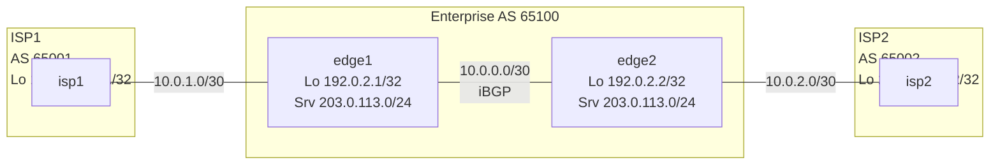

# BGP Namespace Lab

## Objective
Model a dual-homed enterprise (AS 65100) with two upstream providers (AS 65001 and AS 65002) using Linux network namespaces and FRRouting’s `bgpd`, then apply basic routing policy (LOCAL_PREF and MED) while validating iBGP and eBGP adjacencies.

## Topology


## Prerequisites
- Linux host with `iproute2`, `iputils-ping`, `traceroute` (optional), and `sysctl`.
- FRRouting installed with `zebra`, `bgpd`, and `vtysh`.
- Root privileges (use `sudo`).
- Basic familiarity with BGP attributes (`AS_PATH`, `LOCAL_PREF`, `MED`).

## Step 1: Build the Namespace Scaffold

```bash
cat <<'EOF' >/tmp/bgp_ns_setup.sh
#!/usr/bin/env bash
set -euo pipefail

for ns in edge1 edge2 isp1 isp2; do
  ip netns del "$ns" 2>/dev/null || true
done

ip netns add edge1
ip netns add edge2
ip netns add isp1
ip netns add isp2

ip link add e1e2 type veth peer name e2e1
ip link set e1e2 netns edge1
ip link set e2e1 netns edge2

ip link add e1isp1 type veth peer name isp1e1
ip link set e1isp1 netns edge1
ip link set isp1e1 netns isp1

ip link add e2isp2 type veth peer name isp2e2
ip link set e2isp2 netns edge2
ip link set isp2e2 netns isp2

for ns in edge1 edge2 isp1 isp2; do
  ip -n "$ns" link set lo up
done

ip -n edge1 addr add 10.0.0.1/30 dev e1e2
ip -n edge1 addr add 10.0.1.1/30 dev e1isp1
ip -n edge1 addr add 192.0.2.1/32 dev lo
ip -n edge1 addr add 203.0.113.1/24 dev lo
ip -n edge1 link set e1e2 up
ip -n edge1 link set e1isp1 up

ip -n edge2 addr add 10.0.0.2/30 dev e2e1
ip -n edge2 addr add 10.0.2.1/30 dev e2isp2
ip -n edge2 addr add 192.0.2.2/32 dev lo
ip -n edge2 addr add 203.0.113.2/24 dev lo
ip -n edge2 link set e2e1 up
ip -n edge2 link set e2isp2 up

ip -n isp1 addr add 10.0.1.2/30 dev isp1e1
ip -n isp1 addr add 198.51.100.1/32 dev lo
ip -n isp1 link set isp1e1 up

ip -n isp2 addr add 10.0.2.2/30 dev isp2e2
ip -n isp2 addr add 198.51.100.2/32 dev lo
ip -n isp2 link set isp2e2 up

for ns in edge1 edge2 isp1 isp2; do
  ip netns exec "$ns" sysctl -w net.ipv4.ip_forward=1 >/dev/null
done
EOF

sudo bash /tmp/bgp_ns_setup.sh
```

Validate the layout:

```bash
sudo ip netns list
sudo ip -n edge1 route show
```

## Step 2: Prepare FRRouting Baseline

```bash
sudo mkdir -p /var/log/frr
for ns in edge1 edge2 isp1 isp2; do
  sudo mkdir -p /etc/netns/$ns/frr
  cat <<EOF | sudo tee /etc/netns/$ns/frr/zebra.conf >/dev/null
hostname $ns-zebra
log file /var/log/frr/$ns-zebra.log
!
EOF
  echo "service integrated-vtysh-config" | sudo tee /etc/netns/$ns/frr/vtysh.conf >/dev/null
done

for ns in edge1 edge2 isp1 isp2; do
  sudo ip netns exec "$ns" zebra \
    -d \
    -f /etc/netns/$ns/frr/zebra.conf \
    -i /tmp/$ns-zebra.pid \
    -z /tmp/$ns-zebra.sock
done
```

## Step 3: Configure and Start BGP
Create `bgpd.conf` per namespace with appropriate ASNs, neighbors, and policies.

### Enterprise Edge 1 (AS 65100)
```bash
cat <<'EOF' | sudo tee /etc/netns/edge1/frr/bgpd.conf >/dev/null
hostname edge1-bgp
log file /var/log/frr/edge1-bgpd.log
router bgp 65100
 bgp router-id 192.0.2.1
 neighbor 10.0.0.2 remote-as 65100
 neighbor 10.0.0.2 description edge2-iBGP
 neighbor 10.0.1.2 remote-as 65001
 neighbor 10.0.1.2 description isp1-ebgp
 !
 address-family ipv4 unicast
  neighbor 10.0.0.2 activate
  neighbor 10.0.1.2 activate
  neighbor 10.0.0.2 next-hop-self
  network 203.0.113.0/24
 exit-address-family
!
ip prefix-list PUBLISH seq 5 permit 203.0.113.0/24
route-map PREFER-ISP1 permit 10
 set local-preference 200
route-map EXPORT-SERVICE permit 10
 match ip address prefix-list PUBLISH
!
router bgp 65100
 neighbor 10.0.1.2 route-map PREFER-ISP1 in
 neighbor 10.0.1.2 route-map EXPORT-SERVICE out
 neighbor 10.0.0.2 route-map EXPORT-SERVICE out
```

### Enterprise Edge 2 (AS 65100)
```bash
cat <<'EOF' | sudo tee /etc/netns/edge2/frr/bgpd.conf >/dev/null
hostname edge2-bgp
log file /var/log/frr/edge2-bgpd.log
router bgp 65100
 bgp router-id 192.0.2.2
 neighbor 10.0.0.1 remote-as 65100
 neighbor 10.0.0.1 description edge1-iBGP
 neighbor 10.0.2.2 remote-as 65002
 neighbor 10.0.2.2 description isp2-ebgp
 !
 address-family ipv4 unicast
  neighbor 10.0.0.1 activate
  neighbor 10.0.2.2 activate
  neighbor 10.0.0.1 next-hop-self
  network 203.0.113.0/24
 exit-address-family
!
ip prefix-list PUBLISH seq 5 permit 203.0.113.0/24
route-map TAG-ISP2 permit 10
 set metric 50
route-map EXPORT-SERVICE permit 10
 match ip address prefix-list PUBLISH
!
router bgp 65100
 neighbor 10.0.2.2 route-map TAG-ISP2 out
 neighbor 10.0.2.2 route-map EXPORT-SERVICE out
 neighbor 10.0.0.1 route-map EXPORT-SERVICE out
```

### ISP 1 (AS 65001)
```bash
cat <<'EOF' | sudo tee /etc/netns/isp1/frr/bgpd.conf >/dev/null
hostname isp1-bgp
log file /var/log/frr/isp1-bgpd.log
router bgp 65001
 bgp router-id 198.51.100.1
 neighbor 10.0.1.1 remote-as 65100
 neighbor 10.0.1.1 description edge1
 !
 address-family ipv4 unicast
  neighbor 10.0.1.1 activate
  network 198.51.100.1/32
 exit-address-family
!
```

### ISP 2 (AS 65002)
```bash
cat <<'EOF' | sudo tee /etc/netns/isp2/frr/bgpd.conf >/dev/null
hostname isp2-bgp
log file /var/log/frr/isp2-bgpd.log
router bgp 65002
 bgp router-id 198.51.100.2
 neighbor 10.0.2.1 remote-as 65100
 neighbor 10.0.2.1 description edge2
 !
 address-family ipv4 unicast
  neighbor 10.0.2.1 activate
  network 198.51.100.2/32
 exit-address-family
!
```

Start `bgpd` inside each namespace:

```bash
for ns in edge1 edge2 isp1 isp2; do
  sudo ip netns exec "$ns" bgpd \
    -d \
    -f /etc/netns/$ns/frr/bgpd.conf \
    -i /tmp/$ns-bgpd.pid \
    -z /tmp/$ns-zebra.sock \
    -A 127.0.0.1
done
```

## Step 4: Verify iBGP/eBGP Sessions and Policy
- Confirm session establishment:

  ```bash
  sudo ip netns exec edge1 vtysh -c "show ip bgp summary"
  sudo ip netns exec edge2 vtysh -c "show ip bgp summary"
  ```

- Inspect advertised/received routes and attributes:

  ```bash
  sudo ip netns exec edge1 vtysh -c "show ip bgp"
  sudo ip netns exec edge2 vtysh -c "show ip bgp neighbors 10.0.2.2 received-routes"
  sudo ip netns exec isp1 vtysh -c "show ip bgp neighbors 10.0.1.1 advertised-routes"
  ```

- Validate path selection and reachability:

  ```bash
  sudo ip netns exec isp1 ping -c3 203.0.113.1
  sudo ip netns exec edge2 traceroute -n 198.51.100.1
  sudo ip netns exec edge1 vtysh -c "show ip bgp 198.51.100.0/24"
  ```

- Policy checks:

  ```bash
  sudo ip netns exec edge1 vtysh -c "show ip bgp neighbors 10.0.1.2 routes detail"
  sudo ip netns exec edge2 vtysh -c "show ip bgp 0.0.0.0/0"
  ```

- Optional debugging:

  ```bash
  sudo ip netns exec edge1 tcpdump -n -i e1isp1 port 179
  ```

## Step 5: Cleanup

```bash
for ns in edge1 edge2 isp1 isp2; do
  sudo ip netns exec "$ns" pkill -f bgpd || true
  sudo ip netns exec "$ns" pkill -f zebra || true
  sudo ip netns del "$ns"
done

sudo rm -rf /etc/netns/{edge1,edge2,isp1,isp2}
sudo rm -f /tmp/*-bgpd.pid /tmp/*-zebra.pid /tmp/*-zebra.sock
```

## Extensions
- Introduce route reflectors by adding a third enterprise namespace and enabling `neighbor … route-reflector-client` on edge1.
- Experiment with BGP communities: add `set community 65001:100 additive` in `EXPORT-SERVICE` and filter on ISP routers.
- Add a simulated failure (bring down `e1isp1`) and observe how LOCAL_PREF steers traffic through ISP2; modify MED on edge2 to influence inbound routing from ISP2.
