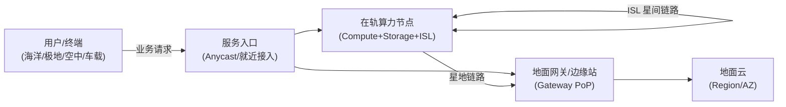
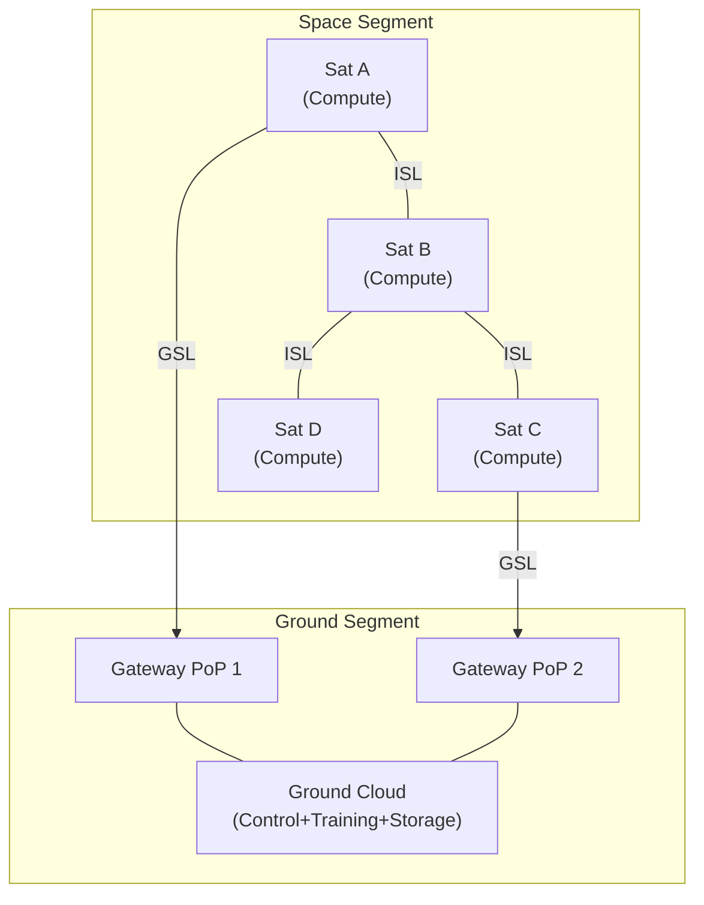
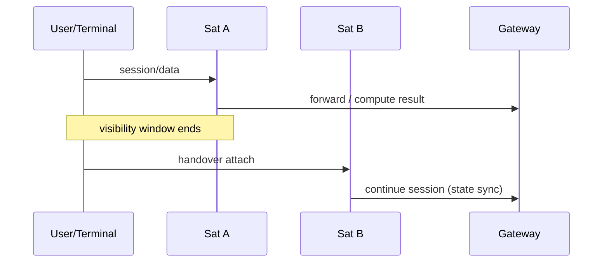
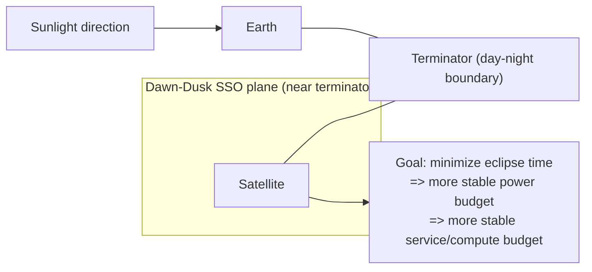
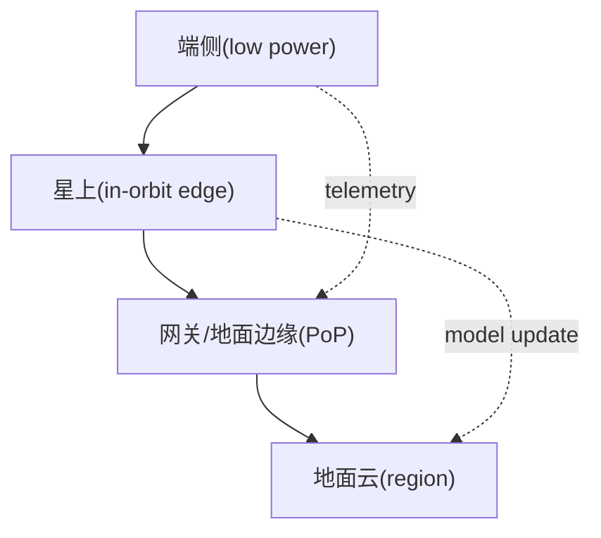

# 算力星座：云网融合的下一跳

> 关键词：在轨计算、卫星网络、可预测拓扑、边云协同、拓扑感知分布式框架  
> 建议课前阅读（可选）：`docs/network_impact_distributed_frameworks.md`、`docs/topology_aware_distributed_framework.md`

---

## 1. 引入：什么是“算力星座”？

“算力星座”可以理解为：**具有通信能力 + 计算/存储能力 + 可编排能力**的一组卫星与地面节点，目标不是只“转发比特”，而是能在网络路径上就地处理数据、部署服务、形成端到端的云网协同能力。

与传统卫星通信系统相比，关键变化：
- 从“以链路为中心”变成“以服务为中心”：服务可能在轨部署、迁移、扩缩容。
- 从“网络不可控”变成“拓扑可预测”：轨道决定连接关系随时间演化（可提前计算）。
- 从“单点链路优化”变成“系统级优化”：调度/路由/缓存/一致性共同决定体验。

> “算力星座”更像“云的延伸”还是“网络设备的升级”？为什么？

---

## 2. 算力上星：为什么、怎么上、上什么

### 2.1 为什么要把算力放到星上？

典型动机（从“云网融合”的视角）：
- **覆盖与时延**：偏远区域只有卫星可达；在轨处理可减少回传、降低端到端时延与抖动。
- **带宽成本**：把原始数据回传地面很贵；在轨做压缩、筛选、特征提取可显著降流量。
- **实时性与自治**：灾害、军事、海洋等场景强调“断网可用”；在轨可本地闭环。
- **数据主权与隐私**：敏感数据不落地或只落地摘要/模型更新。

### 2.2 上星算力的工程约束（与地面边缘不同）

在轨算力不是“把服务器搬上去”，核心约束包括：
- **能耗与供电**：太阳能/电池，功耗预算严格；高峰与阴影期差异大。
- **散热条件**：真空环境主要靠辐射散热，热设计与功耗紧耦合。
- **可靠性与维护**：难以现场维修；容错、降级、远程升级必须体系化。
- **辐射与器件选择**：抗辐照（rad-hard）与商规器件（COTS）之间的成本/性能权衡。
- **上行/下行窗口**：对地链路可能间歇可用；需要“断连友好”的控制与数据策略。

### 2.3 “上什么计算”更现实？

从易到难（也从“收益更确定”到“挑战更大”）：
- **数据预处理**：去噪/压缩/抽帧/目标检测，输出“信息”而非“原始数据”。
- **缓存与内容分发**：热点内容在轨缓存，减少跨链路回源。
- **事件触发型计算**：只在观测到事件时上报/联动，降低持续回传。
- **协同推理**：端-星-地分层推理（early-exit、分层模型）。
- **在轨训练/联邦学习**：可做，但对带宽、同步与稳定性要求高，需要强烈的系统设计。

思考题：
- 哪类任务最适合“在轨算力”？请从 `D/B`（数据量/带宽）与 `L`（时延）角度各举一个例子。

---

## 3. 算力星如何互联：从链路到网络

算力星座的互联通常包含两类链路：
- **星地链路（GSL）**：卫星 ↔ 网关/地面站 ↔ 地面互联网/专网
- **星间链路（ISL）**：卫星 ↔ 卫星（同轨道面内、跨轨道面）

### 3.1 星间链路（ISL）的意义

没有 ISL 时：很多业务必须“星→地→地面骨干→地→星”，路径长、依赖网关密度。  
有 ISL 后：可以形成“在轨骨干网”，实现：
- 更短路径（更少落地与汇聚点）
- 网关稀疏地区的可达性增强
- 业务与控制面可在轨闭环（部分自治）

### 3.2 时变拓扑与切换（handover）

卫星与用户/网关的可见性随时间变化，连接关系发生切换：
- 终端侧：从 `Sat A` 切到 `Sat B`
- 网关侧：从 `GW1` 切到 `GW2`
- ISL 侧：邻接关系随轨道面与姿态变化而变化（取决于星座设计）

### 3.3 控制面与数据面：需要“断连友好”

在轨网络的控制与编排通常要面对：
- 控制消息的高 RTT/间歇可达
- 状态同步的延迟与不一致
- 升级/回滚/审计的困难

工程上常见做法（概念层面）：
- 控制面“慢而可靠”：版本化配置、幂等下发、灰度窗口
- 数据面“快而可降级”：缓存命中优先、路径失败快速绕行、服务降级策略

> 你更倾向把“服务状态”放在星上还是地面？为什么？（提示：一致性、可达性、故障域）

---

## 4. 算力星座的轨道特点：网络为何“可预测但不稳定”

### 4.1 常见轨道壳层

- **LEO（低轨）**：高度低、覆盖窗口短、切换频繁，但更接近用户、传播时延更小  
- **MEO（中轨）**：覆盖与时延折中，星数较少  
- **GEO（地球同步）**：覆盖稳定、切换少，但传播时延大

轨道越高：
- 覆盖越稳定，但传播时延越大
- 星座规模越小，但单链路代价越高

### 4.2 晨昏太阳同步轨道（Dawn-Dusk SSO）：为什么它对“算力上星”的电力很关键

算力上星最直接的系统问题之一就是**电力**：高峰算力需求往往意味着更高功耗，而在轨供电受太阳能与电池容量强约束；一旦进入日食（eclipse）窗口，系统会进入“能量紧缩模式”，可用算力与可用带宽可能需要同步降级。

这里需要区分两个概念：
- **太阳同步轨道（SSO）**：轨道平面随时间进动，使卫星在地面上的过境保持近似固定的“当地太阳时”（便于成像光照条件一致）。
- **晨昏太阳同步轨道（Dawn-Dusk SSO）**：SSO 的一种特殊取向，使轨道平面接近地球晨昏线（terminator，昼夜分界线），从而**显著减少甚至在相当长时间内避免进入地球阴影**，获得更稳定的太阳能供给窗口。

> 说明：严格意义上，“只有 SSO 才能不中断供电”并不准确；更准确的结论是：**晨昏 SSO 更容易获得近连续光照**，从工程上显著简化“持续供电 + 热控”的设计，但是否“完全无日食”仍与轨道几何（如 beta 角、季节）相关。

对“算力星座”的直接影响（把轨道约束映射到云网融合问题）：
- **算力预算更稳定**：更少/更短的日食期意味着计算/存储/链路可持续工作时间更长，调度不必频繁进入“节电降级”。
- **热控与性能耦合更强**：更稳定的照射条件也意味着热环境更可预测，但散热依然困难，可能需要对高功耗任务做时间片/窗口化运行。
- **网络侧的机会与约束并存**：极轨/近极轨特性带来高纬覆盖优势，但也意味着星地可见窗口、网关分布与回传策略需要围绕轨道几何设计。

课堂提问：
- 如果把星上算力当作“可抢占资源”，你会如何设计任务优先级与降级策略来适配日食窗口（或电量不足）？

### 4.3 “可预测拓扑”的机会

与数据中心不同，卫星网络的拓扑随时间变化，但变化规律可由轨道预测：
- 可提前计算未来 T 分钟/小时的“连接矩阵”
- 可进行**前瞻调度**：提前迁移服务、预取数据、选择未来更优的网关

### 4.4 “不稳定”的根源（网络表现会有长尾）

即使拓扑可预测，链路质量仍会波动：
- 星地链路受气象、遮挡、地面站拥塞影响
- 切换过程出现短时中断/重路由
- ISL/节点资源竞争导致排队时延上升（长尾放大）

连接到前面课程内容：
- 仍可用一阶模型理解通信： $T\approx L + D/B$
- 但尾延迟会放大全局同步点（Barrier / Checkpoint / Iteration）的耗时

思考题：
- “可预测拓扑”能否完全消除长尾？如果不能，你会在哪个层面做兜底（路由、调度、应用协议）？

---

## 5. 算力星座如何提供服务：从“链路”到“产品”

### 5.1 服务分层：端-星-地协同

一个常见的服务分层视角：
- **端侧**：最贴近用户、资源最弱，但交互最实时
- **星上**：覆盖广、可就地处理，但资源有限且运行环境苛刻
- **地面边缘/网关**：资源较强，靠近星地汇聚点，可做状态汇聚与缓存
- **地面云**：资源最强，适合大规模存储、训练、离线分析与全局控制

### 5.2 典型服务形态

- **在轨推理服务**：目标检测/语义分割/异常识别，输出事件与摘要
- **在轨缓存/分发**：热点内容在轨缓存，降低跨链路回源与抖动
- **在轨数据中继 + 处理**：边采边算，减少回传压力
- **时空数据服务**：轨道决定“时空覆盖”，服务质量与时间/位置强相关

### 5.3 SLA 与可观测性：更需要“分层指标”

建议用分层指标让学生建立观念：
- 链路层：RTT、丢包、吞吐、切换次数
- 服务层：P50/P90/P99 时延、可用率、抖动、失败重试
- 资源层：星上算力占用、能耗预算、存储命中率

课堂提问：
- 对“在轨推理服务”，你更看重 P99 时延还是可用率？不同业务（应急/娱乐）答案会不同吗？

---

## 6. 分布式计算框架如何适应并利用卫星网络提升服务质量

可将之前“网络影响分布式框架”和“拓扑感知”的内容迁移到卫星网络语境：**网络不是透明的，且更时变；但它可预测，因此也更可利用。**

### 6.1 适应：让框架在“高 RTT + 时变拓扑 + 间歇可达”下可用

常见设计模式（不依赖特定框架）：
- **异步优先**：尽量避免全局同步点；允许结果延后收敛（eventual consistency）。
- **分层聚合**：端侧/星上先聚合，再回传地面（类似机架内聚合后跨机架）。
- **容忍断连**：采用缓冲队列、幂等写入、重放日志、DTN 思路的 store-and-forward。
- **把状态“变小”**：传摘要/特征/模型增量，避免传原始大对象。

对应到简单模型：让系统更少落入“带宽瓶颈”和“同步长尾”两类失败模式。

### 6.2 利用：把“可预测拓扑”变成调度与路由的先验

可预测带来的机会：
- **前瞻放置**：把即将进入覆盖窗口的服务提前部署到相关卫星/网关
- **预取与缓存**：根据轨道与访问热度，提前把内容/模型分发到将要服务的区域
- **路径选择带时间维度**：选择“未来更稳”的网关/路径，而不是只看当前最短

### 6.3 框架层的关键改造点（讨论清单）

把“通用分布式框架”迁移到算力星座，通常要改/补的能力：
- **拓扑服务（Topology Service）**：提供 `G(t)`（随时间变化的邻接、RTT、带宽等级）
- **任务/服务编排的时间维度**：调度决策要带“未来窗口”，不是静态集群
- **状态管理与一致性策略**：弱一致 + 冲突解决（CRDT/版本向量/幂等写入）更常用
- **通信协议与拥塞控制策略**：更重视抖动与长尾（限速、并发控制、批量传输）
- **观测与回放**：记录“拓扑版本 + 决策 + 结果”，便于复盘与改进

### 6.4 在轨训练/联邦学习到底可不可行？

- 难点 1：同步很贵（AllReduce/Barrier 在高 RTT 下放大）  
  对策：分层聚合、局部 SGD、异步/部分同步、稀疏更新
- 难点 2：链路间歇可达（窗口外无法通信）  
  对策：窗口内批量传输、断连缓冲、延迟容忍的调度
- 难点 3：星上资源受限（功耗/散热/可靠性）  
  对策：在轨轻量更新、混合精度、把训练重活留在地面云

> 选择一个框架（Spark/Flink/Ray/PS/AllReduce 任意），指出它在算力星座上最先遇到的 3 个系统性问题，并给出对应的“可落地”改造方向。

---

## 7. 小结

1. 算力星座 = 通信 + 计算/存储 + 编排：从“转发”走向“服务”。
2. 在轨算力受能耗/散热/可靠性强约束，最先落地的是“压缩/筛选/推理/缓存”等任务。
3. 星间链路让星座成为“在轨骨干网”，但拓扑是时变的，需要切换与重路由能力。
4. 轨道让拓扑“可预测”，这既是挑战（时变）也是优势（可前瞻优化）。
5. 服务交付要端-星-地分层设计，用分层指标管理 SLA。
6. 分布式框架要“拓扑感知 + 断连友好 + 异步/分层聚合”，把 `G(t)` 当成一等公民。

---

## 8. 思考题

1. 哪些服务必须“上星算”？哪些服务“落地算”更合理？请用 `L` 与 `D/B` 各给一个判断理由。  
2. 如果只允许你实现一个能力来提升体验：拓扑服务、缓存、还是调度器网络评分？你选哪个，为什么？  
3. 可预测拓扑能做哪些“提前量”优化（至少 3 个）？它们分别在控制面还是数据面实现更合适？  
4. 你如何定义并测量算力星座的 QoS/QoE？给出至少 5 个指标，并说明它们属于哪一层（链路/服务/资源）。  
