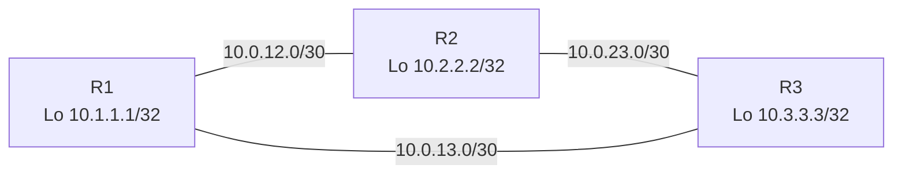

# EIGRP Namespace Lab

## Objective
Explore EIGRP’s Diffusing Update Algorithm (DUAL) using a three-router triangle inside Linux network namespaces with FRRouting’s `eigrpd`, then inspect successor and feasible-successor paths while validating convergence.

## Topology


## Prerequisites
- Linux host with `iproute2`, `iputils-ping`, and `sysctl`.
- FRRouting installed with `zebra`, `eigrpd`, and `vtysh`.
- Root privileges (use `sudo`).

## Step 1: Build the Namespace Scaffold

```bash
cat <<'EOF' >/tmp/eigrp_ns_setup.sh
#!/usr/bin/env bash
set -euo pipefail

for ns in r1 r2 r3; do
  ip netns del "$ns" 2>/dev/null || true
done

ip netns add r1
ip netns add r2
ip netns add r3

ip link add r1r2 type veth peer name r2r1
ip link set r1r2 netns r1
ip link set r2r1 netns r2

ip link add r2r3 type veth peer name r3r2
ip link set r2r3 netns r2
ip link set r3r2 netns r3

ip link add r1r3 type veth peer name r3r1
ip link set r1r3 netns r1
ip link set r3r1 netns r3

for ns in r1 r2 r3; do
  ip -n "$ns" link set lo up
done

ip -n r1 addr add 10.0.12.1/30 dev r1r2
ip -n r1 addr add 10.0.13.1/30 dev r1r3
ip -n r1 addr add 10.1.1.1/32 dev lo
ip -n r1 link set r1r2 up
ip -n r1 link set r1r3 up

ip -n r2 addr add 10.0.12.2/30 dev r2r1
ip -n r2 addr add 10.0.23.1/30 dev r2r3
ip -n r2 addr add 10.2.2.2/32 dev lo
ip -n r2 link set r2r1 up
ip -n r2 link set r2r3 up

ip -n r3 addr add 10.0.23.2/30 dev r3r2
ip -n r3 addr add 10.0.13.2/30 dev r3r1
ip -n r3 addr add 10.3.3.3/32 dev lo
ip -n r3 link set r3r2 up
ip -n r3 link set r3r1 up

for ns in r1 r2 r3; do
  ip netns exec "$ns" sysctl -w net.ipv4.ip_forward=1 >/dev/null
done
EOF

sudo bash /tmp/eigrp_ns_setup.sh
```

Check status:

```bash
sudo ip netns list
sudo ip -n r2 route show
```

## Step 2: Prepare FRRouting Baseline

```bash
sudo mkdir -p /var/log/frr
for ns in r1 r2 r3; do
  sudo mkdir -p /etc/netns/$ns/frr
  cat <<EOF | sudo tee /etc/netns/$ns/frr/zebra.conf >/dev/null
hostname $ns-zebra
log file /var/log/frr/$ns-zebra.log
!
EOF
  echo "service integrated-vtysh-config" | sudo tee /etc/netns/$ns/frr/vtysh.conf >/dev/null
done

for ns in r1 r2 r3; do
  sudo ip netns exec "$ns" zebra \
    -d \
    -f /etc/netns/$ns/frr/zebra.conf \
    -i /tmp/$ns-zebra.pid \
    -z /tmp/$ns-zebra.sock
done
```

## Step 3: Configure and Start EIGRP
EIGRP requires explicit autonomous-system IDs and router IDs. Create per-router configs (AS 100):

```bash
cat <<'EOF' | sudo tee /etc/netns/r1/frr/eigrpd.conf >/dev/null
hostname r1-eigrp
log file /var/log/frr/r1-eigrpd.log
router eigrp 100
 eigrp router-id 1.1.1.1
 network 10.0.12.0/30
 network 10.0.13.0/30
 network 10.1.1.1/32
 passive-interface lo
 no auto-summary
!
EOF

cat <<'EOF' | sudo tee /etc/netns/r2/frr/eigrpd.conf >/dev/null
hostname r2-eigrp
log file /var/log/frr/r2-eigrpd.log
router eigrp 100
 eigrp router-id 2.2.2.2
 network 10.0.12.0/30
 network 10.0.23.0/30
 network 10.2.2.2/32
 passive-interface lo
 no auto-summary
!
EOF

cat <<'EOF' | sudo tee /etc/netns/r3/frr/eigrpd.conf >/dev/null
hostname r3-eigrp
log file /var/log/frr/r3-eigrpd.log
router eigrp 100
 eigrp router-id 3.3.3.3
 network 10.0.23.0/30
 network 10.0.13.0/30
 network 10.3.3.3/32
 passive-interface lo
 no auto-summary
!
EOF
```

Launch `eigrpd` daemons:

```bash
for ns in r1 r2 r3; do
  sudo ip netns exec "$ns" eigrpd \
    -d \
    -f /etc/netns/$ns/frr/eigrpd.conf \
    -i /tmp/$ns-eigrpd.pid \
    -z /tmp/$ns-zebra.sock \
    -A 127.0.0.1
done
```

## Step 4: Verify DUAL Behavior
- Observe neighbors and topology tables:

  ```bash
  sudo ip netns exec r1 vtysh -c "show ip eigrp neighbors"
  sudo ip netns exec r2 vtysh -c "show ip eigrp topology"
  sudo ip netns exec r3 vtysh -c "show ip route eigrp"
  ```

- Trigger a convergence event by taking one link down:

  ```bash
  sudo ip -n r2 link set r2r3 down
  sudo ip netns exec r1 vtysh -c "show ip eigrp topology"
  sudo ip -n r2 link set r2r3 up
  ```

- Confirm reachability through alternative successors:

  ```bash
  sudo ip netns exec r1 ping -c3 10.3.3.3
  sudo ip netns exec r3 traceroute -n 10.1.1.1
  ```

- Optional debugging:

  ```bash
  sudo ip netns exec r2 tcpdump -n -i r2r1 proto 88
  ```

## Step 5: Cleanup

```bash
for ns in r1 r2 r3; do
  sudo ip netns exec "$ns" pkill -f eigrpd || true
  sudo ip netns exec "$ns" pkill -f zebra || true
  sudo ip netns del "$ns"
done

sudo rm -rf /etc/netns/r{1,2,3}
sudo rm -f /tmp/r*-eigrpd.pid /tmp/r*-zebra.pid /tmp/r*-zebra.sock
```

## Extensions
- Adjust interface bandwidth using `ip -n <ns> link set <if> txqueuelen` and `tc qdisc change` commands, then compare the resulting composite metrics.
- Configure `variance 2` on `r1` and add a higher-metric parallel link to observe unequal-cost load sharing.
- Enable authenticated adjacencies by adding `key-chain` definitions and `ip authentication mode eigrp` statements on each interface.
