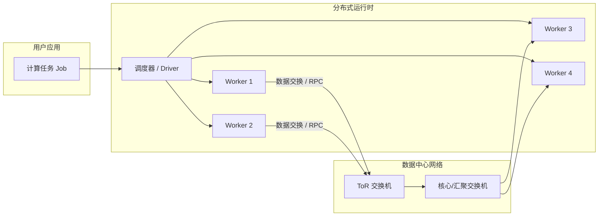
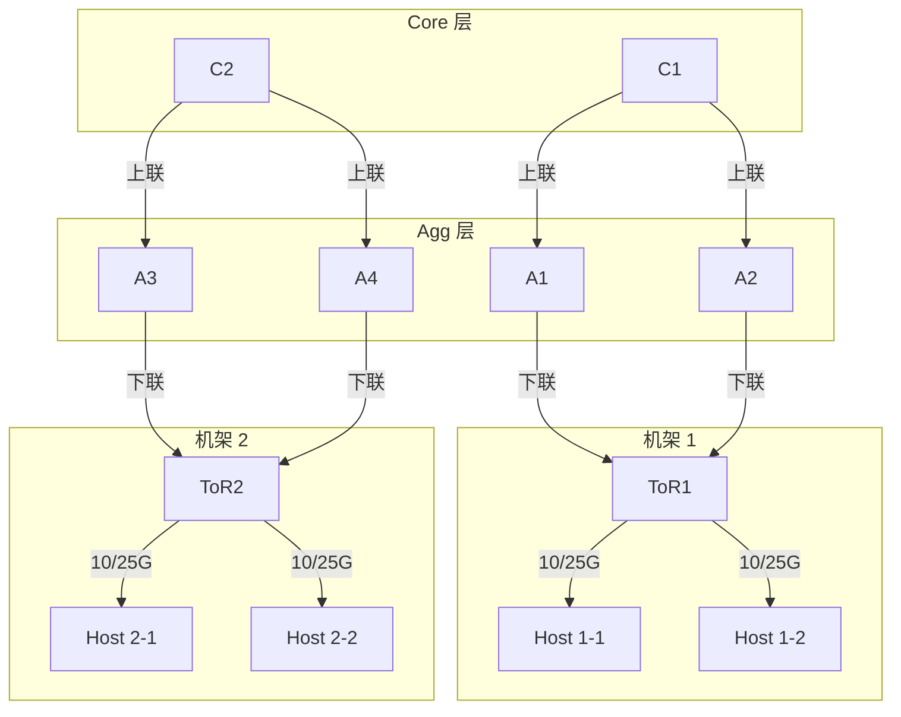
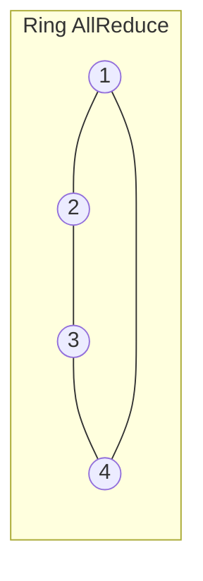
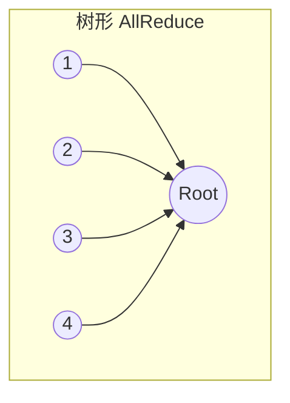
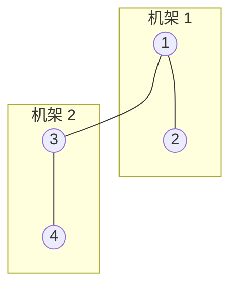

# 网络对于分布式计算框架的影响

> 说明：本讲重点讨论网络特性（延迟、带宽、拓扑）如何限制或提升分布式计算框架（Spark / Flink / Parameter Server / AllReduce 等）的性能。

## 0. 导航与结构

- 第 1 部分：引言——为什么“算得快”不如“传得好”
- 第 2 部分：网络性能指标与简单性能模型
- 第 3 部分：网络延迟对分布式框架的影响
- 第 4 部分：网络拓扑对分布式框架的影响
- 第 5 部分：小实验与代码示例
- 第 6 部分：工程实践建议与研究前沿
- 第 7 部分：小结与思考题

---

## 1. 引言：为什么“算得快”不如“传得好”

### 1.1 一个直观例子

设想有一个 100 节点的 Spark 集群，CPU 已经从 8 核升级到 32 核，但网络仍然是传统的 1 Gbps 以太网：

- Shuffle 阶段需要在节点间传输数百 GB 数据；
- 每个 Stage 在逻辑上是“所有 Task 都完成后才能继续”，即存在 **全局同步点**；
- 单个 Task 只要有一台机器的网络延迟/带宽表现很差，就会拖慢整个 Stage —— 即所谓 **长尾延迟 (tail latency)** 问题。

现实中，大规模在线服务也是如此：少数慢请求的长尾行为决定整体系统的 P99/P999 延迟。

> 你会优先升级哪一部分：CPU、磁盘，还是网络？为什么？

### 1.2 分布式计算框架与网络的耦合

典型分布式计算框架：

- 批处理：Hadoop MapReduce、Spark
- 流处理：Storm、Flink
- 分布式机器学习：Parameter Server（PS）、图计算框架、AllReduce（如 Horovod、PyTorch DDP 等）

共同特点：

- 任务被拆分到多台机器（worker）；
- 中间结果通过 **网络** 交换；
- 通常存在某种形式的同步（barrier / iteration / checkpoint）。

因此，网络层面的三个问题会直接影响框架性能：

1. **延迟 (latency)**：一次 RPC / 小包往返需要多长时间；
2. **带宽 (bandwidth)**：单位时间可传多少数据；
3. **拓扑 (topology)**：哪些节点之间“近”（高带宽低延迟），哪些“远”。

下图为“应用—框架—网络”的整体视图。



---

## 2. 网络性能指标与简单性能模型

### 2.1 基本网络指标

常用指标：

- **单向 / 往返延迟 $L$**：一个小包从 A 到 B（或 A 往返 A）的时间；
- **带宽 $B$**：单位时间内可传输的数据量，一般用 Gbps、Gb/s 表示；
- **抖动 (jitter)**：延迟的波动程度；
- **丢包率 $p$**：一定时间内丢失的包占比；
- **拥塞程度**：排队时延 + 重传次数。

在很多分布式框架中，通信开销可以粗略拆成两部分：

- 固定开销（建立连接、协议栈、系统调用等）：与包大小无关；
- 传输开销（排队 + 在线路上“飞行”的时间）：与数据大小成正比。

一个常见的一阶模型：

$$
T_\text{comm} \approx L + \frac{D}{B}
$$

其中：

- $T_\text{comm}$：一次通信的时间；
- $L$：与包大小弱相关的固定延迟；
- $D$：传输的数据量（bit 或 byte）；
- $B$：有效带宽（同单位下）。

### 2.2 作业级别的时间分解模型

对于一个分布式 Job，总运行时间可以粗略写成：

$$
T_\text{job} = T_\text{comp} + T_\text{comm}
$$

进一步拆分：

$$
T_\text{comm} = \sum_{k=1}^{K} \left( L_k + \frac{D_k}{B_k} \right)
$$

- $K$：通信轮次（如迭代次数、Barrier 次数、Shuffle 轮数等）；
- $L_k, D_k, B_k$：第 $k$ 轮的延迟、数据量、带宽。

理想加速比：

$$
S(p) = \frac{T_1}{T_p}
$$

但实际的 $T_p$ 中，通信部分经常 **随节点数 $p$ 增长而变大**（更多的 shuffle pair、更严重的网络拥塞等），导致实际加速远低于线性。

> 如果将网络从 1 Gbps 升级到 25 Gbps，但延迟不变，你能给出一个简单的估算：对 IO 绑定的作业和计算绑定的作业各有什么影响？

---

## 3. 网络延迟对分布式框架的影响

### 3.1 批处理框架：MapReduce / Spark

#### 3.1.1 Stage + Shuffle + Barrier

Spark 的执行模型可以简化为一系列 Stage，每个 Stage 内部是多个 Task 并行执行，Stage 之间通过 Shuffle 传递数据。

- Stage 内：Task 之间通常互不通信；
- Stage 间：存在全局 Barrier，必须所有上一 Stage 的 Task 全部完成；
- Shuffle：中间结果通过网络做 All-to-All 传输。

令第 $i$ 个 Stage 的完成时间为：

$$
T_i = \max_{j} t_{i,j}
$$

- $t_{i,j}$：第 $i$ 个 Stage 中第 $j$ 个 Task 的完成时间（包含计算 + 网络读写）。

单机“慢”任务（慢磁盘/慢 GC/慢网络）会直接拉长 $\max_j t_{i,j}$，这就是 Spark 中的 **Straggler** 问题，与“长尾延迟”思想一致。

Shuffle 阶段的网络时间可近似写成：

$$
T_\text{shuffle} \approx L + \frac{D_\text{shuffle}}{B_\text{eff}}
$$

其中 $B_\text{eff}$ 通常远低于链路物理带宽，取决于：

- 链路的**利用率**（多租户共享）；
- 拓扑的**过订阅比**（第 4 节讨论）；
- 协议栈和应用实现。

#### 3.1.2 延迟放大示例（思路）

假设：

- 一个 Job 有 5 个 Stage，每个 Stage 包含一次 shuffle；
- 每次 shuffle 需要 2s 的纯数据传输时间；
- 固定延迟（Barrier + RPC + 调度）为 50ms。

则每个 Stage 的网络部分约为：

$$
T_{\text{net}, i} \approx 0.05\ \text{s} + 2\ \text{s}
$$

如果由于网络抖动，长尾 Task 的延迟增加 200ms，那么每个 Stage 的时间都会增加 200ms，5 个 Stage 总共多出 1s。

> 实际集群中，可以用哪些指标监控“网络导致的 Straggler”？  
> 如：Task 的 shuffle read time 分布、GC time vs. 网络 time、P95/P99 延迟等。

#### 3.1.3 一个简单的 Spark 代码示例

```scala
// 伪代码示例，仅展示思路
val sc = spark.sparkContext

// 产生 1 亿个 (key, value)，key 个数较少（产生大量 shuffle）
val n = 100000000
val numKeys = 1000

val rdd = sc.parallelize(1 to n, numSlices = 400)
  .map { i =>
    val k = i % numKeys
    (k, 1L)
  }

// 一个典型的 shuffle 操作：按 key 聚合
val t0 = System.nanoTime()
val result = rdd.reduceByKey(_ + _).collect()
val t1 = System.nanoTime()

println(s"Job time = ${(t1 - t0) / 1e3 / 1e6} ms")
```

可以在不同网络条件下（如同机、跨机、跨机房）运行，观察 Job time 的变化。

---

### 3.2 流处理框架：Flink / Storm

流处理框架的特点：

- 需要**低延迟**处理事件；
- 常用 **有状态算子** 和 **窗口操作**；
- 通常以长时间运行的拓扑（DAG）形式存在。

网络延迟对流处理的几点影响：

1. **端到端延迟**：事件从 Source 到 Sink 的时间增加；
2. **乱序与 watermark**：延迟增加可能导致事件到达顺序更乱，需要更大的 watermark 延迟，进而增加窗口等待时间；
3. **Checkpoint/Savepoint 延迟**：Flink 需要周期性做分布式 checkpoint，网络延迟会拉长 checkpoint 完成时间，甚至阻塞数据流。

一个简单的抽象模型：

- 设每个算子处理时间为 $t_\text{op}$；
- 邻近算子之间网络延迟为 $L_{i \to j}$；
- 一个由 $m$ 个算子串联的 pipeline，其端到端底线延迟约为：

$$
T_\text{e2e} \gtrsim \sum_{k=1}^{m} t_{\text{op},k} + \sum_{k=1}^{m-1} L_{k \to k+1}
$$

> 可以尝试画出一个简单的 Flink 作业 DAG，并估算在 1ms / 5ms / 10ms 链路延迟下的端到端延迟。

---

### 3.3 分布式机器学习：Parameter Server 与 AllReduce

在分布式机器学习中，一次 **训练迭代** 既包含计算也包含通信。

#### 3.3.1 Parameter Server（PS）架构

典型 Parameter Server 结构：

- Worker：负责前向 + 反向计算，产生梯度 $g_i$；
- Server：维护全局参数 $w$；
- 每个迭代：
  - Worker 发送梯度：$g_i \to \text{Server}$；
  - Server 聚合并更新：$w \gets w - \eta \sum_i g_i$；
  - 新参数广播给 Worker。

一轮同步迭代的时间近似为：

$$
T_\text{iter} \approx \max_i T_{\text{comp}, i} + T_\text{push} + T_\text{pull}
$$

其中：

$$
T_\text{push} \approx L + \frac{|g|}{B}
,\quad
T_\text{pull} \approx L + \frac{|w|}{B}
$$

- $|g|$：梯度大小；
- $|w|$：模型参数大小（有些系统只下发增量）。

可以看到：

- 大模型（ $|g|$ 和 $|w|$ 很大）对带宽极度敏感；
- 大量 Worker 并发时，PS 端容易成为瓶颈（集中式汇聚 + 单点热点）。

#### 3.3.2 AllReduce：Ring AllReduce 模型

Horovod 等框架采用 AllReduce 来做分布式数据并行训练，常见实现是 **Ring AllReduce**：

- 将 $p$ 个节点组成一个环；
- 把向量 $g$ 划分成 $p$ 个分块，每轮发送和接收一块；
- 经过若干轮后，每个节点都拿到全局聚合结果。

经典分析给出的 Ring AllReduce 时间开销：

$$
T_\text{allreduce} \approx 2 (p - 1) L + 2 \frac{p - 1}{p} \frac{|g|}{B}
$$

- 第一项： $2(p-1)L$ 来自 scatter-reduce 和 allgather 两个阶段的启动延迟；
- 第二项：通信数据量按环结构分摊。

可以归纳出：

- 当 $p$ 增大时，延迟项线性增加；
- 当 $|g|$ 很大时，即使带宽很高，通信时间依然显著。

#### 3.3.3 小结：延迟对 ML 框架的典型影响

- 同步 SGD：被最慢的 Worker 决定，长尾延迟非常关键；
- 异步 SGD / Stale Synchronous：牺牲部分收敛特性来换取对延迟的鲁棒性；
- 混合并行（数据 + 模型 + 张量切分）：通信模式更复杂，对网络拓扑更敏感。

---

## 4. 网络拓扑对分布式框架的影响

本节从数据中心网络拓扑入手，讨论“谁离谁更近”对性能的影响。

### 4.1 数据中心典型拓扑

常见拓扑：

1. **传统三层树形拓扑**：接入层 / 汇聚层 / 核心层，通常存在较高过订阅比；
2. **Fat-Tree / Clos 拓扑**：使用大量低端口数交换机，通过 Clos 结构构成近似全互连，提供高 bisection 带宽；
3. **更复杂拓扑**：如 Dragonfly、Jellyfish 等，追求更高带宽/更低直径。

下面给出一个简化的 Fat-Tree/Clos 拓扑示意图：



从分布式计算框架的角度，可以定义两类链路：

- **机架内**：Host–ToR 链路，通常带宽高、延迟低；
- **机架间**：需要经由 Agg/Core，可能存在过订阅和拥塞。

### 4.2 Shuffle / AllReduce 流量与拓扑的耦合

#### 4.2.1 简单案例：跨机架 Shuffle

设有两个机架，每个机架 4 台机器，ToR–Agg 带宽为 40 Gbps，Agg–Core 为 40 Gbps，ToR–Host 为 25 Gbps，过订阅比大于 1。

若一个 Spark Job 的 shuffle 主要发生在机架内，则瓶颈在 Host–ToR；若发生在机架之间，则 Agg/Core 容易成为瓶颈。

- **拓扑感知调度**：在可行范围内，将上游和下游 Task 尽量调度到同一机架；
- **数据本地性 (data locality)**：尽量在数据所在的机架/节点上计算，减少跨机架流量。

#### 4.2.2 AllReduce：Ring vs. Tree vs. Hierarchical

不同 AllReduce 拓扑在真实网络中的差异：

- **Ring**：实现简单，带宽利用率高，但所有节点单链路串联，对单边链路延迟/拥塞敏感；
- **Tree / Binary Tree**：可以降低延迟层数，但上层节点成为带宽集中点；
- **Hierarchical AllReduce**：先在机架内做 ring 或 tree 聚合，再在机架间做第二级 AllReduce，能够更好地利用拓扑结构。

三种结构的示意图：







> 给定一个真实数据中心拓扑，你会如何选择 AllReduce 拓扑？是否需要为不同 Job 使用不同策略？

### 4.3 拓扑感知的任务调度与算子划分

一些框架/系统工作提出：

- **拓扑感知调度器**：在调度 Task 时，考虑节点之间的距离和链路负载，而不仅仅是 CPU / 内存；
- **算子划分与贴合**：把通信量大的算子（如 join / shuffle-heavy 算子）尽量放在**网络邻近**的节点上；
- **网络—计算协同优化**：例如，Parameter Server 的 Server 放在高带宽、低延迟的节点上，或者靠近 GPU 服务器。

---

## 5. 小实验与代码示例

本节提供几个简单的实验思路与示例代码，方便在实验课中使用。

### 5.1 asyncio 模拟 barrier + 延迟

下面的 Python 脚本使用 `asyncio` 模拟 $p$ 个 worker，在每一轮迭代中包含“计算 + barrier 通信”两个阶段，通过改变 barrier 延迟来观察整体时间变化。

```python
# 文件：barrier_sim.py
import asyncio
import random
import time

async def worker(i: int, barrier_delay_ms: float):
    # 计算阶段：50~150ms 随机
    comp = random.uniform(50, 150) / 1000.0
    await asyncio.sleep(comp)

    # 通信阶段：模拟 barrier / AllReduce 的网络延迟
    await asyncio.sleep(barrier_delay_ms / 1000.0)

async def run_round(p: int, barrier_delay_ms: float) -> float:
    t0 = time.time()
    await asyncio.gather(*(worker(i, barrier_delay_ms) for i in range(p)))
    t1 = time.time()
    return (t1 - t0) * 1000  # 返回毫秒

async def main():
    p = 32
    for delay in [0.1, 1, 5, 10]:  # 单位 ms
        # 这里 delay 只是逻辑上的“网络延迟”
        t = await run_round(p, delay)
        print(f"p={p}, barrier_delay={delay} ms -> round_time={t:.2f} ms")

if __name__ == "__main__":
    asyncio.run(main())
```

> 将 `barrier_delay_ms` 替换为一个随机变量（例如服从长尾分布），观察“尾部极端值”对 round time 的影响，加深对长尾延迟的理解。

### 5.2 Spark shuffle 小实验（思路）

可以设计如下实验步骤：

1. 在 4 台物理机/虚拟机上搭建一个小型 Spark 集群；
2. 运行第 3.1.3 节中的 shuffle-intensive 任务，记录 Job 时间和 Stage 时间；
3. 使用 Linux 的 `tc netem` 在部分节点上注入额外延迟或限速，示例命令：

```bash
# 在 eth0 上增加 5ms 延迟
sudo tc qdisc add dev eth0 root netem delay 5ms

# 将带宽限制在 100Mbps
sudo tc qdisc add dev eth0 root tbf rate 100mbit burst 32kbit latency 400ms
```

4. 再次运行同一 Spark 程序，比较 Job 时间、各 Stage 的 shuffle read/write time。

> 提示：可在 Spark UI 中查看各 Task 的 runtime 分布、shuffle 读写时间等指标，引导学生找出“瓶颈在哪里”。

### 5.3 简单 Socket RTT 测量代码

如果没有完整的分布式框架环境，也可以用最基础的 socket 程序测量 RTT。

服务器端：

```python
# server.py
import socket

HOST = ""       # 监听所有地址
PORT = 5000

with socket.socket(socket.AF_INET, socket.SOCK_STREAM) as s:
    s.bind((HOST, PORT))
    s.listen()
    print(f"Listening on {PORT}...")
    conn, addr = s.accept()
    with conn:
        print("Connected by", addr)
        while True:
            data = conn.recv(1024)
            if not data:
                break
            conn.sendall(data)  # echo
```

客户端：

```python
# client.py
import socket
import time

HOST = "server-ip"  # 替换成服务器地址
PORT = 5000

N = 1000

with socket.socket(socket.AF_INET, socket.SOCK_STREAM) as s:
    s.connect((HOST, PORT))
    total = 0.0
    for i in range(N):
        t0 = time.time()
        s.sendall(b"x")
        data = s.recv(1)
        t1 = time.time()
        total += (t1 - t0)
    print(f"avg RTT = {total / N * 1000:.3f} ms")
```

在不同网络路径（同机、同机架、跨机架、跨机房）上运行，直观感受 RTT 差异。

---

## 6. 工程实践建议与研究前沿

### 6.1 对框架使用者：如何写“网络友好”的作业

- 减少不必要的 shuffle：
  - Spark 中尽量使用 `mapPartitions`、`reduceByKey` 代替 `groupByKey`；
  - 合理规划 partition 数量，避免大量小文件和小任务。
- 利用数据本地性：
  - 尽量让数据与计算在同一机架甚至同一节点；
  - 对于热点数据，可使用广播变量（broadcast）而不是反复 shuffle。
- 调整批大小和并行度：
  - 深度学习中，适当增大 batch size 减少同步次数；
  - MapReduce/Spark 中合理设置 `spark.default.parallelism`，避免过度切分。

### 6.2 对平台/集群设计者：如何“对框架友好”

- 网络层面：
  - 采用高带宽、低延迟的网络（25G / 40G / 100G 以太网；RDMA/RoCE 等）；
  - 拓扑设计时尽量提高 bisection 带宽，降低过订阅比；
  - 为分布式训练或大数据集群预留相对“干净”的网络切片（QoS / 专用 VLAN / SR-IOV）。
- 运行时与调度器：
  - 引入网络感知的任务调度；
  - 在资源管理器（YARN、Kubernetes）中暴露“机架感知 (rack-aware)”能力；
  - 和存储系统（分布式文件系统、对象存储）协同考虑数据位置。

### 6.3 研究前沿与可选阅读

推荐阅读：

1. Jeffrey Dean, Luiz André Barroso. *The Tail at Scale*. Communications of the ACM, 2013.（大规模服务长尾延迟分析）  
2. Mu Li et al. *Scaling Distributed Machine Learning with the Parameter Server*. OSDI, 2014.（Parameter Server 框架设计与实践）  
3. Alexander Sergeev, Mike Del Balso. *Horovod: fast and easy distributed deep learning in TensorFlow*. arXiv:1802.05799, 2018.（基于 Ring AllReduce 的分布式训练）  
4. Radhika Niranjan Mysore et al. *PortLand: A Scalable Fault-Tolerant Layer 2 Data Center Network Fabric*. SIGCOMM, 2009.（基于 Fat-Tree 的数据中心网络设计）  

---

## 7. 小结与思考题

### 7.1 小结

- 分布式计算框架的性能不仅取决于 CPU / GPU，也强烈依赖于网络的延迟、带宽和拓扑；
- 延迟在存在 Barrier / 同步的系统中会被“放大”成长尾问题，决定 Stage 或迭代的完成时间；
- 拓扑决定“谁离谁更近”，影响 shuffle / AllReduce 等通信模式的实际开销；
- 通过简单的实验和模型，可以帮助我们定量理解网络与计算之间的耦合。

### 7.2 思考题

1. 假设有一个同步 SGD 系统，8 台 GPU，单次 iteration 的计算时间为 80ms，梯度大小为 100MB，网络带宽为 10Gbps，单次 AllReduce 的启动延迟为 0.5ms。请用 Ring AllReduce 模型估算一次迭代的通信时间和总时间。  
2. 在一个采用 Fat-Tree 拓扑的数据中心中，如果将一个大型 Spark Job 的大部分计算集中在同一 Pod，和均匀分布在多个 Pod，相比之下，哪种策略更容易遇到网络瓶颈？为什么？  
3. 你会如何设计一个“网络感知”的调度策略，让分布式计算框架更好地利用底层网络拓扑？可以写出简单的伪代码或流程图。
