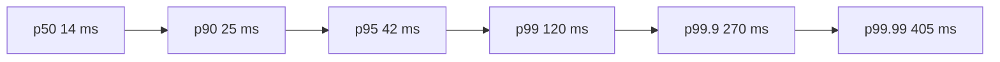

# 网络传输延迟的长尾效应对于计算的影响

## 1. 网络传输延迟的长尾效应简介

### 1.1 定义
*长尾* 描述延迟分布在高百分位（p99、p99.9 等）处出现少量极端值，使平均值与中位数无法代表真实体验。可用重尾分布近似：`P(L > x) ~ x^{-α}`，当 `α ≤ 2` 时方差趋于无穷，导致“偶发”慢请求频繁拖慢批处理或流式计算。

### 1.2 出现的原因

#### A. 排队叠加（Queueing Stacking）
**机理（从 NIC 到交换机的多层队列）**  
数据包从应用发出后会先进入内核 socket 缓冲，再到 qdisc（HTB/FQ-CoDel 等）、设备发送队列（TXQ/NIC ring），跨主机后进入交换机的入/出端口缓冲（如 VOQ）。当**瞬时到达率 λ 接近服务率 μ**时，等待时间按 $W \approx \frac{1}{\mu-\lambda}$ 非线性上升；上游**突发流(bursty)**会显著放大尾延迟。容器/虚机叠加 veth/vxlan 队列层次，使“多层小队列 → 一个长尾”。  
**可观测指标**：`tc -s qdisc show dev <if>` 看 `dropped/overlimits`；`ss -tin` 的 `send-q/recv-q`；`nstat` 的 `TcpRetransSegs`、`TcpDelayedACKs`；交换机端口丢包/ECN/缓冲占用。  
**小实验**：sender ↔ router(ns) ↔ receiver；在中间链路 `netem rate 80mbit`，sender `iperf3 -P 8` 造并发，记录 p95/p99 RTT 与丢包随并发/速率变化，展示“λ→μ”临界附近尾部激增。  
**缓解**：启用 ECN/FQ-CoDel，热点流量用 SR-IOV/DPDK 旁路；应用限峰值扇出与批量化；关键流量与后台任务队列/网卡隔离。

#### B. 共享介质抖动（Contention & Path Variance）
**机理**：  
- **突发争用/微突发**：多个流在同一出端口聚合，微秒级突发即可填满 egress buffer，导致瞬时排队。  
- **不均衡哈希**：ECMP 5-tuple 哈希导致个别 tuple 落在拥挤链路；NAT/负载均衡改变 5-tuple 使路径抖动。  
- **易损链路**：跨 AZ/WAN、Wi‑Fi/蜂窝重传引发 RTT 抖动与有效吞吐下降。  
**可观测指标**：`mtr -u` 看丢包/抖动；`traceroute --paris` 验证路径一致性；应用侧分段埋点（DNS→TLS→首包→全量）。  
**小实验**：两条等价路由做 ECMP，给其中一条 `netem delay 5ms 3ms 20%`，`wrk -t8 -c64` 压测后端，对比哈希不均衡时请求尾延迟上升；改变源端口/并发数观察改善。  
**缓解**：增加哈希熵（含 L4/隧道字段），检测/迁移 Elephant flow；服务部署同 AZ/SN 亲和；跨区链路扩大应用超时并采用幂等重试。

#### C. 软硬件噪声（OS/CPU/内存/虚拟化）
**机理**：  
- **CPU 频率/节能状态**（intel_pstate、C-States）导致关键线程偶发拉长；软中断被抢占时网络栈推进延后。  
- **调度与 cgroup**：K8s CPU 限额触发 CFS Throttling；NUMA 抢占造成远程内存访问/页迁移；后台 `kswapd/compaction`、`rcu` 抖动。  
- **中断/队列亲和性**：IRQ 与应用不共 NUMA/CPU，cache & 内存跨节点产生抖动。  
**可观测指标**：`turbostat` 看频率/C 状态；`/proc/interrupts`、`ethtool -S` 看中断/队列分布；`perf sched timehist` 看就绪→运行延迟；`numastat`；容器 `cpu.stat` 的 `throttled_time`。  
**小实验**：给服务 Pod 设置 `limits.cpu=0.5` 诱发节流，对比 p95/p99；或关闭 irqbalance 并把网卡 IRQ 绑到与业务不同 NUMA，观察尾延迟增加。  
**缓解**：关键服务用 `performance` governor、屏蔽深 C-States；**IRQ/RSS 队列与业务进程 NUMA 对齐与 CPU 绑定**；延迟敏感容器使用 Guaranteed QoS，避免 cgroup 节流。

#### D. 协议回退（Protocol Backoff）
**机理**：  
- **TCP 拥塞控制/重传**：丢包或 ECN 触发拥塞窗口收缩；发生 **RACK/TLP/RTO** 时尾部会跨多个 RTT 周期。  
- **握手与重试**：DNS/TLS 重试、OCSP/CRL 网络请求占 1～数个 RTT；微服务的**同步重试**在高扇出下放大为“重试风暴”。  
- **应用 HOL**：HTTP/2 仍受底层 TCP HOL 影响；改用 QUIC/HTTP/3 可在丢包下降低长尾。  
**可观测指标**：`tcp_info`（`ss -tin`）查看 `rto/retrans/ecn_seen`；应用埋点 `dns → connect → tls → first_byte → full_body` 定位哪一段贡献尾部。  
**小实验**：模拟 1→N RPC 扇出，设置较短超时与**抖动重试**，统计重试导致的 p99.9；启用“提前副本/竞速返回（hedging）”对比尾部改善。  
**缓解**：网络侧部署 ECN/BBR/DCTCP；应用采用**指数回退+随机抖动**、幂等化与 hedged/budgeted 请求；尽量采用 QUIC 的 0‑RTT/连接迁移降低握手/路径波动影响；平台统一超时预算避免层层叠加。

---

### 与 3.1 时间分解的映射
将总时延拆为  

$$
T_{total}=T_{prop}+T_{trans}+T_{queue}+T_{stack}+T_{sched}
$$

- 排队叠加 → $T_{queue}$；
- 共享介质抖动 → $T_{queue}+T_{trans}$；
- 软硬件噪声 → $T_{stack}+T_{sched}$；
- 协议回退 → $T_{stack}$（丢包时也回到 $T_{queue}$）。

> 实操建议：跨层埋点 + p99.9 观测 → 针对性缓解（ECN/BBR、亲和绑定、幂等 + 抖动回退、hedging）。

- **排队叠加**：TCP 队列、交换芯片 VOQ、内核 qdisc 多层排队造成额外等待。
- **共享介质抖动**：带宽突发争用、无线/跨可用区链路重传、ECMP 哈希不均衡。
- **软硬件噪声**：CPU 频率缩放、容器抢占、NUMA 迁移、内核垃圾回收。
- **协议回退**：拥塞控制降速、DNS/TLS 重试、微服务重试风暴。



> 只有 0.01% 的请求落在 400 ms 左右，但它们在大任务中撑起了总耗时的主宰地位。

## 2. 长尾效应对于计算的影响

Google 的 *The Tail at Scale*（CACM 2013）和 AWS Dynamo 论文均指出：只要服务拓扑存在扇出，p99+ 延迟就会把总体 SLA 拖入失败区间。本节在原有实验案例基础上，补充了公开报告中的可量化现象，方便课堂引用。

### 2.1 Hadoop MapReduce Shuffle
Shuffle 过程中 mapper 输出落在少数 reducer 上时，网络与磁盘形成双重排队，少数 reducer 成为 *straggler*，使 `jobEndTime ≈ max(reducer_i)`。Yahoo! 在 2010 年公开的生产日志显示，仅 4% 的 reducer 占用 50% 的总作业收尾时间，根因就是跨机架 shuffle 链路的拥塞尾部。

| 指标 (Yahoo! 日志) | p90 | p95 | p99 |
| --- | --- | --- | --- |
| `ReduceShuffleBytes` 拉取延迟 | 28 s | 53 s | 171 s |
| 同时活跃 reducer 数 | 400 | 400 | 368 |

```xml
<!-- mapred-site.xml（节选）：将超时与推测执行结合 -->
<property>
  <name>mapreduce.task.timeout</name>
  <value>180000</value> <!-- 默认 600000，缩短可更快触发重试 -->
</property>
<property>
  <name>mapreduce.map.speculative</name>
  <value>true</value>
</property>
<property>
  <name>mapreduce.reduce.shuffle.parallelcopies</name>
  <value>10</value> <!-- 提升并发拉取，缓冲 tail reducer -->
</property>
```

> 可运行 `hadoop job -history <job>` 并统计 reducer p99 时延，观察“整体作业完成时间被最慢的 1~2 个 reducer 锁死”的现象。

### 2.2 Spark Structured Streaming 微批
在 Structured Streaming 中，单个 micro-batch 的 `processingTime` 上限由最慢的 Stage 决定。跨 AZ 的 Kafka 或 Delta Lake 读写会把网络尾延迟带入执行计划，导致 `availableOffsets` 长期滞后。Databricks 2021 年的可观测性报告指出：当 Kafka broker RTT 从 8 ms 升到 60 ms 时，微批处理的 p99 时延会增加 4.2×，并诱发 “commits failed: offset out of range”。

```scala
val query = df.writeStream
  .trigger(Trigger.ProcessingTime("500 ms"))
  .option("checkpointLocation", "/delta/checkpoints/txn")
  .start()

spark.streams.addListener(new StreamingQueryListener {
  override def onQueryProgress(event: QueryProgressEvent): Unit = {
    val tail = event.progress.durationMs.get("addBatch").getOrElse(0L)
    if (tail > 1500) {
      spark.conf.set("spark.speculation", true)
      spark.conf.set("spark.speculation.quantile", 0.85)
    }
  }
})
```

监听 `QueryProgressEvent` 即时打开推测执行，向学生展示如何把网络观测（Kafka RTT）反馈到作业级别的调度策略。

> 实验时可让一台 broker 注入 `tc netem delay 20ms 5ms 10%`，对比 `availableOffsets` 与 `inputRowsPerSecond` 的走线，可看到 tail 如何堆积在 `addBatch`。

### 2.3 AI 分布式训练（参数服务器/AllReduce）
在分布式训练中，只要一个 worker 的梯度同步延迟落入 tail，整轮迭代就会阻塞。跨机房训练尤甚，参数服务器模式对尾延迟最敏感。Meta 的 Llama2 训练回顾提到：在 2048 GPU 集群里，只有 1% 的 all-reduce 调用超过 80 ms，但它们让 `iteration_time` 从 1.18 s 拉长到 1.46 s。

```python
import torch.distributed as dist
import time

def sync_gradients(model):
    for p in model.parameters():
        start = time.time()
        dist.all_reduce(p.grad, op=dist.ReduceOp.SUM, async_op=False)
        tail = (time.time() - start) * 1000
        if tail > 50:  # ms
            print(f"[tail] layer {p.shape} sync {tail:.2f} ms")

# 在实验中对 tail 栈采样，结合 traceroute/iperf 解释瓶颈
```

> 可以在 3 台 GPU 机器 + 1 台跨 AZ 节点上跑 ResNet50，可直观观察到仅 1 个慢链路即可把 `iteration_time` 拉长 20% 以上。

### 2.4 大规模在线服务 RPC 扇出
Google 搜索前端会向上百个后端发 RPC。Jeff Dean 的实验表明：若每个后端的 p99 延迟为 1 s，面向 100 个后端的扇出请求在没有防护措施时，整体尾延迟将上升到 63%。同学可以在实验拓扑中模拟 1→N 的 gRPC 扇出，并引入 **hedged requests**。

```go
// 通过 context 超时 + 二次请求来抑制 tail
ctx, cancel := context.WithTimeout(context.Background(), 150*time.Millisecond)
defer cancel()

respCh := make(chan *pb.SearchReply, len(backends))
for _, backend := range backends {
  go func(addr string) {
    if r, err := client(addr).Search(ctx, req); err == nil {
      respCh <- r
    }
  }(backend)
}

first := <-respCh                // 快速返回
go drainSlow(respCh, ctx.Done()) // 统计 tail
```

把 `hedgedPercentile` 设置在 p95 左右即可兼顾成本与收益，Google 论文显示该策略可把整体 99.9 百分位延迟降低 80% 以上。课堂实验可记录 hedged 请求命中率，并与 `ip netns exec` 注入的链路抖动关联。

## 3. 分析与优化

### 3.1 原因再分解
`T_total = T_prop + T_trans + T_queue + T_stack + T_sched`。在云网融合环境中：
- `T_queue` 受 overlay 叠加、虚机/容器多租户影响最大。
- `T_stack` 与 TLS 握手、加密 offload、内核拥塞控制实现相关。
- `T_sched` 体现为 YARN/Spark/Flink 的资源分配与推测策略迟滞。
- `T_trans`、`T_prop` 在跨地域链路中呈确定性上界，却会放大其他随机项。

### 3.2 优化方法
- **观测分层**：在网络侧用 eBPF/FlowLog 统计 p99.9 RTT，同时在任务侧写入指标（如上面的 `StreamingQueryListener`），建立跨层时间线。
- **调度反压**：Hadoop/Spark/Flink 开启推测执行、限制跨 AZ shuffle、对慢节点实施 *node quarantine*。
- **网络侧缓解**：启用 ECN、负载均衡哈希盐、基于 BBR/HPCC 的延迟敏感拥塞控制；对热点流量应用 SR-IOV 或 DPDK 加速。
- **应用协议优化**：参数服务器改用分层 AllReduce、梯度压缩（Top‑K、8bit）、冗余 RPC；把关键服务拆分成幂等微批减少长尾传播。

