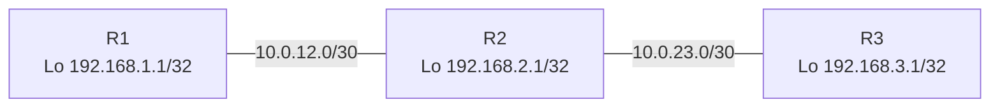

# RIP Namespace Lab

## Objective
Simulate three routers running RIP version 2 inside Linux network namespaces, observe hop-count propagation, and validate end-to-end reachability through FRRouting’s `ripd`.

## Topology


## Prerequisites
- Linux host with `iproute2`, `iputils-ping`, and `sysctl`.
- FRRouting (version 8.x or later) installed with `zebra`, `ripd`, and `vtysh` available in `$PATH`.
- Root privileges (prefix commands with `sudo`).
- Optional: `tcpdump` for packet tracing.

## Step 1: Build the Namespace Scaffold
Create a repeatable setup script that provisions namespaces, veth links, addressing, and forwarding:

```bash
cat <<'EOF' >/tmp/rip_ns_setup.sh
#!/usr/bin/env bash
set -euo pipefail

for ns in r1 r2 r3; do
  ip netns del "$ns" 2>/dev/null || true
done

ip netns add r1
ip netns add r2
ip netns add r3

ip link add r1r2 type veth peer name r2r1
ip link set r1r2 netns r1
ip link set r2r1 netns r2

ip link add r2r3 type veth peer name r3r2
ip link set r2r3 netns r2
ip link set r3r2 netns r3

for ns in r1 r2 r3; do
  ip -n "$ns" link set lo up
done

ip -n r1 addr add 10.0.12.1/30 dev r1r2
ip -n r1 addr add 192.168.1.1/32 dev lo
ip -n r1 link set r1r2 up

ip -n r2 addr add 10.0.12.2/30 dev r2r1
ip -n r2 addr add 10.0.23.1/30 dev r2r3
ip -n r2 addr add 192.168.2.1/32 dev lo
ip -n r2 link set r2r1 up
ip -n r2 link set r2r3 up

ip -n r3 addr add 10.0.23.2/30 dev r3r2
ip -n r3 addr add 192.168.3.1/32 dev lo
ip -n r3 link set r3r2 up

for ns in r1 r2 r3; do
  ip netns exec "$ns" sysctl -w net.ipv4.ip_forward=1 >/dev/null
done
EOF

sudo bash /tmp/rip_ns_setup.sh
```

Verify the scaffold:

```bash
sudo ip netns list
sudo ip -n r2 route show
```

## Step 2: Prepare FRRouting Baseline
Create per-namespace configuration directories and a minimal `zebra` template:

```bash
sudo mkdir -p /var/log/frr
for ns in r1 r2 r3; do
  sudo mkdir -p /etc/netns/$ns/frr
  cat <<EOF | sudo tee /etc/netns/$ns/frr/zebra.conf >/dev/null
hostname $ns-zebra
log file /var/log/frr/$ns-zebra.log
!
EOF
  echo "service integrated-vtysh-config" | sudo tee /etc/netns/$ns/frr/vtysh.conf >/dev/null
done
```

Launch `zebra` daemons inside each namespace (ensure `/tmp` is writable):

```bash
for ns in r1 r2 r3; do
  sudo ip netns exec "$ns" zebra \
    -d \
    -f /etc/netns/$ns/frr/zebra.conf \
    -i /tmp/$ns-zebra.pid \
    -z /tmp/$ns-zebra.sock
done
```

## Step 3: Configure and Start RIP
Create tailored `ripd.conf` files for every router:

```bash
cat <<'EOF' | sudo tee /etc/netns/r1/frr/ripd.conf >/dev/null
hostname r1-rip
log file /var/log/frr/r1-ripd.log
router rip
 version 2
 network 10.0.12.0/30
 network 192.168.1.1/32
 passive-interface lo
 redistribute connected
!
EOF

cat <<'EOF' | sudo tee /etc/netns/r2/frr/ripd.conf >/dev/null
hostname r2-rip
log file /var/log/frr/r2-ripd.log
router rip
 version 2
 network 10.0.12.0/30
 network 10.0.23.0/30
 network 192.168.2.1/32
 passive-interface lo
 redistribute connected
!
EOF

cat <<'EOF' | sudo tee /etc/netns/r3/frr/ripd.conf >/dev/null
hostname r3-rip
log file /var/log/frr/r3-ripd.log
router rip
 version 2
 network 10.0.23.0/30
 network 192.168.3.1/32
 passive-interface lo
 redistribute connected
!
EOF
```

Start `ripd` within each namespace and bind it to the matching `zebra` socket:

```bash
for ns in r1 r2 r3; do
  sudo ip netns exec "$ns" ripd \
    -d \
    -f /etc/netns/$ns/frr/ripd.conf \
    -i /tmp/$ns-ripd.pid \
    -z /tmp/$ns-zebra.sock \
    -A 127.0.0.1
done
```

## Step 4: Verify Convergence
- Inspect adjacencies and learned routes:

  ```bash
  sudo ip netns exec r2 vtysh -c "show ip rip"
  sudo ip netns exec r1 vtysh -c "show ip route"
  sudo ip netns exec r3 vtysh -c "show ip rip database"
  ```

- Test data-plane reachability via learned routes:

  ```bash
  sudo ip netns exec r1 ping -c3 192.168.3.1
  sudo ip netns exec r3 traceroute -n 192.168.1.1
  ```

- Optional troubleshooting:
  ```bash
  sudo ip netns exec r2 tcpdump -n -i r2r1 port 520
  ```

## Step 5: Cleanup
Stop daemons and remove namespaces when finished:

```bash
for ns in r1 r2 r3; do
  sudo ip netns exec "$ns" pkill -f ripd || true
  sudo ip netns exec "$ns" pkill -f zebra || true
done

for ns in r1 r2 r3; do
  sudo ip netns del "$ns"
done

sudo rm -rf /etc/netns/r{1,2,3}
sudo rm -f /tmp/r*-zebra.pid /tmp/r*-ripd.pid /tmp/r*-zebra.sock
```

## Extensions
- Introduce an additional namespace `r4` to explore split-horizon and poison-reverse behavior.
- Modify `timers basic` under `router rip` to evaluate convergence speed.
- Inject static routes on `r2` and observe redistribution effects on adjacent routers.
