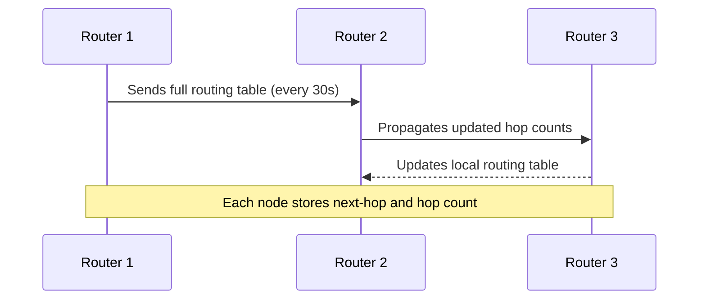
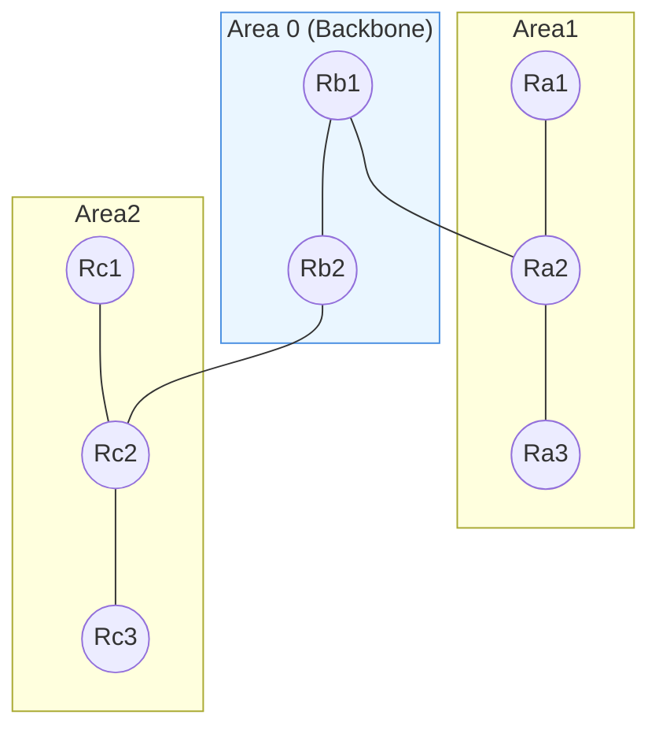
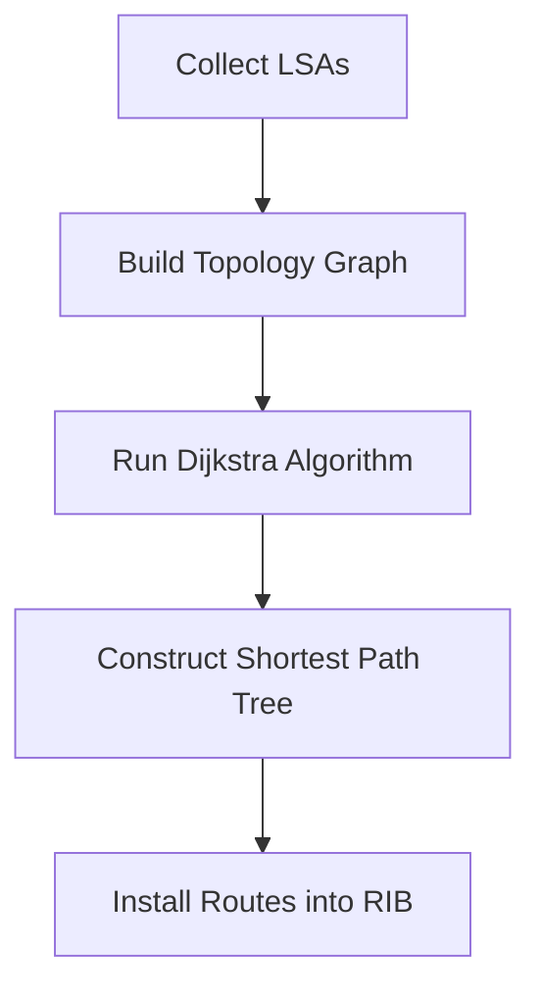
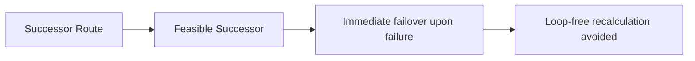
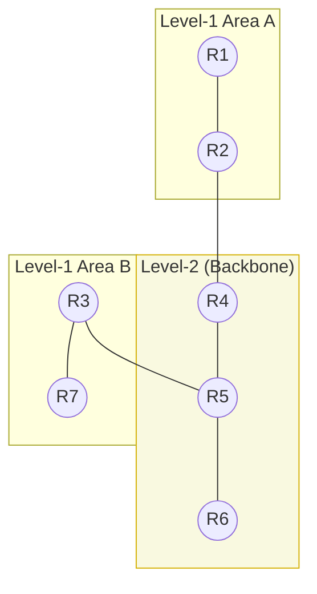
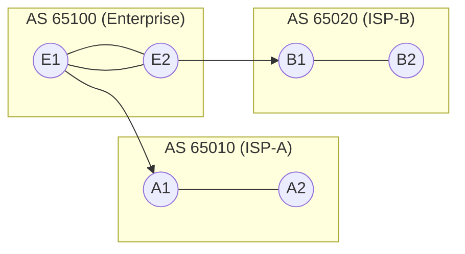

# Routing Protocols Lecture Note

## Overview
Routing protocols let routers exchange reachability information and build forwarding tables automatically. They fall into interior gateway protocols (IGPs) for intra-domain routing and exterior gateway protocols (EGPs) for inter-domain routing.

# Routing Protocols Detailed Explanation

## 1. Routing Information Protocol (RIP)

### Working Principle

RIP is a **distance-vector** routing protocol that relies on hop count as its sole metric (maximum 15 hops). Each router periodically (every 30 seconds) broadcasts its entire routing table to its neighbors. RIP prevents routing loops using techniques such as **split horizon**, **poison reverse**, and **holddown timers**.

* **Metric**: Hop count (max 15)
* **Update Mechanism**: Periodic full-table broadcast every 30 seconds
* **Loop Prevention**: Split horizon, poison reverse, holddown
* **Advantages**: Simple and lightweight
* **Limitations**: Slow convergence and poor scalability

### Flow Diagram

---

## 2. Open Shortest Path First (OSPF)

### Working Principle

OSPF is a **link-state** routing protocol. Each router floods **Link-State Advertisements (LSAs)** describing its interfaces and neighbors. Every router builds an identical **Link-State Database (LSDB)** and runs **Dijkstra's SPF algorithm** to compute shortest paths.

* **Hierarchy**: Backbone Area 0 and non-backbone areas connected via ABRs
* **Key Packets**: Hello, DBD, LSR, LSU, LSAck
* **Metric**: Cost (inversely proportional to bandwidth)
* **Advantages**: Fast convergence, VLSM support, authentication
* **Limitations**: Design complexity due to area planning

### Area Structure Diagram

### SPF Computation Flow

---

## 3. Enhanced Interior Gateway Routing Protocol (EIGRP)

### Working Principle

EIGRP, a Cisco proprietary **advanced distance-vector** protocol, combines features of distance-vector and link-state mechanisms. It uses the **Diffusing Update Algorithm (DUAL)** to guarantee loop-free and rapid convergence.

* **Metric**: Composite of bandwidth and delay (optionally load/reliability)
* **Algorithm**: DUAL maintains successor (primary) and feasible successor (backup) routes
* **Update Mechanism**: Partial updates on topology change
* **Advantages**: Fast convergence, efficient bandwidth use
* **Limitations**: Historically Cisco-only

### DUAL Mechanism

---

## 4. Intermediate System to Intermediate System (IS-IS)

### Working Principle

IS-IS is a **link-state routing protocol** that operates at **Layer 2** of the OSI model. It uses **TLV (Type-Length-Value)** structures for extensibility and supports both IPv4 and IPv6 through Multi-Topology extensions.

* **Levels**: Level 1 (intra-area) and Level 2 (inter-area)
* **Encapsulation**: Runs directly over Layer 2 (no IP dependency)
* **Advantages**: High scalability, minimal reliance on IP
* **Limitations**: Smaller operator base, TLV complexity

### Hierarchical Topology

---

## 5. Border Gateway Protocol (BGP)

### Working Principle

BGP is a **path-vector** protocol designed for **inter-domain routing**. Instead of computing shortest paths, BGP uses **policy-based decisions** guided by **path attributes** such as AS_PATH, NEXT_HOP, LOCAL_PREF, MED, and COMMUNITY.

* **eBGP**: Between autonomous systems (ASes)
* **iBGP**: Within a single AS
* **Attributes**: Control routing preference and path selection
* **Advantages**: Highly scalable, flexible policy control
* **Limitations**: Slow convergence, complex policies

### Topology Diagram

---

## 6. Comparative Summary

| Protocol | Type                     | Metric            | Convergence | Hierarchy | Typical Use            |
| -------- | ------------------------ | ----------------- | ----------- | --------- | ---------------------- |
| RIP      | Distance Vector          | Hop count         | Slow        | No        | Small networks         |
| OSPF     | Link State               | Cost (bandwidth)  | Fast        | Yes       | Enterprise & ISP cores |
| EIGRP    | Advanced Distance Vector | Bandwidth + Delay | Fast        | Partial   | Cisco networks         |
| IS-IS    | Link State               | Wide metric       | Fast        | Yes       | Provider backbones     |
| BGP      | Path Vector              | Policy attributes | Slow        | AS-level  | Inter-domain routing   |

---

## 7. Lab Applications

1. **Namespace RIP Lab**: Create three namespaces linked linearly and run RIP within FRRouting.
2. **OSPF Area Boundary Exercise**: Two ABRs connecting two non-backbone areas to Area 0.
3. **BGP Policy Lab**: Simulate dual-homed enterprise network and tune route selection with LOCAL_PREF and MED.

---

## 8. References

* RFC 1058 (RIP)
* RFC 2328 (OSPFv2)
* RFC 5308 (IS-IS IPv6)
* RFC 4271 (BGP)
* Cisco EIGRP Whitepaper

## Further Study
Review RFC 1058 (RIP), RFC 2328 (OSPFv2), RFC 5308 (IS-IS IPv6), RFC 4271 (BGP), and Cisco’s EIGRP whitepaper. For lab practice, use Linux network namespaces, FRRouting, or virtual routers (e.g., Cisco CSR1000v) to observe adjacency formation, SPF runs, and convergence behavior firsthand.
