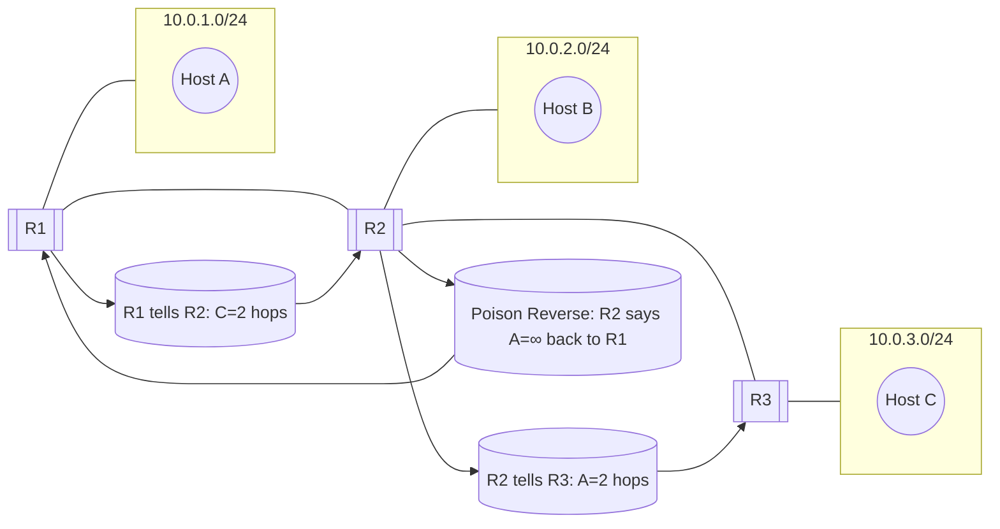
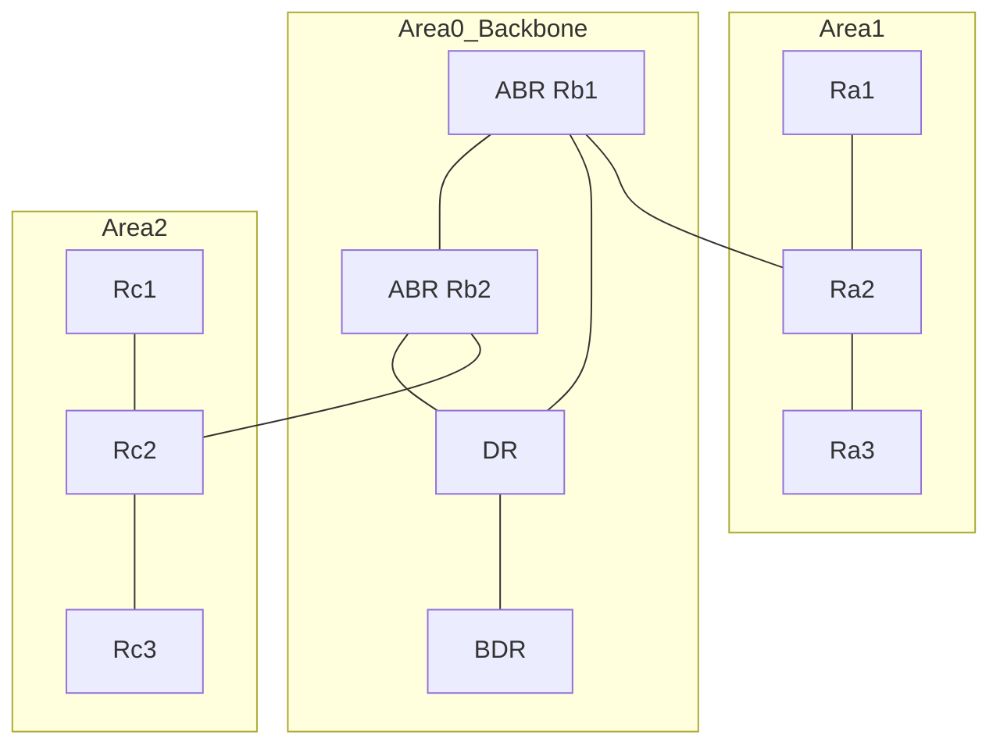
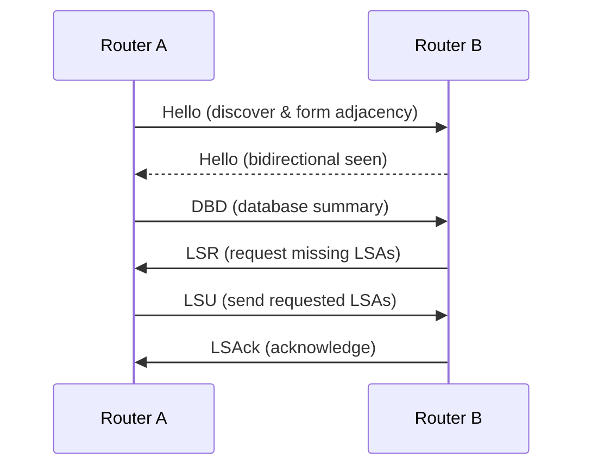
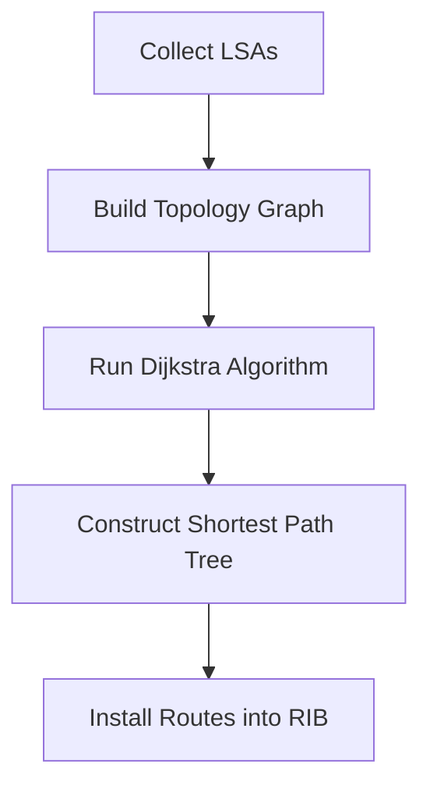
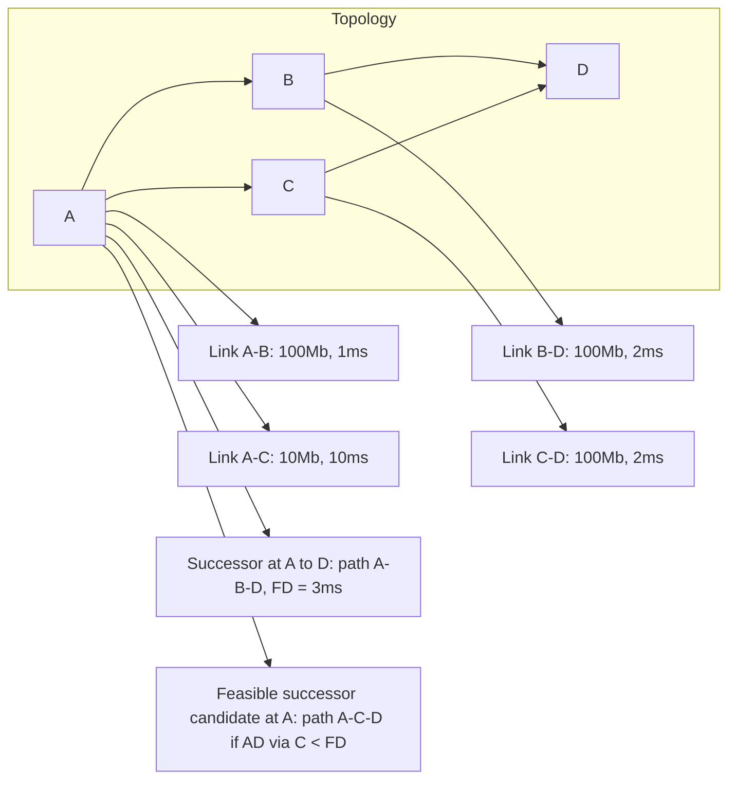
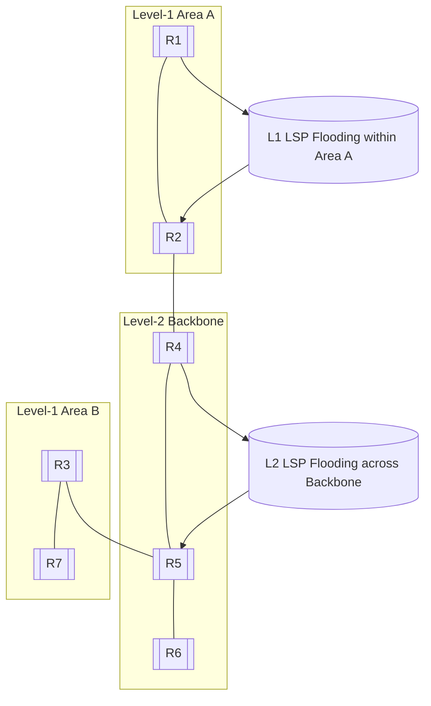

# Routing Protocols Detailed Explanation

## 1. Routing Information Protocol (RIP)

### Working Principle

RIP is a **distance-vector** routing protocol that relies on hop count as its sole metric (maximum 15 hops). Each router periodically (every 30 seconds) broadcasts its entire routing table to its neighbors. RIP prevents routing loops using techniques such as **split horizon**, **poison reverse**, and **holddown timers**.

* **Metric**: Hop count (max 15)
* **Update Mechanism**: Periodic full-table broadcast every 30 seconds
* **Loop Prevention**: Split horizon, poison reverse, holddown
* **Advantages**: Simple and lightweight
* **Limitations**: Slow convergence and poor scalability

### Flow Diagram



**Figure Notes (RIP):**

* Example distances: R1 learns *C* via R2 in **2 hops**; R3 learns *A* via R2 in **2 hops**.
* When a route fails, R2 advertises **∞ (16)** back to the source (poison reverse) to break loops.
* Periodic updates occur every **30s**; holddown timer delays acceptance of worse metrics to stabilize.

---

## 2. Open Shortest Path First (OSPF)

### Working Principle

OSPF is a **link-state** routing protocol. Each router floods **Link-State Advertisements (LSAs)** describing its interfaces and neighbors. Every router builds an identical **Link-State Database (LSDB)** and runs **Dijkstra's SPF algorithm** to compute shortest paths.

* **Hierarchy**: Backbone Area 0 and non-backbone areas connected via ABRs
* **Key Packets**: Hello, DBD, LSR, LSU, LSAck
* **Metric**: Cost (inversely proportional to bandwidth)
* **Advantages**: Fast convergence, VLSM support, authentication
* **Limitations**: Design complexity due to area planning

### Area & Role Diagram



**Rendering notes:**

* Uses only `flowchart` + `subgraph` + default node shapes (no classes, no styles, no quotes).
* `direction LR` inside subgraphs avoids nested layout quirks on GitHub.
* If a repo uses an older Mermaid renderer, replace `---` with `--` (both render as plain edges).

### LSA & Neighbor Exchange (Simplified)



**Figure Notes (OSPF):**

* **DR/BDR** elected on multi-access networks to reduce LSA flooding; routers form adjacencies primarily with DR/BDR.
* **ABRs (Rb1/Rb2)** hold multiple LSDBs (one per area) and **summarize** routes between areas.
* After LSDBs converge, each router runs **SPF** to compute shortest paths.

### SPF Computation Flow



**Figure Notes (SPF):**

* Triggered by LSA changes with throttling/timers to avoid excessive recomputation.
* Costs are additive along a path; lowest total cost wins.
* Equal-cost paths can be installed to enable **ECMP**.

---

## 3. Enhanced Interior Gateway Routing Protocol (EIGRP)

### Working Principle

EIGRP, a Cisco proprietary **advanced distance-vector** protocol, combines features of distance-vector and link-state mechanisms. It uses the **Diffusing Update Algorithm (DUAL)** to guarantee loop-free and rapid convergence.

* **Metric**: Composite of bandwidth and delay (optionally load/reliability)
* **Algorithm**: DUAL maintains successor (primary) and feasible successor (backup) routes
* **Update Mechanism**: Partial updates on topology change
* **Advantages**: Fast convergence, efficient bandwidth use
* **Limitations**: Historically Cisco-only

### DUAL Mechanism with Feasibility Condition



**Rendering notes (EIGRP):**

* Edge labels were moved into standalone nodes (M1–M4) for GitHub safety.
* Only basic `flowchart` syntax is used; no styles, classes, or Unicode arrows.
* If rendering still fails in a restricted environment, replace `subgraph` with a plain list of nodes.

**Figure Notes (EIGRP):**

* **Feasibility Condition**: A neighbor's **advertised distance (AD)** to a destination must be **<** the local **feasible distance (FD)** of the current successor to be a valid **feasible successor**.
* When the successor fails, traffic switches to the feasible successor **without a diffusing query**, ensuring fast convergence.
* If no feasible successor exists, DUAL enters **active** state and diffuses queries to find a new path.

---

## 4. Intermediate System to Intermediate System (IS-IS)

### Working Principle

IS-IS is a **link-state routing protocol** that operates at **Layer 2** of the OSI model. It uses **TLV (Type-Length-Value)** structures for extensibility and supports both IPv4 and IPv6 through Multi-Topology extensions.

* **Levels**: Level 1 (intra-area) and Level 2 (inter-area)
* **Encapsulation**: Runs directly over Layer 2 (no IP dependency)
* **Advantages**: High scalability, minimal reliance on IP
* **Limitations**: Smaller operator base, TLV complexity

### Hierarchical Topology & LSP Flooding



**Figure Notes (IS-IS):**

* **Level-1** routers know only intra-area routes; **Level-2** routers provide inter-area connectivity.
* IS-IS uses **LSPs**, **CSNP/PSNP** for database synchronization; extensible **TLVs** carry IPv4/IPv6 reachability.
* Running at Layer 2 avoids dependency on IP to bring up adjacencies.

---

## 5. Border Gateway Protocol (BGP)

### Working Principle

BGP is a **path-vector** protocol designed for **inter-domain routing**. Instead of computing shortest paths, BGP uses **policy-based decisions** guided by **path attributes** such as AS_PATH, NEXT_HOP, LOCAL_PREF, MED, and COMMUNITY.

* **eBGP**: Between autonomous systems (ASes)
* **iBGP**: Within a single AS
* **Attributes**: Control routing preference and path selection
* **Advantages**: Highly scalable, flexible policy control
* **Limitations**: Slow convergence, complex policies

### Topology & Attribute Flow

```mermaid
flowchart LR
  subgraph ISP_A[AS65010 (ISP-A)]
    A1[[A1]]
  end
  subgraph ENT[AS65100 (Enterprise)]
    E1[[E1]] --- E2[[E2]]
  end
  subgraph ISP_B[AS65020 (ISP-B)]
    B1[[B1]]
  end

  E1 --> A1
  E2 --> B1

  E1 --- E2

  ATTR1[(Path via ISP-A: AS_PATH 65010, LOCAL_PREF=200)]
  ATTR2[(Path via ISP-B: AS_PATH 65020, LOCAL_PREF=100, MED=50)]

  A1 --> ATTR1 --> E1
  B1 --> ATTR2 --> E2
```

**Figure Notes (BGP):**

* Enterprise prefers **ISP-A** due to higher **LOCAL_PREF=200**; **AS_PATH** also influences selection (shorter preferred).
* **MED** from ISP-B suggests inbound preference to its path for specific prefixes.
* Within the enterprise, **iBGP** propagates chosen paths; in larger deployments use **route reflectors** to avoid full meshes.

**Legend:**

* `E1 → A1`, `E2 → B1`: eBGP sessions to upstream ISPs.
* `E1 — E2`: iBGP session within the enterprise AS (route reflection not shown).

---

## 6. Comparative Summary

| Protocol | Type                     | Metric            | Convergence | Hierarchy | Typical Use            |
| -------- | ------------------------ | ----------------- | ----------- | --------- | ---------------------- |
| RIP      | Distance Vector          | Hop count         | Slow        | No        | Small networks         |
| OSPF     | Link State               | Cost (bandwidth)  | Fast        | Yes       | Enterprise & ISP cores |
| EIGRP    | Advanced Distance Vector | Bandwidth + Delay | Fast        | Partial   | Cisco networks         |
| IS-IS    | Link State               | Wide metric       | Fast        | Yes       | Provider backbones     |
| BGP      | Path Vector              | Policy attributes | Slow        | AS-level  | Inter-domain routing   |

---

## 7. Lab Applications

1. **Namespace RIP Lab**: Create three namespaces linked linearly and run RIP within FRRouting.
2. **OSPF Area Boundary Exercise**: Two ABRs connecting two non-backbone areas to Area 0.
3. **BGP Policy Lab**: Simulate dual-homed enterprise network and tune route selection with LOCAL_PREF and MED.

---

## 8. References

* RFC 1058 (RIP)
* RFC 2328 (OSPFv2)
* RFC 5308 (IS-IS IPv6)
* RFC 4271 (BGP)
* Cisco EIGRP Whitepaper
