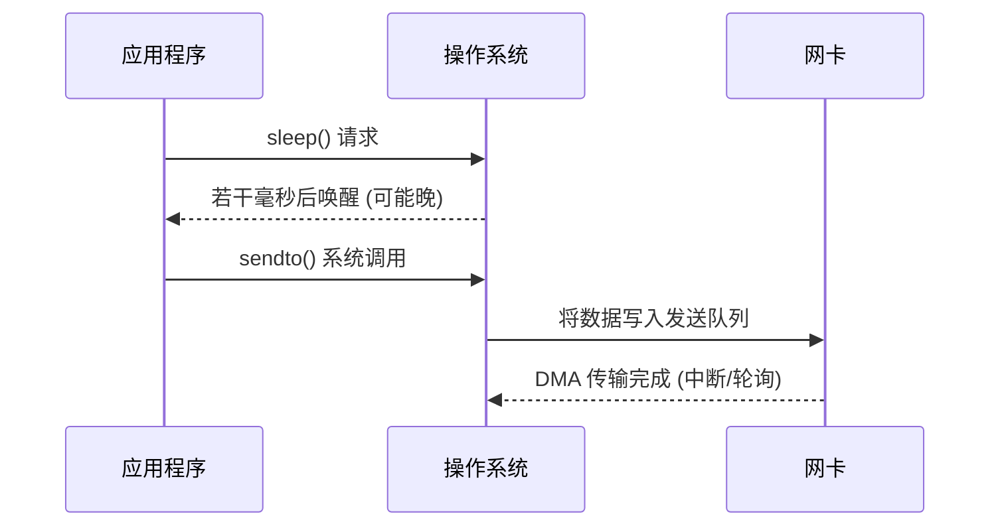

# 如何准确地按照时间戳发送数据包  

## 1. 背景：为什么要“按时间戳发送数据包”

在上一节我们已经分析了：

- 应用层发送数据包的时间开销
- 网络传输延迟的长尾效应对计算的影响

今天要解决的是 **“如何控制自己这边发出去的时间”**。

### 1.1 典型场景

- **流量回放 / 重放测试**
  - 线上抓了一份 `tcpdump`/`pcap` 包，希望在实验环境中 **按原始时间间隔重放**，复现线上问题
- **性能压测 / A/B 测试**
  - 对两套系统做压力测试，需要 **精确控制请求节奏**（例如“10 万 QPS，按真实业务的时间分布”）
- **网络仿真 / 数字孪生**
  - 大规模仿真中，需要按某个时序模型产生流量，验证调度/路由策略
- **时序敏感应用**
  - 高频交易、工业控制、音视频直播等，需要对时间高度敏感

### 1.2 直觉 vs 现实

很多同学的第一反应：

> “我有一堆时间戳，循环里 `sleep(目标时间 - 当前时间)`，然后 `sendto()` 不就好了？”

现实中会遇到：

- `sleep` 精度不够，唤醒延迟不可控
- OS 调度、其他进程干扰，导致 **抖动（jitter）** 很大
- CPU 省电策略、系统调用开销、缓存缺页等各种细节影响

---

## 2. 时间戳与时间源基础

在精确按时间戳发包之前，必须先弄清楚两个问题：

1. **时间戳是什么？**
2. **“现在的时间”从哪里来？**

### 2.1 时间戳的几种语义

1. **绝对时间戳**
   - 例如：`2025-11-17 10:00:00.123456`
   - 通常相对于 UTC 或本地时区
   - 常见于：日志、业务系统、部分抓包工具

2. **相对时间戳**
   - 例如：`第一包时间为 t=0，后续包都是相对差值`
   - `pcap` 中通常可以视为“相对于捕获开始”的时间
   - 回放时更常用：**只关心包与包之间的间隔**

3. **单调时间 vs 实时时间**

| 类型           | 特点                                                 | 使用场景                             |
|----------------|------------------------------------------------------|--------------------------------------|
| 实时时间（wall clock） | 可能被 NTP、手动校时调整，**不单调**                  | 对外展示、人类友好日志               |
| 单调时间（monotonic）  | 始终向前，**不受系统时间调整影响**                    | 定时、超时、调度                     |

> 发包调度几乎总是应该基于 **单调时间**（例如 `CLOCK_MONOTONIC`）。

---

### 2.2 Linux 中的常见时钟源

简单列几种常见类型：

- `CLOCK_REALTIME`：系统实时时钟（会被 NTP/手动调整）
- `CLOCK_MONOTONIC`：单调递增时钟（**推荐用于调度**）
- `CLOCK_MONOTONIC_RAW`：更接近硬件 TSC，几乎不受任何调整
- `CLOCK_BOOTTIME`：包含睡眠时间
- `CLOCK_REALTIME_COARSE` / `CLOCK_MONOTONIC_COARSE`：低精度，高性能

**API 入口：**

- `clock_gettime(clockid_t clk_id, struct timespec *tp);`
- 高精度睡眠：`clock_nanosleep`

---

### 2.3 示例：比较不同时间源的行为（C 语言小例子）

> 用来课堂演示，不必逐行讲透，但可以让学生感受“时间源”的差异。

```c
#include <stdio.h>
#include <time.h>
#include <unistd.h>

static void print_time(const char *name, clockid_t cid) {
    struct timespec ts;
    clock_gettime(cid, &ts);
    printf("%s: %ld.%09ld\n", name, ts.tv_sec, ts.tv_nsec);
}

int main() {
    for (int i = 0; i < 5; ++i) {
        print_time("REALTIME   ", CLOCK_REALTIME);
        print_time("MONOTONIC  ", CLOCK_MONOTONIC);
        print_time("MONO_RAW   ", CLOCK_MONOTONIC_RAW);
        printf("------ sleep 0.5s ------\n\n");
        usleep(500 * 1000);
    }
    return 0;
}
```

课堂可以演示：

- 偶尔调整系统时间（或者模拟 NTP），看 `CLOCK_REALTIME` 跳变，而 `CLOCK_MONOTONIC` 不跳。

---

## 3. 最简单的按时间戳发包：用户态循环 + sleep

先从最朴素的方案开始。

### 3.1 数据模型：一串带时间戳的数据包

假设我们已经把一份 `pcap` 提取成下面这种格式（伪格式）：

```text
# 每行: 相对时间(秒) 源IP 源端口 目的IP 目的端口 负载(十六进制)
0.000123 10.0.0.1 5000 10.0.0.2 80  48656c6c6f
0.010456 10.0.0.1 5000 10.0.0.2 80  776f726c64
...
```

我们要做的事情：

- 从文件读出一串 `(t_i, payload_i)`  
- 按照 `t_i` 之间的间隔发送出去

### 3.2 朴素算法伪代码

```text
read all packets: (t0, pkt0), (t1, pkt1), ...

base_time = 当前单调时间
start_ts  = t0  # 假设第一个包时间为 0 或其他值

for each packet i:
    target_time = base_time + (t_i - start_ts)

    while 当前单调时间 < target_time:
        sleep(短一点，比如 100 微秒)

    sendto(socket, pkt_i)
```

### 3.3 Python 示例：使用 `time.sleep` 回放 UDP 流量

> 这是一个**容易上手但精度一般**的版本，适合作为第 1 节课代码分析的例子。

```python
import socket
import time

def load_trace(path):
    events = []
    with open(path) as f:
        for line in f:
            line = line.strip()
            if not line or line.startswith("#"):
                continue
            parts = line.split()
            ts = float(parts[0])
            dst_ip = parts[3]
            dst_port = int(parts[4])
            payload_hex = parts[5]
            payload = bytes.fromhex(payload_hex)
            events.append((ts, dst_ip, dst_port, payload))
    return events

def replay(trace_file, speed=1.0):
    events = load_trace(trace_file)
    if not events:
        print("no events")
        return

    sock = socket.socket(socket.AF_INET, socket.SOCK_DGRAM)

    base_ts = events[0][0]
    base_mono = time.monotonic()

    for ts, dst_ip, dst_port, payload in events:
        rel = (ts - base_ts) / speed
        target = base_mono + rel

        # 朴素 sleep：低频轮询
        while True:
            now = time.monotonic()
            diff = target - now
            if diff <= 0:
                break
            # 粗粒度 sleep，避免忙等占满 CPU
            if diff > 0.005:
                time.sleep(0.002)
            else:
                # 更接近时，只sleep一个短时间
                time.sleep(diff / 2)

        sock.sendto(payload, (dst_ip, dst_port))

if __name__ == "__main__":
    replay("trace.txt", speed=1.0)
```

课堂可讨论：

- `time.monotonic()` 为何比 `time.time()` 合适？
- `sleep` 精度的问题：  
  - 定时器粒度、调度周期  
  - `sleep(0.002)` 不一定正好 2ms，经常 >2ms  
- CPU 利用率 vs 发包精度的权衡  

---

### 3.4 简单时间轴示意图（Mermaid）



> 可以借此回顾上一节的“发送端时间开销”。

---

## 4. 更精确的用户态定时：`clock_nanosleep` + 绝对时间

第一步优化：**使用绝对时间定时 + 高精度睡眠接口**。

### 4.1 相对 sleep 的问题

- `sleep(Δt)` 是“从现在起睡 Δt”  
- 多个 `sleep` 调用之间会累计误差（每次唤醒都可能延迟）
- 长时间回放时，**漂移（drift）** 会越来越大

### 4.2 绝对时间睡眠：`clock_nanosleep`

我们可以指定一个目标时间点：

- `clock_nanosleep(CLOCK_MONOTONIC, TIMER_ABSTIME, &ts, NULL);`
  - `TIMER_ABSTIME`：表示 `ts` 是一个“绝对时间点”

伪代码：

```text
base_mono = 当前单调时间
start_ts = 第一包时间

for each packet:
    target = base_mono + (t_i - start_ts)

    将 target 转成 struct timespec 绝对时间
    clock_nanosleep(CLOCK_MONOTONIC, TIMER_ABSTIME, &target, NULL);

    sendto(...)
```

### 4.3 C 语言示例：基于 `clock_nanosleep` 的 UDP 回放器

> 可做为第 1 节课的“核心代码示例”，配合讲解。

```c
#include <stdio.h>
#include <stdlib.h>
#include <string.h>
#include <time.h>
#include <unistd.h>
#include <arpa/inet.h>
#include <sys/socket.h>

typedef struct {
    double ts;   // 相对时间，单位秒
    char   ip[64];
    int    port;
    size_t len;
    unsigned char payload[1500];
} event_t;

#define MAX_EVENTS 100000

static int load_trace(const char *path, event_t *events, int max_events) {
    FILE *f = fopen(path, "r");
    if (!f) {
        perror("fopen");
        return -1;
    }
    int n = 0;
    while (!feof(f) && n < max_events) {
        double ts;
        char sip[64], dip[64], payload_hex[4096];
        int sport, dport;
        if (fscanf(f, "%lf %63s %d %63s %d %4095s",
                   &ts, sip, &sport, dip, &dport, payload_hex) != 6) {
            // 忽略格式不匹配的行
            char buf[1024];
            if (!fgets(buf, sizeof(buf), f)) break;
            continue;
        }
        event_t *e = &events[n];
        e->ts = ts;
        strncpy(e->ip, dip, sizeof(e->ip));
        e->port = dport;

        size_t hexlen = strlen(payload_hex);
        e->len = hexlen / 2;
        for (size_t i = 0; i < e->len; ++i) {
            sscanf(payload_hex + 2*i, "%2hhx", &e->payload[i]);
        }
        n++;
    }
    fclose(f);
    return n;
}

static void add_timespec(struct timespec *ts, double delta_sec) {
    long sec = (long)delta_sec;
    long nsec = (long)((delta_sec - sec) * 1e9);
    ts->tv_sec  += sec;
    ts->tv_nsec += nsec;
    if (ts->tv_nsec >= 1000000000L) {
        ts->tv_sec++;
        ts->tv_nsec -= 1000000000L;
    }
}

int main(int argc, char **argv) {
    if (argc < 2) {
        fprintf(stderr, "Usage: %s trace.txt\n", argv[0]);
        return 1;
    }

    event_t *events = calloc(MAX_EVENTS, sizeof(event_t));
    int n = load_trace(argv[1], events, MAX_EVENTS);
    if (n <= 0) {
        fprintf(stderr, "no events\n");
        return 1;
    }

    int sock = socket(AF_INET, SOCK_DGRAM, 0);
    if (sock < 0) {
        perror("socket");
        return 1;
    }

    double base_ts = events[0].ts;

    struct timespec base_mono;
    clock_gettime(CLOCK_MONOTONIC, &base_mono);

    for (int i = 0; i < n; ++i) {
        event_t *e = &events[i];

        double rel = e->ts - base_ts;
        struct timespec target = base_mono;
        add_timespec(&target, rel);

        // 绝对时间睡眠，直到 target
        int ret = clock_nanosleep(CLOCK_MONOTONIC, TIMER_ABSTIME, &target, NULL);
        if (ret != 0) {
            // 可以视情况处理 EINTR 等错误
        }

        struct sockaddr_in addr = {0};
        addr.sin_family = AF_INET;
        addr.sin_port = htons(e->port);
        inet_pton(AF_INET, e->ip, &addr.sin_addr);

        sendto(sock, e->payload, e->len, 0,
               (struct sockaddr *)&addr, sizeof(addr));
    }

    close(sock);
    free(events);
    return 0;
}
```

课堂可以重点讲：

- `CLOCK_MONOTONIC + TIMER_ABSTIME` 的绝对定时方式
- 浮点转 `timespec` 时的精度问题
- 这种方式仍然会受到：
  - 进程被抢占
  - page fault
  - CPU 频率变化
  等因素的影响

---

## 5. 更进一步：实时调度、绑核和“忙等”

如果希望再进一步压缩抖动，可以考虑：

1. **提升线程调度优先级**
2. **将线程绑定到特定 CPU 核**
3. **在临近目标时间时使用“忙等”**

> 这是第 2 节课的重点之一，但强调：**不要在生产环境随意使用**，可能影响系统其它任务。

### 5.1 实时调度策略简述

Linux 上常见的调度策略：

- `SCHED_OTHER`：普通时间片调度（默认）
- `SCHED_FIFO` / `SCHED_RR`：实时调度，优先级高于普通任务

简单示意：

```c
#include <sched.h>

struct sched_param sp;
sp.sched_priority = 80; // 1-99, 越大优先级越高
if (sched_setscheduler(0, SCHED_FIFO, &sp) != 0) {
    perror("sched_setscheduler");
}
```

> 课堂讨论：如果把一个线程提到很高优先级，会有什么风险？

### 5.2 CPU 绑核（CPU affinity）

- 尽量减少线程在不同 CPU 上迁移导致的缓存失效
- 简例（伪代码）：

```c
#include <pthread.h>

cpu_set_t cpus;
CPU_ZERO(&cpus);
CPU_SET(1, &cpus); // 绑到 CPU1
pthread_setaffinity_np(pthread_self(), sizeof(cpu_set_t), &cpus);
```

### 5.3 忙等（busy-wait）的组合策略

一种常见策略：

- 当距离目标时间 **较远** 时，用 `clock_nanosleep` 或 `sleep`  
- 当进入“最后几百微秒”时，改为忙等：

```c
while (1) {
    clock_gettime(CLOCK_MONOTONIC, &now);
    double diff = target - now;
    if (diff <= 0) break;
    if (diff > 0.0005) {
        // 超过 500 微秒，用 sleep 免得占满 CPU
        struct timespec ts = {0, 200000}; // 200us
        nanosleep(&ts, NULL);
    } else {
        // 最后 500 微秒内，忙等
        // 空循环或执行轻量操作
    }
}
// 到时间，sendto(...)
```

> 这里可以让学生思考：  
> - 较小的 `diff` 用忙等是为何？  
> - 忙等和 CPU 利用率/功耗的 trade-off？

---

## 6. 内核协助：SO_TXTIME + ETF qdisc 的时间调度发包

仅靠用户态“掐点”总会有局限：

- 应用在目标时间唤醒，还要经过：
  - 系统调用
  - 内核排队
  - 网卡 DMA 队列
- 这些都带来不可控延迟和抖动

**内核协助思路：**

> “我提前把包交给内核，同时告诉内核它应该在什么时间发出去。”

Linux 中比较典型的是：

- `SO_TXTIME` 套接字选项
- 配合 `ETF qdisc`（Earliest TxTime First）

### 6.1 架构示意图（Mermaid）


关键点：

- 应用提前“投喂”若干个包，并为每个包设置发送时间 `txtime`
- ETF 调度器按时间排序，在合适时间将包放入 NIC 队列
- NIC 再负责真正的线速发送

### 6.2 基本使用步骤（概念性）

1. 为相应网卡配置 `ETF qdisc`  
   （示意命令，课堂只需解释含义，不必深入细节）

   ```bash
   # 假设网卡为 eth0
   tc qdisc replace dev eth0 root mq
   tc qdisc add dev eth0 parent 1: etf \
       clockid CLOCK_TAI \
       delta 100000 \
       offload
   ```

2. 在应用中开启 `SO_TXTIME` 选项：  

   - 设置一个“基准时间”和 `clockid`
   - 每个包通过 `sendmsg` 附带 `SCM_TXTIME` 控制消息指定发送时间

### 6.3 简化 C 示例（片段，讲思想即可）

> 实际代码较长，这里只展示关键部分以便讲原理。

```c
#include <linux/net_tstamp.h>
#include <linux/so_txtime.h>

int sock = socket(AF_INET, SOCK_DGRAM, 0);

/* 开启 SO_TXTIME */
struct sock_txtime txtime_opt = {
    .clockid = CLOCK_TAI,
    .flags   = SOF_TXTIME_REPORT_ERRORS,
};
setsockopt(sock, SOL_SOCKET, SO_TXTIME,
           &txtime_opt, sizeof(txtime_opt));

/* 构造 sendmsg，附带 txtime */
struct msghdr msg = {0};
struct iovec iov;
char ctrl[CMSG_SPACE(sizeof(__u64))];

iov.iov_base = payload;
iov.iov_len  = len;
msg.msg_iov = &iov;
msg.msg_iovlen = 1;
msg.msg_control = ctrl;
msg.msg_controllen = sizeof(ctrl);

struct cmsghdr *cm = CMSG_FIRSTHDR(&msg);
cm->cmsg_level = SOL_SOCKET;
cm->cmsg_type  = SCM_TXTIME;
cm->cmsg_len   = CMSG_LEN(sizeof(__u64));

__u64 *val = (__u64 *)CMSG_DATA(cm);
*val = txtime_ns;  // 发送时间，ns 单位，相对于指定 clockid

sendmsg(sock, &msg, 0);
```

课堂可以重点讲：

- 为何需要 `CLOCK_TAI` / `CLOCK_MONOTONIC` 一致？
- 应用把“何时发”的责任交给内核/网卡，有什么好处？
- 何时选择用户态定时 vs SO_TXTIME？

---

## 7. 发包精度的测量与分析

不能只“感觉自己很准”，需要 **量化**！

### 7.1 一个简单的测量方案

**最简单但不完美的办法：**

- 在应用中记录：
  - 目标时间 `t_target`
  - 实际调用 `sendto` 前的时间 `t_send`
- 误差 `e = t_send - t_target`  
  - 理想情况下：`e` 接近 0  
  - 实际：`e` 为一个分布，可能有长尾

**发包端简单记录代码片段：**

```c
struct timespec now;
clock_gettime(CLOCK_MONOTONIC, &now);
double t_send = now.tv_sec + now.tv_nsec / 1e9;
double err = t_send - t_target;

fprintf(log_file, "%.9f %.9f %.9f\n", t_target, t_send, err);
```

> 课堂可以配合上一节的“长尾延迟”知识点，讨论误差分布的尾部。

### 7.2 用 Python 统计误差分布

（假设 log 文件每行：`t_target t_send err`）

```python
import numpy as np

def analyze_log(path):
    targets = []
    sends = []
    errs = []
    with open(path) as f:
        for line in f:
            if not line.strip():
                continue
            t1, t2, e = map(float, line.split())
            targets.append(t1)
            sends.append(t2)
            errs.append(e)

    errs = np.array(errs)
    print("count:", len(errs))
    print("mean error (us):", np.mean(errs) * 1e6)
    print("p50  error (us):", np.percentile(errs, 50) * 1e6)
    print("p95  error (us):", np.percentile(errs, 95) * 1e6)
    print("p99  error (us):", np.percentile(errs, 99) * 1e6)
    print("max  error (us):", np.max(errs) * 1e6)

if __name__ == "__main__":
    analyze_log("send_log.txt")
```

课堂可以讨论：

- `p50/p95/p99` 各代表什么含义
- 对“数字孪生/仿真”的价值：  
  - 若误差过大，仿真结果会偏离真实网络

---

## 8. 案例：按 tcpdump 轨迹回放 UDP 流量

把上面的内容串在一起，设计一个完整的小实验。

### 8.1 实验步骤概览

1. **线上/测试环境抓包**
   - `tcpdump -i eth0 udp port 8000 -w trace.pcap`
2. **离线解析 pcap**
   - 写一个小脚本读 `pcap`，生成 text trace（`ts src_ip src_port dst_ip dst_port payload_hex`）
3. **用“朴素版本”回放**
   - 基于 Python `time.sleep` 的回放器
4. **用“高精度版本”回放**
   - 基于 `clock_nanosleep` 的 C 版本
5. **记录发包误差并分析**
   - 观察两个版本误差分布的差异

### 8.2 PCAP 转文本的示意脚本（Python + scapy）

> 实际课程中可以提前准备好脚本，课堂只讲关键思想。

```python
from scapy.all import rdpcap, UDP, IP
import binascii

def pcap_to_text(pcap_file, out_file):
    pkts = rdpcap(pcap_file)
    if not pkts:
        return

    base_ts = pkts[0].time

    with open(out_file, "w") as f:
        for p in pkts:
            if UDP in p and IP in p:
                ts = p.time - base_ts
                sip = p[IP].src
                dip = p[IP].dst
                sport = p[UDP].sport
                dport = p[UDP].dport
                payload = bytes(p[UDP].payload)
                payload_hex = binascii.hexlify(payload).decode()
                f.write(f"{ts:.6f} {sip} {sport} {dip} {dport} {payload_hex}\n")

if __name__ == "__main__":
    pcap_to_text("trace.pcap", "trace.txt")
```

课堂可以用一个小例子演示：

- 准备一段简单的 PCAP：每 10ms 一个 UDP 包
- 回放后测量误差，看“朴素版 vs 高精度版”的差异

---

## 9. 与“长尾延迟”内容的呼应

可以在第二节课最后几分钟进行 **知识串联**：

- 之前学的是：**网络路径** 会带来长尾延迟
- 今天学的是：**发包端** 的时间控制也会带来偏差
- 在完整系统里，**端到端延迟分布** 是下面几部分叠加：


- 如果我们想在“数字孪生”中严格复现生产环境：
  - 每一段都要控制好
  - 本节内容属于第一段（应用侧发包控制）

---

## 10. 课堂小结与思考题

### 10.1 小结

- 按时间戳发包是很多工程场景的基础（流量回放、仿真、压测等）
- **时间源选择很关键**：
  - 推荐使用 `CLOCK_MONOTONIC` / `CLOCK_MONOTONIC_RAW`
- 简单实现可以用：
  - `time.monotonic + sleep`（Python）
  - `clock_gettime + clock_nanosleep`（C）
- 若需更高精度：
  - 实时调度（`SCHED_FIFO`）、绑核、忙等
  - 内核辅助：`SO_TXTIME + ETF qdisc`
- 必须配合 **测量与统计分析**，评估误差分布，特别是尾部

### 10.2 思考题（可作为课后作业）

1. 为什么用 `CLOCK_REALTIME` 来做发包调度可能会出问题？请给出一个具体例子。  
2. 在一个高负载的多核服务器上，你会如何为“精确发包线程”设计调度策略和 CPU 绑核策略？  
3. 如果要在同一台机器上同时回放 10 条不同业务流（10 份 trace），你会选择：  
   - 单线程顺序轮询 10 个流，还是  
   - 10 个线程，每个线程负责一条流？  
   请分析各自的优缺点。  
4. 试着设计一个实验，比较以下三种方式的发包误差分布：  
   - Python `time.sleep` 版本  
   - C `clock_nanosleep` 版本  
   - C + 实时调度 + 忙等 版本  
5. 如果 NIC 支持 `SO_TXTIME + ETF qdisc`，你会如何修改回放程序的架构？哪些逻辑放在用户态，哪些交给内核/网卡？
