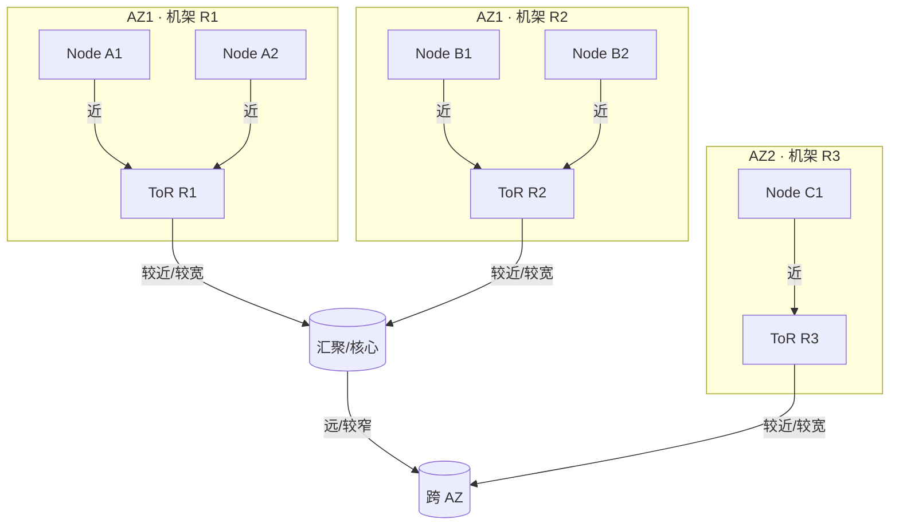

# 网络拓扑感知的分布式计算框架设计

## 1. 背景与问题陈述

- 传统“网络透明”假设失效：多机学习、流批一体、跨 AZ/边缘的异构带宽/延迟差异显著，长尾包/链路波动放大全局同步开销。
- 拓扑层次日益复杂：机架内（ToR）、机架间、园区/跨城、云上 overlay + underlay 共存，出现 RDMA/SmartNIC/可编程交换机混部。
- 案例痛点与现象：
  - Spark Shuffle 案例：某 200 节点集群一次 8 TB Shuffle，将 reduce task 随机分布，跨机架流量把 ToR 上行占满，stage 完成时间从 4 分钟拉长到 12 分钟；开启机架亲和后跨机架流量下降 40%，尾延迟收敛。
  - Checkpoint 案例：Flink 低延迟作业将 checkpoint 存 S3，跨 AZ RTT 抖动导致 checkpoint 时间偶发 3 倍上升；改为先落近端存储再异步复制，主流程不再被跨区延迟拖慢。
  - 分布式训练案例：PS/AllReduce 在多 AZ 部署，跨区带宽仅本地 1/5，梯度同步时间占比超过 60%；采用分层 ring（机架内聚合，再跨机架/跨 AZ）后整体训练吞吐提升约 1.3-1.5 倍。
  - 编排调度案例：Ray/K8s 默认 binpack，将多个带宽密集 actor 堆到同一机架，导致同机架上行竞争，gRPC P99 飙升；加入 rack-aware 亲和和网络评分后，P99 恢复、作业完成时间下降约 10-15%。

## 2. 网络拓扑特征与测量方法

- 拓扑抽象：
  - 分层：节点（pod/VM）、机架（ToR）、汇聚/核心、城域/骨干。
  - 带宽/延迟矩阵：`bw(i,j)`、`lat(i,j)`；可折算为“近/远”分区。
  - 链路约束：oversubscription、ECMP/负载均衡行为、队列隔离策略（DCTCP/HPCC/TSN）。
  - 视觉化示意（机架内近、跨机架远、跨区更远）：

- 数据采集：
  - 被动：sFlow/NetFlow、交换机计数器、RDMA CC 事件；适合长期趋势，低额外流量。
  - 主动：小包探针（latency heatmap）、周期 iPerf/TCP CUBIC/BBR 取样，控制频率避免干扰业务。
  - 框架内信号：Task RPC RTT、Shuffle fetch 延迟直方图、gRPC P99，作为“嵌入式探针”。
- 轻量感知策略：
  - 机架内默认“近”、跨机架抽样验证；构建带 TTL 的邻接表，超时自动降级。
  - 决策前只测必要子集：调度器先粗选候选节点，再对候选间补充测量，避免全量 O(N^2)。
  - 对称/非对称处理：记录方向性差异（如 overlay、NAT），避免假设对称带来的偏差。

## 3. 性能模型与瓶颈定位

- 粗粒度成本模型：总时间近似
  - $$T_{\text{total}} \approx T_{\text{comp}} + \sum_{i,j}\left(\frac{D_{ij}}{\text{bw}(i,j)} + \text{RTT}(i,j)\right) + T_{\text{sync}}$$
  - 直觉：谁占据最大一跳的“数据量/带宽”或 P99 RTT，谁主导 barrier。
  - 符号说明： $T_{\text{comp}}$ （纯计算时间）、 $D_{ij}$ （节点 $i$ 到 $j$ 的数据量）、 $\text{bw}(i,j)$ （两节点间有效带宽）、 $\text{RTT}(i,j)$ （往返时延）、 $T_{\text{sync}}$ （屏障/同步时间）。
- Shuffle/AllReduce 拆分：
  - Shuffle 阶段： $$T_{\text{shuffle}} \approx \max_j \sum_i \frac{\text{flow}_{ij}}{\text{bw}(i,j)}$$ 可把机架内/跨机架分开估计，对跨机架部分设置上限预算。
  - 分层 AllReduce：机架内 reduce 时间 $T_\text{rack}$，跨机架/跨 AZ 树型时间 $T_\text{inter}$，总时间 $$T \approx T_\text{rack} + T_\text{inter}$$；异构带宽下可用“不等分片”让快链路多分担。
- 长尾分析与放大系数：
  - Stage 完成时间受最慢 task 约束，可用 order statistics 估算： $$T_{\text{stage}} \approx T_{50} + k \cdot (T_{99}-T_{50})$$ 其中 $k$ 随并行度上升（并行度越高，尾巴越影响）。
  - 对 RPC/拉流延迟，跟踪 P95/P99；如果 P99/P50 比值持续 >3，优先检查跨机架路径。
- 定位提示：
  - Shuffle fetch 卡顿：抓 ToR/核心端口利用率与丢包，或在节点侧抓 tcp retrans/ECN 计数；观察是否集中在少数跨机架对。
  - PS/AllReduce 吞吐骤降：检查单条 RDMA 会话的 CC 事件或热点链路；对比机架内/跨机架吞吐差异。
  - 边缘/多活：跨地区 RTT 抖动放大 checkpoint/一致性落后，监控跨区 RTT 直方图与可用带宽。
- 案例分析：
  - 假设机架内带宽 40 Gbps、跨机架 10 Gbps，一次 4 TB Shuffle，如果 reduce task 随机打散，跨机架占 50% 流量，则 $T \approx \frac{2\,\text{TB}}{10\,\text{Gbps}} \approx 1600\,\text{s}$（忽略协议/启动开销）；改为机架亲和让跨机架降到 20%，则 $T \approx 640\,\text{s}$，展示拓扑感知的量级收益。
  - 分层 AllReduce：每机架 8 节点，机架内 40 Gbps，跨机架 10 Gbps，梯度 4 GB。机架内树型聚合耗时 $\frac{4\,\text{GB}}{40\,\text{Gbps}} \approx 0.8\,\text{s}$，跨机架再聚合 $\frac{4\,\text{GB}}{10\,\text{Gbps}} \approx 3.2\,\text{s}$，总约 4 s；若直接跨机架 ring，约 $\frac{4\,\text{GB}}{10\,\text{Gbps}} \times 2 \approx 6.4\,\text{s}$，体现分层优势。

## 4. 拓扑感知的放置与调度策略

- 任务放置：
  - 机架亲和（rack-aware）：Shuffle-heavy stage、reduce task 优先同机架；若资源不足再向外扩张，避免默认随机撒。
  - 拓扑分区（topology zones）：为跨 AZ/边缘划定“近/远”区域，给跨区流量设预算或软/硬上限。
  - 带宽/RTT 评分：调度器优先级函数加入 `score = locality + α·bw - β·RTT`，用历史或在线测得的 `bw(i,j)` 选择“宽管”节点。
  - 反亲和：避免把多个带宽密集型 task 堆在同一机架上行，降低局部拥塞。
- 数据放置：
  - 副本选择：读取优先同机架/同 AZ；写入时按拓扑多样性扩散，防同一故障域；对热点分片做“近端缓存 + 异步远端”。
  - 亲和绑定：将 stage/actor 与其主要数据副本协同调度，减少跨机架拉流。
  - 热点缓存：把中心性高的节点作为缓存层，缩短多数读取路径。
- 协调与节流：
  - 时间分片：错峰大流量（shuffle、checkpoint、broadcast），在窗口内限速或排队。
  - 速率控制：框架侧 token bucket / pacer，与 DCTCP/HPCC 等 CC 协同，避免应用层突发压垮交换机队列。
  - Coflow/批量调度：对 DAG 内一组关联流整体分配带宽，减少“最后一条慢流”导致的尾部放大。
  - 动态调整：根据实时 RTT/丢包反馈调整并行度、分区大小或拉流并发度。
- 可操作的调度流程：
  1. 从拓扑服务拉取最新邻接表（机架内/跨机架/跨 AZ 的 bw/RTT 标签）。
  2. Planner 基于 DAG 标记带宽密集 stage，设置亲和/反亲和约束。
  3. 调度器为候选节点打分（locality + bw - RTT），同时检查机架上行剩余带宽阈值。
  4. 分配后推送速率/并发上限配置，作业运行中周期刷新测量值，必要时重排或限速。

## 5. 框架案例与设计要点

### 5.1 Spark / Flink
- Shuffle locality：将 map output 拉取优先限制在同机架；推拉混合减轻 TCP 慢启动。
- Adaptive query execution (AQE) + 拓扑指标：根据实时 `bw(i,j)` 调整并行度、merge 小分区。
- Checkpoint/Savepoint：跨机架/跨 AZ 速率限制，优先近端存储再异步扩散。

### 5.2 Parameter Server / AllReduce
- 拓扑感知的层次化聚合：先机架内 reduce，再跨机架树型/环型；在异构带宽下采用不等分片或分层 ring。
- Worker 分组：依据带宽矩阵聚类，组内同步、组间异步/延后。
- 异常路径兜底：检测 RTT 飙升时临时切换到次优但稳定的拓扑。

### 5.3 Ray / Kubernetes 调度
- 利用 Node/Pod 拓扑标签（zone、rack、switch）约束放置；为 actor 设置亲和/反亲和。
- 调度器插件：在优先级函数中加入“网络成本”评分；保持可扩展性（O(log N) 查找）。
- Autoscaling：扩容时优先补齐缺口机架，避免单机架过热。

## 6. 控制面与实现建议

- 拓扑服务：
  - 负责汇总被动/主动探测与框架内信号，形成带 TTL 的邻接表；支持版本号，便于“读老版本”降级。
  - 提供轻量查询接口：`query(node)` 返回可用区域与带宽/RTT 标签；`sample(k)` 返回需要补测的对。
- 反馈闭环：
  - 作业侧上报：RPC/Shuffle/AllReduce 的 P95/P99 RTT、吞吐、重传/ECN 计数。
  - 调度器侧刷新：周期性拉取拓扑服务，更新优先级函数；异常时触发限速或迁移。
  - 快速路径与慢路径：正常运行使用缓存（快），探测或重规划走控制面（慢），降低控制面干扰。
- 安全与隔离：
  - 多租户环境仅暴露抽象等级（近/远/限速），不泄露物理拓扑细节。
  - 访问控制：调度器/控制器具备只读/写权限分级；探测频率受限防止噪声攻击。
- 兼容性与降级：
  - 探测缺失或拓扑漂移时退化为传统 locality，不因缺数据阻塞调度。
  - 设定“保守默认值”：跨机架假设窄带/高延迟，强制上限带宽或并行度。
  - 日志与可观测性：记录每次决策使用的拓扑版本、评分与约束，方便回溯。
- 实现小贴士：
  - 将拓扑服务做成 sidecar/微服务，与调度器解耦；允许不同框架复用。
  - 对大集群，邻接表按层次压缩（机架级、区域级），避免 O(N^2) 存储。
  - 支持“订阅模式”：当某链路/区域状态突变时推送通知，而非全量轮询。

## 7. 实验

- 小型实验（可在本仓库 namespace 脚本上演示）：
  - 构建两段不同带宽/延迟的命名空间链路，模拟近/远节点。
  - 在近端优先放置 Reduce/PS 进程，测量吞吐/完成时间差异。
  - 切换到随机放置，观察 P95/P99 RTT 对 stage 进度的影响。
- 记录：抓取 `ip -n <ns> addr`、`tc qdisc` 配置、ping/iperf 结果，供课后对比。

## 8. 研究前沿与近三年参考论文

- 同步训练的拓扑感知：Sincronia（NSDI 2022）展示了分层同步在大规模集群的线性扩展潜力。
- 可编程交换机辅助：使用 P4/SmartNIC 做层次化聚合或拥塞信号（如部分 2023/2024 SIGCOMM/NSDI 论文对 RDMA/PS 优化的探索）。
- Coflow / 任务级带宽调度的新实现：近年工作将 coflow 抽象下沉到 SDN/交换芯片，更好约束大流量长尾。
- 异构/多活部署：面向边缘与多数据中心的拓扑感知一致性与复制策略（2023-2024 SOSP/OSDI 多篇论文关注跨域部署开销）。
- 编排系统演进：K8s/Scheduler 插件化让网络评分成为一等公民，云厂商近年在 topology-aware autoscaling 与 overlay/underlay 协同上有新实践。

## 9. 工程实践建议

- 最小可行拓扑建模：至少区分机架内/跨机架/跨 AZ，周期性轻量测量更新。
- 调度/放置打通：在 DAG planner 和资源调度器中显式调用拓扑服务；对关键 stage 设置速率与亲和策略。
- 压测与回放：构建“近/远”对照流量，验证 P95/P99；记录探测数据与决策日志，便于回溯。
- 回退策略：探测失败或拓扑漂移时自动降级，保证可用性；与底层 CC/队列策略保持一致。

## 10. 思考题

- 如果跨机架带宽仅有机架内的 1/4，你会如何调整 Spark Shuffle 分区与并行度？
- PS/AllReduce 在多 AZ 条件下如何平衡一致性与性能？哪些环节可以异步化？
- 拓扑感知调度是否会导致资源碎片化？如何缓解（如软约束、时间分片）？
- 若只能获取有限的测量样本，怎样决定“测谁”和“多久测一次”以保持模型可用？
