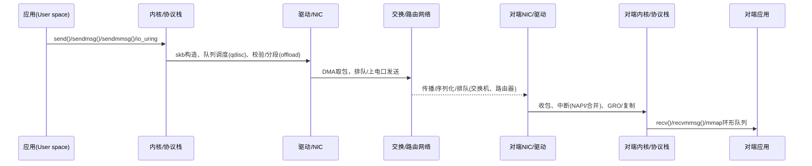

# “在应用层发送 UDP 数据包”的时间开销：全链路分析与可落地优化

> 课程：《工程科技创新2-云网融合》 · 主题：应用层发包的端到端延迟与抖动（jitter）来源、量化与工程优化  
> 场景聚焦：**按照 tcpdump 文件中的时间戳，精确复现发包节奏**

---

## 目录
- [0. 全链路总览（概念与量级）](#0-全链路总览概念与量级)
- [1. 发送端（Sender）时间开销与优化](#1-发送端sender时间开销与优化)
- [2. 网络传输（Middle of the Network）](#2-网络传输middle-of-the-network)
- [3. 接收端（Receiver）时间开销与优化](#3-接收端receiver时间开销与优化)
- [4. 实战：按 tcpdump 时间戳精准复现发包（A/B/C 三方案）](#4-实战按-tcpdump-时间戳精准复现发包abc-三方案)
- [5. 端到端“时间戳与误差”测量方法](#5-端到端时间戳与误差测量方法)
- [6. Linux 调优指令清单（发送 & 接收）](#6-linux-调优指令清单发送--接收)
- [7. 课堂实验建议（可复现）](#7-课堂实验建议可复现)
- [8. 常见坑位清单](#8-常见坑位清单)
- [9. 小结（给学生的 takeaway）](#9-小结给学生的-takeaway)

---

## 0. 全链路总览（概念与量级）



**典型时间量级（经验值）**  
- 用户态 → 内核：系统调用+复制+调度：**0.3–5 μs**（受 CPU/缓存/批量程度影响）  
- qdisc/队列/驱动/NIC DMA：**0.5–10 μs**（受拥塞、合并策略、队列深度影响）  
- 线速序列化（以太网“上线时间”）：`帧长(bit)/链路速率`  
  - 1500B 载荷一帧（连同头尾 + 前导码/IFG ≈ 1538B）  
  - 1 Gbps：**≈12.3 μs/帧**；10 Gbps：**≈1.23 μs/帧**；25 Gbps：**≈0.49 μs/帧**  
- 传播：光纤约 **~5 μs/公里**；同机房可忽略，跨城/洲占主导  
- 接收侧（NAPI/GRO/复制/唤醒）：**1–10+ μs**（强依赖负载与合并策略）  

> 端到端**平均时延**通常由“队列 + 序列化 + 传播”主导；**抖动**多来自“中断合并/调度/时钟与节能状态”。

---

## 1. 发送端（Sender）时间开销与优化

### 1.1 发送端时间拆解
1. **用户态准备**：序列化/编码、缓冲区准备、拷贝 → 影响：内存分配、缓存亲和、NUMA跨节点。  
2. **系统调用路径**：`send()/sendmsg()` 进入内核；socket 查找、`skb` 分配、元数据填充、可能的校验计算（可 offload）。  
3. **排队与调度（qdisc）**：`fq/fq_codel/etf` 等队列实现；TSQ pacing；可能的 **GSO/USO**（UDP 分段 offload）合并。  
4. **驱动/NIC**：DMA map，写门铃（doorbell），环形队列，**中断合并**参数（影响抖动），端口速率/队列拥塞。

### 1.2 关键优化手段（按投入/收益从“易→难”排序）

**减少系统调用 & 批量化**
- `sendmmsg()`（批量发送多报文），`recvmmsg()`（接收端配套）。
- `io_uring` + `IOSQE_ASYNC`/`SEND_ZC`（零拷贝路径；降低 syscall/ctx switch）。
- **UDP GSO/USO**：应用按大块提交，NIC 分段上线（减少内核/PCIe 压力）。

**绕过多余拷贝**
- `MSG_ZEROCOPY`（内核零拷贝发送，配合完成事件处理），或 **AF_XDP**（mmap 环 + XDP）/DPDK（用户态驱动）。

**亲和性与 NUMA**
- **将发包线程绑核**（`taskset`/`sched_setaffinity`），绑到与 **NIC 队列同 NUMA** 节点；  
- 开启 **XPS（传输侧队列选择）**，使该 CPU 的发包优先落到固定 Tx 队列；
- 避免跨 NUMA 内存：`numactl --membind`/hugepages；预分配/锁页 `mlockall()`。

**qdisc/驱动调优**
- 低抖动追求：`tc qdisc replace dev $IF root fq maxrate ...` 或 **ETF**（见 §4 方案B）；  
- `ethtool -K`：确保需要的 offload（tx-checksum/tx-udp_tnl-segmentation 等）开启；  
- `ethtool -C`：**谨慎**调小 TX/RX 中断合并（过大合并→抖动与尾部时延）。

**减少调度抖动**
- 进程 `SCHED_FIFO`/`SCHED_RR` 提高调度优先级；  
- 固定 CPU 频率，禁用深度 C-state（节能状态会放大 μs 级抖动）；  
- 避免与其他噪声线程/IRQ 共享核心；将 NIC 中断绑到“相邻或固定”的核心。

---

## 2. 网络传输（Middle of the Network）

### 2.1 三大必经开销
- **序列化延迟**：`T_ser = 帧总比特数 / 速率`。  
- **传播延迟**：`T_prop ≈ 距离(km) × 5 μs/km`（光纤）。  
- **排队延迟**：交换机/路由器的队列；拥塞/拥塞控制/缓冲管理（RED/CoDel/ECN）决定。

### 2.2 可控手段
- **拥塞可视化**：sFlow/NetFlow/INT/队列统计，定位拥塞链路；  
- **AQM/ECN**：降低排队尾部；  
- **路径工程**：多路径 ECMP/TE（数据中心）或 SRv6/TE（运营场景），避开热点。  

---

## 3. 接收端（Receiver）时间开销与优化

### 3.1 接收路径拆解
NIC 收到帧 → DMA → 中断/轮询（**NAPI**）→ 合并（**GRO/UDP GRO**）→ `skb` → 协议栈 → socket 队列 → 用户态 `recv()` 唤醒 → 拷贝到应用缓冲。

### 3.2 关键优化
- **批量接收**：`recvmmsg()`；  
- **放大缓冲**：`SO_RCVBUF` 与 `net.core.rmem_max`；  
- **忙轮询**：`SO_BUSY_POLL`/`net.core.busy_read`（降低唤醒开销，换更高 CPU）；  
- **亲和/NUMA/RPS/RFS**：让该流量落到处理它的核心与队列；  
- **AF_XDP/DPDK**：需要极限性能时采用；  
- **GRO 策略**：若应用对延迟敏感，可适度降低合并（减少积累带来的抖动）。

---

## 4. 实战：按 tcpdump 时间戳精准复现发包（A/B/C 三方案）

> 目标：读取 pcap/pcapng（含每个包的绝对时间戳），**按原始“相邻包时间差（Δt）”**在目标网口**准时**发出。

### 方案 A（用户态高精度定时，易用，亚毫微秒级不保证）
**适用**：Δt ≥ 50–100 μs；Linux 内核默认 HZ/时钟源 OK；代码简单、依赖少。  

**要点**：
1. 解析 pcap：拿到 `t[i]`（第 i 个包的绝对时间）。  
2. 将应用线程设为 `SCHED_FIFO`，**绑核**，`mlockall()`；  
3. 使用**绝对时间**定时（避免累计漂移）：`clock_nanosleep(CLOCK_MONOTONIC, TIMER_ABSTIME, ...)`；  
4. **批量发送**：将下一段短间隔包用 `sendmmsg()` 一次提交；  
5. 关闭深度省电、固定频率；确保与 NIC 队列同 NUMA。  

**伪代码片段（C）**：
```c
// 省略：打开pcap，读出每个报文payload与t[i]（ns）
struct mmsghdr v[MMAX]; // 批量
for (size_t i = 0; i < n; ) {
    // 准备一批在 [i, j) 内、间隔很短的报文
    size_t j = pack_batch(v, i);
    // 绝对定时到 t[i]（MONOTONIC 下的目标时间）
    clock_nanosleep(CLOCK_MONOTONIC, TIMER_ABSTIME, &ts[i], NULL);
    // 一把 sendmmsg
    int sent = sendmmsg(fd, v, j - i, 0);
    i += sent;
}
```

**优点**：易上手；对 “毫秒/百微秒” 级节奏非常稳。  
**缺点**：受调度/中断合并影响；**微秒内**抖动难免。

---

### 方案 B（内核定时下发：**SO_TXTIME + ETF qdisc**，微秒级抖动）
**适用**：**微秒级**间隔；不想引入 DPDK/AF_XDP；用原生 UDP socket。  

**原理**：应用提前把“**每个包的发送时刻 txtime**”通过 `SCM_TXTIME` 作为控制消息交给内核；**ETF qdisc** 按该时间放行到 NIC。  

**配置步骤（root）**：
```bash
# 1) 让系统时钟高精度（推荐也同步 PTP，见 §5）
sysctl kernel.sched_rt_runtime_us=-1  # 放宽 RT
# 2) 在 egress 口启用 ETF（以 CLOCK_TAI/RAW 为例）
tc qdisc replace dev eth0 root etf clockid CLOCK_TAI delta 50000 offload
# delta: 提前量(ns)，根据路径和驱动微调
```

**应用侧（C，关键片段）**：
```c
int clk = CLOCK_TAI; // 与 qdisc 一致
int enable = 1;
setsockopt(fd, SOL_SOCKET, SO_TXTIME, &enable, sizeof(enable));

struct msghdr msg = {0};
char cbuf[CMSG_SPACE(sizeof(uint64_t))];
msg.msg_control = cbuf; msg.msg_controllen = sizeof(cbuf);
struct cmsghdr *cm = CMSG_FIRSTHDR(&msg);
cm->cmsg_level = SOL_SOCKET;
cm->cmsg_type  = SCM_TXTIME;
cm->cmsg_len   = CMSG_LEN(sizeof(uint64_t));
*(uint64_t *)CMSG_DATA(cm) = txtime_ns; // pcap 时间转换并加上 offset
sendmsg(fd, &msg, 0);
```

**实操提示**  
- **时钟一致**：`SO_TXTIME` 的 `clockid` 要与 `etf clockid` 一致（如 `CLOCK_TAI`）。  
- `delta` 需要**略早**提交（几十微秒到数百微秒），留给内核排队与驱动时间。  
- 某些 NIC 支持**硬件级**时间感知（TSN 类）；ETF 可利用 offload，进一步收敛抖动。

---

### 方案 C（极致精度/高吞吐：**DPDK/MoonGen/AF_XDP**）
**适用**：Δt 在**数微秒**乃至**亚微秒**；需要线速、百万 PPS；对环境可控。  

**做法**：用 DPDK 载入 PCAP，基于 NIC 的硬件时间戳/定时发送能力或 busy-wait 高精度循环；MoonGen（Lua）脚本化方便；AF_XDP 则在 Linux 原生生态下获得近似 DPDK 的路径。  

**优点**：最小抖动、最高 PPS。  
**代价**：开发、部署与调试成本高；对内核/驱动/大页/隔离核心等要求严格。

---

### 三方案对比（概览）

| 方案 | 复杂度 | 典型精度 | 吞吐 | 依赖/限制 |
|---|---|---:|---:|---|
| A 用户态绝对定时 + 批量 | ★ | ~50–100 μs 间隔可稳 | 中 | OS 调度/合并影响大 |
| B SO_TXTIME + ETF | ★★ | **微秒级**可控 | 中 | 需要较新内核 & qdisc 配置 |
| C DPDK/MoonGen/AF_XDP | ★★★ | **微秒/亚微秒** | **高** | 专用栈/大页/绑核/脚本或C |

> 课上建议：**优先 B**（工程落地最佳），较大间隔/简单试验用 **A**，科研/极限性能再考虑 **C**。

---

## 5. 端到端“时间戳与误差”测量方法

**硬件/软件时间戳**
- 发送端与接收端均开启 `SO_TIMESTAMPING`（HW/SW/BOTH），尽量使用**硬件时间戳**（NIC 支持时抖动显著更小）；  
- 同步时钟：PTP（`ptp4l` 同步 PHC），`phc2sys` 将 NIC PHC 对齐系统时钟（或反向）。

**验证流程**
1. 回放时对**发送端 TX**与**接收端 RX**抓取时间戳；  
2. 计算相邻包 `Δt_send` 与 `Δt_recv`，与 pcap 原始 `Δt_pcap` 比较；  
3. 绘制误差 `ε = Δt_actual - Δt_pcap` 的直方图/百分位（P50/P95/P99.9）。

**简易 Python（离线评估 jitter；示例仅示意）**
```python
import dpkt, statistics
with open("trace.pcap", "rb") as f:
    pcap = dpkt.pcap.Reader(f)
    ts = [t for t,_ in pcap]
gaps = [ts[i+1]-ts[i] for i in range(len(ts)-1)]
print("median/us:", statistics.median(gaps)*1e6,
      "p99/us:", sorted(gaps)[int(0.99*len(gaps))]*1e6)
```

---

## 6. Linux 调优指令清单（发送 & 接收）

**Socket & sysctl**
```bash
# 放大缓冲
sysctl -w net.core.wmem_max=268435456
sysctl -w net.core.rmem_max=268435456
# FQ pacing（如需）
tc qdisc replace dev eth0 root fq maxrate 10gbit
# 打开忙轮询（接收端可选）
sysctl -w net.core.busy_read=50
sysctl -w net.core.busy_poll=50
```

**CPU/中断与亲和**
```bash
# 将发包线程绑核
taskset -c 6 ./sender
# 中断绑核（示例：将 eth0 的 IRQ 绑到 6/7）
echo 0xC0 > /proc/irq/${IRQ_OF_ETH0}/smp_affinity
```

**ethtool**
```bash
# 查看/调整中断合并（合并越大，抖动越大、CPU越省）
ethtool -c eth0
ethtool -C eth0 rx-usecs 10 tx-usecs 10
# 校验与分段 offload
ethtool -k eth0
```

**进程优先级**
```bash
chrt -f 90 ./sender   # SCHED_FIFO 90
```

**电源与频率（视环境谨慎）**
- 关闭深度 C-states；固定 CPU 频率到高档；服务器 BIOS 中设置“Performance”。

---

## 7. 课堂实验建议（可复现）

1. **基线**：方案 A，间隔 200 μs，PPS≈5k；对比 SCHED_OTHER vs SCHED_FIFO、绑核与否的 jitter 曲线。  
2. **引入 ETF**：方案 B，Δt 同上；比较 P50/P99 抖动改善幅度。  
3. **压力场景**：并发其他 CPU 压力（`stress-ng`），观察 jitter 抗扰性。  
4. **中断合并扫描**：修改 `ethtool -C` 的 `rx-usecs`、`tx-usecs`，画“抖动 vs CPU”权衡曲线。  
5. **网络段影响**：在中间交换机开启/关闭 AQM（如 CoDel），在拥塞时观察尾部延迟变化。

---

## 8. 常见坑位清单
- **使用相对睡眠**（`nanosleep` 非绝对）→ **累计漂移**；  
- **时钟不一致**（发送与 ETF 的 `CLOCKID` 不同）→ 定时失准；  
- **中断合并过大** → P99 抖动显著；  
- **跨 NUMA** 分配/调度 → 额外复制与 cache miss；  
- **容器网络**（veth/bridge/iptables）→ 额外队列与规则开销；极致要求下直接用 host 网络/DPDK；  
- **省电策略** 未关闭 → 随机长尾；  
- **GRO/LRO** 在延迟敏感场景下未评估其影响（接收侧“攒包”会引入抖动）。

---

## 9. 小结（给学生的 takeaway）
- **端到端延迟 =** 发送端（用户态+内核+NIC）+ 网络（序列化/传播/排队）+ 接收端；  
- **抖动的大头**：调度与中断合并、队列拥塞、节能状态；  
- **工程上优先级**：**批量化** → **亲和/NUMA** → **ETF/精确定时** → （需要时）**AF_XDP/DPDK**；  
- **按 tcpdump 精确重放**：课堂上推荐 **SO_TXTIME + ETF**，用**绝对时间**、提前量 `delta` 与 PTP 同步校准，达成微秒级节奏复现。
