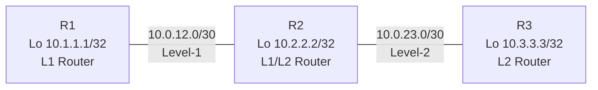

# IS-IS Namespace Lab

## Objective
Emulate a simple Level-1/Level-2 Integrated IS-IS deployment with three routers using Linux network namespaces and FRRouting’s `isisd`, highlighting adjacency roles, area addresses, and route dissemination.

## Topology


## Prerequisites
- Linux host with `iproute2`, `iputils-ping`, and `sysctl`.
- FRRouting installed with `zebra`, `isisd`, and `vtysh`.
- Root privileges (`sudo`).

## Step 1: Build the Namespace Scaffold

```bash
cat <<'EOF' >/tmp/isis_ns_setup.sh
#!/usr/bin/env bash
set -euo pipefail

for ns in r1 r2 r3; do
  ip netns del "$ns" 2>/dev/null || true
done

ip netns add r1
ip netns add r2
ip netns add r3

ip link add r1r2 type veth peer name r2r1
ip link set r1r2 netns r1
ip link set r2r1 netns r2

ip link add r2r3 type veth peer name r3r2
ip link set r2r3 netns r2
ip link set r3r2 netns r3

for ns in r1 r2 r3; do
  ip -n "$ns" link set lo up
done

ip -n r1 addr add 10.0.12.1/30 dev r1r2
ip -n r1 addr add 10.1.1.1/32 dev lo
ip -n r1 link set r1r2 up

ip -n r2 addr add 10.0.12.2/30 dev r2r1
ip -n r2 addr add 10.0.23.1/30 dev r2r3
ip -n r2 addr add 10.2.2.2/32 dev lo
ip -n r2 link set r2r1 up
ip -n r2 link set r2r3 up

ip -n r3 addr add 10.0.23.2/30 dev r3r2
ip -n r3 addr add 10.3.3.3/32 dev lo
ip -n r3 link set r3r2 up

for ns in r1 r2 r3; do
  ip netns exec "$ns" sysctl -w net.ipv4.ip_forward=1 >/dev/null
done
EOF

sudo bash /tmp/isis_ns_setup.sh
```

Verify:

```bash
sudo ip -n r2 addr show
sudo ip -n r2 route show
```

## Step 2: Prepare FRRouting Baseline

```bash
sudo mkdir -p /var/log/frr
for ns in r1 r2 r3; do
  sudo mkdir -p /etc/netns/$ns/frr
  cat <<EOF | sudo tee /etc/netns/$ns/frr/zebra.conf >/dev/null
hostname $ns-zebra
log file /var/log/frr/$ns-zebra.log
!
EOF
  echo "service integrated-vtysh-config" | sudo tee /etc/netns/$ns/frr/vtysh.conf >/dev/null
done

for ns in r1 r2 r3; do
  sudo ip netns exec "$ns" zebra \
    -d \
    -f /etc/netns/$ns/frr/zebra.conf \
    -i /tmp/$ns-zebra.pid \
    -z /tmp/$ns-zebra.sock
done
```

## Step 3: Configure and Start IS-IS
Assign unique Network Entity Titles (NETs) using ISO area ID `49.0001` and enable IS-IS on relevant interfaces:

```bash
cat <<'EOF' | sudo tee /etc/netns/r1/frr/isisd.conf >/dev/null
hostname r1-isis
log file /var/log/frr/r1-isisd.log
router isis CORE
 net 49.0001.0000.0000.0001.00
 is-type level-1
 metric-style wide
 passive-interface lo
!
interface r1r2
 ip router isis CORE
!
interface lo
 ip router isis CORE
 isis passive
!
EOF

cat <<'EOF' | sudo tee /etc/netns/r2/frr/isisd.conf >/dev/null
hostname r2-isis
log file /var/log/frr/r2-isisd.log
router isis CORE
 net 49.0001.0000.0000.0002.00
 is-type level-1-2
 metric-style wide
 passive-interface lo
!
interface r2r1
 ip router isis CORE
!
interface r2r3
 ip router isis CORE
!
interface lo
 ip router isis CORE
 isis passive
!
EOF

cat <<'EOF' | sudo tee /etc/netns/r3/frr/isisd.conf >/dev/null
hostname r3-isis
log file /var/log/frr/r3-isisd.log
router isis CORE
 net 49.0001.0000.0000.0003.00
 is-type level-2-only
 metric-style wide
 passive-interface lo
!
interface r3r2
 ip router isis CORE
!
interface lo
 ip router isis CORE
 isis passive
!
EOF
```

Boot `isisd` in each namespace:

```bash
for ns in r1 r2 r3; do
  sudo ip netns exec "$ns" isisd \
    -d \
    -f /etc/netns/$ns/frr/isisd.conf \
    -i /tmp/$ns-isisd.pid \
    -z /tmp/$ns-zebra.sock \
    -A 127.0.0.1
done
```

## Step 4: Verify Adjacencies and SPF
- Inspect adjacency states and levels:

  ```bash
  sudo ip netns exec r1 vtysh -c "show isis neighbor"
  sudo ip netns exec r2 vtysh -c "show isis neighbor detail"
  ```

- Review the LSDB and installed routes:

  ```bash
  sudo ip netns exec r2 vtysh -c "show isis database"
  sudo ip netns exec r3 vtysh -c "show ip route isis"
  ```

- Validate end-to-end reachability:

  ```bash
  sudo ip netns exec r1 ping -c3 10.3.3.3
  sudo ip netns exec r3 traceroute -n 10.1.1.1
  ```

- Optional: capture IS-IS PDUs (Layer 2):

  ```bash
  sudo ip netns exec r2 tcpdump -n -i r2r1 -xx isis
  ```

## Step 5: Cleanup

```bash
for ns in r1 r2 r3; do
  sudo ip netns exec "$ns" pkill -f isisd || true
  sudo ip netns exec "$ns" pkill -f zebra || true
  sudo ip netns del "$ns"
done

sudo rm -rf /etc/netns/r{1,2,3}
sudo rm -f /tmp/r*-isisd.pid /tmp/r*-zebra.pid /tmp/r*-zebra.sock
```

## Extensions
- Change `is-type` on `r1` to `level-1-2` and observe how inter-area routes appear in the LSDB.
- Configure IPv6 addressing on the same interfaces and add `ipv6 router isis CORE` to explore multi-topology operation.
- Inject static routes on `r3` and redistribute them with `redistribute connected` to observe Level-2 to Level-1 route leaking.
