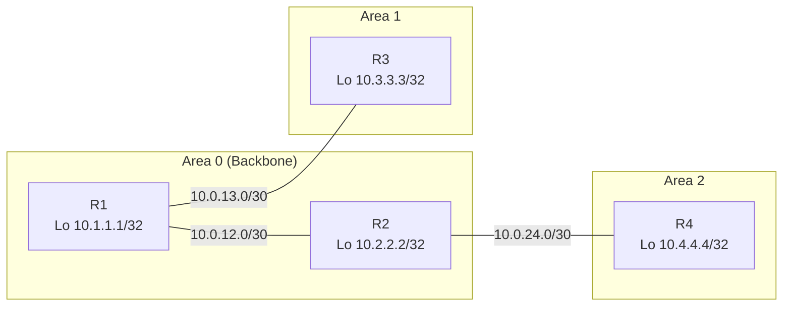

# OSPF Namespace Lab

## Objective
Deploy a four-router OSPF design with backbone and non-backbone areas using Linux network namespaces and FRRouting’s `ospfd`, then validate adjacency formation, LSDB contents, and inter-area reachability.

## Topology


## Prerequisites
- Linux host with `iproute2`, `iputils-ping`, `sysctl`, and optional `traceroute`.
- FRRouting installed with `zebra`, `ospfd`, and `vtysh`.
- Root privileges (use `sudo`).

## Step 1: Build the Namespace Scaffold
Provision namespaces, point-to-point links, addressing, and forwarding:

```bash
cat <<'EOF' >/tmp/ospf_ns_setup.sh
#!/usr/bin/env bash
set -euo pipefail

for ns in r1 r2 r3 r4; do
  ip netns del "$ns" 2>/dev/null || true
done

ip netns add r1
ip netns add r2
ip netns add r3
ip netns add r4

ip link add r1r2 type veth peer name r2r1
ip link set r1r2 netns r1
ip link set r2r1 netns r2

ip link add r1r3 type veth peer name r3r1
ip link set r1r3 netns r1
ip link set r3r1 netns r3

ip link add r2r4 type veth peer name r4r2
ip link set r2r4 netns r2
ip link set r4r2 netns r4

for ns in r1 r2 r3 r4; do
  ip -n "$ns" link set lo up
done

ip -n r1 addr add 10.0.12.1/30 dev r1r2
ip -n r1 addr add 10.0.13.1/30 dev r1r3
ip -n r1 addr add 10.1.1.1/32 dev lo
ip -n r1 link set r1r2 up
ip -n r1 link set r1r3 up

ip -n r2 addr add 10.0.12.2/30 dev r2r1
ip -n r2 addr add 10.0.24.1/30 dev r2r4
ip -n r2 addr add 10.2.2.2/32 dev lo
ip -n r2 link set r2r1 up
ip -n r2 link set r2r4 up

ip -n r3 addr add 10.0.13.2/30 dev r3r1
ip -n r3 addr add 10.3.3.3/32 dev lo
ip -n r3 link set r3r1 up

ip -n r4 addr add 10.0.24.2/30 dev r4r2
ip -n r4 addr add 10.4.4.4/32 dev lo
ip -n r4 link set r4r2 up

for ns in r1 r2 r3 r4; do
  ip netns exec "$ns" sysctl -w net.ipv4.ip_forward=1 >/dev/null
done
EOF

sudo bash /tmp/ospf_ns_setup.sh
```

Confirm addressing:

```bash
sudo ip -n r1 addr show r1r2
sudo ip -n r2 route show
```

## Step 2: Prepare FRRouting Baseline

```bash
sudo mkdir -p /var/log/frr
for ns in r1 r2 r3 r4; do
  sudo mkdir -p /etc/netns/$ns/frr
  cat <<EOF | sudo tee /etc/netns/$ns/frr/zebra.conf >/dev/null
hostname $ns-zebra
log file /var/log/frr/$ns-zebra.log
!
EOF
  echo "service integrated-vtysh-config" | sudo tee /etc/netns/$ns/frr/vtysh.conf >/dev/null
done

for ns in r1 r2 r3 r4; do
  sudo ip netns exec "$ns" zebra \
    -d \
    -f /etc/netns/$ns/frr/zebra.conf \
    -i /tmp/$ns-zebra.pid \
    -z /tmp/$ns-zebra.sock
done
```

## Step 3: Configure and Start OSPF
Create `ospfd.conf` per namespace with explicit areas and router IDs:

```bash
cat <<'EOF' | sudo tee /etc/netns/r1/frr/ospfd.conf >/dev/null
hostname r1-ospf
log file /var/log/frr/r1-ospfd.log
router ospf
 router-id 1.1.1.1
 passive-interface lo
 network 10.0.12.0/30 area 0
 network 10.0.13.0/30 area 1
 network 10.1.1.1/32 area 1
!
EOF

cat <<'EOF' | sudo tee /etc/netns/r2/frr/ospfd.conf >/dev/null
hostname r2-ospf
log file /var/log/frr/r2-ospfd.log
router ospf
 router-id 2.2.2.2
 passive-interface lo
 network 10.0.12.0/30 area 0
 network 10.0.24.0/30 area 2
 network 10.2.2.2/32 area 2
!
EOF

cat <<'EOF' | sudo tee /etc/netns/r3/frr/ospfd.conf >/dev/null
hostname r3-ospf
log file /var/log/frr/r3-ospfd.log
router ospf
 router-id 3.3.3.3
 passive-interface lo
 network 10.0.13.0/30 area 1
 network 10.3.3.3/32 area 1
!
EOF

cat <<'EOF' | sudo tee /etc/netns/r4/frr/ospfd.conf >/dev/null
hostname r4-ospf
log file /var/log/frr/r4-ospfd.log
router ospf
 router-id 4.4.4.4
 passive-interface lo
 network 10.0.24.0/30 area 2
 network 10.4.4.4/32 area 2
!
EOF
```

Start `ospfd` in each namespace:

```bash
for ns in r1 r2 r3 r4; do
  sudo ip netns exec "$ns" ospfd \
    -d \
    -f /etc/netns/$ns/frr/ospfd.conf \
    -i /tmp/$ns-ospfd.pid \
    -z /tmp/$ns-zebra.sock \
    -A 127.0.0.1
done
```

## Step 4: Verify Adjacencies and LSDB
- Check neighbors from multiple perspectives:

  ```bash
  sudo ip netns exec r1 vtysh -c "show ip ospf neighbor"
  sudo ip netns exec r2 vtysh -c "show ip ospf neighbor detail"
  ```

- Inspect the area-specific LSDB and summary routes:

  ```bash
  sudo ip netns exec r1 vtysh -c "show ip ospf database router"
  sudo ip netns exec r3 vtysh -c "show ip route ospf"
  sudo ip netns exec r4 vtysh -c "show ip ospf database summary"
  ```

- Validate traffic flow across areas:

  ```bash
  sudo ip netns exec r3 ping -c3 10.4.4.4
  sudo ip netns exec r4 traceroute -n 10.1.1.1
  ```

- Optional debugging:

  ```bash
  sudo ip netns exec r1 tcpdump -n -i r1r2 proto ospf
  ```

## Step 5: Cleanup
Terminate daemons and remove namespaces:

```bash
for ns in r1 r2 r3 r4; do
  sudo ip netns exec "$ns" pkill -f ospfd || true
  sudo ip netns exec "$ns" pkill -f zebra || true
  sudo ip netns del "$ns"
done

sudo rm -rf /etc/netns/r{1,2,3,4}
sudo rm -f /tmp/r*-zebra.pid /tmp/r*-zebra.sock /tmp/r*-ospfd.pid
```

## Extensions
- Configure Area 1 as a stub or NSSA by adding `area 1 stub` under `router ospf` on relevant routers.
- Inject a static route on `r3` and redistribute it into OSPF to see Type-5 LSAs propagate through the backbone.
- Add a fifth router to Area 0 to experiment with OSPF cost manipulation and load sharing.
