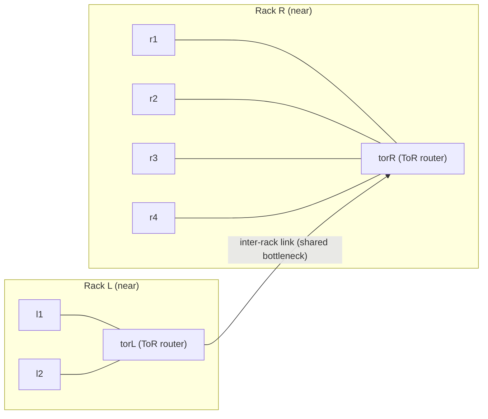

# 网络拓扑感知调度（仿真）实验指导书

> 依据 `docs/topology_aware_distributed_framework.md` 完成一次“拓扑差异 → 代价模型 → 调度策略 → 结果对比”的闭环实验。本实验不要求部署 Spark/Flink/Ray 等真实框架，而是复用本仓库的命名空间拓扑（可选）+ `tc netem` 注入 + Python 仿真器，观察“同机架优先/网络评分”如何降低跨机架流量与作业完成时间。

---

## 1. 实验目标
- 在**两层拓扑**（机架内近、跨机架远）下，理解为什么“网络透明”假设会失效，以及为何会出现尾延迟放大。
- 掌握一个最小可行的**网络代价模型**：$T \\approx T_\\text{comp} + (L + D/B)$，并把其用于调度决策（优先同机架、用网络评分选点）。
- 对比三种调度策略在不同网络条件下的表现：
  1) `random`：网络透明/随机放置  
  2) `rack_local`：机架亲和（粗粒度拓扑感知）  
  3) `score`：用代价模型做最早完成时间（finish time）评分
- 形成可复现实验记录：拓扑、注入参数、输入参数、输出结果、解释与思考题答案。

## 2. 预备知识与工具
- 熟悉：`ip netns`、`tc netem`、`ping`；可选 `iperf3`。
- 需安装：`python3`。

## 3. 目录与资源
```
docs/topology_aware_distributed_framework.md
experiments/08/ns_topology_aware.sh
experiments/08/topology_aware_scheduler_sim.py
experiments/08/run_topology_aware_lab.sh
```

---

## 4. 实验网络拓扑（本实验自定义）
本实验用“两机架 + 跨机架互联”的最小拓扑来表达“近/远”差异：



说明：
- `l1/l2` 与 `r1/r2/r3/r4` 是计算节点（worker）。
- `torL/torR` 是机架交换机/ToR 的近似（用路由命名空间表达）。
- 所有跨机架流量都要经过 `torL <-> torR` 的 inter-rack 链路，可在该链路上用 `tc netem` 注入延迟/限速/抖动，模拟“机架上行/汇聚层受限”。

---

## 5. 环境准备（可选：使用命名空间“测量”近/远链路）
> 如果你当前环境不方便运行 Linux network namespace，可跳过本节，直接使用“仿真参数”完成实验。

1. **拉起拓扑**
   ```bash
   sudo bash experiments/08/ns_topology_aware.sh
   ip netns list
   ```
2. **基础连通性检查**
   ```bash
   ip netns exec l1 ping -c 2 10.0.1.6   # 同机架（l1 -> l2）
   ip netns exec l1 ping -c 2 10.0.3.2   # 跨机架（l1 -> r1）
   ```
3. **（可选）记录接口与路由快照**（用于报告复现）
   ```bash
   ip -n torL addr
   ip -n torR addr
   ip -n torL route
   ip -n torR route
   ip netns exec torL sysctl net.ipv4.ip_forward
   ```

---

## 6. 构造“近/远”差异：跨机架链路注入瓶颈（可选但推荐）
> 目的：把跨机架路径显式变“慢”，让拓扑感知策略的收益更明显。推荐把瓶颈放在 inter-rack 链路上（`torL` 与 `torR` 的互联）。

1. **在 inter-rack 链路上注入 netem**（示例：增加延迟并限速）
   ```bash
   ip netns exec torL tc qdisc add dev vethLRa root netem delay 5ms 1ms 15% rate 200mbit
   ip netns exec torL tc qdisc show dev vethLRa
   ```
2. **测量“近/远” RTT（示例）**
   ```bash
   mkdir -p logs
   ip netns exec l1 ping -c 30 -i 0.2 10.0.1.6 > logs/ping_intra_rack.txt
   ip netns exec l1 ping -c 30 -i 0.2 10.0.3.2 > logs/ping_inter_rack.txt
   ```
3. **（可选）测量跨机架吞吐**
   ```bash
   ip netns exec r1 iperf3 -s -D
   ip netns exec l1 iperf3 -c 10.0.3.2 -t 15 -i 3
   ip netns exec r1 pkill iperf3 || true
   ```

**思考题（关键步骤）**
- 为什么把瓶颈放在 inter-rack 链路更接近“机架上行/汇聚层受限”的真实含义？如果把 netem 只加在某一台 leaf（例如 `l1`）上，会更像什么场景？
- 你会把 `ping` 的哪一个统计量作为模型的 `latency_ms`（p50/p90/p99）？为什么？

---

## 7. 运行仿真：对比三种调度策略
本实验的仿真器用一个最小模型近似“读数据 + 计算”的任务：
- 任务先读取数据块（大小 `data_mb`），若跨机架则走“共享的跨机架瓶颈链路”（用于体现拥塞排队）。
- 随后执行计算（耗时 `compute_ms`）。
- 三种调度策略只改变“任务放到哪个 worker 上跑”，其它保持一致。

### 7.1 生成示例配置
```bash
python3 experiments/08/topology_aware_scheduler_sim.py init --outdir experiments/08/examples
```
示例配置默认包含“数据倾斜 + 资源不均衡”（左侧 rack 节点更少），用于触发“仅亲和 vs 网络评分”的取舍。

### 7.2 将第 6 步测量值写入仿真配置（关键）
第 6 步得到的 `ping/iperf3` 数据不会被仿真器自动读取；你需要把测量结果**手动写入**仿真配置文件 `experiments/08/examples/topology.json`，让第 7 步仿真使用“实测的近/远网络条件”。

**映射关系**
- `logs/ping_intra_rack.txt`（如 `l1 -> l2`）→ `links.intra.latency_ms`（单位 ms）
- `logs/ping_inter_rack.txt`（如 `l1 -> r1`）→ `links.inter.latency_ms`（单位 ms）
- `iperf3` 的吞吐（如 `l1 -> r1`）→ `links.inter.bandwidth_gbps`（单位 Gbps）
  - 若 `iperf3` 输出是 `Mbits/sec`，换算为 Gbps：`Gbps = Mbits/sec / 1000`；若输出是 `Gbits/sec` 可直接填入。
  - 如果你也测了同机架吞吐，可同步更新 `links.intra.bandwidth_gbps`（不测也可用默认值）。

**你需要修改的文件与字段**
- 文件：`experiments/08/examples/topology.json`
- 字段：
  - `links.intra.latency_ms`：填“同机架”延迟（来自第 6 步 `ping_intra_rack`）
  - `links.inter.latency_ms`：填“跨机架”延迟（来自第 6 步 `ping_inter_rack`）
  - `links.inter.bandwidth_gbps`：填“跨机架”带宽（来自第 6 步 `iperf3`）
  - （可选）`links.intra.bandwidth_gbps`：填“同机架”带宽（若你测了）

> 口径建议：如果你没有单独算 p50/p90/p99，可以直接使用 `ping` 最后一行的 `avg` 作为 `latency_ms` 的近似；只要 intra/inter 口径一致即可用于对比调度策略。

也可以直接用一键脚本跑完三种调度并把输出写入 `logs/`：
```bash
bash experiments/08/run_topology_aware_lab.sh
```

### 7.3 用“网络透明”随机调度跑一遍（基线）
```bash
python3 experiments/08/topology_aware_scheduler_sim.py run \
  --topology experiments/08/examples/topology.json \
  --job experiments/08/examples/job.json \
  --scheduler random \
  --seed 1
```

### 7.4 启用机架亲和（rack-aware）
```bash
python3 experiments/08/topology_aware_scheduler_sim.py run \
  --topology experiments/08/examples/topology.json \
  --job experiments/08/examples/job.json \
  --scheduler rack_local \
  --seed 1
```

### 7.5 启用网络评分（代价模型选点）
```bash
python3 experiments/08/topology_aware_scheduler_sim.py run \
  --topology experiments/08/examples/topology.json \
  --job experiments/08/examples/job.json \
  --scheduler score \
  --seed 1
```

**思考题（关键步骤）**
- `rack_local` 与 `score` 的差别是什么？当跨机架链路“已经很慢且共享”时，为什么只做亲和仍可能不够？
- 你认为 `score` 的“最小完成时间”策略在什么情况下会引发资源碎片或热点（例如某一机架被过度偏好）？

---

## 8. 对照实验：改变跨机架条件，观察收益变化
1. 编辑 `experiments/08/examples/topology.json`（或自行另存），分别构造两组对照：
   - A：跨机架 `bandwidth_gbps` 较高、`latency_ms` 较低（“拓扑差异小”）
   - B：跨机架 `bandwidth_gbps` 较低、`latency_ms` 较高（“拓扑差异大”）
2. 对 A/B 两组，分别运行三种 `--scheduler` 并记录 `makespan` 与 `cross_rack_mb`。

**思考题（关键步骤）**
- 当拓扑差异很小（A）时，拓扑感知调度的收益会如何变化？为什么？
- 如果只能测到少量样本（无法全量矩阵），你会优先测哪些对（哪些节点之间）来支持调度？

---

## 9. 报告要求（建议）
- 说明你使用的拓扑（是否启用命名空间、是否注入 `tc netem`，参数是什么）。
- 给出至少两组对照（拓扑差异小 vs 大），并对比三种调度策略的输出结果。
- 用 $L + D/B$ 解释差异：哪一项主导了变化？是否出现“共享瓶颈导致的排队放大”？
- 回答本指导书中的思考题；如有额外观察（例如长尾/拥塞排队），请附上你采集的 `ping`/`iperf3`/`tc qdisc show` 输出摘要。

---

## 10. 清理（仅命名空间实验需要）
```bash
ip netns exec torL tc qdisc del dev vethLRa root || true
sudo bash experiments/08/ns_topology_aware.sh down
```

---

## 11. 考核目标（含思考题）
1. **能够复现实验闭环**：给出完整命令、输入配置、输出结果（至少 2 组网络条件 × 3 种调度策略）。
   - 思考题：你选择了哪些测量值作为 `latency_ms/bandwidth_gbps`，为什么它们适合作为调度输入？
2. **能够解释收益来源**：用 $L + D/B$ 与“共享瓶颈排队”解释 `random` 与拓扑感知策略的差异。
   - 思考题：在你的结果中，降低 `latency_ms` 和提高 `bandwidth_gbps` 哪个更“值钱”？为什么？
3. **能够分析代价与副作用**：讨论拓扑感知调度可能带来的碎片化、热点、测量开销与降级策略。
   - 思考题：如果拓扑服务数据过期（TTL 超时）或测量缺失，你会如何降级以保证调度可用？
